# เอกสารการออกแบบระบบ — talad

> เอกสารฉบับนี้ถูก **สร้างจากไฟล์ JSON ทั้งฉบับ** (renderer v1.0) — แก้ไฟล์นี้โดยตรงแล้วจะหายในการ render รอบถัดไป
> แก้ที่ต้นทางเสมอ: รายการและตารางแก้ผ่านคำสั่งของ `design` · ร้อยแก้วแก้ที่ไฟล์ Markdown ต้นทางที่ระบุไว้ท้ายแต่ละหัวข้อ

## ปกและตารางแก้ไข

**เอกสารฉบับนี้ไม่มีเลขเวอร์ชันของตัวเอง** — ไม่มีไฟล์ไหนในเฟสนี้เก็บเลขเวอร์ชันของเอกสารไว้
สิ่งที่ใช้แทนคือตารางการเปลี่ยนแปลงข้างล่าง ซึ่งอ่านจากใบเปลี่ยนแปลงจริง และตารางสถานะการอนุมัติรายไฟล์

### ตารางแก้ไข (Revision History)

| รหัส | ที่มา | เมื่อ | เหตุผล | ผู้เกี่ยวข้อง / สถานะ |
|---|---|---|---|---|
| CHG-talad-001 | req | 2026-09-23T11:59+07:00 | v1 ไม่ได้บอกว่าสมาชิกที่ยังไม่เคยซื้อลบแล้วเป็นอย่างไร — เจ้าของงานตอบว่าซ่อนเหมือนกัน ให้ทุกการลบสมาชิกเป็นซ่อน สอดคล้องกับสินค้า/โปรโมชั่นตาม BR-talad-037@v1 (SRC-027) | เจ้าของงาน (ตอบในแชตระหว่าง /req:example BR-talad-037@v1 — SRC-027 บรรทัด 2) → เจ้าของงาน (ผู้ตอบในเซสชัน /req:change BR-talad-040@v1) |
| CHG-talad-002 | req | 2026-09-23T17:10+07:00 | v1 ไม่ได้บอกว่าบิลแสดงโปรที่ใช้อย่างไร — เจ้าของงานตอบระหว่าง /req:example BR-talad-029@v1 ว่าแสดงชื่อโปรใต้บรรทัดสินค้า (SRC-041 บรรทัด 2) | mon sai → mon sai |
| CHG-talad-001 | design · revised | 2026-09-23T17:48:41+07:00 | req ออกกฎการลบสมาชิกเป็นรุ่น 2 — สมาชิกทุกคนเมื่อเจ้าของร้านกดลบจะถูกซ่อน ไม่ว่ามีบิลผูกอยู่หรือไม่ (รุ่น 1 ไม่ได้บอกกรณีสมาชิกที่ยังไม่เคยซื้อ) · design รับไว้หลังจากที่ทุกขั้นถูกออกแบบกับรุ่น 2 อยู่แล้ว | รับเข้าแล้ว 2026-09-23T10:48:56Z |
| CHG-talad-002 | design · revised | 2026-09-23T17:48:41+07:00 | req ออกกฎการบันทึกบิลเป็นรุ่น 2 — บรรทัดสินค้าที่ได้โปรระดับสินค้าต้องแสดงชื่อโปรและส่วนลดใต้บรรทัด นอกเหนือจากยอดส่วนลดโปรโมชั่นรวม · design รับไว้หลังจากที่ทุกขั้นถูกออกแบบกับรุ่น 2 อยู่แล้ว | รับเข้าแล้ว 2026-09-23T10:48:56Z |

### สถานะการอนุมัติรายไฟล์

| ไฟล์ | คำสั่งที่เขียน | สถานะขั้น | สถานะเอกสาร | ผู้อนุมัติ | เมื่อ | หมายเหตุ |
|---|---|---|---|---|---|---|
| design.state.json | /design:init | done | — | — | — | — |
| context.json | /design:overview | done | draft | — | — | — |
| modules/talad/functions.json | /design:function | done | draft | — | — | — |
| trace.design.json | /design:function | done | — | — | — | — |
| datamodel.json | /design:datamodel | done | draft | — | — | — |
| modules/talad/statemachines.json | /design:datamodel | done | draft | — | — | — |
| rbac.json | /design:rbac | done | draft | — | — | — |
| nfr.json | /design:nfr | done | draft | — | — | — |
| sitemap.json | /design:sitemap | done | draft | — | — | — |
| modules/talad/screens.json | /design:sitemap | done | draft | — | — | — |
| interfaces.json | /design:interface | done | draft | — | — | — |

> ℹ️ **ข้อจำกัดของข้อมูลชุดนี้** — "สถานะขั้น" มาจากไฟล์สถานะ ส่วน "สถานะเอกสาร" มาจากตัวไฟล์เอง — ขั้นที่ค้างจะเห็นได้ที่คอลัมน์แรกเท่านั้น เพราะเครื่องหมายค้างถูกเก็บที่ขั้น ไม่ใช่ในเนื้อหาที่อนุมัติไปแล้ว

> ℹ️ **ข้อจำกัดของข้อมูลชุดนี้** — ตารางนี้ไม่มีแถวของขั้น `export` เอง เพราะ artifact ของขั้นนั้นคือเอกสารฉบับนี้ — เอกสารที่รายงานสถานะการส่งมอบของตัวเอง จะไม่ตรงกับความจริงทันทีที่มีคนบันทึกว่าส่งแล้ว

## 1 บทนำ

**วัตถุประสงค์ของเอกสาร**

เอกสารฉบับนี้คือการออกแบบระบบขายหน้าร้าน (POS) สำหรับร้านขายผลไม้และสินค้าทั่วไป (ระบบ talad) ใช้เป็นข้อตกลงระหว่างร้านกับทีมพัฒนาว่าระบบจะทำอะไร เก็บข้อมูลอะไร ใครทำอะไรได้บ้าง และวัดความสำเร็จอย่างไร ทุกหัวข้ออ้างกลับไปหาความต้องการที่ร้านอนุมัติแล้วในขั้นเก็บความต้องการ (CP1)

**ที่มาของงาน**

ทุกวันนี้ร้านคิดเงิน จดยอดขาย คิดส่วนลด ตัดสต็อก และจดยอดสะสมของลูกค้าประจำด้วยมือ งานเหล่านี้ช้า ผิดพลาดง่าย และตรวจย้อนหลังไม่ได้ว่าใครขายอะไรไปเมื่อไหร่

เป้าหมายปลายทางที่ร้านตั้งไว้คือ **ทุกการขายต้องผ่านระบบ และเลิกทำงานเหล่านี้ด้วยมือทั้งหมด** ถ้าส่งมอบแล้วยังต้องจดยอดขาย คิดส่วนลด หรือนับตัดสต็อกด้วยมือ ถือว่างานนี้ไม่สำเร็จ

**ผู้อ่านเอกสาร**

- เจ้าของร้าน: ตรวจขอบเขต ตารางสิทธิ์ และตัวเลขเป้าหมาย แล้วเซ็นอนุมัติ
- ทีมพัฒนาและทีมทดสอบ: ใช้เป็นแบบสำหรับสร้างและตรวจรับระบบ

### 1.1 ขอบเขตที่อยู่ในงาน

| รหัส | รายการ | ที่มา |
|---|---|---|
| sales-screen | หน้าขายสินค้า — เลือกสินค้าจากการ์ดรูปภาพหรือค้นหาด้วยชื่อ/เลขบาร์โค้ด จัดการตะกร้า ชำระเงิน และแสดง/พิมพ์ใบเสร็จ | REQ-talad-001 |
| membership | ระบบสมาชิก — สมัคร ค้นหา แก้ไข และซ่อนสมาชิก ผูกสมาชิกกับตะกร้าเพื่อรับส่วนลด และสะสมยอดซื้อ | REQ-talad-002 |
| staff-and-access | บัญชีผู้ใช้และสิทธิ์ — ล็อกอินก่อนใช้งาน แยกสิทธิ์พนักงานขายกับเจ้าของร้าน/ผู้ดูแล และบันทึกผู้ขายของทุกบิล | REQ-talad-003 |
| stock | ระบบสต็อกสินค้า — จัดการสินค้าพร้อมรูปภาพ ราคา และจำนวนคงเหลือ ตัดสต็อกอัตโนมัติเมื่อขาย ปรับสต็อกด้วยมือพร้อมประวัติ เตือนสินค้าใกล้หมด และ Export Excel | REQ-talad-004 |
| promotion | ระบบโปรโมชั่น — ส่วนลด % ต่อสินค้าและทั้งบิล โปรแถม/โปรลดแบบชุด ส่วนลดสมาชิก และช่วงวันที่มีผล | REQ-talad-005 |
| sales-record | การบันทึกยอดขาย — เก็บบิลขายครบถ้วน ดูประวัติย้อนหลัง พิมพ์ใบเสร็จซ้ำ ยกเลิกบิลของวันนี้ และ Export Excel | REQ-talad-006 |
| reports | รายงาน — ยอดขายรายวัน/รายเดือน สินค้าขายดี ยอดขายแยกตามผู้ขาย และสต็อกคงเหลือ พร้อม Export Excel | REQ-talad-007 |

### 1.2 ขอบเขตที่ไม่อยู่ในงาน

| รหัส | รายการ | ที่มา |
|---|---|---|
| multi-branch | หลายสาขา — ระบบรองรับร้านค้าเดี่ยวเท่านั้นในเวอร์ชันนี้ | REQ-talad-001 |
| payment-gateway | เชื่อมต่อ payment gateway / QR พร้อมเพย์ / เครื่องรูดบัตร — ระบบไม่ตรวจว่าเงินเข้าจริง | — |
| payment-method | บันทึกวิธีชำระเงิน (เงินสด/โอน/QR) — การกดชำระเงินถือว่ารับเงินครบแล้ว บิลไม่เก็บว่าจ่ายด้วยวิธีใด | — |
| tax-invoice | ใบกำกับภาษีและการคำนวณ VAT — ใบเสร็จที่ออกเป็นใบเสร็จธรรมดา | — |
| cash-drawer | คำนวณเงินทอนและควบคุมลิ้นชักเงินสด — ไม่รับยอดเงินที่ลูกค้าจ่าย ไม่มีกระทบยอดเงินสดสิ้นวัน | — |
| accounting | ระบบบัญชีหรือการเชื่อมโปรแกรมบัญชีภายนอก — มีเพียง Export Excel ของรายงาน | — |
| offline-sales | ขายต่อได้ตอนเชื่อมต่อเซิร์ฟเวอร์ไม่ได้ (offline) — หน้าขายใช้ไม่ได้จนกว่าจะเชื่อมต่อได้อีกครั้ง | — |
| online-store | ขายออนไลน์หรือให้ลูกค้าสั่งซื้อเอง — ผู้ใช้ระบบมีเฉพาะคนในร้าน | — |
| loyalty-points | สะสมแต้มและแลกของรางวัล — สมาชิกมีเพียงยอดซื้อสะสมและส่วนลด % สมาชิก | — |
| purchasing | จัดซื้อ ทะเบียนผู้จำหน่าย และใบรับของเข้า — ของเข้าบันทึกเป็นรายการปรับสต็อกด้วยมือ | — |
| sell-by-weight | ขายแบบชั่งน้ำหนัก (ราคาต่อกิโลกรัม) — รอบนี้ขายเป็นหน่วยนับเท่านั้น ยกไปรอบถัดไป | REQ-talad-001 |

### 1.3 เอกสารอ้างอิง

| เอกสาร | ที่อยู่ |
|---|---|
| ความต้องการที่ `req` เก็บไว้ | .aeon/req/requirements.json |
| อภิธานศัพท์ | .aeon/req/glossary.json |
| ผู้มีส่วนได้ส่วนเสีย | .aeon/req/stakeholders.json |

### 1.4 อภิธานศัพท์

| รหัส | คำไทย | คำอังกฤษ | ความหมาย | อย่าสับสนกับ | สถานะ |
|---|---|---|---|---|---|
| UL-talad-001 | สินค้า | Product | ผลไม้และสินค้าทั่วไปที่ร้านขาย มีรูปภาพ ราคา และจำนวนคงเหลือ | — | draft |
| UL-talad-002 | ตะกร้า | Cart | รายการสินค้าที่พนักงานเลือกไว้ในการขายครั้งหนึ่ง เพิ่ม/ลด/ลบได้ก่อนชำระเงิน — "ตะกร้าไอคอน/การ์ด" ในบรรทัด 4 คือตะกร้าเดียวกันนี้ | — | draft |
| UL-talad-003 | บิลขาย | Sale | การขายที่ชำระเงินสำเร็จหนึ่งครั้ง บันทึกรายการสินค้า ราคา ส่วนลด พนักงานที่ขาย และสมาชิก (ถ้ามี) — "ออเดอร์" คือสิ่งเดียวกัน ใช้คำว่า "บิลขาย" ทั้งเอกสาร โค้ด และ UI | — | draft |
| UL-talad-005 | สมาชิก | Member | ลูกค้าที่สมัครสมาชิกด้วยเบอร์โทร/ชื่อ มียอดซื้อสะสม และได้สิทธิ์ส่วนลดสมาชิก | — | draft |
| UL-talad-006 | ยอดซื้อสะสม | Accumulated purchase | ยอดซื้อที่ผูกไว้กับสมาชิกแต่ละคน | — | draft |
| UL-talad-007 | พนักงานขาย | Cashier | พนักงานที่ล็อกอินเข้าหน้าขายและเป็นผู้ขายของแต่ละบิลขาย — "Staff", "Cashier" และ "พนักงาน" ในเอกสารคือสิ่งเดียวกัน ใช้คำว่า "พนักงานขาย" | UL-talad-012 | draft |
| UL-talad-008 | สต็อก | Stock | จำนวนคงเหลือของสินค้าแต่ละรายการ ถูกตัดอัตโนมัติเมื่อขายสำเร็จ | — | draft |
| UL-talad-009 | สินค้าใกล้หมด | Low stock | สินค้าที่จำนวนคงเหลือเท่ากับหรือน้อยกว่าจุดเตือนที่เจ้าของร้านตั้งไว้สำหรับสินค้านั้น — ระบบแสดงป้าย "ใกล้หมด" | — | draft |
| UL-talad-010 | โปรโมชั่น | Promotion | เงื่อนไขส่วนลดหรือของแถมทั่วไป มีช่วงวันที่เริ่ม-สิ้นสุด | — | draft |
| UL-talad-011 | ส่วนลดสมาชิก | Member discount | ส่วนลดพิเศษเป็น % สำหรับสมาชิก แยกจากโปรโมชั่นทั่วไป | — | draft |
| UL-talad-012 | เจ้าของร้าน | Owner | คนในร้านที่แยกบทบาทจากพนักงานขาย ดูแลสต็อก โปรโมชั่น บัญชีพนักงาน และดูรายงาน (คำตอบเลือกเป็น "เจ้าของร้าน/ผู้ดูแล") | UL-talad-007 | draft |
| UL-talad-013 | ของแถม | Free item | สินค้าที่ได้ฟรีเมื่อครบเงื่อนไขโปรโมชั่นแบบแถม (y ใน "ซื้อ x แถม y" และ "ซื้อ a + b แถม y") อาจเป็นสินค้าคนละตัวกับที่ซื้อ | — | draft |
| UL-talad-014 | ผู้ขาย | Seller | คนที่บิลขายบันทึกว่าเป็นผู้ขาย — เป็นได้ทั้งพนักงานขายและเจ้าของร้าน/ผู้ดูแล | — | draft |
| UL-talad-015 | ปิดยอดประจำวัน | Day close | ระบบไม่มีขั้นตอนหรือปุ่มปิดยอด — ขึ้นวันใหม่แล้วถือว่าบิลของวันก่อนหน้าปิดแล้วโดยปริยาย ยกเลิกไม่ได้ | — | draft |
| UL-talad-016 | ยกเลิกบิล | Void sale | การยกเลิกบิลขายที่ชำระแล้วโดยเจ้าของร้าน พร้อมเหตุผล — บิลเดิมยังอยู่ในสถานะยกเลิก สต็อกและยอดสะสมถูกคืน ใบเสร็จเดิมถือว่ายกเลิก · เป็นทางเดียวที่แก้บิลผิดได้ (แก้บิลโดยตรงไม่ได้) | — | draft |
| UL-talad-017 | ใบเสร็จ | Receipt | เอกสารที่ออกให้ลูกค้าเมื่อบิลขายชำระเงินสำเร็จ — ยกเลิกบิลแล้วใบเสร็จเดิมถือว่ายกเลิก | UL-talad-003 | draft |
| UL-talad-018 | ส่วนลดทั้งบิล | Bill discount | ส่วนลด % ที่คิดจากยอดรวมของบิล — คิดหลังโปรระดับสินค้า และก่อนส่วนลดสมาชิก | UL-talad-011 | draft |
| UL-talad-019 | รายการปรับสต็อก | Stock adjustment | รายการที่เกิดขึ้นทุกครั้งที่เจ้าของร้านแก้จำนวนคงเหลือด้วยมือ (นับใหม่ ของเน่า/เสีย รับของเข้า) บันทึกจำนวนที่เพิ่ม/ลด ผู้ทำ เวลา และเหตุผล — ต่างจากการตัดสต็อกอัตโนมัติเมื่อขาย | UL-talad-008 | draft |
| UL-talad-020 | ประวัติราคา | Price history | แถวบันทึกทุกครั้งที่แก้ราคาสินค้า — ราคาเดิม ราคาใหม่ ผู้แก้ และเวลา · ไม่ใช่ราคาที่บันทึกไว้ในบิลขาย (บิลเก็บราคา ณ ตอนขายตาม BR-talad-016) | UL-talad-003 | draft |
| UL-talad-021 | เลิกขาย | Discontinued | สถานะของสินค้าหรือโปรโมชั่นที่เจ้าของร้านกดลบ — ไม่ถูกลบจริง (ไม่ว่าเคยขายแล้วหรือไม่) หายจากหน้าขายและหน้าจัดการ แต่บิลเก่ายังอ้างถึงและแสดงได้ครบ | — | draft |

## 2 ภาพรวมระบบ

**ภาพรวมของระบบ**

ระบบ talad เป็นเว็บแอปพลิเคชันตัวเดียว ใช้ภายในร้านค้าเดี่ยวหนึ่งร้าน และติดตั้งบนเครื่องเซิร์ฟเวอร์ในร้าน ผู้ใช้มีสองกลุ่ม คือพนักงานขายที่ทำงานหน้าร้าน และเจ้าของร้าน/ผู้ดูแลที่ทำได้ทุกอย่างที่พนักงานขายทำ และดูแลสินค้า โปรโมชั่น บัญชีพนักงาน และรายงานด้วย

ระบบไม่เชื่อมต่อระบบภายนอกใดนอกจากเครื่องพิมพ์ใบเสร็จที่ต่อกับเครื่องขาย ลูกค้าของร้านไม่ได้ใช้ระบบเอง

**การทำงานแบบเดิม (As-Is)**

1. พนักงานคิดราคาสินค้าและส่วนลดด้วยมือหรือเครื่องคิดเลข
2. ลูกค้าประจำใช้บัตรสะสมแต้มที่จดด้วยมือ
3. ยอดขายจดลงสมุด และไม่รู้แน่ชัดว่าพนักงานคนไหนขายบิลไหน
4. สต็อกนับและตัดด้วยมือ จึงรู้ช้าว่าสินค้าใกล้หมด
5. ยอดขายรายวันและรายเดือนต้องรวมเองจากสมุด

**การทำงานแบบใหม่ (To-Be)**

1. พนักงานล็อกอิน เลือกสินค้าจากการ์ดรูปภาพหรือค้นหาด้วยชื่อหรือเลขบาร์โค้ด แล้วใส่ตะกร้า
2. ระบบคิดราคา โปรโมชั่น ส่วนลดทั้งบิล และส่วนลดสมาชิกให้เอง ด้วยค่า ณ ตอนกดชำระเงิน
3. พนักงานค้นหาและผูกสมาชิกกับตะกร้า ระบบสะสมยอดซื้อให้สมาชิกเอง
4. กดชำระเงินแล้วระบบบันทึกบิลพร้อมชื่อผู้ขาย ตัดสต็อกเอง และแสดงใบเสร็จให้พิมพ์เมื่อลูกค้าต้องการ
5. เจ้าของร้านเห็นสินค้าใกล้หมดทันที ดูประวัติการขายและรายงานได้จากข้อมูลจริง และ Export เป็น Excel ได้
6. งานที่ย้อนกลับไม่ได้ เช่น ยกเลิกบิล แก้ราคา และลบสินค้า เจ้าของร้านเท่านั้นที่ทำได้ และระบบเก็บประวัติไว้ทุกครั้ง

**ขอบเขตของรอบนี้**

- รองรับร้านค้าเดี่ยวเท่านั้น การรองรับหลายสาขาเป็นส่วนขยายในรอบถัดไป
- ขายเป็นหน่วยนับเท่านั้น การขายแบบชั่งน้ำหนัก (ราคาต่อกิโลกรัม) ยกไปรอบถัดไป

### 2.1 ผังบริบทของระบบ (DFD ระดับ 0)

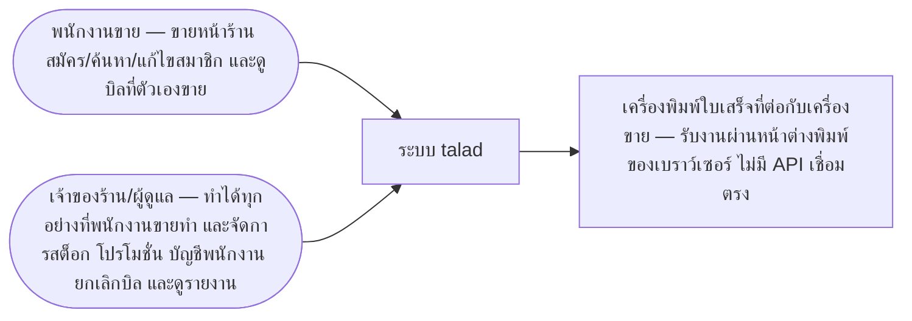

### 2.2 ผู้ใช้ระบบ

| รหัส | ผู้ใช้ | ผู้มีส่วนได้ส่วนเสียที่ `req` บันทึก |
|---|---|---|
| cashier | พนักงานขาย — ขายหน้าร้าน สมัคร/ค้นหา/แก้ไขสมาชิก และดูบิลที่ตัวเองขาย | STK-talad-001 |
| owner | เจ้าของร้าน/ผู้ดูแล — ทำได้ทุกอย่างที่พนักงานขายทำ และจัดการสต็อก โปรโมชั่น บัญชีพนักงาน ยกเลิกบิล และดูรายงาน | STK-talad-002 |

### 2.3 ข้อสมมติ

| รหัส | ข้อสมมติ | ที่มา |
|---|---|---|
| always-online | เครื่องที่ใช้ขายเชื่อมต่อเซิร์ฟเวอร์ได้ตลอดเวลาเปิดร้าน | — |
| modern-browser | ผู้ใช้ใช้เบราว์เซอร์รุ่นปัจจุบัน (Chrome / Edge / Safari) ไม่รองรับเบราว์เซอร์รุ่นเก่า | REQ-talad-001 |
| concurrent-devices | มีเครื่องที่ขายพร้อมกันไม่เกินประมาณ 5 เครื่อง — ตัวเลขจริงยืนยันอีกครั้งตอนกำหนด NFR | — |
| thb-thai-time | ยอดเงินทั้งหมดเป็นเงินบาทสกุลเดียว และขอบวันทุกจุดนับตามเวลาไทย (Asia/Bangkok) | REQ-talad-005 · REQ-talad-006 |
| barcode-typed | ไม่มีเครื่องสแกนบาร์โค้ด — พนักงานพิมพ์เลขบาร์โค้ดลงช่องค้นหาเอง | REQ-talad-001 |
| receipt-browser-print | ปุ่มพิมพ์ใบเสร็จใช้หน้าต่างพิมพ์ของเบราว์เซอร์ ส่งไปเครื่องพิมพ์ที่ต่อกับเครื่องขาย ไม่มีการสั่งเครื่องพิมพ์โดยตรง | REQ-talad-001 |

### 2.4 ข้อจำกัด

| รหัส | ข้อจำกัด | ที่มา |
|---|---|---|
| mandated-stack | ใช้เทคโนโลยีตามที่ลูกค้ากำหนดใน NFR-talad-003 — เว็บ React + Tailwind v5 + daisy v4, API .NET 10, ฐานข้อมูล PostgreSQL v18 ไม่มีทางเลือกอื่นให้ตัดสิน | REQ-talad-001 |
| mandated-auth | ยืนยันตัวตนด้วย .NET Identity แบบ JWT ตามที่ลูกค้ากำหนดใน NFR-talad-005 | REQ-talad-003 |
| single-store | ออกแบบสำหรับร้านค้าเดี่ยว ไม่มีแนวคิดสาขาในข้อมูล | REQ-talad-001 |

### 2.5 แผนผังผู้มีส่วนได้ส่วนเสีย

| รหัส | ชื่อ | ประเภท | กลายเป็นบทบาท | คำอธิบาย |
|---|---|---|---|---|
| STK-talad-001 | พนักงานขาย | internal | — | ขายหน้าร้าน สมัคร/ค้นหาสมาชิก · ห้ามจัดการสต็อก/โปรโมชั่น/พนักงาน ห้ามดูรายงาน ห้ามทำสิ่งที่ย้อนกลับไม่ได้ |
| STK-talad-002 | เจ้าของร้าน/ผู้ดูแล | internal | — | จัดการสต็อก โปรโมชั่น บัญชีพนักงาน ดูรายงาน ยกเลิก/แก้บิลที่ชำระแล้ว แก้ราคาหน้าขาย ลบสินค้า และขายหน้าร้านได้เหมือนพนักงานขาย |

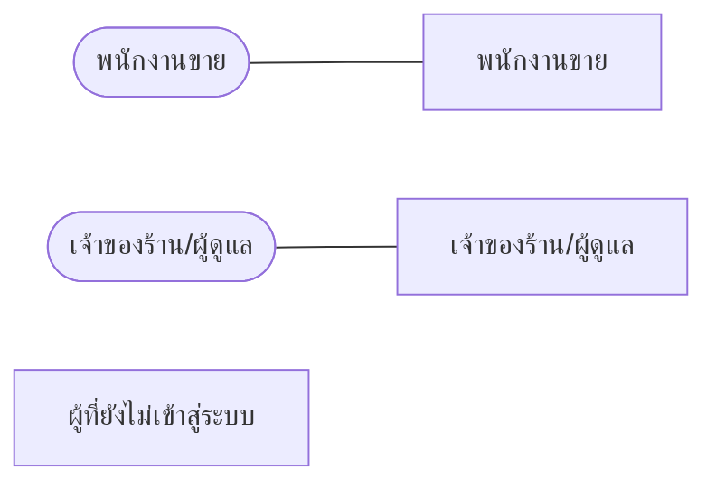

### 2.6 คำตัดสินทางเทคโนโลยี

| รหัส | หัวข้อ | คำถาม | สิ่งที่เลือก | สถานะ |
|---|---|---|---|---|
| DEC-001 | hosting | ระบบ (เว็บ API และฐานข้อมูล) จะติดตั้งและรันอยู่ที่ไหน | เครื่องในร้าน (on-premise) | เลือกแล้ว รอลายเซ็น |
| DEC-002 | other | รูปภาพสินค้าเก็บไว้ที่ไหน | ไฟล์บนดิสก์เซิร์ฟเวอร์ | เลือกแล้ว รอลายเซ็น |

#### DEC-001 · ระบบ (เว็บ API และฐานข้อมูล) จะติดตั้งและรันอยู่ที่ไหน

| ทางเลือกที่ชั่งน้ำหนัก | แนะนำ | หลักฐานที่ตรวจได้ | หมายเหตุ |
|---|---|---|---|
| Cloud VPS | ⭐ | ขอบเขตกำหนดให้ขายแบบ offline อยู่นอกขอบเขต และถือว่าหน้าร้านเชื่อมต่อได้ตลอดเวลา จึงไม่มีเหตุบังคับให้ตั้งเครื่องในร้าน · cloud ไม่ต้องให้ร้านดูแลฮาร์ดแวร์และการสำรองข้อมูลเอง และเจ้าของร้านดูรายงานจากที่อื่นได้ | มีค่าเช่ารายเดือน |
| เครื่องในร้าน (on-premise) | — | — | ตั้ง PC/มินิพีซีในร้าน ใช้ผ่าน LAN — ไม่มีค่าเช่า แต่ร้านต้องดูแลเครื่องและการสำรองข้อมูลเอง |

| หัวข้อ | รายละเอียด |
|---|---|
| สิ่งที่เลือก | เครื่องในร้าน (on-premise) |
| เหตุผล | ผู้ตัดสินเลือกติดตั้งบนเครื่องในร้าน (ตอบในเซสชัน /design:overview) — ยังไม่ได้ให้เหตุผลเพิ่มเติม ผลที่ตามมาคือร้านต้องรับผิดชอบการดูแลเครื่องและการสำรองข้อมูล ซึ่งจะกำหนดเป็นตัวเลขที่ /design:nfr |
| ผู้ตัดสิน | mon sai |
| วันที่ตัดสิน | 2026-09-23T17:16:17+07:00 |
| ตัวเลขที่บังคับให้เลือกแบบนี้ | — |
| ลายเซ็น | ยังไม่มี |

#### DEC-002 · รูปภาพสินค้าเก็บไว้ที่ไหน

| ทางเลือกที่ชั่งน้ำหนัก | แนะนำ | หลักฐานที่ตรวจได้ | หมายเหตุ |
|---|---|---|---|
| ไฟล์บนดิสก์เซิร์ฟเวอร์ | ⭐ | ร้านเดี่ยวตาม NFR-talad-004 มีเครื่องขายพร้อมกันไม่เกินประมาณ 5 เครื่อง และติดตั้งบนเครื่องในร้าน — ไม่มีปริมาณหรือการกระจายที่ต้องใช้บริการเก็บไฟล์ภายนอก | ฐานข้อมูลเก็บเพียงตำแหน่งไฟล์ ต้องรวมโฟลเดอร์รูปในการสำรองข้อมูล |
| เก็บใน PostgreSQL | — | — | สำรองข้อมูลที่เดียวได้ครบ แต่ฐานข้อมูลโตเร็ว |
| Object storage (S3-compatible) | — | — | ขยายได้ แต่เพิ่มระบบข้างเคียงอีกหนึ่งตัว |

| หัวข้อ | รายละเอียด |
|---|---|
| สิ่งที่เลือก | ไฟล์บนดิสก์เซิร์ฟเวอร์ |
| เหตุผล | ขนาดร้านเดี่ยวและการติดตั้งในร้านไม่ต้องการบริการภายนอก เก็บไฟล์บนดิสก์ของเครื่องเซิร์ฟเวอร์เรียบง่ายที่สุด |
| ผู้ตัดสิน | mon sai |
| วันที่ตัดสิน | 2026-09-23T17:16:17+07:00 |
| ตัวเลขที่บังคับให้เลือกแบบนี้ | NFR-talad-004 |
| ลายเซ็น | ยังไม่มี |

> ℹ️ **ข้อจำกัดของข้อมูลชุดนี้** — การ์ดที่ยังไม่มี “สิ่งที่เลือก” คือคำถามที่ยังเปิดอยู่ ไม่ใช่ช่องที่ลืมกรอก — ท่านกำลังอ่านคำถามที่ทีมออกแบบยังไม่ได้ตัดสิน และเป็นคำถามที่ท่านตอบได้ · ลายเซ็นเป็นรายใบ การเซ็นใบหนึ่งจึงไม่ผูกพันใบอื่น · หลักฐานในตารางเป็นสิ่งที่ท่านตรวจได้เอง คำแนะนำที่ไม่มีหลักฐานถูกปฏิเสธตั้งแต่ตอนบันทึก

## 3 ความต้องการเชิงหน้าที่

### 3.1 โมดูล talad

| รหัส | ฟังก์ชัน | คำอธิบาย | ความต้องการต้นทาง | กฎที่คุม |
|---|---|---|---|---|
| FUN-talad-001 | จัดการตะกร้าขาย | ค้นหาสินค้าด้วยชื่อหรือเลขบาร์โค้ด หรือกดการ์ดสินค้า ใส่ตะกร้า เพิ่ม ลด และเอารายการออกก่อนชำระเงิน โดยตะกร้าเป็นของผู้ที่เปิดเท่านั้น | REQ-talad-001 | BR-talad-001@v1 · BR-talad-020@v1 · BR-talad-007@v1 · BR-talad-008@v1 · BR-talad-037@v1 |
| FUN-talad-002 | ชำระเงินและบันทึกบิลขาย | ปิดการขายของตะกร้าหนึ่งใบเป็นบิลขาย บันทึกผู้ขาย รายการ ราคา ส่วนลด และสมาชิก ตัดสต็อก และสะสมยอดซื้อของสมาชิก | REQ-talad-001 · REQ-talad-002 · REQ-talad-004 · REQ-talad-006 | BR-talad-038@v1 · BR-talad-039@v1 · BR-talad-006@v1 · BR-talad-007@v1 · BR-talad-003@v1 · BR-talad-016@v2 · BR-talad-037@v1 · BR-talad-035@v1 · BR-talad-036@v1 · BR-talad-026@v1 |
| FUN-talad-003 | คิดราคา โปรโมชั่น และส่วนลดของตะกร้า | คำนวณยอดของแต่ละบรรทัด โปรโมชั่นระดับสินค้า ส่วนลดทั้งบิล และส่วนลดสมาชิก ตามค่าที่มีผล ณ ตอนกดชำระเงิน | REQ-talad-005 | BR-talad-009@v1 · BR-talad-010@v1 · BR-talad-011@v1 · BR-talad-012@v1 · BR-talad-013@v1 · BR-talad-014@v1 · BR-talad-015@v1 · BR-talad-027@v1 · BR-talad-028@v1 · BR-talad-029@v1 · BR-talad-038@v1 · CALC-talad-001@v1 · CALC-talad-002@v1 · CALC-talad-003@v1 · CALC-talad-004@v1 · CALC-talad-005@v1 · CALC-talad-006@v1 · CALC-talad-007@v1 · CALC-talad-008@v1 · CALC-talad-009@v1 |
| FUN-talad-004 | ออกและพิมพ์ใบเสร็จ | แสดงใบเสร็จเต็มจอหลังชำระเงิน พิมพ์ผ่านหน้าต่างพิมพ์ของเบราว์เซอร์ และพิมพ์ซ้ำจากประวัติการขายตามสิทธิ์ | REQ-talad-001 · REQ-talad-006 | BR-talad-026@v1 · BR-talad-018@v1 · BR-talad-021@v1 |
| FUN-talad-005 | สมัครสมาชิก | สร้างสมาชิกใหม่ด้วยชื่อและเบอร์โทร | REQ-talad-002 | BR-talad-002@v1 · BR-talad-030@v1 · BR-talad-040@v2 · BR-talad-021@v1 |
| FUN-talad-006 | แก้ไขข้อมูลสมาชิก | แก้ชื่อหรือเบอร์โทรของสมาชิกที่ใช้งานอยู่ | REQ-talad-002 | BR-talad-002@v1 · BR-talad-030@v1 · BR-talad-018@v1 |
| FUN-talad-007 | ค้นหาสมาชิกและผูกกับตะกร้า | ค้นหาสมาชิกด้วยเบอร์โทรเต็มหรือชื่อบางส่วน แล้วผูกกับตะกร้าเพื่อให้การขายนั้นได้สิทธิ์สมาชิก | REQ-talad-002 | BR-talad-004@v1 · BR-talad-031@v1 · BR-talad-040@v2 · BR-talad-010@v1 |
| FUN-talad-008 | ลบ (ซ่อน) สมาชิก | เจ้าของร้านซ่อนสมาชิกออกจากการค้นหา โดยบิลเก่ายังแสดงสมาชิกครบ และปล่อยเบอร์ให้สมัครใหม่ได้ | REQ-talad-002 | BR-talad-040@v2 · BR-talad-019@v1 · BR-talad-030@v1 |
| FUN-talad-009 | ล็อกอินเข้าสู่ระบบ | ผู้ใช้เข้าสู่ระบบด้วยชื่อผู้ใช้และรหัสผ่านก่อนใช้หน้าขาย และได้ตะกร้าที่ตัวเองค้างไว้กลับมา | REQ-talad-003 | BR-talad-005@v1 · BR-talad-020@v1 |
| FUN-talad-010 | จำกัดสิทธิ์การใช้งานตามบทบาท | แสดงเมนูและให้เปิดหน้าได้ตามบทบาท พนักงานขายใช้ได้เฉพาะงานหน้าร้าน เจ้าของร้านทำได้ทุกอย่าง | REQ-talad-003 | BR-talad-018@v1 · BR-talad-019@v1 · BR-talad-021@v1 |
| FUN-talad-011 | จัดการบัญชีพนักงาน | เจ้าของร้านสร้างบัญชีผู้ใช้ รีเซ็ตรหัสผ่าน และปิดใช้งานบัญชีพนักงาน | REQ-talad-003 | — |
| FUN-talad-012 | จัดการข้อมูลสินค้า | เพิ่ม แก้ไข และเลิกขายสินค้า พร้อมรูปภาพ ราคา จุดเตือน และประวัติราคา และดูรายการสต็อกพร้อมป้ายใกล้หมด | REQ-talad-004 | BR-talad-033@v1 · BR-talad-037@v1 · BR-talad-008@v1 · BR-talad-036@v1 · BR-talad-035@v1 · BR-talad-019@v1 |
| FUN-talad-013 | ปรับสต็อกด้วยมือ | บันทึกรายการปรับสต็อก (รับของเข้า · ของเน่า/เสีย · นับสต็อกใหม่) แยกเป็นรายการที่ไม่ถูกทับ | REQ-talad-004 | BR-talad-032@v1 · BR-talad-041@v1 · BR-talad-008@v1 |
| FUN-talad-014 | จัดการโปรโมชั่น | สร้าง แก้ไข และเลิกใช้โปรโมชั่นทุกรูปแบบ พร้อมช่วงวันที่มีผล | REQ-talad-005 | BR-talad-009@v1 · BR-talad-011@v1 · BR-talad-012@v1 · BR-talad-013@v1 · BR-talad-014@v1 · BR-talad-015@v1 · BR-talad-037@v1 · BR-talad-035@v1 · BR-talad-036@v1 |
| FUN-talad-015 | ตั้งส่วนลดสมาชิก | เจ้าของร้านตั้ง % ส่วนลดสมาชิกของทั้งร้าน | REQ-talad-005 | BR-talad-010@v1 · BR-talad-035@v1 · BR-talad-036@v1 |
| FUN-talad-016 | ดูประวัติการขาย | ดูรายการบิลขายย้อนหลังและรายละเอียดบิลตามสิทธิ์ของผู้ดู | REQ-talad-006 | BR-talad-016@v2 · BR-talad-018@v1 · BR-talad-021@v1 · BR-talad-025@v1 · BR-talad-034@v1 · BR-talad-035@v1 · BR-talad-036@v1 |
| FUN-talad-017 | ยกเลิกบิลขาย | เจ้าของร้านยกเลิกบิลขายของวันนี้พร้อมเหตุผล ระบบคืนสต็อกและหักยอดซื้อสะสมคืน | REQ-talad-006 | BR-talad-019@v1 · BR-talad-023@v1 · BR-talad-024@v1 · BR-talad-034@v1 · BR-talad-042@v1 · BR-talad-026@v1 |
| FUN-talad-018 | ดูรายงาน | รายงานยอดขายรายวัน/รายเดือน สินค้าขายดี ยอดขายแยกตามผู้ขาย และสต็อกคงเหลือ | REQ-talad-007 | BR-talad-022@v1 · BR-talad-024@v1 |
| FUN-talad-019 | Export Excel | ส่งออกรายงาน รายการสต็อก และประวัติการขายเป็นไฟล์ Excel ที่ตรงกับบนจอ | REQ-talad-004 · REQ-talad-006 · REQ-talad-007 | BR-talad-017@v1 · BR-talad-018@v1 |

#### ผังกรณีใช้งาน — talad

```mermaid
flowchart LR
  subgraph U0["FUN-talad-001 · จัดการตะกร้าขาย"]
    U1(["UC-talad-001 · หยิบสินค้าและปรับจำนวนในตะกร้า"])
    U2(["UC-talad-002 · กลับมาทำตะกร้าที่ค้างไว้หลังล็อกอินใหม่"])
  end
  subgraph U3["FUN-talad-002 · ชำระเงินและบันทึกบิลขาย"]
    U4(["UC-talad-003 · ชำระเงินตะกร้า"])
  end
  subgraph U5["FUN-talad-003 · คิดราคา โปรโมชั่น และส่วนลดของตะกร้า"]
    U6(["UC-talad-004 · ตรวจยอดและส่วนลดของตะกร้าก่อนชำระ"])
  end
  subgraph U7["FUN-talad-004 · ออกและพิมพ์ใบเสร็จ"]
    U8(["UC-talad-005 · แสดงและพิมพ์ใบเสร็จหลังชำระ"])
    U9(["UC-talad-006 · พิมพ์ใบเสร็จซ้ำจากประวัติการขาย"])
  end
  subgraph U10["FUN-talad-005 · สมัครสมาชิก"]
    U11(["UC-talad-007 · สมัครสมาชิกใหม่"])
  end
  subgraph U12["FUN-talad-006 · แก้ไขข้อมูลสมาชิก"]
    U13(["UC-talad-008 · แก้ชื่อหรือเบอร์โทรสมาชิก"])
  end
  subgraph U14["FUN-talad-007 · ค้นหาสมาชิกและผูกกับตะกร้า"]
    U15(["UC-talad-009 · ค้นหาสมาชิกและผูกกับตะกร้า"])
  end
  subgraph U16["FUN-talad-008 · ลบ (ซ่อน) สมาชิก"]
    U17(["UC-talad-010 · ลบ (ซ่อน) สมาชิก"])
  end
  subgraph U18["FUN-talad-009 · ล็อกอินเข้าสู่ระบบ"]
    U19(["UC-talad-011 · เข้าสู่ระบบ"])
  end
  subgraph U20["FUN-talad-010 · จำกัดสิทธิ์การใช้งานตามบทบาท"]
    U21(["UC-talad-012 · ใช้เมนูและเปิดหน้าตามสิทธิ์"])
  end
  subgraph U22["FUN-talad-011 · จัดการบัญชีพนักงาน"]
    U23(["UC-talad-013 · สร้างบัญชีพนักงาน"])
    U24(["UC-talad-014 · รีเซ็ตรหัสผ่านพนักงาน"])
    U25(["UC-talad-015 · ปิดใช้งานบัญชีพนักงาน"])
  end
  subgraph U26["FUN-talad-012 · จัดการข้อมูลสินค้า"]
    U27(["UC-talad-016 · เพิ่มหรือแก้ไขข้อมูลสินค้า"])
    U28(["UC-talad-017 · แก้ราคาสินค้าและดูประวัติราคา"])
    U29(["UC-talad-018 · ลบ (เลิกขาย) สินค้า"])
    U30(["UC-talad-019 · ดูรายการสต็อกและป้ายใกล้หมด"])
  end
  subgraph U31["FUN-talad-013 · ปรับสต็อกด้วยมือ"]
    U32(["UC-talad-020 · บันทึกรายการปรับสต็อก"])
  end
  subgraph U33["FUN-talad-014 · จัดการโปรโมชั่น"]
    U34(["UC-talad-021 · สร้างหรือแก้ไขโปรโมชั่น"])
    U35(["UC-talad-022 · ลบ (เลิกใช้) โปรโมชั่น"])
  end
  subgraph U36["FUN-talad-015 · ตั้งส่วนลดสมาชิก"]
    U37(["UC-talad-023 · ตั้งส่วนลดสมาชิก"])
  end
  subgraph U38["FUN-talad-016 · ดูประวัติการขาย"]
    U39(["UC-talad-024 · ดูประวัติการขายและรายละเอียดบิล"])
  end
  subgraph U40["FUN-talad-017 · ยกเลิกบิลขาย"]
    U41(["UC-talad-025 · ยกเลิกบิลขาย"])
  end
  subgraph U42["FUN-talad-018 · ดูรายงาน"]
    U43(["UC-talad-026 · ดูรายงาน"])
  end
  subgraph U44["FUN-talad-019 · Export Excel"]
    U45(["UC-talad-027 · Export Excel"])
  end
  A0["พนักงานขาย หรือเจ้าของร้าน/ผู้ดูแล"] --> U1
  A0["พนักงานขาย หรือเจ้าของร้าน/ผู้ดูแล"] --> U2
  A0["พนักงานขาย หรือเจ้าของร้าน/ผู้ดูแล"] --> U4
  A0["พนักงานขาย หรือเจ้าของร้าน/ผู้ดูแล"] --> U6
  A0["พนักงานขาย หรือเจ้าของร้าน/ผู้ดูแล"] --> U8
  A0["พนักงานขาย หรือเจ้าของร้าน/ผู้ดูแล"] --> U9
  A0["พนักงานขาย หรือเจ้าของร้าน/ผู้ดูแล"] --> U11
  A0["พนักงานขาย หรือเจ้าของร้าน/ผู้ดูแล"] --> U13
  A0["พนักงานขาย หรือเจ้าของร้าน/ผู้ดูแล"] --> U15
  A1["เจ้าของร้าน/ผู้ดูแล"] --> U17
  A2["ผู้ใช้ทุกบทบาท (พนักงานขาย · เจ้าของร้าน/ผู้ดูแล)"] --> U19
  A2["ผู้ใช้ทุกบทบาท (พนักงานขาย · เจ้าของร้าน/ผู้ดูแล)"] --> U21
  A1["เจ้าของร้าน/ผู้ดูแล"] --> U23
  A1["เจ้าของร้าน/ผู้ดูแล"] --> U24
  A1["เจ้าของร้าน/ผู้ดูแล"] --> U25
  A1["เจ้าของร้าน/ผู้ดูแล"] --> U27
  A1["เจ้าของร้าน/ผู้ดูแล"] --> U28
  A1["เจ้าของร้าน/ผู้ดูแล"] --> U29
  A1["เจ้าของร้าน/ผู้ดูแล"] --> U30
  A1["เจ้าของร้าน/ผู้ดูแล"] --> U32
  A1["เจ้าของร้าน/ผู้ดูแล"] --> U34
  A1["เจ้าของร้าน/ผู้ดูแล"] --> U35
  A1["เจ้าของร้าน/ผู้ดูแล"] --> U37
  A0["พนักงานขาย หรือเจ้าของร้าน/ผู้ดูแล"] --> U39
  A1["เจ้าของร้าน/ผู้ดูแล"] --> U41
  A1["เจ้าของร้าน/ผู้ดูแล"] --> U43
  A1["เจ้าของร้าน/ผู้ดูแล"] --> U45
```

> ℹ️ **ข้อจำกัดของข้อมูลชุดนี้** — Mermaid ไม่มีไวยากรณ์ของ use case diagram โดยตรง ผังนี้จึงวาดด้วย flowchart — ผู้ใช้เป็นกล่อง กรณีใช้งานเป็นแคปซูล และกรอบคือฟังก์ชันที่เป็นเจ้าของ

#### UC-talad-001 · หยิบสินค้าและปรับจำนวนในตะกร้า

| หัวข้อ | รายละเอียด |
|---|---|
| ฟังก์ชันที่สังกัด | FUN-talad-001 |
| ผู้ใช้ | พนักงานขาย หรือเจ้าของร้าน/ผู้ดูแล |
| เงื่อนไขก่อนเริ่ม | ผู้ใช้ล็อกอินและอยู่ที่หน้าขาย · มีตะกร้าที่ผู้ใช้คนนี้เปิดอยู่ (ว่างหรือมีรายการ) |

**ขั้นตอนหลัก**
1. ผู้ใช้กดการ์ดสินค้า หรือค้นหาด้วยชื่อ/เลขบาร์โค้ดแล้วเลือกสินค้า
2. ระบบเพิ่มสินค้าลงตะกร้า จำนวน 1 และแสดงยอดรวมใหม่
3. ผู้ใช้กด "+" หรือ "−" เพื่อปรับจำนวน ระบบแสดงยอดรวมใหม่ทุกครั้ง

**ทางเลือกอื่น**
1. ผู้ใช้กด "−" ที่รายการที่เหลือจำนวน 1 ระบบถามยืนยันการลบ แล้วเอารายการออกเมื่อยืนยัน
2. สินค้าที่คงเหลือถึงจุดเตือนแสดงป้ายใกล้หมดบนการ์ดตามกฎ BR-talad-008@v1

**กรณียกเว้น**
1. เพิ่มจำนวนเกินคงเหลือ ระบบปฏิเสธและแจ้งข้อความตามกฎ BR-talad-007@v1 จำนวนในตะกร้าไม่เปลี่ยน
2. ผู้ใช้กดยกเลิกในกล่องยืนยันการลบ รายการยังอยู่ในตะกร้า
3. สินค้าที่เลิกขายแล้วไม่แสดงและค้นหาไม่เจอตามกฎ BR-talad-037@v1

#### UC-talad-002 · กลับมาทำตะกร้าที่ค้างไว้หลังล็อกอินใหม่

| หัวข้อ | รายละเอียด |
|---|---|
| ฟังก์ชันที่สังกัด | FUN-talad-001 |
| ผู้ใช้ | พนักงานขาย หรือเจ้าของร้าน/ผู้ดูแล |
| เงื่อนไขก่อนเริ่ม | ผู้ใช้เคยเปิดตะกร้าที่ยังไม่ชำระแล้วล็อกเอาต์ |

**ขั้นตอนหลัก**
1. ผู้ใช้ล็อกอินอีกครั้งและเปิดหน้าขาย
2. ระบบแสดงตะกร้าที่ผู้ใช้คนนี้เปิดค้างไว้ครบทุกรายการ
3. ผู้ใช้ทำรายการต่อหรือกดชำระเงินได้ตามปกติ

**ทางเลือกอื่น**
1. ผู้ใช้อีกคนล็อกอินที่เครื่องเดียวกันในระหว่างนั้น ได้ตะกร้าว่างของตัวเอง และตะกร้าที่ค้างของคนแรกไม่ถูกแตะ

**กรณียกเว้น**
1. ผู้ใช้อื่น รวมถึงเจ้าของร้าน เห็น แก้ไข หรือชำระตะกร้าที่คนอื่นเปิดไม่ได้ตามกฎ BR-talad-020@v1

#### UC-talad-003 · ชำระเงินตะกร้า

| หัวข้อ | รายละเอียด |
|---|---|
| ฟังก์ชันที่สังกัด | FUN-talad-002 |
| ผู้ใช้ | พนักงานขาย หรือเจ้าของร้าน/ผู้ดูแล |
| เงื่อนไขก่อนเริ่ม | ผู้ใช้ล็อกอินและเป็นผู้เปิดตะกร้านี้ · ตะกร้ามีรายการอย่างน้อยหนึ่งรายการและยังไม่ถูกชำระ |

**ขั้นตอนหลัก**
1. ผู้ใช้กดชำระเงิน
2. ระบบคิดยอดด้วยราคา โปรโมชั่น และส่วนลดสมาชิก ณ ตอนกดชำระ
3. ระบบสร้างบิลขายที่บันทึกผู้ขาย รายการ ราคา ส่วนลด และสมาชิก ตัดสต็อกรวมของแถม และสะสมยอดซื้อให้สมาชิกที่ผูกไว้
4. ระบบแสดงใบเสร็จของบิลนี้เต็มจอ (ต่อที่ UC-talad-005)

**ทางเลือกอื่น**
1. ตะกร้าไม่ผูกสมาชิก ระบบสร้างบิลโดยไม่สะสมยอดซื้อให้ใคร
2. ยอดชำระเป็น 0 บาท (เช่น ส่วนลดสมาชิก 100%) ระบบยังสร้างบิลปกติ

**กรณียกเว้น**
1. กดชำระซ้ำหรือส่งคำขอซ้ำ ระบบปฏิเสธครั้งหลัง ไม่เกิดบิลที่สอง ไม่ตัดสต็อกและไม่สะสมยอดซ้ำตามกฎ BR-talad-039@v1
2. สต็อกของรายการใดไม่พอ ณ ตอนกดชำระ ระบบไม่สร้างบิลและแจ้งสินค้าที่ไม่พอตามกฎ BR-talad-007@v1
3. มีสินค้าที่เลิกขายแล้วในตะกร้า ระบบไม่สร้างบิลและให้เอาออกจากตะกร้าตามกฎ BR-talad-037@v1

#### UC-talad-004 · ตรวจยอดและส่วนลดของตะกร้าก่อนชำระ

| หัวข้อ | รายละเอียด |
|---|---|
| ฟังก์ชันที่สังกัด | FUN-talad-003 |
| ผู้ใช้ | พนักงานขาย หรือเจ้าของร้าน/ผู้ดูแล |
| เงื่อนไขก่อนเริ่ม | ตะกร้ามีรายการอย่างน้อยหนึ่งรายการ |

**ขั้นตอนหลัก**
1. ระบบแสดงราคา จำนวน และยอดของแต่ละบรรทัด
2. ระบบเลือกโปรโมชั่นระดับสินค้าที่ลูกค้าได้ลดมากที่สุดให้แต่ละบรรทัด แล้วคิดส่วนลดทั้งบิลและส่วนลดสมาชิกต่อกันตามลำดับ
3. ระบบแสดงส่วนลดแต่ละประเภทและยอดที่ต้องชำระ

**ทางเลือกอื่น**
1. มีโปรโมชั่นที่ลดเท่ากันพอดี ระบบให้ผู้ใช้เลือกโปรก่อนชำระตามกฎ BR-talad-029@v1
2. ผู้ใช้หยิบของแถมใส่ตะกร้าเอง ระบบคิดเป็นฟรีเมื่อครบเงื่อนไข

**กรณียกเว้น**
1. ราคา โปรโมชั่น หรือส่วนลดสมาชิกเปลี่ยนระหว่างที่ตะกร้าเปิดอยู่ ยอดที่ชำระใช้ค่า ณ ตอนกดชำระตามกฎ BR-talad-038@v1
2. ของแถมหมดสต็อก ของแถมไม่เข้าตะกร้า สินค้าที่ซื้อยังขายได้ราคาปกติ

#### UC-talad-005 · แสดงและพิมพ์ใบเสร็จหลังชำระ

| หัวข้อ | รายละเอียด |
|---|---|
| ฟังก์ชันที่สังกัด | FUN-talad-004 |
| ผู้ใช้ | พนักงานขาย หรือเจ้าของร้าน/ผู้ดูแล |
| เงื่อนไขก่อนเริ่ม | ตะกร้าเพิ่งชำระเงินสำเร็จ |

**ขั้นตอนหลัก**
1. ระบบแสดงใบเสร็จของบิลเต็มจอพร้อมปุ่ม [พิมพ์] และ [ปิด]
2. ผู้ใช้กด [พิมพ์] ระบบเปิดหน้าต่างพิมพ์ของเบราว์เซอร์
3. ผู้ใช้กด [ปิด] ระบบแสดงตะกร้าว่างใบใหม่

**ทางเลือกอื่น**
1. ลูกค้าไม่ต้องการใบเสร็จ ผู้ใช้กด [ปิด] โดยไม่พิมพ์ บิลยังพิมพ์ซ้ำได้จากประวัติการขาย
2. บิลที่ขายใหม่แทนบิลที่ยกเลิกได้ใบเสร็จเลขใหม่ที่ไม่อ้างถึงใบเดิม

**กรณียกเว้น**
1. เครื่องพิมพ์ไม่พร้อมหรือผู้ใช้ยกเลิกหน้าต่างพิมพ์ บิลบันทึกแล้วไม่เปลี่ยน ผู้ใช้พิมพ์ซ้ำได้จากประวัติการขาย

#### UC-talad-006 · พิมพ์ใบเสร็จซ้ำจากประวัติการขาย

| หัวข้อ | รายละเอียด |
|---|---|
| ฟังก์ชันที่สังกัด | FUN-talad-004 |
| ผู้ใช้ | พนักงานขาย หรือเจ้าของร้าน/ผู้ดูแล |
| เงื่อนไขก่อนเริ่ม | ผู้ใช้ล็อกอินและเปิดบิลในประวัติการขาย · ผู้ใช้มีสิทธิ์เห็นบิลนี้ (พนักงานขายเฉพาะบิลของตัวเอง เจ้าของร้านทุกบิล) |

**ขั้นตอนหลัก**
1. ผู้ใช้กดพิมพ์ใบเสร็จซ้ำ
2. ระบบเปิดหน้าต่างพิมพ์ของเบราว์เซอร์พร้อมใบเสร็จของบิลนั้น

**ทางเลือกอื่น**
1. เจ้าของร้านพิมพ์ซ้ำบิลที่พนักงานขายคนอื่นขายได้ตามกฎ BR-talad-021@v1

**กรณียกเว้น**
1. บิลที่ถูกยกเลิกไม่มีปุ่มพิมพ์ใบเสร็จตามกฎ BR-talad-026@v1

#### UC-talad-007 · สมัครสมาชิกใหม่

| หัวข้อ | รายละเอียด |
|---|---|
| ฟังก์ชันที่สังกัด | FUN-talad-005 |
| ผู้ใช้ | พนักงานขาย หรือเจ้าของร้าน/ผู้ดูแล |
| เงื่อนไขก่อนเริ่ม | ผู้ใช้ล็อกอินและเปิดหน้าสมัครสมาชิก |

**ขั้นตอนหลัก**
1. ผู้ใช้กรอกชื่อและเบอร์โทร แล้วกดบันทึก
2. ระบบสร้างสมาชิกใหม่ ยอดซื้อสะสม 0 บาท และแจ้งว่าสมัครสำเร็จ

**ทางเลือกอื่น**
1. เบอร์ที่กรอกเป็นของสมาชิกที่ถูกซ่อนแล้ว ระบบสร้างเป็นสมาชิกคนใหม่ได้ตามกฎ BR-talad-040@v2

**กรณียกเว้น**
1. ชื่อหรือเบอร์ว่าง หรือเบอร์ไม่ใช่ตัวเลข 10 หลักขึ้นต้นด้วย 0 ระบบไม่สร้างสมาชิกและแจ้งช่องที่ผิดตามกฎ BR-talad-002@v1
2. เบอร์ซ้ำกับสมาชิกที่ใช้งานอยู่ รวมถึงกดบันทึกซ้ำ ระบบไม่สร้างสมาชิกและแจ้ง error ตามกฎ BR-talad-030@v1

#### UC-talad-008 · แก้ชื่อหรือเบอร์โทรสมาชิก

| หัวข้อ | รายละเอียด |
|---|---|
| ฟังก์ชันที่สังกัด | FUN-talad-006 |
| ผู้ใช้ | พนักงานขาย หรือเจ้าของร้าน/ผู้ดูแล |
| เงื่อนไขก่อนเริ่ม | ผู้ใช้ล็อกอินและเปิดข้อมูลสมาชิกที่ใช้งานอยู่ |

**ขั้นตอนหลัก**
1. ผู้ใช้แก้ชื่อหรือเบอร์โทร แล้วกดบันทึก
2. ระบบบันทึกข้อมูลใหม่ การค้นหาที่หน้าขายเจอด้วยข้อมูลใหม่

**ทางเลือกอื่น**
1. แก้เฉพาะชื่อโดยไม่แตะเบอร์ ระบบบันทึกชื่อใหม่ เบอร์เดิมคงไว้

**กรณียกเว้น**
1. เบอร์ใหม่ไม่ใช่ตัวเลข 10 หลักขึ้นต้นด้วย 0 ระบบไม่บันทึกและแจ้ง error ตามกฎ BR-talad-002@v1
2. เบอร์ใหม่ซ้ำกับสมาชิกคนอื่นที่ใช้งานอยู่ ระบบไม่บันทึกตามกฎ BR-talad-030@v1

#### UC-talad-009 · ค้นหาสมาชิกและผูกกับตะกร้า

| หัวข้อ | รายละเอียด |
|---|---|
| ฟังก์ชันที่สังกัด | FUN-talad-007 |
| ผู้ใช้ | พนักงานขาย หรือเจ้าของร้าน/ผู้ดูแล |
| เงื่อนไขก่อนเริ่ม | ผู้ใช้อยู่ที่หน้าขายและมีตะกร้าที่ตัวเองเปิด |

**ขั้นตอนหลัก**
1. ผู้ใช้กรอกเบอร์โทรเต็ม 10 หลักในช่องค้นหาสมาชิก
2. ระบบแสดงชื่อ เบอร์โทรเต็ม และยอดซื้อสะสมของสมาชิกที่ตรงกัน
3. ผู้ใช้เลือกสมาชิก ระบบผูกสมาชิกกับตะกร้าและคิดส่วนลดสมาชิกในยอดที่ต้องชำระ

**ทางเลือกอื่น**
1. ผู้ใช้ค้นด้วยชื่อบางส่วน ระบบแสดงรายชื่อทุกคนที่ชื่อมีคำนั้นให้เลือก

**กรณียกเว้น**
1. ไม่พบสมาชิก (รวมถึงค้นด้วยเบอร์บางส่วน) ระบบแจ้งไม่พบและเสนอให้สมัครใหม่ ตะกร้ายังไม่ผูกสมาชิก
2. สมาชิกที่ถูกซ่อนไม่ปรากฏในผลค้นหาตามกฎ BR-talad-040@v2

#### UC-talad-010 · ลบ (ซ่อน) สมาชิก

| หัวข้อ | รายละเอียด |
|---|---|
| ฟังก์ชันที่สังกัด | FUN-talad-008 |
| ผู้ใช้ | เจ้าของร้าน/ผู้ดูแล |
| เงื่อนไขก่อนเริ่ม | เจ้าของร้านล็อกอินและเปิดข้อมูลสมาชิก |

**ขั้นตอนหลัก**
1. เจ้าของร้านกดลบสมาชิก
2. ระบบซ่อนสมาชิก ค้นหาที่หน้าขายไม่เจออีก และปล่อยเบอร์ให้สมัครใหม่ได้
3. บิลเก่าที่ผูกสมาชิกคนนี้ยังแสดงชื่อและเบอร์ครบ

**ทางเลือกอื่น**
1. สมาชิกไม่เคยมีบิลผูก ระบบซ่อนเหมือนกันตามกฎ BR-talad-040@v2

**กรณียกเว้น**
1. พนักงานขายไม่มีปุ่มลบสมาชิกตามกฎ BR-talad-019@v1

#### UC-talad-011 · เข้าสู่ระบบ

| หัวข้อ | รายละเอียด |
|---|---|
| ฟังก์ชันที่สังกัด | FUN-talad-009 |
| ผู้ใช้ | ผู้ใช้ทุกบทบาท (พนักงานขาย · เจ้าของร้าน/ผู้ดูแล) |
| เงื่อนไขก่อนเริ่ม | ผู้ใช้มีบัญชีที่เปิดใช้งานอยู่ |

**ขั้นตอนหลัก**
1. ผู้ใช้กรอกชื่อผู้ใช้และรหัสผ่าน แล้วกดเข้าสู่ระบบ
2. ระบบตรวจสอบแล้วพาเข้าหน้าขายในชื่อผู้ใช้นั้น พร้อมตะกร้าที่ผู้ใช้ค้างไว้ (ถ้ามี)

**ทางเลือกอื่น**
1. ผู้ใช้เปิดหน้าขายโดยยังไม่ล็อกอิน ระบบพาไปหน้าล็อกอิน และพากลับหน้าขายหลังล็อกอินสำเร็จ

**กรณียกเว้น**
1. ไม่พบชื่อผู้ใช้ หรือรหัสผ่านไม่ถูกต้อง ระบบแจ้งแยกกันตามกฎ BR-talad-005@v1 และยังอยู่ที่หน้าล็อกอิน
2. บัญชีถูกปิดใช้งาน ระบบไม่ให้เข้าสู่ระบบ (ข้อความรอกำหนดที่ req)

#### UC-talad-012 · ใช้เมนูและเปิดหน้าตามสิทธิ์

| หัวข้อ | รายละเอียด |
|---|---|
| ฟังก์ชันที่สังกัด | FUN-talad-010 |
| ผู้ใช้ | ผู้ใช้ทุกบทบาท (พนักงานขาย · เจ้าของร้าน/ผู้ดูแล) |
| เงื่อนไขก่อนเริ่ม | ผู้ใช้ล็อกอินอยู่ |

**ขั้นตอนหลัก**
1. ระบบแสดงเมนูซ้ายเฉพาะงานที่บทบาทของผู้ใช้ทำได้
2. ผู้ใช้เลือกเมนูและเปิดหน้านั้นได้

**ทางเลือกอื่น**
1. เจ้าของร้านเห็นทุกเมนู รวมถึงงานหน้าร้านเหมือนพนักงานขาย

**กรณียกเว้น**
1. ผู้ใช้เปิดหน้าที่ไม่มีสิทธิ์ตรง ๆ ทาง URL ระบบพากลับหน้าขายและแจ้งว่าไม่มีสิทธิ์ตามกฎ BR-talad-018@v1 โดยไม่แสดงข้อมูลของหน้านั้น

#### UC-talad-013 · สร้างบัญชีพนักงาน

| หัวข้อ | รายละเอียด |
|---|---|
| ฟังก์ชันที่สังกัด | FUN-talad-011 |
| ผู้ใช้ | เจ้าของร้าน/ผู้ดูแล |
| เงื่อนไขก่อนเริ่ม | เจ้าของร้านล็อกอินและเปิดหน้าจัดการบัญชีพนักงาน |

**ขั้นตอนหลัก**
1. เจ้าของร้านกรอกชื่อที่แสดง ชื่อผู้ใช้ รหัสผ่านเริ่มต้น และบทบาท แล้วกดบันทึก
2. ระบบสร้างบัญชี และพนักงานล็อกอินด้วยบัญชีนี้ได้

**ทางเลือกอื่น**
1. เจ้าของร้านสร้างบัญชีบทบาทเจ้าของร้าน/ผู้ดูแลเพิ่ม

**กรณียกเว้น**
1. ชื่อผู้ใช้ซ้ำกับบัญชีที่มีอยู่ ระบบไม่สร้างบัญชีและแจ้ง error
2. ช่องที่บังคับว่าง ระบบไม่สร้างบัญชีและแจ้งช่องที่ผิด

#### UC-talad-014 · รีเซ็ตรหัสผ่านพนักงาน

| หัวข้อ | รายละเอียด |
|---|---|
| ฟังก์ชันที่สังกัด | FUN-talad-011 |
| ผู้ใช้ | เจ้าของร้าน/ผู้ดูแล |
| เงื่อนไขก่อนเริ่ม | เจ้าของร้านล็อกอินและเปิดบัญชีพนักงานที่มีอยู่ |

**ขั้นตอนหลัก**
1. เจ้าของร้านกรอกรหัสผ่านใหม่แล้วกดบันทึก
2. ระบบบันทึก พนักงานล็อกอินด้วยรหัสผ่านใหม่ได้ และรหัสผ่านเดิมใช้ไม่ได้อีก

**ทางเลือกอื่น**
1. พนักงานลืมรหัสผ่าน แจ้งเจ้าของร้านให้รีเซ็ตให้ (ระบบไม่มีการรีเซ็ตรหัสด้วยตัวเอง)

**กรณียกเว้น**
1. รหัสผ่านใหม่ว่าง ระบบไม่บันทึกและแจ้ง error

#### UC-talad-015 · ปิดใช้งานบัญชีพนักงาน

| หัวข้อ | รายละเอียด |
|---|---|
| ฟังก์ชันที่สังกัด | FUN-talad-011 |
| ผู้ใช้ | เจ้าของร้าน/ผู้ดูแล |
| เงื่อนไขก่อนเริ่ม | เจ้าของร้านล็อกอินและเปิดบัญชีพนักงานที่เปิดใช้งานอยู่ |

**ขั้นตอนหลัก**
1. เจ้าของร้านกดปิดใช้งานบัญชี
2. ระบบปิดบัญชี บัญชีนี้ล็อกอินไม่ได้อีก บิลเก่ายังแสดงชื่อผู้ขายเดิมครบ

**ทางเลือกอื่น**
1. เจ้าของร้านเปิดใช้งานบัญชีที่ปิดไว้อีกครั้ง พนักงานล็อกอินได้ตามปกติ

**กรณียกเว้น**
1. บัญชีที่ปิดแล้วพยายามล็อกอิน ระบบไม่ให้เข้าสู่ระบบ

#### UC-talad-016 · เพิ่มหรือแก้ไขข้อมูลสินค้า

| หัวข้อ | รายละเอียด |
|---|---|
| ฟังก์ชันที่สังกัด | FUN-talad-012 |
| ผู้ใช้ | เจ้าของร้าน/ผู้ดูแล |
| เงื่อนไขก่อนเริ่ม | เจ้าของร้านล็อกอินและเปิดหน้าสต็อก |

**ขั้นตอนหลัก**
1. เจ้าของร้านกรอกชื่อ ราคา จำนวนคงเหลือเริ่มต้น จุดเตือน เลขบาร์โค้ด (ถ้ามี) และรูปภาพ (ถ้ามี) แล้วกดบันทึก
2. ระบบบันทึกสินค้า และสินค้าแสดงเป็นการ์ดที่หน้าขาย

**ทางเลือกอื่น**
1. แก้ไขข้อมูลสินค้าที่มีอยู่ ระบบบันทึกทับข้อมูลเดิม ยกเว้นราคาที่เกิดประวัติราคา (UC-talad-017)

**กรณียกเว้น**
1. ชื่อว่าง หรือราคาไม่มากกว่า 0 ระบบไม่บันทึกและแจ้งช่องที่ผิด
2. เลขบาร์โค้ดซ้ำกับสินค้าที่ยังขายอยู่ ระบบไม่บันทึกและแจ้ง error

#### UC-talad-017 · แก้ราคาสินค้าและดูประวัติราคา

| หัวข้อ | รายละเอียด |
|---|---|
| ฟังก์ชันที่สังกัด | FUN-talad-012 |
| ผู้ใช้ | เจ้าของร้าน/ผู้ดูแล |
| เงื่อนไขก่อนเริ่ม | เจ้าของร้านล็อกอิน และสินค้ายังขายอยู่ |

**ขั้นตอนหลัก**
1. เจ้าของร้านแก้ราคาสินค้าที่หน้าสต็อกแล้วกดบันทึก
2. ระบบบันทึกราคาใหม่ที่มีผลกับบิลถัดไป และเพิ่มรายการประวัติราคา (ราคาเดิม ราคาใหม่ ผู้แก้ เวลา)
3. เจ้าของร้านเปิดประวัติราคาของสินค้า เห็นทุกรายการเรียงตามเวลา

**ทางเลือกอื่น**
1. เจ้าของร้านแก้ราคาจากหน้าขายด้วยทางลัด ได้ผลเหมือนแก้ที่หน้าสต็อกตามกฎ BR-talad-019@v1

**กรณียกเว้น**
1. พนักงานขายไม่มีช่องหรือปุ่มแก้ราคาที่หน้าขาย
2. ราคาใหม่ไม่มากกว่า 0 ระบบไม่บันทึกและแจ้งช่องที่ผิด

#### UC-talad-018 · ลบ (เลิกขาย) สินค้า

| หัวข้อ | รายละเอียด |
|---|---|
| ฟังก์ชันที่สังกัด | FUN-talad-012 |
| ผู้ใช้ | เจ้าของร้าน/ผู้ดูแล |
| เงื่อนไขก่อนเริ่ม | เจ้าของร้านล็อกอินและเปิดสินค้าที่ยังขายอยู่ |

**ขั้นตอนหลัก**
1. เจ้าของร้านกดลบสินค้า
2. ระบบเปลี่ยนสินค้าเป็นเลิกขาย สินค้าหายจากหน้าขายและหน้าสต็อก บิลเก่ายังแสดงสินค้า ราคา และส่วนลดเดิมครบ

**ทางเลือกอื่น**
1. สินค้าไม่เคยถูกขาย ระบบเปลี่ยนเป็นเลิกขายเหมือนกันตามกฎ BR-talad-037@v1

**กรณียกเว้น**
1. สินค้าอยู่ในตะกร้าที่ยังเปิด ตะกร้านั้นชำระไม่ได้จนกว่าจะเอาออก ตามกฎ BR-talad-037@v1

#### UC-talad-019 · ดูรายการสต็อกและป้ายใกล้หมด

| หัวข้อ | รายละเอียด |
|---|---|
| ฟังก์ชันที่สังกัด | FUN-talad-012 |
| ผู้ใช้ | เจ้าของร้าน/ผู้ดูแล |
| เงื่อนไขก่อนเริ่ม | เจ้าของร้านล็อกอิน |

**ขั้นตอนหลัก**
1. เจ้าของร้านเปิดหน้าสต็อก
2. ระบบแสดงรายการสินค้าที่ยังขายอยู่แบบแบ่งหน้าจากเซิร์ฟเวอร์ พร้อมจำนวนคงเหลือ และป้ายใกล้หมดตามจุดเตือนของแต่ละสินค้า

**ทางเลือกอื่น**
1. เจ้าของร้านกรอกคำค้นแล้วกดปุ่มค้นหา ระบบแสดงเฉพาะสินค้าที่ตรง

**กรณียกเว้น**
1. ไม่มีสินค้าที่ตรงกับคำค้น ระบบแสดงตารางว่างพร้อมข้อความว่าไม่พบ

#### UC-talad-020 · บันทึกรายการปรับสต็อก

| หัวข้อ | รายละเอียด |
|---|---|
| ฟังก์ชันที่สังกัด | FUN-talad-013 |
| ผู้ใช้ | เจ้าของร้าน/ผู้ดูแล |
| เงื่อนไขก่อนเริ่ม | เจ้าของร้านล็อกอินและเปิดฟอร์มปรับสต็อกของสินค้า |

**ขั้นตอนหลัก**
1. เจ้าของร้านเลือกเหตุผล (รับของเข้า · ของเน่า/เสีย) กรอกจำนวน +/− และหมายเหตุ (ถ้ามี) แล้วกดบันทึก
2. ระบบปรับจำนวนคงเหลือ และบันทึกรายการปรับสต็อกพร้อมผู้ทำ เวลา และเหตุผล

**ทางเลือกอื่น**
1. เลือกเหตุผล "นับสต็อกใหม่" แล้วกรอกจำนวนที่นับได้ ระบบคำนวณส่วนต่างและบันทึกเป็นรายการปรับสต็อก
2. เปิดฟอร์มใหม่เพื่อบันทึกรายการที่สอง ระบบบันทึกเป็นอีกรายการหนึ่ง

**กรณียกเว้น**
1. ผลการปรับทำให้คงเหลือติดลบ ระบบไม่บันทึกและแจ้ง error ตามกฎ BR-talad-032@v1
2. กดบันทึกซ้ำหรือส่งคำขอซ้ำจากฟอร์มเดิม ระบบปฏิเสธครั้งหลังตามกฎ BR-talad-041@v1

#### UC-talad-021 · สร้างหรือแก้ไขโปรโมชั่น

| หัวข้อ | รายละเอียด |
|---|---|
| ฟังก์ชันที่สังกัด | FUN-talad-014 |
| ผู้ใช้ | เจ้าของร้าน/ผู้ดูแล |
| เงื่อนไขก่อนเริ่ม | เจ้าของร้านล็อกอินและเปิดหน้าจัดการโปรโมชั่น |

**ขั้นตอนหลัก**
1. เจ้าของร้านเลือกรูปแบบโปรโมชั่น (ลด % ต่อสินค้า · ลด % ทั้งบิล · ซื้อ x แถม y · ซื้อ a + b แถม y · ซื้อ a + b ลด y% · ซื้อ x ชิ้นลด y%) กรอกเงื่อนไข วันเริ่ม และวันสิ้นสุด (ถ้ามี) แล้วกดบันทึก
2. ระบบบันทึกโปรโมชั่น และโปรมีผลกับตะกร้าที่กดชำระในช่วงวันที่

**ทางเลือกอื่น**
1. แก้ไขโปรโมชั่นที่มีอยู่ ค่าใหม่มีผลกับบิลที่ชำระหลังจากแก้เท่านั้นตามกฎ BR-talad-035@v1

**กรณียกเว้น**
1. % ไม่อยู่ในช่วง 0–100 จำนวนชิ้นต่อชุดไม่มากกว่า 0 หรือวันสิ้นสุดอยู่ก่อนวันเริ่ม ระบบไม่บันทึกและแจ้งช่องที่ผิด
2. ไม่ใส่วันเริ่ม ระบบไม่บันทึกตามกฎ BR-talad-015@v1

#### UC-talad-022 · ลบ (เลิกใช้) โปรโมชั่น

| หัวข้อ | รายละเอียด |
|---|---|
| ฟังก์ชันที่สังกัด | FUN-talad-014 |
| ผู้ใช้ | เจ้าของร้าน/ผู้ดูแล |
| เงื่อนไขก่อนเริ่ม | เจ้าของร้านล็อกอินและเปิดโปรโมชั่นที่ยังใช้อยู่ |

**ขั้นตอนหลัก**
1. เจ้าของร้านกดลบโปรโมชั่น
2. ระบบเปลี่ยนโปรเป็นเลิกใช้ โปรหายจากหน้าจัดการและไม่มีผลกับตะกร้าที่ชำระหลังจากนั้น บิลเก่ายังแสดงส่วนลดเดิมครบ

**ทางเลือกอื่น**
1. โปรไม่เคยถูกใช้ในบิล ระบบเปลี่ยนเป็นเลิกใช้เหมือนกันตามกฎ BR-talad-037@v1

**กรณียกเว้น**
1. ตะกร้าที่เปิดอยู่และคาดว่าจะได้โปรนี้ ไม่ได้ส่วนลด ณ ตอนกดชำระตามกฎ BR-talad-038@v1

#### UC-talad-023 · ตั้งส่วนลดสมาชิก

| หัวข้อ | รายละเอียด |
|---|---|
| ฟังก์ชันที่สังกัด | FUN-talad-015 |
| ผู้ใช้ | เจ้าของร้าน/ผู้ดูแล |
| เงื่อนไขก่อนเริ่ม | เจ้าของร้านล็อกอิน |

**ขั้นตอนหลัก**
1. เจ้าของร้านกรอก % ส่วนลดสมาชิกแล้วกดบันทึก
2. ระบบบันทึก และ % ใหม่มีผลกับบิลที่ผูกสมาชิกและชำระหลังจากแก้

**ทางเลือกอื่น**
1. ตั้ง 0% เพื่อปิดส่วนลดสมาชิก สมาชิกยังสะสมยอดซื้อตามปกติ

**กรณียกเว้น**
1. % ไม่อยู่ในช่วง 0–100 ระบบไม่บันทึกและแจ้ง error ตามกฎ BR-talad-010@v1

#### UC-talad-024 · ดูประวัติการขายและรายละเอียดบิล

| หัวข้อ | รายละเอียด |
|---|---|
| ฟังก์ชันที่สังกัด | FUN-talad-016 |
| ผู้ใช้ | พนักงานขาย หรือเจ้าของร้าน/ผู้ดูแล |
| เงื่อนไขก่อนเริ่ม | ผู้ใช้ล็อกอินอยู่ |

**ขั้นตอนหลัก**
1. ผู้ใช้เปิดประวัติการขาย ระบบแสดงรายการบิลแบบแบ่งหน้าจากเซิร์ฟเวอร์ พร้อมช่องค้นหาและปุ่มค้นหา
2. ผู้ใช้เปิดบิล ระบบแสดงรายการสินค้า ราคา ส่วนลด ชื่อโปรใต้บรรทัด ยอดชำระ ผู้ขาย สมาชิก และสถานะ ตามค่า ณ ตอนขาย

**ทางเลือกอื่น**
1. บิลที่ยกเลิกแล้วแสดงสถานะยกเลิก ผู้ยกเลิก เวลา และเหตุผล

**กรณียกเว้น**
1. พนักงานขายเห็นเฉพาะบิลที่ตัวเองเป็นผู้ขายตามกฎ BR-talad-018@v1
2. บิลที่ชำระแล้วไม่มีช่องหรือปุ่มแก้รายการตามกฎ BR-talad-025@v1

#### UC-talad-025 · ยกเลิกบิลขาย

| หัวข้อ | รายละเอียด |
|---|---|
| ฟังก์ชันที่สังกัด | FUN-talad-017 |
| ผู้ใช้ | เจ้าของร้าน/ผู้ดูแล |
| เงื่อนไขก่อนเริ่ม | เจ้าของร้านล็อกอินและเปิดบิลที่ชำระแล้วในประวัติการขาย · บิลเป็นบิลที่ขายในวันนี้ (เวลาไทย) |

**ขั้นตอนหลัก**
1. เจ้าของร้านกดยกเลิก กรอกเหตุผล แล้วยืนยัน
2. ระบบเปลี่ยนบิลเป็นสถานะยกเลิก บันทึกผู้ยกเลิก เวลา และเหตุผล คืนสต็อก และหักยอดซื้อสะสมของสมาชิกคืน
3. ใบเสร็จของบิลนี้ถือว่ายกเลิกและพิมพ์ซ้ำไม่ได้

**ทางเลือกอื่น**
1. บิลไม่ได้ผูกสมาชิก ระบบคืนเฉพาะสต็อก

**กรณียกเว้น**
1. ไม่ระบุเหตุผล ระบบไม่ยกเลิกและแจ้งข้อความตามกฎ BR-talad-019@v1
2. บิลของวันก่อนหน้าไม่มีปุ่มยกเลิกตามกฎ BR-talad-023@v1
3. กดยืนยันซ้ำหรือส่งคำขอซ้ำ ระบบปฏิเสธครั้งหลังตามกฎ BR-talad-042@v1

#### UC-talad-026 · ดูรายงาน

| หัวข้อ | รายละเอียด |
|---|---|
| ฟังก์ชันที่สังกัด | FUN-talad-018 |
| ผู้ใช้ | เจ้าของร้าน/ผู้ดูแล |
| เงื่อนไขก่อนเริ่ม | เจ้าของร้านล็อกอิน |

**ขั้นตอนหลัก**
1. เจ้าของร้านเลือกรายงาน (ยอดขายรายวัน/รายเดือน · สินค้าขายดี · ยอดขายแยกตามผู้ขาย · สต็อกคงเหลือ) และช่วงเวลา
2. ระบบแสดงรายงานแบบแบ่งหน้าจากเซิร์ฟเวอร์ โดยไม่นับบิลที่ยกเลิก

**ทางเลือกอื่น**
1. รายงานยอดขายแยกตามผู้ขายแสดงแถวของเจ้าของร้านและผู้ขายที่ไม่มียอดเป็น 0 ตามกฎ BR-talad-022@v1

**กรณียกเว้น**
1. ช่วงเวลาที่เลือกไม่มีข้อมูล ระบบแสดงรายงานว่าง

#### UC-talad-027 · Export Excel

| หัวข้อ | รายละเอียด |
|---|---|
| ฟังก์ชันที่สังกัด | FUN-talad-019 |
| ผู้ใช้ | เจ้าของร้าน/ผู้ดูแล |
| เงื่อนไขก่อนเริ่ม | เจ้าของร้านล็อกอินและเปิดรายงาน หน้าสต็อก หรือประวัติการขาย |

**ขั้นตอนหลัก**
1. เจ้าของร้านกด Export Excel
2. ระบบสร้างไฟล์ .xlsx ที่มีแถวเดียวกับบนจอในช่วงที่เลือก ยอดเงินเป็นเซลล์ตัวเลข 2 ตำแหน่ง

**ทางเลือกอื่น**
1. ไม่มีข้อมูลในช่วงที่เลือก ระบบยังให้ดาวน์โหลดไฟล์ที่มีแต่หัวตาราง

**กรณียกเว้น**
1. พนักงานขายไม่มีปุ่ม Export Excel ตามกฎ BR-talad-018@v1

#### เกณฑ์การยอมรับ — talad

| รหัส | เกณฑ์ | ที่มา | กฎที่คุม | กรณีใช้งาน |
|---|---|---|---|---|
| AC-talad-001 | เพิ่มสินค้าและกด + ในตะกร้า | EX-talad-001 | BR-talad-001@v1 | UC-talad-001 |
| AC-talad-002 | ลดจำนวนสินค้าโดยไม่ต้องยืนยัน | EX-talad-002 | BR-talad-001@v1 | UC-talad-001 |
| AC-talad-003 | ลดจนหมดต้องยืนยันการลบรายการ | EX-talad-003 | BR-talad-001@v1 | UC-talad-001 |
| AC-talad-004 | ชำระแล้วได้ตะกร้าใหม่ แก้รายการที่ชำระแล้วไม่ได้ | EX-talad-004 | BR-talad-001@v1 · BR-talad-020@v1 · BR-talad-039@v1 · BR-talad-025@v1 | UC-talad-003 · UC-talad-005 |
| AC-talad-005 | สมัครสมาชิกสำเร็จ | EX-talad-005 | BR-talad-002@v1 · BR-talad-030@v1 | UC-talad-007 |
| AC-talad-006 | สมัครโดยไม่กรอกชื่อไม่ได้ | EX-talad-006 | BR-talad-002@v1 | UC-talad-007 |
| AC-talad-007 | เบอร์โทร 9 หลักสมัครไม่ได้ | EX-talad-007 | BR-talad-002@v1 | UC-talad-007 |
| AC-talad-008 | แก้เบอร์เป็น 11 หลักไม่ได้ | EX-talad-008 | BR-talad-002@v1 | UC-talad-008 |
| AC-talad-009 | สมัครด้วยเบอร์ที่มีสมาชิกใช้อยู่ไม่ได้ | EX-talad-009 | BR-talad-030@v1 | UC-talad-007 |
| AC-talad-010 | แก้เบอร์ให้ซ้ำกับสมาชิกอื่นไม่ได้ | EX-talad-010 | BR-talad-030@v1 | UC-talad-008 |
| AC-talad-011 | สมัครด้วยเบอร์ของสมาชิกที่ถูกซ่อนได้ | EX-talad-011 | BR-talad-030@v1 · BR-talad-040@v2 | UC-talad-007 |
| AC-talad-012 | สมาชิกที่ถูกลบค้นหาไม่เจอ | EX-talad-012 | BR-talad-040@v2 | UC-talad-010 · UC-talad-009 |
| AC-talad-013 | บิลเก่ายังแสดงสมาชิกที่ถูกลบ | EX-talad-013 | BR-talad-040@v2 | UC-talad-010 · UC-talad-024 |
| AC-talad-014 | ยอดซื้อสะสมเพิ่มตามยอดชำระจริง | EX-talad-014 | BR-talad-003@v1 · BR-talad-028@v1 · BR-talad-027@v1 | UC-talad-003 |
| AC-talad-015 | บิลที่ไม่ผูกสมาชิกไม่เพิ่มยอดสะสม | EX-talad-015 | BR-talad-003@v1 | UC-talad-003 |
| AC-talad-016 | ค้นหาด้วยเบอร์เต็มแล้วผูกสมาชิกได้ส่วนลด | EX-talad-016 | BR-talad-004@v1 · BR-talad-031@v1 · BR-talad-010@v1 | UC-talad-009 |
| AC-talad-017 | ค้นหาด้วยชื่อบางส่วนได้รายชื่อให้เลือก | EX-talad-017 | BR-talad-004@v1 | UC-talad-009 |
| AC-talad-018 | ค้นหาเบอร์ที่ไม่มีแจ้งไม่พบสมาชิก | EX-talad-018 | BR-talad-004@v1 | UC-talad-009 |
| AC-talad-019 | ค้นหาด้วยเบอร์บางส่วนไม่เจอ | EX-talad-019 | BR-talad-004@v1 | UC-talad-009 |
| AC-talad-020 | ผู้ใช้อื่นที่เครื่องเดียวกันได้ตะกร้าว่างของตัวเอง | EX-talad-020 | BR-talad-020@v1 | UC-talad-002 |
| AC-talad-021 | ผู้เปิดกลับมาได้ตะกร้าเดิมครบ | EX-talad-021 | BR-talad-020@v1 | UC-talad-002 |
| AC-talad-022 | เจ้าของร้านแตะตะกร้าของคนอื่นไม่ได้ | EX-talad-022 | BR-talad-020@v1 · BR-talad-021@v1 | UC-talad-002 |
| AC-talad-023 | ใช้ราคาล่าสุด ณ ตอนกดชำระ | EX-talad-023 | BR-talad-038@v1 · BR-talad-035@v1 | UC-talad-003 · UC-talad-004 |
| AC-talad-024 | ใช้ส่วนลดสมาชิกล่าสุด ณ ตอนกดชำระ | EX-talad-024 | BR-talad-038@v1 · BR-talad-010@v1 | UC-talad-003 · UC-talad-004 |
| AC-talad-025 | โปรหมดช่วงก่อนกดชำระไม่ได้ลด | EX-talad-025 | BR-talad-038@v1 · BR-talad-015@v1 | UC-talad-003 · UC-talad-004 |
| AC-talad-026 | โปรเริ่มก่อนกดชำระได้ลด | EX-talad-026 | BR-talad-038@v1 · BR-talad-015@v1 | UC-talad-003 · UC-talad-004 |
| AC-talad-027 | กดชำระสองครั้งเกิดบิลเดียว | EX-talad-027 | BR-talad-039@v1 | UC-talad-003 |
| AC-talad-028 | ส่งคำขอชำระซ้ำหลังเน็ตหลุดเกิดบิลเดียว | EX-talad-028 | BR-talad-039@v1 | UC-talad-003 |
| AC-talad-029 | พิมพ์ใบเสร็จหลังชำระ | EX-talad-029 | BR-talad-026@v1 | UC-talad-005 |
| AC-talad-030 | ปิดใบเสร็จโดยไม่พิมพ์ พิมพ์ซ้ำได้ภายหลัง | EX-talad-030 | BR-talad-026@v1 | UC-talad-005 · UC-talad-006 |
| AC-talad-031 | บิลที่ยกเลิกไม่มีปุ่มพิมพ์ใบเสร็จ | EX-talad-031 | BR-talad-026@v1 · BR-talad-024@v1 | UC-talad-025 · UC-talad-006 |
| AC-talad-032 | บิลที่ขายใหม่แทนได้เลขใบเสร็จใหม่ | EX-talad-032 | BR-talad-026@v1 · BR-talad-025@v1 | UC-talad-005 |
| AC-talad-033 | ล็อกอินสำเร็จเข้าหน้าขาย | EX-talad-033 | BR-talad-005@v1 | UC-talad-011 |
| AC-talad-034 | รหัสผ่านผิดแจ้งรหัสผ่านไม่ถูกต้อง | EX-talad-034 | BR-talad-005@v1 | UC-talad-011 |
| AC-talad-035 | ชื่อผู้ใช้ไม่มีแจ้งไม่พบชื่อผู้ใช้ | EX-talad-035 | BR-talad-005@v1 | UC-talad-011 |
| AC-talad-036 | เปิดหน้าขายโดยไม่ล็อกอินถูกพาไปล็อกอินแล้วกลับมา | EX-talad-036 | BR-talad-005@v1 | UC-talad-011 |
| AC-talad-037 | บิลบันทึกพนักงานขายเป็นผู้ขาย | EX-talad-037 | BR-talad-006@v1 | UC-talad-003 · UC-talad-024 |
| AC-talad-038 | บิลที่เจ้าของร้านขายบันทึกเจ้าของร้านเป็นผู้ขาย | EX-talad-038 | BR-talad-006@v1 · BR-talad-021@v1 | UC-talad-003 · UC-talad-024 |
| AC-talad-039 | ผู้ขายคือคนเปิดตะกร้า ไม่ใช่คนที่ใช้เครื่องก่อนหน้า | EX-talad-039 | BR-talad-006@v1 | UC-talad-003 |
| AC-talad-040 | เจ้าของร้านสมัครสมาชิกได้ | EX-talad-040 | BR-talad-021@v1 | UC-talad-007 |
| AC-talad-041 | เจ้าของร้านเห็นทุกบิลและพิมพ์ซ้ำได้ | EX-talad-041 | BR-talad-021@v1 | UC-talad-024 · UC-talad-006 |
| AC-talad-042 | พนักงานขายเห็นเฉพาะบิลของตัวเอง | EX-talad-042 | BR-talad-018@v1 | UC-talad-024 |
| AC-talad-043 | พนักงานขายแก้ชื่อสมาชิกได้แต่ลบไม่ได้ | EX-talad-043 | BR-talad-018@v1 · BR-talad-019@v1 | UC-talad-008 |
| AC-talad-044 | เมนูของพนักงานขายมีเฉพาะงานหน้าร้าน | EX-talad-044 | BR-talad-018@v1 · BR-talad-019@v1 | UC-talad-012 |
| AC-talad-045 | เปิด URL หน้าที่ไม่มีสิทธิ์ถูกพากลับหน้าขาย | EX-talad-045 | BR-talad-018@v1 | UC-talad-012 |
| AC-talad-046 | ยกเลิกบิลของวันนี้พร้อมเหตุผล | EX-talad-046 | BR-talad-019@v1 · BR-talad-023@v1 · BR-talad-042@v1 · BR-talad-034@v1 | UC-talad-025 |
| AC-talad-047 | ยกเลิกโดยไม่ระบุเหตุผลไม่ได้ | EX-talad-047 | BR-talad-019@v1 | UC-talad-025 |
| AC-talad-048 | เจ้าของร้านแก้ราคาจากหน้าขาย มีผลกับตะกร้าถัดไป | EX-talad-048 | BR-talad-019@v1 | UC-talad-017 |
| AC-talad-049 | พนักงานขายไม่มีปุ่มยกเลิกบิลและแก้ราคา | EX-talad-049 | BR-talad-019@v1 | UC-talad-024 · UC-talad-001 |
| AC-talad-050 | ยกเลิกบิลคืนสต็อกและหักยอดสะสมคืน | EX-talad-050 | BR-talad-024@v1 | UC-talad-025 |
| AC-talad-051 | ยกเลิกบิลที่ไม่ผูกสมาชิกคืนเฉพาะสต็อก | EX-talad-051 | BR-talad-024@v1 | UC-talad-025 |
| AC-talad-052 | บิลที่ยกเลิกไม่นับในรายงาน | EX-talad-052 | BR-talad-024@v1 | UC-talad-025 · UC-talad-026 |
| AC-talad-053 | ยกเลิกได้ถึงนาทีสุดท้ายของวัน | EX-talad-053 | BR-talad-023@v1 | UC-talad-025 |
| AC-talad-054 | บิลของวันก่อนไม่มีปุ่มยกเลิก | EX-talad-054 | BR-talad-023@v1 | UC-talad-025 · UC-talad-024 |
| AC-talad-055 | กดยืนยันยกเลิกสองครั้ง คืนของครั้งเดียว | EX-talad-055 | BR-talad-042@v1 | UC-talad-025 |
| AC-talad-056 | ส่งคำขอยกเลิกซ้ำหลังเน็ตหลุด คืนของครั้งเดียว | EX-talad-056 | BR-talad-042@v1 | UC-talad-025 |
| AC-talad-057 | บิลที่ยกเลิกแสดงผู้ยกเลิก เวลา และเหตุผล | EX-talad-057 | BR-talad-034@v1 | UC-talad-024 |
| AC-talad-058 | ข้อมูลการยกเลิกคงอยู่เมื่อเปิดดูภายหลัง | EX-talad-058 | BR-talad-034@v1 | UC-talad-024 |
| AC-talad-059 | บิลที่ชำระแล้วไม่มีช่องแก้รายการ | EX-talad-059 | BR-talad-025@v1 | UC-talad-024 |
| AC-talad-060 | แก้ราคาแล้วบิลเก่ายังเป็นราคาเดิม | EX-talad-060 | BR-talad-035@v1 · BR-talad-036@v1 | UC-talad-017 · UC-talad-024 |
| AC-talad-061 | แก้ส่วนลดสมาชิกแล้วบิลเก่าและยอดสะสมไม่เปลี่ยน | EX-talad-061 | BR-talad-035@v1 · BR-talad-036@v1 | UC-talad-023 · UC-talad-024 |
| AC-talad-062 | แก้โปรแล้วบิลเก่ายังเป็นส่วนลดเดิม | EX-talad-062 | BR-talad-035@v1 · BR-talad-036@v1 | UC-talad-021 · UC-talad-024 |
| AC-talad-063 | แต่ละบิลแสดงราคาของช่วงที่ขาย | EX-talad-063 | BR-talad-036@v1 | UC-talad-024 |
| AC-talad-064 | ลบโปรแล้วบิลเก่ายังแสดงส่วนลดเดิม | EX-talad-064 | BR-talad-036@v1 · BR-talad-037@v1 | UC-talad-022 · UC-talad-024 |
| AC-talad-065 | บิลบันทึกรายการ ส่วนลด ผู้ขาย และสมาชิกครบ | EX-talad-065 | BR-talad-028@v1 · BR-talad-009@v1 | UC-talad-024 · UC-talad-004 |
| AC-talad-066 | บิลที่ไม่มีส่วนลดและไม่มีสมาชิก | EX-talad-066 | BR-talad-010@v1 · BR-talad-016@v2 | UC-talad-024 |
| AC-talad-067 | ขายสำเร็จตัดสต็อก | EX-talad-067 | BR-talad-007@v1 | UC-talad-003 |
| AC-talad-068 | ของแถมถูกตัดสต็อกด้วย | EX-talad-068 | BR-talad-007@v1 | UC-talad-003 |
| AC-talad-069 | กด + เกินคงเหลือไม่ได้ | EX-talad-069 | BR-talad-007@v1 | UC-talad-001 |
| AC-talad-070 | สต็อกไม่พอตอนกดชำระ ชำระไม่ได้ | EX-talad-070 | BR-talad-007@v1 | UC-talad-003 |
| AC-talad-071 | คงเหลือเท่าจุดเตือนแสดงป้ายใกล้หมด | EX-talad-071 | BR-talad-008@v1 | UC-talad-019 · UC-talad-001 |
| AC-talad-072 | คงเหลือเกินจุดเตือนไม่มีป้าย | EX-talad-072 | BR-talad-008@v1 | UC-talad-019 · UC-talad-001 |
| AC-talad-073 | จุดเตือนของแต่ละสินค้าต่างกันได้ | EX-talad-073 | BR-talad-008@v1 | UC-talad-019 |
| AC-talad-074 | รับของเข้าจนเกินจุดเตือน ป้ายหาย | EX-talad-074 | BR-talad-008@v1 | UC-talad-020 · UC-talad-019 |
| AC-talad-075 | บันทึกรับของเข้าพร้อมผู้ทำ เวลา และเหตุผล | EX-talad-075 | BR-talad-032@v1 · BR-talad-041@v1 | UC-talad-020 |
| AC-talad-076 | นับสต็อกใหม่ ระบบคำนวณส่วนต่าง | EX-talad-076 | BR-talad-032@v1 | UC-talad-020 |
| AC-talad-077 | ปรับจนคงเหลือติดลบไม่ได้ | EX-talad-077 | BR-talad-032@v1 | UC-talad-020 |
| AC-talad-078 | รายการปรับสต็อกไม่ถูกทับ | EX-talad-078 | BR-talad-032@v1 | UC-talad-020 |
| AC-talad-079 | กดบันทึกปรับสต็อกสองครั้งเกิดรายการเดียว | EX-talad-079 | BR-talad-041@v1 | UC-talad-020 |
| AC-talad-080 | ส่งคำขอปรับสต็อกซ้ำหลังเน็ตหลุดเกิดรายการเดียว | EX-talad-080 | BR-talad-041@v1 | UC-talad-020 |
| AC-talad-081 | รับของสองรอบด้วยฟอร์มใหม่บันทึกได้ทั้งสองครั้ง | EX-talad-081 | BR-talad-041@v1 | UC-talad-020 |
| AC-talad-082 | แก้ราคาเกิดประวัติราคา | EX-talad-082 | BR-talad-033@v1 | UC-talad-017 |
| AC-talad-083 | แก้ราคาจากหน้าขายก็เกิดประวัติราคา | EX-talad-083 | BR-talad-033@v1 | UC-talad-017 |
| AC-talad-084 | ประวัติราคาไม่ถูกทับ | EX-talad-084 | BR-talad-033@v1 | UC-talad-017 |
| AC-talad-085 | ลบสินค้าที่เคยขาย บิลเก่ายังแสดงครบ | EX-talad-085 | BR-talad-037@v1 | UC-talad-018 |
| AC-talad-086 | ลบสินค้าที่ไม่เคยขายก็เป็นเลิกขาย | EX-talad-086 | BR-talad-037@v1 | UC-talad-018 |
| AC-talad-087 | สินค้าในตะกร้าถูกลบ ชำระไม่ได้ | EX-talad-087 | BR-talad-037@v1 | UC-talad-018 · UC-talad-003 |
| AC-talad-088 | ลบโปรแล้วบิลใหม่ไม่ได้ลด | EX-talad-088 | BR-talad-037@v1 | UC-talad-022 |
| AC-talad-089 | ลบสมาชิกที่ไม่เคยซื้อก็ถูกซ่อน | EX-talad-089 | BR-talad-040@v2 | UC-talad-010 |
| AC-talad-090 | สมัครใหม่ด้วยเบอร์ของสมาชิกที่ไม่เคยซื้อที่ถูกซ่อน | EX-talad-090 | BR-talad-040@v2 | UC-talad-007 · UC-talad-010 |
| AC-talad-091 | ส่วนลดสมาชิกคิดต่อจากโปรและส่วนลดทั้งบิล | EX-talad-091 | BR-talad-028@v1 · BR-talad-027@v1 · BR-talad-009@v1 | UC-talad-004 |
| AC-talad-092 | ส่วนลดสมาชิก 100% ชำระ 0 บาทได้ | EX-talad-092 | BR-talad-028@v1 | UC-talad-004 · UC-talad-003 |
| AC-talad-093 | ปัดครึ่งขึ้นที่หลักสตางค์ | EX-talad-093 | BR-talad-027@v1 | UC-talad-004 |
| AC-talad-094 | สมาชิกทุกคนได้ % เท่ากัน | EX-talad-094 | BR-talad-010@v1 | UC-talad-004 |
| AC-talad-095 | ส่วนลดสมาชิก 0% ยังสะสมยอด | EX-talad-095 | BR-talad-010@v1 | UC-talad-004 |
| AC-talad-096 | ส่วนลด % ต่อสินค้าคิดจากยอดทั้งบรรทัด | EX-talad-096 | BR-talad-009@v1 | UC-talad-004 |
| AC-talad-097 | ยอดเท่าขั้นต่ำพอดีได้ส่วนลดทั้งบิล | EX-talad-097 | BR-talad-009@v1 | UC-talad-004 |
| AC-talad-098 | ยอดต่ำกว่าขั้นต่ำไม่ได้ส่วนลดทั้งบิล | EX-talad-098 | BR-talad-009@v1 | UC-talad-004 |
| AC-talad-099 | หลายโปรทั้งบิลใช้อันที่ลดมากสุด | EX-talad-099 | BR-talad-009@v1 | UC-talad-004 |
| AC-talad-100 | วันสุดท้ายของโปรยังได้ลดทั้งวัน | EX-talad-100 | BR-talad-015@v1 | UC-talad-004 |
| AC-talad-101 | โปรไม่มีวันสิ้นสุดยังมีผล | EX-talad-101 | BR-talad-015@v1 | UC-talad-004 |
| AC-talad-102 | ก่อนวันเริ่มโปรไม่ได้ลด | EX-talad-102 | BR-talad-015@v1 | UC-talad-004 |
| AC-talad-103 | รายงานแยกตามผู้ขายรวมเจ้าของร้าน | EX-talad-103 | BR-talad-022@v1 | UC-talad-026 |
| AC-talad-104 | รายงานแยกตามผู้ขายไม่นับบิลยกเลิก | EX-talad-104 | BR-talad-022@v1 | UC-talad-026 |
| AC-talad-105 | ผู้ขายที่ไม่มียอดแสดง 0 | EX-talad-105 | BR-talad-022@v1 | UC-talad-026 |
| AC-talad-106 | Export รายงานได้ตัวเลขตรงกับจอ | EX-talad-106 | BR-talad-017@v1 | UC-talad-027 |
| AC-talad-107 | รายงานว่าง Export ได้ไฟล์ที่มีแต่หัวตาราง | EX-talad-107 | BR-talad-017@v1 | UC-talad-027 |
| AC-talad-108 | Export ไม่นับบิลยกเลิก | EX-talad-108 | BR-talad-017@v1 | UC-talad-027 |
| AC-talad-109 | ซื้อ x แถม y แถมซ้ำตามจำนวนชุด | EX-talad-109 | BR-talad-011@v1 | UC-talad-004 |
| AC-talad-110 | ซื้อ x แถม y ของแถมหมดสต็อก สินค้าหลักยังขายได้ | EX-talad-110 | BR-talad-011@v1 | UC-talad-004 · UC-talad-001 |
| AC-talad-111 | ซื้อ x แถม y หยิบของแถมเกินสิทธิ์ ชิ้นเกินคิดราคาปกติ | EX-talad-111 | BR-talad-011@v1 | UC-talad-004 |
| AC-talad-112 | ซื้อ x แถม y สินค้าเดียวกัน | EX-talad-112 | BR-talad-011@v1 | UC-talad-004 |
| AC-talad-113 | ซื้อ a + b แถม y ตามชุดครบคู่ | EX-talad-113 | BR-talad-012@v1 | UC-talad-004 |
| AC-talad-114 | ซื้อ a + b แถม y ของแถมหมดสต็อก | EX-talad-114 | BR-talad-012@v1 | UC-talad-004 · UC-talad-001 |
| AC-talad-115 | ซื้อ a + b แถม a ชิ้นฟรีไม่นับเป็นชิ้นที่ซื้อ | EX-talad-115 | BR-talad-012@v1 | UC-talad-004 |
| AC-talad-116 | ซื้อ a + b แถม a ไม่มีชิ้นเกินไม่ได้แถม | EX-talad-116 | BR-talad-012@v1 | UC-talad-004 |
| AC-talad-117 | ซื้อ a + b ลด y% ตามชุดครบคู่ | EX-talad-117 | BR-talad-013@v1 | UC-talad-004 |
| AC-talad-118 | ซื้อ a + b ลด y% ไม่ครบชุดไม่ได้ลด | EX-talad-118 | BR-talad-013@v1 | UC-talad-004 |
| AC-talad-119 | ซื้อ a + b ลด y% ชิ้นเกินคิดราคาปกติ | EX-talad-119 | BR-talad-013@v1 | UC-talad-004 |
| AC-talad-120 | ซื้อ a + b ลด y% ปัดแยกต่อบรรทัด | EX-talad-120 | BR-talad-013@v1 | UC-talad-004 |
| AC-talad-121 | ซื้อ x ชิ้นลด y% ซ้ำตามจำนวนชุด | EX-talad-121 | BR-talad-014@v1 | UC-talad-004 |
| AC-talad-122 | ซื้อ x ชิ้นลด y% ไม่ครบชุดไม่ได้ลด | EX-talad-122 | BR-talad-014@v1 | UC-talad-004 |
| AC-talad-123 | ซื้อ x ชิ้นลด y% ครบชุดพอดี | EX-talad-123 | BR-talad-014@v1 | UC-talad-004 |
| AC-talad-124 | ซื้อ x ชิ้นลด y% ปัดครั้งเดียวต่อบรรทัด | EX-talad-124 | BR-talad-014@v1 | UC-talad-004 |
| AC-talad-125 | หลายโปรเลือกอันที่ลดมากสุดและแสดงชื่อโปรใต้บรรทัด | EX-talad-125 | BR-talad-029@v1 · BR-talad-016@v2 | UC-talad-004 · UC-talad-024 |
| AC-talad-126 | บรรทัดที่ถูกใช้แล้วหลุดจากโปรอื่น | EX-talad-126 | BR-talad-029@v1 | UC-talad-004 |
| AC-talad-127 | โปรลดเท่ากันให้พนักงานเลือก | EX-talad-127 | BR-talad-029@v1 | UC-talad-004 |
| AC-talad-128 | โปรชุดแสดงส่วนลดแยกใต้แต่ละบรรทัด | EX-talad-128 | BR-talad-029@v1 · BR-talad-016@v2 | UC-talad-004 · UC-talad-024 |

##### AC-talad-001 · เพิ่มสินค้าและกด + ในตะกร้า

| หัวข้อ | รายละเอียด |
|---|---|
| สถานการณ์ตั้งต้น | พนักงานขายสมชายล็อกอินอยู่ที่หน้าขาย ตะกร้ายังว่าง · สินค้า ส้มสายน้ำผึ้ง ราคา 45 บาท |
| สิ่งที่เกิดขึ้น | กดการ์ดสินค้า "ส้มสายน้ำผึ้ง" แล้วกดปุ่ม "+" ที่รายการนั้นอีก 2 ครั้ง |
| ผลที่ผู้ใช้ต้องเห็น | ตะกร้ามีรายการ ส้มสายน้ำผึ้ง จำนวน 3 · ยอดรวม 135 บาท |
| ที่มาของประโยค | คัดลอกจากตัวอย่าง EX-talad-001 ของ `req` คำต่อคำ |

##### AC-talad-002 · ลดจำนวนสินค้าโดยไม่ต้องยืนยัน

| หัวข้อ | รายละเอียด |
|---|---|
| สถานการณ์ตั้งต้น | ตะกร้าของสมชาย (ยังไม่ชำระเงิน) มี ส้มสายน้ำผึ้ง จำนวน 3 (45 บาท) · ยอดรวม 135 บาท |
| สิ่งที่เกิดขึ้น | กดปุ่ม "−" ที่รายการ ส้มสายน้ำผึ้ง 1 ครั้ง |
| ผลที่ผู้ใช้ต้องเห็น | รายการ ส้มสายน้ำผึ้ง เหลือจำนวน 2 · ยอดรวม 90 บาท · ไม่มีกล่องยืนยัน |
| ที่มาของประโยค | คัดลอกจากตัวอย่าง EX-talad-002 ของ `req` คำต่อคำ |

##### AC-talad-003 · ลดจนหมดต้องยืนยันการลบรายการ

| หัวข้อ | รายละเอียด |
|---|---|
| สถานการณ์ตั้งต้น | ตะกร้าของสมชาย (ยังไม่ชำระเงิน) มี ส้มสายน้ำผึ้ง จำนวน 1 (45 บาท) และ มังคุด แพ็ก จำนวน 1 (120 บาท) · ยอดรวม 165 บาท |
| สิ่งที่เกิดขึ้น | กดปุ่ม "−" ที่รายการ ส้มสายน้ำผึ้ง แล้วกด [ลบ] ในกล่องยืนยัน |
| ผลที่ผู้ใช้ต้องเห็น | ระบบแสดงกล่องยืนยัน "ต้องการลบ ส้มสายน้ำผึ้ง ออกจากตะกร้าหรือไม่?" พร้อมปุ่ม [ลบ] [ยกเลิก] · หลังกด [ลบ] รายการ ส้มสายน้ำผึ้ง หายจากตะกร้า เหลือ มังคุด แพ็ก จำนวน 1 · ยอดรวม 120 บาท |
| ที่มาของประโยค | คัดลอกจากตัวอย่าง EX-talad-003 ของ `req` คำต่อคำ |

##### AC-talad-004 · ชำระแล้วได้ตะกร้าใหม่ แก้รายการที่ชำระแล้วไม่ได้

| หัวข้อ | รายละเอียด |
|---|---|
| สถานการณ์ตั้งต้น | ตะกร้าของสมชายมี ส้มสายน้ำผึ้ง จำนวน 2 · ยอดรวม 90 บาท |
| สิ่งที่เกิดขึ้น | กดชำระเงินจนชำระสำเร็จ |
| ผลที่ผู้ใช้ต้องเห็น | หน้าจอแสดงใบเสร็จของบิลนี้เต็มจอ ยอด 90 บาท พร้อมปุ่ม [พิมพ์] [ปิด] · กด [ปิด] แล้วหน้าขายแสดงตะกร้าว่างใบใหม่ · รายการที่ชำระแล้วไม่อยู่ในตะกร้าอีก จึงไม่มีปุ่ม "+" "−" หรือลบให้กดกับบิลที่ชำระแล้ว |
| ที่มาของประโยค | คัดลอกจากตัวอย่าง EX-talad-004 ของ `req` คำต่อคำ |

##### AC-talad-005 · สมัครสมาชิกสำเร็จ

| หัวข้อ | รายละเอียด |
|---|---|
| สถานการณ์ตั้งต้น | พนักงานขายสมชายอยู่ที่หน้าสมัครสมาชิก · ยังไม่มีสมาชิกเบอร์ 0812345678 |
| สิ่งที่เกิดขึ้น | กรอกชื่อ "สมหญิง ใจดี" เบอร์โทร "0812345678" แล้วกดบันทึก |
| ผลที่ผู้ใช้ต้องเห็น | ระบบแสดง "สมัครสมาชิกสำเร็จ" · ค้นหาเบอร์ 0812345678 ที่หน้าขายเจอสมาชิก สมหญิง ใจดี |
| ที่มาของประโยค | คัดลอกจากตัวอย่าง EX-talad-005 ของ `req` คำต่อคำ |

##### AC-talad-006 · สมัครโดยไม่กรอกชื่อไม่ได้

| หัวข้อ | รายละเอียด |
|---|---|
| สถานการณ์ตั้งต้น | พนักงานขายสมชายอยู่ที่หน้าสมัครสมาชิก |
| สิ่งที่เกิดขึ้น | เว้นช่องชื่อว่าง กรอกเบอร์โทร "0898765432" แล้วกดบันทึก |
| ผลที่ผู้ใช้ต้องเห็น | ใต้ช่องชื่อแสดง "กรุณากรอกชื่อ" · ไม่มีสมาชิกใหม่ถูกสร้าง — ค้นหาเบอร์ 0898765432 ที่หน้าขายไม่เจอ |
| ที่มาของประโยค | คัดลอกจากตัวอย่าง EX-talad-006 ของ `req` คำต่อคำ |

##### AC-talad-007 · เบอร์โทร 9 หลักสมัครไม่ได้

| หัวข้อ | รายละเอียด |
|---|---|
| สถานการณ์ตั้งต้น | พนักงานขายสมชายอยู่ที่หน้าสมัครสมาชิก |
| สิ่งที่เกิดขึ้น | กรอกชื่อ "มานะ ขยัน" เบอร์โทร "081234567" (9 หลัก) แล้วกดบันทึก |
| ผลที่ผู้ใช้ต้องเห็น | ระบบแสดง "เบอร์โทรต้องเป็นตัวเลข 10 หลัก ขึ้นต้นด้วย 0" · ไม่มีสมาชิกใหม่ถูกสร้าง |
| ที่มาของประโยค | คัดลอกจากตัวอย่าง EX-talad-007 ของ `req` คำต่อคำ |

##### AC-talad-008 · แก้เบอร์เป็น 11 หลักไม่ได้

| หัวข้อ | รายละเอียด |
|---|---|
| สถานการณ์ตั้งต้น | มีสมาชิก สมหญิง ใจดี เบอร์ 0812345678 อยู่แล้ว · พนักงานขายสมชายเปิดหน้าแก้ข้อมูลสมาชิกคนนี้ |
| สิ่งที่เกิดขึ้น | แก้เบอร์โทรเป็น "08123456789" (11 หลัก) แล้วกดบันทึก |
| ผลที่ผู้ใช้ต้องเห็น | ระบบแสดง "เบอร์โทรต้องเป็นตัวเลข 10 หลัก ขึ้นต้นด้วย 0" · เบอร์ของสมหญิงยังเป็น 0812345678 เหมือนเดิม |
| ที่มาของประโยค | คัดลอกจากตัวอย่าง EX-talad-008 ของ `req` คำต่อคำ |

##### AC-talad-009 · สมัครด้วยเบอร์ที่มีสมาชิกใช้อยู่ไม่ได้

| หัวข้อ | รายละเอียด |
|---|---|
| สถานการณ์ตั้งต้น | มีสมาชิก สมหญิง ใจดี เบอร์ 0812345678 ใช้งานอยู่ · พนักงานขายสมชายอยู่ที่หน้าสมัครสมาชิก |
| สิ่งที่เกิดขึ้น | กรอกชื่อ "สมศรี มีสุข" เบอร์โทร "0812345678" แล้วกดบันทึก |
| ผลที่ผู้ใช้ต้องเห็น | ระบบแสดง "เบอร์โทรนี้เป็นสมาชิกอยู่แล้ว" · ไม่มีสมาชิกใหม่ถูกสร้าง — ค้นหาเบอร์ 0812345678 ที่หน้าขายเจอแค่ สมหญิง ใจดี คนเดียว |
| ที่มาของประโยค | คัดลอกจากตัวอย่าง EX-talad-009 ของ `req` คำต่อคำ |

##### AC-talad-010 · แก้เบอร์ให้ซ้ำกับสมาชิกอื่นไม่ได้

| หัวข้อ | รายละเอียด |
|---|---|
| สถานการณ์ตั้งต้น | มีสมาชิกใช้งานอยู่ 2 คน: สมหญิง ใจดี เบอร์ 0812345678 และ มานะ ขยัน เบอร์ 0898765432 · สมชายเปิดหน้าแก้ข้อมูลของมานะ |
| สิ่งที่เกิดขึ้น | แก้เบอร์ของมานะเป็น "0812345678" แล้วกดบันทึก |
| ผลที่ผู้ใช้ต้องเห็น | ระบบแสดง "เบอร์โทรนี้เป็นสมาชิกอยู่แล้ว" · เบอร์ของมานะยังเป็น 0898765432 เหมือนเดิม |
| ที่มาของประโยค | คัดลอกจากตัวอย่าง EX-talad-010 ของ `req` คำต่อคำ |

##### AC-talad-011 · สมัครด้วยเบอร์ของสมาชิกที่ถูกซ่อนได้

| หัวข้อ | รายละเอียด |
|---|---|
| สถานการณ์ตั้งต้น | สมาชิก สมหญิง ใจดี เบอร์ 0812345678 ยอดซื้อสะสม 1,500 บาท ถูกเจ้าของร้านลบแล้ว (ถูกซ่อนตาม BR-talad-040) · ไม่มีสมาชิกใช้งานอยู่คนไหนใช้เบอร์นี้ |
| สิ่งที่เกิดขึ้น | สมชายสมัครสมาชิกใหม่ ชื่อ "สมศรี มีสุข" เบอร์โทร "0812345678" แล้วกดบันทึก |
| ผลที่ผู้ใช้ต้องเห็น | ระบบแสดง "สมัครสมาชิกสำเร็จ" · ค้นหาเบอร์ 0812345678 ที่หน้าขายเจอ สมศรี มีสุข ยอดซื้อสะสม 0 บาท (ไม่เจอ สมหญิง) |
| ที่มาของประโยค | คัดลอกจากตัวอย่าง EX-talad-011 ของ `req` คำต่อคำ |

##### AC-talad-012 · สมาชิกที่ถูกลบค้นหาไม่เจอ

| หัวข้อ | รายละเอียด |
|---|---|
| สถานการณ์ตั้งต้น | มีสมาชิก สมหญิง ใจดี เบอร์ 0812345678 ซึ่งมีบิลขายผูกอยู่ 1 บิล (ขายโดยสมชาย ยอด 250 บาท) · เจ้าของร้านล็อกอินอยู่ |
| สิ่งที่เกิดขึ้น | เจ้าของร้านลบสมาชิก สมหญิง ใจดี แล้วพนักงานขายสมชายค้นหาสมาชิกที่หน้าขายด้วยเบอร์ "0812345678" และด้วยชื่อ "สมหญิง" |
| ผลที่ผู้ใช้ต้องเห็น | ค้นหาทั้งสองแบบไม่เจอ สมหญิง ใจดี — ผูกสมาชิกคนนี้กับตะกร้าใหม่ไม่ได้ |
| ที่มาของประโยค | คัดลอกจากตัวอย่าง EX-talad-012 ของ `req` คำต่อคำ |

##### AC-talad-013 · บิลเก่ายังแสดงสมาชิกที่ถูกลบ

| หัวข้อ | รายละเอียด |
|---|---|
| สถานการณ์ตั้งต้น | มีสมาชิก สมหญิง ใจดี เบอร์ 0812345678 ซึ่งมีบิลขายผูกอยู่ 1 บิล (ขายโดยสมชาย ยอด 250 บาท) · เจ้าของร้านล็อกอินอยู่ |
| สิ่งที่เกิดขึ้น | เจ้าของร้านลบสมาชิก สมหญิง ใจดี แล้วเปิดดูบิลขาย 250 บาทใบนั้นในประวัติการขาย |
| ผลที่ผู้ใช้ต้องเห็น | บิลยังแสดงสมาชิก สมหญิง ใจดี เบอร์ 0812345678 ครบเหมือนก่อนลบ |
| ที่มาของประโยค | คัดลอกจากตัวอย่าง EX-talad-013 ของ `req` คำต่อคำ |

##### AC-talad-014 · ยอดซื้อสะสมเพิ่มตามยอดชำระจริง

| หัวข้อ | รายละเอียด |
|---|---|
| สถานการณ์ตั้งต้น | สมาชิก สมหญิง ใจดี ยอดซื้อสะสม 1,000 บาท · ส่วนลดสมาชิก 5% · ตะกร้าของสมชายมีสินค้ารวมราคาเต็ม 100 บาท ที่เข้าโปรโมชั่นลด 10% · ผูกสมหญิงกับตะกร้านี้แล้ว |
| สิ่งที่เกิดขึ้น | สมชายกดชำระเงินจนชำระสำเร็จ (ลูกค้าจ่าย 85.50 บาท) |
| ผลที่ผู้ใช้ต้องเห็น | ค้นหาสมหญิงที่หน้าขาย แสดงยอดซื้อสะสม 1,085.50 บาท (เพิ่ม 85.50 ไม่ใช่ 100) |
| ที่มาของประโยค | คัดลอกจากตัวอย่าง EX-talad-014 ของ `req` คำต่อคำ |

##### AC-talad-015 · บิลที่ไม่ผูกสมาชิกไม่เพิ่มยอดสะสม

| หัวข้อ | รายละเอียด |
|---|---|
| สถานการณ์ตั้งต้น | สมาชิก สมหญิง ใจดี ยอดซื้อสะสม 1,000 บาท · ตะกร้าของสมชายมีสินค้า 100 บาท และไม่ได้ผูกสมาชิกคนไหน |
| สิ่งที่เกิดขึ้น | สมชายกดชำระเงินจนชำระสำเร็จ |
| ผลที่ผู้ใช้ต้องเห็น | ค้นหาสมหญิงที่หน้าขาย ยอดซื้อสะสมยังเป็น 1,000 บาท |
| ที่มาของประโยค | คัดลอกจากตัวอย่าง EX-talad-015 ของ `req` คำต่อคำ |

##### AC-talad-016 · ค้นหาด้วยเบอร์เต็มแล้วผูกสมาชิกได้ส่วนลด

| หัวข้อ | รายละเอียด |
|---|---|
| สถานการณ์ตั้งต้น | สมาชิก สมหญิง ใจดี เบอร์ 0812345678 ยอดซื้อสะสม 1,000 บาท สมัครโดยพนักงานขายมานี · ส่วนลดสมาชิก 5% · ตะกร้าของพนักงานขายสมชายมีสินค้ารวม 100 บาท ไม่เข้าโปรโมชั่นใด |
| สิ่งที่เกิดขึ้น | สมชายค้นหาสมาชิกด้วย "0812345678" แล้วเลือกสมหญิง |
| ผลที่ผู้ใช้ต้องเห็น | ผลค้นหาแสดง สมหญิง ใจดี · 0812345678 · ยอดซื้อสะสม 1,000 บาท · หลังเลือก ตะกร้าผูกกับสมหญิง และยอดที่ต้องชำระเป็น 95 บาท |
| ที่มาของประโยค | คัดลอกจากตัวอย่าง EX-talad-016 ของ `req` คำต่อคำ |

##### AC-talad-017 · ค้นหาด้วยชื่อบางส่วนได้รายชื่อให้เลือก

| หัวข้อ | รายละเอียด |
|---|---|
| สถานการณ์ตั้งต้น | มีสมาชิก สมหญิง ใจดี (0812345678) และ สมหมาย รักดี (0898765432) · ตะกร้าของสมชายยังไม่ผูกสมาชิก |
| สิ่งที่เกิดขึ้น | สมชายค้นหาสมาชิกด้วย "สมห" แล้วเลือก สมหมาย รักดี จากรายชื่อ |
| ผลที่ผู้ใช้ต้องเห็น | ผลค้นหาแสดง 2 คน คือ สมหญิง ใจดี และ สมหมาย รักดี · หลังเลือก ตะกร้าผูกกับ สมหมาย รักดี |
| ที่มาของประโยค | คัดลอกจากตัวอย่าง EX-talad-017 ของ `req` คำต่อคำ |

##### AC-talad-018 · ค้นหาเบอร์ที่ไม่มีแจ้งไม่พบสมาชิก

| หัวข้อ | รายละเอียด |
|---|---|
| สถานการณ์ตั้งต้น | ไม่มีสมาชิกเบอร์ 0899999999 · ตะกร้าของสมชายมีสินค้ารวม 100 บาท ยังไม่ผูกสมาชิก |
| สิ่งที่เกิดขึ้น | สมชายค้นหาสมาชิกด้วย "0899999999" |
| ผลที่ผู้ใช้ต้องเห็น | ระบบแสดง "ไม่พบสมาชิก — สมัครสมาชิกใหม่?" · ตะกร้ายังไม่ผูกสมาชิก ยอดที่ต้องชำระยังเป็น 100 บาท |
| ที่มาของประโยค | คัดลอกจากตัวอย่าง EX-talad-018 ของ `req` คำต่อคำ |

##### AC-talad-019 · ค้นหาด้วยเบอร์บางส่วนไม่เจอ

| หัวข้อ | รายละเอียด |
|---|---|
| สถานการณ์ตั้งต้น | มีสมาชิก สมหญิง ใจดี เบอร์ 0812345678 · ไม่มีสมาชิกคนไหนชื่อมี "5678" |
| สิ่งที่เกิดขึ้น | สมชายค้นหาสมาชิกด้วย "5678" (เบอร์ 4 หลักท้าย) |
| ผลที่ผู้ใช้ต้องเห็น | ระบบแสดง "ไม่พบสมาชิก — สมัครสมาชิกใหม่?" — ค้นด้วยเบอร์บางส่วนไม่เจอสมหญิง |
| ที่มาของประโยค | คัดลอกจากตัวอย่าง EX-talad-019 ของ `req` คำต่อคำ |

##### AC-talad-020 · ผู้ใช้อื่นที่เครื่องเดียวกันได้ตะกร้าว่างของตัวเอง

| หัวข้อ | รายละเอียด |
|---|---|
| สถานการณ์ตั้งต้น | พนักงานขายสมชายเปิดตะกร้า มี ส้มสายน้ำผึ้ง จำนวน 2 (45 บาท) · ยอดรวม 90 บาท ยังไม่ชำระ แล้วล็อกเอาต์ |
| สิ่งที่เกิดขึ้น | พนักงานขายมานีล็อกอินที่เครื่องเดียวกันแล้วเข้าหน้าขาย |
| ผลที่ผู้ใช้ต้องเห็น | มานีเห็นตะกร้าว่าง ยอดรวม 0 บาท · ไม่มีรายการ ส้มสายน้ำผึ้ง ของสมชายให้เห็นหรือแก้ไข |
| ที่มาของประโยค | คัดลอกจากตัวอย่าง EX-talad-020 ของ `req` คำต่อคำ |

##### AC-talad-021 · ผู้เปิดกลับมาได้ตะกร้าเดิมครบ

| หัวข้อ | รายละเอียด |
|---|---|
| สถานการณ์ตั้งต้น | พนักงานขายสมชายเปิดตะกร้า มี ส้มสายน้ำผึ้ง จำนวน 2 (45 บาท) · ยอดรวม 90 บาท ยังไม่ชำระ แล้วล็อกเอาต์ · มานีล็อกอินใช้เครื่องนี้แล้วล็อกเอาต์ไป |
| สิ่งที่เกิดขึ้น | สมชายล็อกอินกลับมาที่หน้าขาย |
| ผลที่ผู้ใช้ต้องเห็น | ตะกร้าของสมชายกลับมาครบ: ส้มสายน้ำผึ้ง จำนวน 2 · ยอดรวม 90 บาท · สมชายกด "+" และกดชำระเงินต่อได้ |
| ที่มาของประโยค | คัดลอกจากตัวอย่าง EX-talad-021 ของ `req` คำต่อคำ |

##### AC-talad-022 · เจ้าของร้านแตะตะกร้าของคนอื่นไม่ได้

| หัวข้อ | รายละเอียด |
|---|---|
| สถานการณ์ตั้งต้น | พนักงานขายสมชายเปิดตะกร้า มี ส้มสายน้ำผึ้ง จำนวน 2 (45 บาท) · ยอดรวม 90 บาท ยังไม่ชำระ แล้วล็อกเอาต์ |
| สิ่งที่เกิดขึ้น | เจ้าของร้านล็อกอินที่เครื่องเดียวกันแล้วเข้าหน้าขาย |
| ผลที่ผู้ใช้ต้องเห็น | เจ้าของร้านเห็นตะกร้าว่างของตัวเอง ยอดรวม 0 บาท · ไม่เห็นตะกร้าของสมชาย จึงแก้ไขหรือกดชำระตะกร้านั้นไม่ได้ |
| ที่มาของประโยค | คัดลอกจากตัวอย่าง EX-talad-022 ของ `req` คำต่อคำ |

##### AC-talad-023 · ใช้ราคาล่าสุด ณ ตอนกดชำระ

| หัวข้อ | รายละเอียด |
|---|---|
| สถานการณ์ตั้งต้น | ตะกร้าของสมชายมี ส้มสายน้ำผึ้ง จำนวน 2 ตอนหยิบราคา 45 บาท (ยอดรวม 90 บาท) · ไม่ผูกสมาชิก ไม่เข้าโปรโมชั่นใด · ระหว่างที่ตะกร้ายังเปิดอยู่ เจ้าของร้านแก้ราคา ส้มสายน้ำผึ้ง เป็น 50 บาท |
| สิ่งที่เกิดขึ้น | สมชายกดชำระเงินจนชำระสำเร็จ |
| ผลที่ผู้ใช้ต้องเห็น | ยอดที่ชำระ 100 บาท · บิลขายบันทึก ส้มสายน้ำผึ้ง จำนวน 2 ราคา 50 บาท |
| ที่มาของประโยค | คัดลอกจากตัวอย่าง EX-talad-023 ของ `req` คำต่อคำ |

##### AC-talad-024 · ใช้ส่วนลดสมาชิกล่าสุด ณ ตอนกดชำระ

| หัวข้อ | รายละเอียด |
|---|---|
| สถานการณ์ตั้งต้น | สมาชิก สมหญิง ใจดี ผูกกับตะกร้าของสมชาย · ตะกร้ามีสินค้ารวม 100 บาท ไม่เข้าโปรโมชั่นใด · ตอนผูกสมาชิก ส่วนลดสมาชิกตั้งไว้ 5% · ระหว่างที่ตะกร้ายังเปิดอยู่ เจ้าของร้านแก้ส่วนลดสมาชิกเป็น 10% |
| สิ่งที่เกิดขึ้น | สมชายกดชำระเงินจนชำระสำเร็จ |
| ผลที่ผู้ใช้ต้องเห็น | ยอดที่ชำระ 90 บาท (ใช้ส่วนลดสมาชิก 10% ไม่ใช่ 5%) |
| ที่มาของประโยค | คัดลอกจากตัวอย่าง EX-talad-024 ของ `req` คำต่อคำ |

##### AC-talad-025 · โปรหมดช่วงก่อนกดชำระไม่ได้ลด

| หัวข้อ | รายละเอียด |
|---|---|
| สถานการณ์ตั้งต้น | โปรโมชั่นลด 10% สำหรับ ส้มสายน้ำผึ้ง (ราคา 45 บาท) มีผลถึงวันที่ 23 ก.ย. 2569 · เวลา 23:55 ของวันที่ 23 สมชายหยิบ ส้มสายน้ำผึ้ง จำนวน 2 ใส่ตะกร้า |
| สิ่งที่เกิดขึ้น | สมชายกดชำระเงินเวลา 00:01 ของวันที่ 24 ก.ย. 2569 จนชำระสำเร็จ |
| ผลที่ผู้ใช้ต้องเห็น | ยอดที่ชำระ 90 บาท — โปรโมชั่นหมดช่วงแล้ว ณ ตอนกดชำระ จึงไม่ได้ลด 10% |
| ที่มาของประโยค | คัดลอกจากตัวอย่าง EX-talad-025 ของ `req` คำต่อคำ |

##### AC-talad-026 · โปรเริ่มก่อนกดชำระได้ลด

| หัวข้อ | รายละเอียด |
|---|---|
| สถานการณ์ตั้งต้น | โปรโมชั่นลด 10% สำหรับ ส้มสายน้ำผึ้ง (ราคา 45 บาท) เริ่มมีผลวันที่ 24 ก.ย. 2569 · เวลา 23:55 ของวันที่ 23 สมชายหยิบ ส้มสายน้ำผึ้ง จำนวน 2 ใส่ตะกร้า |
| สิ่งที่เกิดขึ้น | สมชายกดชำระเงินเวลา 00:01 ของวันที่ 24 ก.ย. 2569 จนชำระสำเร็จ |
| ผลที่ผู้ใช้ต้องเห็น | ยอดที่ชำระ 81 บาท — โปรโมชั่นเริ่มมีผลแล้ว ณ ตอนกดชำระ จึงได้ลด 10% |
| ที่มาของประโยค | คัดลอกจากตัวอย่าง EX-talad-026 ของ `req` คำต่อคำ |

##### AC-talad-027 · กดชำระสองครั้งเกิดบิลเดียว

| หัวข้อ | รายละเอียด |
|---|---|
| สถานการณ์ตั้งต้น | ตะกร้าของสมชายมี ส้มสายน้ำผึ้ง จำนวน 2 (45 บาท) ไม่เข้าโปรโมชั่นใด · สต็อก ส้มสายน้ำผึ้ง คงเหลือ 10 · ผูกสมาชิก สมหญิง ใจดี (ยอดซื้อสะสม 1,000 บาท · ส่วนลดสมาชิก 5%) · ยอดที่ต้องชำระ 85.50 บาท |
| สิ่งที่เกิดขึ้น | สมชายกดปุ่มชำระเงินสองครั้งติดกัน |
| ผลที่ผู้ใช้ต้องเห็น | ครั้งแรกชำระสำเร็จ · ครั้งที่สองระบบแสดง "ตะกร้านี้ชำระเงินไปแล้ว" · ประวัติการขายมีบิลใหม่ของสมชายเพียง 1 ใบ ยอด 85.50 บาท · สต็อก ส้มสายน้ำผึ้ง เหลือ 8 · ยอดซื้อสะสมของสมหญิงเป็น 1,085.50 บาท |
| ที่มาของประโยค | คัดลอกจากตัวอย่าง EX-talad-027 ของ `req` คำต่อคำ |

##### AC-talad-028 · ส่งคำขอชำระซ้ำหลังเน็ตหลุดเกิดบิลเดียว

| หัวข้อ | รายละเอียด |
|---|---|
| สถานการณ์ตั้งต้น | ตะกร้าของสมชายมี ส้มสายน้ำผึ้ง จำนวน 2 (45 บาท) ไม่เข้าโปรโมชั่นใด · สต็อก ส้มสายน้ำผึ้ง คงเหลือ 10 · ผูกสมาชิก สมหญิง ใจดี (ยอดซื้อสะสม 1,000 บาท · ส่วนลดสมาชิก 5%) · ยอดที่ต้องชำระ 85.50 บาท · สมชายกดชำระเงิน ระบบบันทึกการชำระสำเร็จแล้ว แต่เน็ตหลุดก่อนหน้าจอได้รับผล |
| สิ่งที่เกิดขึ้น | หน้าจอส่งคำขอชำระเงินของตะกร้าเดิมซ้ำอีกครั้งหลังเน็ตกลับมา |
| ผลที่ผู้ใช้ต้องเห็น | ระบบแสดง "ตะกร้านี้ชำระเงินไปแล้ว" · ประวัติการขายมีบิลใหม่ของสมชายเพียง 1 ใบ ยอด 85.50 บาท · สต็อก ส้มสายน้ำผึ้ง เหลือ 8 · ยอดซื้อสะสมของสมหญิงเป็น 1,085.50 บาท |
| ที่มาของประโยค | คัดลอกจากตัวอย่าง EX-talad-028 ของ `req` คำต่อคำ |

##### AC-talad-029 · พิมพ์ใบเสร็จหลังชำระ

| หัวข้อ | รายละเอียด |
|---|---|
| สถานการณ์ตั้งต้น | ตะกร้าของสมชายมี ส้มสายน้ำผึ้ง จำนวน 2 · ยอดรวม 90 บาท · ลูกค้าขอใบเสร็จ |
| สิ่งที่เกิดขึ้น | สมชายกดชำระเงินจนสำเร็จ แล้วกด [พิมพ์] ตามด้วย [ปิด] |
| ผลที่ผู้ใช้ต้องเห็น | หลังชำระ หน้าจอแสดงใบเสร็จเต็มจอ ยอด 90 บาท พร้อมปุ่ม [พิมพ์] [ปิด] · กด [พิมพ์] ใบเสร็จถูกพิมพ์ออกเครื่องพิมพ์ · กด [ปิด] แล้วได้ตะกร้าว่างใบใหม่ |
| ที่มาของประโยค | คัดลอกจากตัวอย่าง EX-talad-029 ของ `req` คำต่อคำ |

##### AC-talad-030 · ปิดใบเสร็จโดยไม่พิมพ์ พิมพ์ซ้ำได้ภายหลัง

| หัวข้อ | รายละเอียด |
|---|---|
| สถานการณ์ตั้งต้น | ตะกร้าของสมชายมี ส้มสายน้ำผึ้ง จำนวน 2 · ยอดรวม 90 บาท · ลูกค้าไม่ต้องการใบเสร็จกระดาษ |
| สิ่งที่เกิดขึ้น | สมชายกดชำระเงินจนสำเร็จ แล้วกด [ปิด] โดยไม่กด [พิมพ์] |
| ผลที่ผู้ใช้ต้องเห็น | ไม่มีอะไรพิมพ์ออกเครื่องพิมพ์ · ได้ตะกร้าว่างใบใหม่ · บิลนี้อยู่ในประวัติการขายของสมชายพร้อมปุ่มพิมพ์ใบเสร็จซ้ำ |
| ที่มาของประโยค | คัดลอกจากตัวอย่าง EX-talad-030 ของ `req` คำต่อคำ |

##### AC-talad-031 · บิลที่ยกเลิกไม่มีปุ่มพิมพ์ใบเสร็จ

| หัวข้อ | รายละเอียด |
|---|---|
| สถานการณ์ตั้งต้น | บิลขายของวันนี้ ยอด 90 บาท ชำระแล้ว · เจ้าของร้านยกเลิกบิลนี้พร้อมเหตุผล "ลูกค้าเปลี่ยนใจ" |
| สิ่งที่เกิดขึ้น | เจ้าของร้านเปิดบิลนี้ในประวัติการขาย |
| ผลที่ผู้ใช้ต้องเห็น | บิลแสดงสถานะ "ยกเลิก" · ไม่มีปุ่มพิมพ์ใบเสร็จ |
| ที่มาของประโยค | คัดลอกจากตัวอย่าง EX-talad-031 ของ `req` คำต่อคำ |

##### AC-talad-032 · บิลที่ขายใหม่แทนได้เลขใบเสร็จใหม่

| หัวข้อ | รายละเอียด |
|---|---|
| สถานการณ์ตั้งต้น | บิลขายของวันนี้ ยอด 90 บาท ถูกเจ้าของร้านยกเลิกแล้ว (ใบเสร็จเดิมถือว่ายกเลิก) · เจ้าของร้านขายรายการที่ถูกต้องใหม่เป็น ส้มสายน้ำผึ้ง จำนวน 1 ยอด 45 บาท |
| สิ่งที่เกิดขึ้น | เจ้าของร้านกดชำระเงินบิลใหม่จนสำเร็จ |
| ผลที่ผู้ใช้ต้องเห็น | หน้าจอแสดงใบเสร็จใบใหม่ ยอด 45 บาท · เลขใบเสร็จต่างจากใบเดิม และไม่มีข้อความอ้างถึงใบเดิมหรือบิลที่ยกเลิก |
| ที่มาของประโยค | คัดลอกจากตัวอย่าง EX-talad-032 ของ `req` คำต่อคำ |

##### AC-talad-033 · ล็อกอินสำเร็จเข้าหน้าขาย

| หัวข้อ | รายละเอียด |
|---|---|
| สถานการณ์ตั้งต้น | มีบัญชีพนักงานขาย ชื่อผู้ใช้ "somchai" รหัสผ่าน "Somchai#2569" · อยู่ที่หน้าล็อกอิน |
| สิ่งที่เกิดขึ้น | กรอกชื่อผู้ใช้ "somchai" รหัสผ่าน "Somchai#2569" แล้วกดเข้าสู่ระบบ |
| ผลที่ผู้ใช้ต้องเห็น | เข้าสู่หน้าขายในชื่อ somchai |
| ที่มาของประโยค | คัดลอกจากตัวอย่าง EX-talad-033 ของ `req` คำต่อคำ |

##### AC-talad-034 · รหัสผ่านผิดแจ้งรหัสผ่านไม่ถูกต้อง

| หัวข้อ | รายละเอียด |
|---|---|
| สถานการณ์ตั้งต้น | มีบัญชีพนักงานขาย ชื่อผู้ใช้ "somchai" รหัสผ่าน "Somchai#2569" · อยู่ที่หน้าล็อกอิน |
| สิ่งที่เกิดขึ้น | กรอกชื่อผู้ใช้ "somchai" รหัสผ่าน "somchai2569" แล้วกดเข้าสู่ระบบ |
| ผลที่ผู้ใช้ต้องเห็น | ระบบแสดง "รหัสผ่านไม่ถูกต้อง" · ยังอยู่ที่หน้าล็อกอิน |
| ที่มาของประโยค | คัดลอกจากตัวอย่าง EX-talad-034 ของ `req` คำต่อคำ |

##### AC-talad-035 · ชื่อผู้ใช้ไม่มีแจ้งไม่พบชื่อผู้ใช้

| หัวข้อ | รายละเอียด |
|---|---|
| สถานการณ์ตั้งต้น | ไม่มีบัญชีชื่อผู้ใช้ "somchay" · อยู่ที่หน้าล็อกอิน |
| สิ่งที่เกิดขึ้น | กรอกชื่อผู้ใช้ "somchay" รหัสผ่านใดก็ได้ แล้วกดเข้าสู่ระบบ |
| ผลที่ผู้ใช้ต้องเห็น | ระบบแสดง "ไม่พบชื่อผู้ใช้" · ยังอยู่ที่หน้าล็อกอิน |
| ที่มาของประโยค | คัดลอกจากตัวอย่าง EX-talad-035 ของ `req` คำต่อคำ |

##### AC-talad-036 · เปิดหน้าขายโดยไม่ล็อกอินถูกพาไปล็อกอินแล้วกลับมา

| หัวข้อ | รายละเอียด |
|---|---|
| สถานการณ์ตั้งต้น | ยังไม่มีใครล็อกอินในเบราว์เซอร์นี้ · มีบัญชี somchai |
| สิ่งที่เกิดขึ้น | เปิดหน้าขายตรง ๆ จาก bookmark แล้วล็อกอินด้วย somchai ที่หน้าที่ปรากฏ |
| ผลที่ผู้ใช้ต้องเห็น | ระบบพาไปหน้าล็อกอินโดยไม่มีข้อความใด · หลังล็อกอินสำเร็จ กลับมาที่หน้าขาย |
| ที่มาของประโยค | คัดลอกจากตัวอย่าง EX-talad-036 ของ `req` คำต่อคำ |

##### AC-talad-037 · บิลบันทึกพนักงานขายเป็นผู้ขาย

| หัวข้อ | รายละเอียด |
|---|---|
| สถานการณ์ตั้งต้น | พนักงานขายสมชาย (somchai) เปิดตะกร้า มี ส้มสายน้ำผึ้ง จำนวน 2 · ยอด 90 บาท |
| สิ่งที่เกิดขึ้น | สมชายกดชำระเงินจนสำเร็จ แล้วเจ้าของร้านเปิดบิลนี้ในประวัติการขาย |
| ผลที่ผู้ใช้ต้องเห็น | บิลแสดงผู้ขายเป็น สมชาย (somchai) |
| ที่มาของประโยค | คัดลอกจากตัวอย่าง EX-talad-037 ของ `req` คำต่อคำ |

##### AC-talad-038 · บิลที่เจ้าของร้านขายบันทึกเจ้าของร้านเป็นผู้ขาย

| หัวข้อ | รายละเอียด |
|---|---|
| สถานการณ์ตั้งต้น | เจ้าของร้านล็อกอินที่หน้าขายและเปิดตะกร้าของตัวเอง มี ส้มสายน้ำผึ้ง จำนวน 1 · ยอด 45 บาท |
| สิ่งที่เกิดขึ้น | เจ้าของร้านกดชำระเงินจนสำเร็จ แล้วเปิดบิลนี้ในประวัติการขาย |
| ผลที่ผู้ใช้ต้องเห็น | บิลแสดงผู้ขายเป็นเจ้าของร้าน (ไม่ใช่พนักงานขายคนใด) |
| ที่มาของประโยค | คัดลอกจากตัวอย่าง EX-talad-038 ของ `req` คำต่อคำ |

##### AC-talad-039 · ผู้ขายคือคนเปิดตะกร้า ไม่ใช่คนที่ใช้เครื่องก่อนหน้า

| หัวข้อ | รายละเอียด |
|---|---|
| สถานการณ์ตั้งต้น | สมชายเปิดตะกร้า ส้มสายน้ำผึ้ง จำนวน 2 (90 บาท) แล้วล็อกเอาต์ · มานีล็อกอินที่เครื่องเดียวกัน ขายมังคุด แพ็ก จำนวน 1 (120 บาท) ชำระสำเร็จ แล้วล็อกเอาต์ |
| สิ่งที่เกิดขึ้น | สมชายล็อกอินกลับมาแล้วกดชำระตะกร้า 90 บาทของตัวเองจนสำเร็จ · เจ้าของร้านเปิดสองบิลนี้ในประวัติการขาย |
| ผลที่ผู้ใช้ต้องเห็น | บิล 120 บาทแสดงผู้ขายเป็น มานี · บิล 90 บาทแสดงผู้ขายเป็น สมชาย (somchai) — ผู้ขายคือคนเปิดตะกร้า ไม่ใช่คนที่ใช้เครื่องก่อนหน้า |
| ที่มาของประโยค | คัดลอกจากตัวอย่าง EX-talad-039 ของ `req` คำต่อคำ |

##### AC-talad-040 · เจ้าของร้านสมัครสมาชิกได้

| หัวข้อ | รายละเอียด |
|---|---|
| สถานการณ์ตั้งต้น | เจ้าของร้านล็อกอินอยู่ · ยังไม่มีสมาชิกเบอร์ 0861112222 |
| สิ่งที่เกิดขึ้น | เจ้าของร้านสมัครสมาชิก ชื่อ "ปรีชา ดีงาม" เบอร์โทร "0861112222" แล้วกดบันทึก |
| ผลที่ผู้ใช้ต้องเห็น | ระบบแสดง "สมัครสมาชิกสำเร็จ" · ค้นหาเบอร์ 0861112222 ที่หน้าขายเจอ ปรีชา ดีงาม |
| ที่มาของประโยค | คัดลอกจากตัวอย่าง EX-talad-040 ของ `req` คำต่อคำ |

##### AC-talad-041 · เจ้าของร้านเห็นทุกบิลและพิมพ์ซ้ำได้

| หัวข้อ | รายละเอียด |
|---|---|
| สถานการณ์ตั้งต้น | วันนี้มีบิลขายที่ชำระแล้ว 3 ใบ: ของสมชาย 90 บาท · ของมานี 120 บาท · ของเจ้าของร้าน 45 บาท |
| สิ่งที่เกิดขึ้น | เจ้าของร้านเปิดประวัติการขาย แล้วเปิดบิล 90 บาทของสมชาย |
| ผลที่ผู้ใช้ต้องเห็น | ประวัติการขายแสดงครบทั้ง 3 บิล · บิล 90 บาทของสมชายมีปุ่มพิมพ์ใบเสร็จซ้ำให้เจ้าของร้านกดได้ |
| ที่มาของประโยค | คัดลอกจากตัวอย่าง EX-talad-041 ของ `req` คำต่อคำ |

##### AC-talad-042 · พนักงานขายเห็นเฉพาะบิลของตัวเอง

| หัวข้อ | รายละเอียด |
|---|---|
| สถานการณ์ตั้งต้น | วันนี้มีบิลที่ชำระแล้ว 3 ใบ: ของสมชาย 90 บาท · ของมานี 120 บาท · ของเจ้าของร้าน 45 บาท · สมชายล็อกอินอยู่ |
| สิ่งที่เกิดขึ้น | สมชายเปิดประวัติการขาย |
| ผลที่ผู้ใช้ต้องเห็น | เห็นเฉพาะบิล 90 บาทของตัวเอง (ไม่เห็นบิล 120 บาทของมานี และบิล 45 บาทของเจ้าของร้าน) · บิล 90 บาทมีปุ่มพิมพ์ใบเสร็จซ้ำ · ไม่มีปุ่ม Export Excel |
| ที่มาของประโยค | คัดลอกจากตัวอย่าง EX-talad-042 ของ `req` คำต่อคำ |

##### AC-talad-043 · พนักงานขายแก้ชื่อสมาชิกได้แต่ลบไม่ได้

| หัวข้อ | รายละเอียด |
|---|---|
| สถานการณ์ตั้งต้น | มีสมาชิก สมหญิง ใจดี เบอร์ 0812345678 · สมชายล็อกอินอยู่ |
| สิ่งที่เกิดขึ้น | สมชายเปิดข้อมูลสมาชิกสมหญิง แก้ชื่อเป็น "สมหญิง ใจงาม" แล้วกดบันทึก |
| ผลที่ผู้ใช้ต้องเห็น | บันทึกสำเร็จ — ค้นหาเบอร์ 0812345678 ที่หน้าขายเจอ สมหญิง ใจงาม · หน้าข้อมูลสมาชิกไม่มีปุ่มลบสมาชิก |
| ที่มาของประโยค | คัดลอกจากตัวอย่าง EX-talad-043 ของ `req` คำต่อคำ |

##### AC-talad-044 · เมนูของพนักงานขายมีเฉพาะงานหน้าร้าน

| หัวข้อ | รายละเอียด |
|---|---|
| สถานการณ์ตั้งต้น | พนักงานขายสมชายล็อกอินอยู่ |
| สิ่งที่เกิดขึ้น | สมชายดูเมนูด้านซ้าย |
| ผลที่ผู้ใช้ต้องเห็น | เมนูมีเฉพาะงานขาย · สมาชิก · ประวัติการขาย — ไม่มีเมนูของงานสต็อก โปรโมชั่น บัญชีพนักงาน และรายงาน |
| ที่มาของประโยค | คัดลอกจากตัวอย่าง EX-talad-044 ของ `req` คำต่อคำ |

##### AC-talad-045 · เปิด URL หน้าที่ไม่มีสิทธิ์ถูกพากลับหน้าขาย

| หัวข้อ | รายละเอียด |
|---|---|
| สถานการณ์ตั้งต้น | พนักงานขายสมชายล็อกอินอยู่ |
| สิ่งที่เกิดขึ้น | สมชายพิมพ์ URL ของหน้าจัดการสต็อกลงในเบราว์เซอร์ตรง ๆ |
| ผลที่ผู้ใช้ต้องเห็น | ระบบพากลับหน้าขาย และแสดง "คุณไม่มีสิทธิ์เข้าถึงหน้านี้" · ไม่เห็นข้อมูลใดของหน้าสต็อก |
| ที่มาของประโยค | คัดลอกจากตัวอย่าง EX-talad-045 ของ `req` คำต่อคำ |

##### AC-talad-046 · ยกเลิกบิลของวันนี้พร้อมเหตุผล

| หัวข้อ | รายละเอียด |
|---|---|
| สถานการณ์ตั้งต้น | บิลขายของสมชายวันนี้ ยอด 90 บาท ชำระแล้ว · เจ้าของร้านล็อกอินอยู่ |
| สิ่งที่เกิดขึ้น | เจ้าของร้านเปิดบิลนี้ในประวัติการขาย กดยกเลิก กรอกเหตุผล "ลูกค้าเปลี่ยนใจ" แล้วยืนยัน |
| ผลที่ผู้ใช้ต้องเห็น | บิลแสดงสถานะ "ยกเลิก" พร้อมเหตุผล "ลูกค้าเปลี่ยนใจ" |
| ที่มาของประโยค | คัดลอกจากตัวอย่าง EX-talad-046 ของ `req` คำต่อคำ |

##### AC-talad-047 · ยกเลิกโดยไม่ระบุเหตุผลไม่ได้

| หัวข้อ | รายละเอียด |
|---|---|
| สถานการณ์ตั้งต้น | บิลขายของสมชายวันนี้ ยอด 90 บาท ชำระแล้ว · เจ้าของร้านล็อกอินอยู่ |
| สิ่งที่เกิดขึ้น | เจ้าของร้านกดยกเลิกบิลนี้ เว้นช่องเหตุผลว่าง แล้วกดยืนยัน |
| ผลที่ผู้ใช้ต้องเห็น | ระบบแสดง "กรุณาระบุเหตุผลการยกเลิก" · บิลยังอยู่ในสถานะชำระแล้ว ไม่ถูกยกเลิก |
| ที่มาของประโยค | คัดลอกจากตัวอย่าง EX-talad-047 ของ `req` คำต่อคำ |

##### AC-talad-048 · เจ้าของร้านแก้ราคาจากหน้าขาย มีผลกับตะกร้าถัดไป

| หัวข้อ | รายละเอียด |
|---|---|
| สถานการณ์ตั้งต้น | ราคา ส้มสายน้ำผึ้ง ในระบบ 45 บาท · เจ้าของร้านอยู่ที่หน้าขาย |
| สิ่งที่เกิดขึ้น | เจ้าของร้านแก้ราคา ส้มสายน้ำผึ้ง จากหน้าขายเป็น 50 บาท แล้วสมชายเปิดตะกร้าใหม่และหยิบ ส้มสายน้ำผึ้ง จำนวน 1 |
| ผลที่ผู้ใช้ต้องเห็น | ตะกร้าของสมชายแสดง ส้มสายน้ำผึ้ง ราคา 50 บาท |
| ที่มาของประโยค | คัดลอกจากตัวอย่าง EX-talad-048 ของ `req` คำต่อคำ |

##### AC-talad-049 · พนักงานขายไม่มีปุ่มยกเลิกบิลและแก้ราคา

| หัวข้อ | รายละเอียด |
|---|---|
| สถานการณ์ตั้งต้น | บิลขายของสมชายวันนี้ ยอด 90 บาท ชำระแล้ว · สมชายล็อกอินอยู่ และมี ส้มสายน้ำผึ้ง จำนวน 1 ในตะกร้า |
| สิ่งที่เกิดขึ้น | สมชายเปิดบิลนี้ในประวัติการขาย แล้วกลับไปดูรายการในตะกร้าที่หน้าขาย |
| ผลที่ผู้ใช้ต้องเห็น | บิลไม่มีปุ่มยกเลิก · รายการในตะกร้าไม่มีช่องหรือปุ่มให้แก้ราคา |
| ที่มาของประโยค | คัดลอกจากตัวอย่าง EX-talad-049 ของ `req` คำต่อคำ |

##### AC-talad-050 · ยกเลิกบิลคืนสต็อกและหักยอดสะสมคืน

| หัวข้อ | รายละเอียด |
|---|---|
| สถานการณ์ตั้งต้น | บิลขายของสมชายวันนี้: ส้มสายน้ำผึ้ง จำนวน 2 ผูกสมาชิก สมหญิง ใจดี ชำระ 85.50 บาท · หลังขาย สต็อก ส้มสายน้ำผึ้ง เหลือ 8 และยอดซื้อสะสมของสมหญิงเป็น 1,085.50 บาท |
| สิ่งที่เกิดขึ้น | เจ้าของร้านยกเลิกบิลนี้ด้วยเหตุผล "คิดเงินผิด" |
| ผลที่ผู้ใช้ต้องเห็น | สต็อก ส้มสายน้ำผึ้ง กลับเป็น 10 · ค้นหาสมหญิงที่หน้าขาย ยอดซื้อสะสมกลับเป็น 1,000 บาท · บิลยังอยู่ในประวัติการขาย สถานะ "ยกเลิก" |
| ที่มาของประโยค | คัดลอกจากตัวอย่าง EX-talad-050 ของ `req` คำต่อคำ |

##### AC-talad-051 · ยกเลิกบิลที่ไม่ผูกสมาชิกคืนเฉพาะสต็อก

| หัวข้อ | รายละเอียด |
|---|---|
| สถานการณ์ตั้งต้น | บิลขายของสมชายวันนี้: มังคุด แพ็ก จำนวน 1 ชำระ 120 บาท ไม่ได้ผูกสมาชิก · หลังขาย สต็อก มังคุด แพ็ก เหลือ 4 · สมาชิก สมหญิง ใจดี ยอดซื้อสะสม 1,000 บาท |
| สิ่งที่เกิดขึ้น | เจ้าของร้านยกเลิกบิลนี้ด้วยเหตุผล "ลูกค้าเปลี่ยนใจ" |
| ผลที่ผู้ใช้ต้องเห็น | สต็อก มังคุด แพ็ก กลับเป็น 5 · ยอดซื้อสะสมของสมหญิงยังเป็น 1,000 บาท (ไม่มีสมาชิกคนใดถูกหัก) |
| ที่มาของประโยค | คัดลอกจากตัวอย่าง EX-talad-051 ของ `req` คำต่อคำ |

##### AC-talad-052 · บิลที่ยกเลิกไม่นับในรายงาน

| หัวข้อ | รายละเอียด |
|---|---|
| สถานการณ์ตั้งต้น | วันนี้มีบิลที่ชำระแล้ว 2 ใบ: 90 บาท และ 120 บาท · รายงานยอดขายรายวันของวันนี้แสดงยอดขาย 210 บาท |
| สิ่งที่เกิดขึ้น | เจ้าของร้านยกเลิกบิล 90 บาทด้วยเหตุผล "ลูกค้าเปลี่ยนใจ" แล้วเปิดรายงานยอดขายรายวันของวันนี้ |
| ผลที่ผู้ใช้ต้องเห็น | รายงานยอดขายรายวันของวันนี้แสดงยอดขาย 120 บาท (ไม่นับบิลที่ยกเลิก) |
| ที่มาของประโยค | คัดลอกจากตัวอย่าง EX-talad-052 ของ `req` คำต่อคำ |

##### AC-talad-053 · ยกเลิกได้ถึงนาทีสุดท้ายของวัน

| หัวข้อ | รายละเอียด |
|---|---|
| สถานการณ์ตั้งต้น | บิลขายของสมชาย ยอด 90 บาท ชำระเมื่อวันที่ 23 ก.ย. 2569 เวลา 23:58 · เจ้าของร้านล็อกอินอยู่ |
| สิ่งที่เกิดขึ้น | เวลา 23:59 ของวันที่ 23 ก.ย. 2569 เจ้าของร้านเปิดบิลนี้ กดยกเลิก กรอกเหตุผล "คิดเงินผิด" แล้วยืนยัน |
| ผลที่ผู้ใช้ต้องเห็น | บิลแสดงสถานะ "ยกเลิก" — ยังเป็นบิลของวันนี้ จึงยกเลิกได้ |
| ที่มาของประโยค | คัดลอกจากตัวอย่าง EX-talad-053 ของ `req` คำต่อคำ |

##### AC-talad-054 · บิลของวันก่อนไม่มีปุ่มยกเลิก

| หัวข้อ | รายละเอียด |
|---|---|
| สถานการณ์ตั้งต้น | บิลขายของสมชาย ยอด 90 บาท ชำระเมื่อวันที่ 23 ก.ย. 2569 เวลา 23:58 · เจ้าของร้านล็อกอินอยู่ |
| สิ่งที่เกิดขึ้น | เวลา 00:01 ของวันที่ 24 ก.ย. 2569 เจ้าของร้านเปิดบิลนี้ในประวัติการขาย |
| ผลที่ผู้ใช้ต้องเห็น | บิลไม่มีปุ่มยกเลิก · สถานะยังเป็นชำระแล้ว — ขึ้นวันใหม่แล้ว บิลของวันก่อนหน้ายกเลิกไม่ได้ |
| ที่มาของประโยค | คัดลอกจากตัวอย่าง EX-talad-054 ของ `req` คำต่อคำ |

##### AC-talad-055 · กดยืนยันยกเลิกสองครั้ง คืนของครั้งเดียว

| หัวข้อ | รายละเอียด |
|---|---|
| สถานการณ์ตั้งต้น | บิลขายของสมชายวันนี้: ส้มสายน้ำผึ้ง จำนวน 2 ผูกสมาชิก สมหญิง ใจดี ชำระ 85.50 บาท · หลังขาย สต็อก ส้มสายน้ำผึ้ง เหลือ 8 และยอดซื้อสะสมของสมหญิงเป็น 1,085.50 บาท · เจ้าของร้านเปิดบิลนี้ กดยกเลิก และกรอกเหตุผล "คิดเงินผิด" |
| สิ่งที่เกิดขึ้น | เจ้าของร้านกดปุ่มยืนยันยกเลิกสองครั้งติดกัน |
| ผลที่ผู้ใช้ต้องเห็น | ครั้งแรกยกเลิกสำเร็จ · ครั้งที่สองระบบแสดง "บิลนี้ถูกยกเลิกไปแล้ว" · บิลแสดงสถานะ "ยกเลิก" · สต็อก ส้มสายน้ำผึ้ง เป็น 10 (คืนครั้งเดียว ไม่ใช่ 12) · ยอดซื้อสะสมของสมหญิงเป็น 1,000 บาท (หักครั้งเดียว ไม่ใช่ 914.50) |
| ที่มาของประโยค | คัดลอกจากตัวอย่าง EX-talad-055 ของ `req` คำต่อคำ |

##### AC-talad-056 · ส่งคำขอยกเลิกซ้ำหลังเน็ตหลุด คืนของครั้งเดียว

| หัวข้อ | รายละเอียด |
|---|---|
| สถานการณ์ตั้งต้น | บิลขายของสมชายวันนี้: ส้มสายน้ำผึ้ง จำนวน 2 ผูกสมาชิก สมหญิง ใจดี ชำระ 85.50 บาท · หลังขาย สต็อก ส้มสายน้ำผึ้ง เหลือ 8 และยอดซื้อสะสมของสมหญิงเป็น 1,085.50 บาท · เจ้าของร้านเปิดบิลนี้ กดยกเลิก และกรอกเหตุผล "คิดเงินผิด" · กดยืนยันแล้ว ระบบยกเลิกบิลสำเร็จ แต่เน็ตหลุดก่อนหน้าจอได้รับผล |
| สิ่งที่เกิดขึ้น | หน้าจอส่งคำขอยกเลิกบิลเดิมซ้ำอีกครั้งหลังเน็ตกลับมา |
| ผลที่ผู้ใช้ต้องเห็น | ระบบแสดง "บิลนี้ถูกยกเลิกไปแล้ว" · บิลแสดงสถานะ "ยกเลิก" · สต็อก ส้มสายน้ำผึ้ง เป็น 10 (คืนครั้งเดียว ไม่ใช่ 12) · ยอดซื้อสะสมของสมหญิงเป็น 1,000 บาท (หักครั้งเดียว ไม่ใช่ 914.50) |
| ที่มาของประโยค | คัดลอกจากตัวอย่าง EX-talad-056 ของ `req` คำต่อคำ |

##### AC-talad-057 · บิลที่ยกเลิกแสดงผู้ยกเลิก เวลา และเหตุผล

| หัวข้อ | รายละเอียด |
|---|---|
| สถานการณ์ตั้งต้น | บิลขายของสมชาย ยอด 90 บาท ชำระวันที่ 23 ก.ย. 2569 เวลา 10:15 |
| สิ่งที่เกิดขึ้น | เวลา 14:35 ของวันเดียวกัน เจ้าของร้านยกเลิกบิลนี้ด้วยเหตุผล "คิดเงินผิด" แล้วเปิดบิลนี้ในประวัติการขาย |
| ผลที่ผู้ใช้ต้องเห็น | บิลแสดงสถานะ "ยกเลิก" · ผู้ยกเลิกเป็นเจ้าของร้าน · เวลาที่ยกเลิก 23 ก.ย. 2569 14:35 · เหตุผล "คิดเงินผิด" · ผู้ขายยังเป็นสมชาย (ไม่ถูกแทนด้วยผู้ยกเลิก) |
| ที่มาของประโยค | คัดลอกจากตัวอย่าง EX-talad-057 ของ `req` คำต่อคำ |

##### AC-talad-058 · ข้อมูลการยกเลิกคงอยู่เมื่อเปิดดูภายหลัง

| หัวข้อ | รายละเอียด |
|---|---|
| สถานการณ์ตั้งต้น | บิลขายของสมชาย ยอด 90 บาท ถูกเจ้าของร้านยกเลิกเมื่อวันที่ 23 ก.ย. 2569 เวลา 14:35 ด้วยเหตุผล "คิดเงินผิด" |
| สิ่งที่เกิดขึ้น | วันที่ 30 ก.ย. 2569 เจ้าของร้านเปิดบิลนี้ในประวัติการขาย |
| ผลที่ผู้ใช้ต้องเห็น | บิลยังแสดงผู้ยกเลิกเป็นเจ้าของร้าน · เวลาที่ยกเลิก 23 ก.ย. 2569 14:35 · เหตุผล "คิดเงินผิด" ครบเหมือนวันที่ยกเลิก |
| ที่มาของประโยค | คัดลอกจากตัวอย่าง EX-talad-058 ของ `req` คำต่อคำ |

##### AC-talad-059 · บิลที่ชำระแล้วไม่มีช่องแก้รายการ

| หัวข้อ | รายละเอียด |
|---|---|
| สถานการณ์ตั้งต้น | บิลขายของสมชายวันนี้ ส้มสายน้ำผึ้ง จำนวน 2 ยอด 90 บาท ชำระแล้ว · เจ้าของร้านล็อกอินอยู่ |
| สิ่งที่เกิดขึ้น | เจ้าของร้านเปิดบิลนี้ในประวัติการขาย |
| ผลที่ผู้ใช้ต้องเห็น | บิลแสดงรายการ ส้มสายน้ำผึ้ง จำนวน 2 ยอด 90 บาท โดยไม่มีปุ่มหรือช่องให้เพิ่ม ลด ลบรายการ หรือแก้จำนวนและราคา · มีเพียงปุ่มยกเลิกและปุ่มพิมพ์ใบเสร็จซ้ำ |
| ที่มาของประโยค | คัดลอกจากตัวอย่าง EX-talad-059 ของ `req` คำต่อคำ |

##### AC-talad-060 · แก้ราคาแล้วบิลเก่ายังเป็นราคาเดิม

| หัวข้อ | รายละเอียด |
|---|---|
| สถานการณ์ตั้งต้น | บิลขายของสมชาย: ส้มสายน้ำผึ้ง จำนวน 2 ราคา 45 บาท ยอด 90 บาท ชำระแล้ว |
| สิ่งที่เกิดขึ้น | เจ้าของร้านแก้ราคา ส้มสายน้ำผึ้ง ในระบบเป็น 50 บาท แล้วเปิดบิลเดิมในประวัติการขาย |
| ผลที่ผู้ใช้ต้องเห็น | บิลเดิมยังแสดง ส้มสายน้ำผึ้ง จำนวน 2 ราคา 45 บาท ยอด 90 บาท |
| ที่มาของประโยค | คัดลอกจากตัวอย่าง EX-talad-060 ของ `req` คำต่อคำ |

##### AC-talad-061 · แก้ส่วนลดสมาชิกแล้วบิลเก่าและยอดสะสมไม่เปลี่ยน

| หัวข้อ | รายละเอียด |
|---|---|
| สถานการณ์ตั้งต้น | บิลขายผูกสมาชิก สมหญิง ใจดี สินค้ารวม 100 บาท ไม่เข้าโปรโมชั่นใด ส่วนลดสมาชิก 5% ชำระ 95 บาท · ยอดซื้อสะสมของสมหญิงหลังบิลนี้ 1,095 บาท |
| สิ่งที่เกิดขึ้น | เจ้าของร้านแก้ส่วนลดสมาชิกเป็น 10% แล้วเปิดบิลเดิม และค้นหาสมหญิงที่หน้าขาย |
| ผลที่ผู้ใช้ต้องเห็น | บิลเดิมยังแสดงส่วนลดสมาชิก 5 บาท ยอดชำระ 95 บาท · ยอดซื้อสะสมของสมหญิงยังเป็น 1,095 บาท (ไม่ถูกคำนวณใหม่) |
| ที่มาของประโยค | คัดลอกจากตัวอย่าง EX-talad-061 ของ `req` คำต่อคำ |

##### AC-talad-062 · แก้โปรแล้วบิลเก่ายังเป็นส่วนลดเดิม

| หัวข้อ | รายละเอียด |
|---|---|
| สถานการณ์ตั้งต้น | บิลขาย: ส้มสายน้ำผึ้ง จำนวน 2 (90 บาท) เข้าโปรโมชั่นลด 10% ชำระ 81 บาท |
| สิ่งที่เกิดขึ้น | เจ้าของร้านแก้โปรโมชั่นนั้นเป็นลด 20% แล้วเปิดบิลเดิม |
| ผลที่ผู้ใช้ต้องเห็น | บิลเดิมยังแสดงส่วนลด 9 บาท ยอดชำระ 81 บาท |
| ที่มาของประโยค | คัดลอกจากตัวอย่าง EX-talad-062 ของ `req` คำต่อคำ |

##### AC-talad-063 · แต่ละบิลแสดงราคาของช่วงที่ขาย

| หัวข้อ | รายละเอียด |
|---|---|
| สถานการณ์ตั้งต้น | ราคา ส้มสายน้ำผึ้ง 45 บาท · บิล A: ส้มสายน้ำผึ้ง จำนวน 1 ชำระแล้ว · จากนั้นเจ้าของร้านแก้ราคาเป็น 50 บาท · บิล B: ส้มสายน้ำผึ้ง จำนวน 1 ชำระแล้ว · จากนั้นเจ้าของร้านแก้ราคาเป็น 55 บาท |
| สิ่งที่เกิดขึ้น | เจ้าของร้านเปิดบิล A และบิล B ในประวัติการขาย |
| ผลที่ผู้ใช้ต้องเห็น | บิล A แสดงราคา 45 บาท · บิล B แสดงราคา 50 บาท — แต่ละบิลแสดงราคาของช่วงที่ขาย ไม่ใช่ราคาปัจจุบัน 55 บาท |
| ที่มาของประโยค | คัดลอกจากตัวอย่าง EX-talad-063 ของ `req` คำต่อคำ |

##### AC-talad-064 · ลบโปรแล้วบิลเก่ายังแสดงส่วนลดเดิม

| หัวข้อ | รายละเอียด |
|---|---|
| สถานการณ์ตั้งต้น | บิลขาย: ส้มสายน้ำผึ้ง จำนวน 2 (90 บาท) เข้าโปรโมชั่นลด 10% ชำระ 81 บาท |
| สิ่งที่เกิดขึ้น | เจ้าของร้านลบโปรโมชั่นนั้น แล้วเปิดบิลเดิม |
| ผลที่ผู้ใช้ต้องเห็น | บิลเดิมยังแสดงส่วนลด 9 บาท ยอดชำระ 81 บาท — ข้อมูลโปรโมชั่นที่บิลอ้างถึงไม่หายไปพร้อมการลบ |
| ที่มาของประโยค | คัดลอกจากตัวอย่าง EX-talad-064 ของ `req` คำต่อคำ |

##### AC-talad-065 · บิลบันทึกรายการ ส่วนลด ผู้ขาย และสมาชิกครบ

| หัวข้อ | รายละเอียด |
|---|---|
| สถานการณ์ตั้งต้น | ตะกร้าของสมชาย: ส้มสายน้ำผึ้ง จำนวน 2 (45 บาท) ที่เข้าโปรโมชั่นลด 10% และ มังคุด แพ็ก จำนวน 1 (120 บาท) ไม่เข้าโปรโมชั่นใด · ผูกสมาชิก สมหญิง ใจดี ส่วนลดสมาชิก 5% |
| สิ่งที่เกิดขึ้น | สมชายกดชำระเงินจนสำเร็จ (ยอดชำระ 190.95 บาท) แล้วเจ้าของร้านเปิดบิลนี้ในประวัติการขาย |
| ผลที่ผู้ใช้ต้องเห็น | บิลแสดง: ส้มสายน้ำผึ้ง จำนวน 2 ราคา 45 บาท · มังคุด แพ็ก จำนวน 1 ราคา 120 บาท · ส่วนลดโปรโมชั่น 9 บาท · ส่วนลดสมาชิก 10.05 บาท · ยอดชำระ 190.95 บาท · ผู้ขาย สมชาย · สมาชิก สมหญิง ใจดี |
| ที่มาของประโยค | คัดลอกจากตัวอย่าง EX-talad-065 ของ `req` คำต่อคำ |

##### AC-talad-066 · บิลที่ไม่มีส่วนลดและไม่มีสมาชิก

| หัวข้อ | รายละเอียด |
|---|---|
| สถานการณ์ตั้งต้น | ตะกร้าของมานี: มังคุด แพ็ก จำนวน 1 (120 บาท) ไม่เข้าโปรโมชั่นใด · ไม่ได้ผูกสมาชิก |
| สิ่งที่เกิดขึ้น | มานีกดชำระเงินจนสำเร็จ แล้วเจ้าของร้านเปิดบิลนี้ในประวัติการขาย |
| ผลที่ผู้ใช้ต้องเห็น | บิลแสดง: มังคุด แพ็ก จำนวน 1 ราคา 120 บาท · ไม่มีส่วนลด · ยอดชำระ 120 บาท · ผู้ขาย มานี · ไม่มีข้อมูลสมาชิก |
| ที่มาของประโยค | คัดลอกจากตัวอย่าง EX-talad-066 ของ `req` คำต่อคำ |

##### AC-talad-067 · ขายสำเร็จตัดสต็อก

| หัวข้อ | รายละเอียด |
|---|---|
| สถานการณ์ตั้งต้น | สต็อก ส้มสายน้ำผึ้ง 10 · มังคุด แพ็ก 5 · ตะกร้าของสมชายมี ส้มสายน้ำผึ้ง จำนวน 2 และ มังคุด แพ็ก จำนวน 1 · ไม่เข้าโปรโมชั่นใด |
| สิ่งที่เกิดขึ้น | สมชายกดชำระเงินจนสำเร็จ แล้วเจ้าของร้านดูสต็อก |
| ผลที่ผู้ใช้ต้องเห็น | สต็อก ส้มสายน้ำผึ้ง เหลือ 8 · มังคุด แพ็ก เหลือ 4 |
| ที่มาของประโยค | คัดลอกจากตัวอย่าง EX-talad-067 ของ `req` คำต่อคำ |

##### AC-talad-068 · ของแถมถูกตัดสต็อกด้วย

| หัวข้อ | รายละเอียด |
|---|---|
| สถานการณ์ตั้งต้น | สต็อก ส้มสายน้ำผึ้ง 10 · มังคุด แพ็ก 5 · โปรโมชั่น ซื้อ ส้มสายน้ำผึ้ง 2 แถม มังคุด แพ็ก 1 · ตะกร้าของสมชายมี ส้มสายน้ำผึ้ง จำนวน 2 และได้ มังคุด แพ็ก 1 เป็นของแถม |
| สิ่งที่เกิดขึ้น | สมชายกดชำระเงินจนสำเร็จ แล้วเจ้าของร้านดูสต็อก |
| ผลที่ผู้ใช้ต้องเห็น | สต็อก ส้มสายน้ำผึ้ง เหลือ 8 · มังคุด แพ็ก เหลือ 4 (ของแถมถูกตัดสต็อกด้วย) |
| ที่มาของประโยค | คัดลอกจากตัวอย่าง EX-talad-068 ของ `req` คำต่อคำ |

##### AC-talad-069 · กด + เกินคงเหลือไม่ได้

| หัวข้อ | รายละเอียด |
|---|---|
| สถานการณ์ตั้งต้น | สต็อก ส้มสายน้ำผึ้ง 2 · ตะกร้าของสมชายมี ส้มสายน้ำผึ้ง จำนวน 2 |
| สิ่งที่เกิดขึ้น | สมชายกด "+" ที่รายการ ส้มสายน้ำผึ้ง |
| ผลที่ผู้ใช้ต้องเห็น | ระบบแสดง "ส้มสายน้ำผึ้ง คงเหลือไม่พอ (เหลือ 2)" · จำนวนในตะกร้ายังเป็น 2 |
| ที่มาของประโยค | คัดลอกจากตัวอย่าง EX-talad-069 ของ `req` คำต่อคำ |

##### AC-talad-070 · สต็อกไม่พอตอนกดชำระ ชำระไม่ได้

| หัวข้อ | รายละเอียด |
|---|---|
| สถานการณ์ตั้งต้น | สต็อก ส้มสายน้ำผึ้ง 2 · สมชายหยิบ ส้มสายน้ำผึ้ง จำนวน 2 ใส่ตะกร้าแล้วยังไม่ชำระ · ระหว่างนั้นมานีขาย ส้มสายน้ำผึ้ง 1 ชิ้นสำเร็จ (สต็อกเหลือ 1) |
| สิ่งที่เกิดขึ้น | สมชายกดชำระเงิน |
| ผลที่ผู้ใช้ต้องเห็น | ชำระไม่สำเร็จ ระบบแสดง "ส้มสายน้ำผึ้ง คงเหลือไม่พอ (เหลือ 1)" · ไม่เกิดบิลขาย · สต็อก ส้มสายน้ำผึ้ง ยังเป็น 1 |
| ที่มาของประโยค | คัดลอกจากตัวอย่าง EX-talad-070 ของ `req` คำต่อคำ |

##### AC-talad-071 · คงเหลือเท่าจุดเตือนแสดงป้ายใกล้หมด

| หัวข้อ | รายละเอียด |
|---|---|
| สถานการณ์ตั้งต้น | ส้มสายน้ำผึ้ง จุดเตือน 5 · คงเหลือ 6 · ยังไม่มีป้าย "ใกล้หมด" |
| สิ่งที่เกิดขึ้น | สมชายขาย ส้มสายน้ำผึ้ง 1 ชิ้นจนชำระสำเร็จ (คงเหลือ 5) |
| ผลที่ผู้ใช้ต้องเห็น | การ์ด ส้มสายน้ำผึ้ง ที่หน้าขายแสดงป้าย "ใกล้หมด" · หน้าสต็อกของเจ้าของร้านแสดงป้าย "ใกล้หมด" ที่ ส้มสายน้ำผึ้ง |
| ที่มาของประโยค | คัดลอกจากตัวอย่าง EX-talad-071 ของ `req` คำต่อคำ |

##### AC-talad-072 · คงเหลือเกินจุดเตือนไม่มีป้าย

| หัวข้อ | รายละเอียด |
|---|---|
| สถานการณ์ตั้งต้น | ส้มสายน้ำผึ้ง จุดเตือน 5 · คงเหลือ 7 |
| สิ่งที่เกิดขึ้น | สมชายขาย ส้มสายน้ำผึ้ง 1 ชิ้นจนชำระสำเร็จ (คงเหลือ 6) |
| ผลที่ผู้ใช้ต้องเห็น | การ์ด ส้มสายน้ำผึ้ง ที่หน้าขายและหน้าสต็อกไม่มีป้าย "ใกล้หมด" |
| ที่มาของประโยค | คัดลอกจากตัวอย่าง EX-talad-072 ของ `req` คำต่อคำ |

##### AC-talad-073 · จุดเตือนของแต่ละสินค้าต่างกันได้

| หัวข้อ | รายละเอียด |
|---|---|
| สถานการณ์ตั้งต้น | ส้มสายน้ำผึ้ง จุดเตือน 5 คงเหลือ 3 · มังคุด แพ็ก จุดเตือน 2 คงเหลือ 3 |
| สิ่งที่เกิดขึ้น | เจ้าของร้านเปิดหน้าสต็อก |
| ผลที่ผู้ใช้ต้องเห็น | ส้มสายน้ำผึ้ง แสดงป้าย "ใกล้หมด" · มังคุด แพ็ก ไม่มีป้าย — คงเหลือเท่ากันแต่จุดเตือนต่างกัน |
| ที่มาของประโยค | คัดลอกจากตัวอย่าง EX-talad-073 ของ `req` คำต่อคำ |

##### AC-talad-074 · รับของเข้าจนเกินจุดเตือน ป้ายหาย

| หัวข้อ | รายละเอียด |
|---|---|
| สถานการณ์ตั้งต้น | ส้มสายน้ำผึ้ง จุดเตือน 5 · คงเหลือ 4 · มีป้าย "ใกล้หมด" |
| สิ่งที่เกิดขึ้น | เจ้าของร้านบันทึกรายการปรับสต็อก รับของเข้า ส้มสายน้ำผึ้ง +10 (คงเหลือ 14) |
| ผลที่ผู้ใช้ต้องเห็น | ป้าย "ใกล้หมด" ของ ส้มสายน้ำผึ้ง หายไปทั้งที่หน้าขายและหน้าสต็อก |
| ที่มาของประโยค | คัดลอกจากตัวอย่าง EX-talad-074 ของ `req` คำต่อคำ |

##### AC-talad-075 · บันทึกรับของเข้าพร้อมผู้ทำ เวลา และเหตุผล

| หัวข้อ | รายละเอียด |
|---|---|
| สถานการณ์ตั้งต้น | ส้มสายน้ำผึ้ง คงเหลือ 4 · เจ้าของร้านอยู่ที่หน้าสต็อก |
| สิ่งที่เกิดขึ้น | เจ้าของร้านปรับสต็อก ส้มสายน้ำผึ้ง เลือกเหตุผล "รับของเข้า" กรอก +10 แล้วบันทึก เวลา 09:10 วันที่ 23 ก.ย. 2569 |
| ผลที่ผู้ใช้ต้องเห็น | ส้มสายน้ำผึ้ง คงเหลือ 14 · รายการปรับสต็อกของ ส้มสายน้ำผึ้ง แสดง +10 · ผู้ทำ เจ้าของร้าน · 23 ก.ย. 2569 09:10 · เหตุผล "รับของเข้า" |
| ที่มาของประโยค | คัดลอกจากตัวอย่าง EX-talad-075 ของ `req` คำต่อคำ |

##### AC-talad-076 · นับสต็อกใหม่ ระบบคำนวณส่วนต่าง

| หัวข้อ | รายละเอียด |
|---|---|
| สถานการณ์ตั้งต้น | ส้มสายน้ำผึ้ง คงเหลือในระบบ 10 · นับของจริงบนแผงได้ 8 |
| สิ่งที่เกิดขึ้น | เจ้าของร้านปรับสต็อก ส้มสายน้ำผึ้ง เลือกเหตุผล "นับสต็อกใหม่" กรอกจำนวนที่นับได้ 8 แล้วบันทึก |
| ผลที่ผู้ใช้ต้องเห็น | ส้มสายน้ำผึ้ง คงเหลือ 8 · รายการปรับสต็อกแสดง −2 · เหตุผล "นับสต็อกใหม่" |
| ที่มาของประโยค | คัดลอกจากตัวอย่าง EX-talad-076 ของ `req` คำต่อคำ |

##### AC-talad-077 · ปรับจนคงเหลือติดลบไม่ได้

| หัวข้อ | รายละเอียด |
|---|---|
| สถานการณ์ตั้งต้น | ส้มสายน้ำผึ้ง คงเหลือ 3 |
| สิ่งที่เกิดขึ้น | เจ้าของร้านปรับสต็อก ส้มสายน้ำผึ้ง เลือกเหตุผล "ของเน่า/เสีย" กรอก −5 แล้วบันทึก |
| ผลที่ผู้ใช้ต้องเห็น | ระบบแสดง "จำนวนคงเหลือต้องไม่ติดลบ (เหลือ 3)" · คงเหลือยังเป็น 3 · ไม่มีรายการปรับสต็อกใหม่ |
| ที่มาของประโยค | คัดลอกจากตัวอย่าง EX-talad-077 ของ `req` คำต่อคำ |

##### AC-talad-078 · รายการปรับสต็อกไม่ถูกทับ

| หัวข้อ | รายละเอียด |
|---|---|
| สถานการณ์ตั้งต้น | ส้มสายน้ำผึ้ง คงเหลือ 4 |
| สิ่งที่เกิดขึ้น | เจ้าของร้านปรับ +10 ("รับของเข้า") แล้วปรับ −2 ("ของเน่า/เสีย") ตามลำดับ แล้วเปิดรายการปรับสต็อกของ ส้มสายน้ำผึ้ง |
| ผลที่ผู้ใช้ต้องเห็น | คงเหลือ 12 · รายการปรับสต็อกแสดงครบ 2 รายการ คือ +10 "รับของเข้า" และ −2 "ของเน่า/เสีย" — รายการแรกไม่ถูกทับ |
| ที่มาของประโยค | คัดลอกจากตัวอย่าง EX-talad-078 ของ `req` คำต่อคำ |

##### AC-talad-079 · กดบันทึกปรับสต็อกสองครั้งเกิดรายการเดียว

| หัวข้อ | รายละเอียด |
|---|---|
| สถานการณ์ตั้งต้น | ส้มสายน้ำผึ้ง คงเหลือ 4 · เจ้าของร้านเปิดฟอร์มปรับสต็อก เลือกเหตุผล "รับของเข้า" กรอก +10 |
| สิ่งที่เกิดขึ้น | เจ้าของร้านกดบันทึกสองครั้งติดกัน |
| ผลที่ผู้ใช้ต้องเห็น | ครั้งแรกบันทึกสำเร็จ · ครั้งที่สองระบบแสดง "รายการปรับสต็อกนี้บันทึกไปแล้ว" · คงเหลือ 14 (ไม่ใช่ 24) · รายการปรับสต็อกมี +10 เพียง 1 รายการ |
| ที่มาของประโยค | คัดลอกจากตัวอย่าง EX-talad-079 ของ `req` คำต่อคำ |

##### AC-talad-080 · ส่งคำขอปรับสต็อกซ้ำหลังเน็ตหลุดเกิดรายการเดียว

| หัวข้อ | รายละเอียด |
|---|---|
| สถานการณ์ตั้งต้น | ส้มสายน้ำผึ้ง คงเหลือ 4 · เจ้าของร้านเปิดฟอร์มปรับสต็อก เลือกเหตุผล "รับของเข้า" กรอก +10 · กดบันทึกแล้ว ระบบบันทึกสำเร็จ แต่เน็ตหลุดก่อนหน้าจอได้รับผล |
| สิ่งที่เกิดขึ้น | หน้าจอส่งคำขอบันทึกของฟอร์มเดิมซ้ำอีกครั้งหลังเน็ตกลับมา |
| ผลที่ผู้ใช้ต้องเห็น | ระบบแสดง "รายการปรับสต็อกนี้บันทึกไปแล้ว" · คงเหลือ 14 · รายการปรับสต็อกมี +10 เพียง 1 รายการ |
| ที่มาของประโยค | คัดลอกจากตัวอย่าง EX-talad-080 ของ `req` คำต่อคำ |

##### AC-talad-081 · รับของสองรอบด้วยฟอร์มใหม่บันทึกได้ทั้งสองครั้ง

| หัวข้อ | รายละเอียด |
|---|---|
| สถานการณ์ตั้งต้น | ส้มสายน้ำผึ้ง คงเหลือ 4 · วันนี้ของมาส่งสองรอบ รอบละ 10 |
| สิ่งที่เกิดขึ้น | เจ้าของร้านเปิดฟอร์มปรับสต็อก "รับของเข้า" +10 แล้วบันทึก จากนั้นเปิดฟอร์มใหม่อีกครั้ง "รับของเข้า" +10 แล้วบันทึก |
| ผลที่ผู้ใช้ต้องเห็น | บันทึกสำเร็จทั้งสองครั้ง ไม่มีข้อความ "รายการปรับสต็อกนี้บันทึกไปแล้ว" · คงเหลือ 24 · รายการปรับสต็อกมี +10 สองรายการ |
| ที่มาของประโยค | คัดลอกจากตัวอย่าง EX-talad-081 ของ `req` คำต่อคำ |

##### AC-talad-082 · แก้ราคาเกิดประวัติราคา

| หัวข้อ | รายละเอียด |
|---|---|
| สถานการณ์ตั้งต้น | ราคา ส้มสายน้ำผึ้ง 45 บาท · ยังไม่มีประวัติราคา |
| สิ่งที่เกิดขึ้น | เวลา 10:00 วันที่ 23 ก.ย. 2569 เจ้าของร้านแก้ราคา ส้มสายน้ำผึ้ง ที่หน้าสต็อกเป็น 50 บาท แล้วเปิดประวัติราคาของ ส้มสายน้ำผึ้ง |
| ผลที่ผู้ใช้ต้องเห็น | ประวัติราคามี 1 รายการ: ราคาเดิม 45 บาท → ราคาใหม่ 50 บาท · ผู้แก้ เจ้าของร้าน · 23 ก.ย. 2569 10:00 |
| ที่มาของประโยค | คัดลอกจากตัวอย่าง EX-talad-082 ของ `req` คำต่อคำ |

##### AC-talad-083 · แก้ราคาจากหน้าขายก็เกิดประวัติราคา

| หัวข้อ | รายละเอียด |
|---|---|
| สถานการณ์ตั้งต้น | ราคา ส้มสายน้ำผึ้ง 45 บาท · เจ้าของร้านอยู่ที่หน้าขาย |
| สิ่งที่เกิดขึ้น | เวลา 11:30 เจ้าของร้านแก้ราคา ส้มสายน้ำผึ้ง จากหน้าขายเป็น 48 บาท (ทางลัดตาม BR-talad-019) แล้วเปิดประวัติราคาของ ส้มสายน้ำผึ้ง |
| ผลที่ผู้ใช้ต้องเห็น | ประวัติราคามีรายการ: ราคาเดิม 45 บาท → ราคาใหม่ 48 บาท · ผู้แก้ เจ้าของร้าน · 23 ก.ย. 2569 11:30 — แก้จากหน้าขายก็ถูกบันทึกเหมือนแก้ที่หน้าสต็อก |
| ที่มาของประโยค | คัดลอกจากตัวอย่าง EX-talad-083 ของ `req` คำต่อคำ |

##### AC-talad-084 · ประวัติราคาไม่ถูกทับ

| หัวข้อ | รายละเอียด |
|---|---|
| สถานการณ์ตั้งต้น | ราคา ส้มสายน้ำผึ้ง 45 บาท · ยังไม่มีประวัติราคา |
| สิ่งที่เกิดขึ้น | เจ้าของร้านแก้ราคาเป็น 50 บาท แล้วแก้อีกครั้งเป็น 55 บาท แล้วเปิดประวัติราคาของ ส้มสายน้ำผึ้ง |
| ผลที่ผู้ใช้ต้องเห็น | ประวัติราคามี 2 รายการ: 45 → 50 และ 50 → 55 — รายการแรกไม่ถูกทับ |
| ที่มาของประโยค | คัดลอกจากตัวอย่าง EX-talad-084 ของ `req` คำต่อคำ |

##### AC-talad-085 · ลบสินค้าที่เคยขาย บิลเก่ายังแสดงครบ

| หัวข้อ | รายละเอียด |
|---|---|
| สถานการณ์ตั้งต้น | ส้มสายน้ำผึ้ง (45 บาท) เคยขายในบิล 90 บาทของสมชาย · เจ้าของร้านล็อกอินอยู่ |
| สิ่งที่เกิดขึ้น | เจ้าของร้านลบ ส้มสายน้ำผึ้ง แล้วเปิดหน้าขาย หน้าสต็อก และบิล 90 บาทเดิม |
| ผลที่ผู้ใช้ต้องเห็น | หน้าขายไม่มีการ์ด ส้มสายน้ำผึ้ง และค้นหาชื่อ "ส้มสายน้ำผึ้ง" ไม่เจอ · หน้าสต็อกไม่มี ส้มสายน้ำผึ้ง · บิล 90 บาทเดิมยังแสดง ส้มสายน้ำผึ้ง จำนวน 2 ราคา 45 บาท |
| ที่มาของประโยค | คัดลอกจากตัวอย่าง EX-talad-085 ของ `req` คำต่อคำ |

##### AC-talad-086 · ลบสินค้าที่ไม่เคยขายก็เป็นเลิกขาย

| หัวข้อ | รายละเอียด |
|---|---|
| สถานการณ์ตั้งต้น | เจ้าของร้านเพิ่มสินค้า "ทุเรียนหมอนทอง" ผิด และยังไม่เคยถูกขายในบิลใด |
| สิ่งที่เกิดขึ้น | เจ้าของร้านลบ ทุเรียนหมอนทอง แล้วเปิดหน้าขายและหน้าสต็อก |
| ผลที่ผู้ใช้ต้องเห็น | หน้าขายไม่มีการ์ด ทุเรียนหมอนทอง และค้นหาไม่เจอ · หน้าสต็อกไม่มี ทุเรียนหมอนทอง |
| ที่มาของประโยค | คัดลอกจากตัวอย่าง EX-talad-086 ของ `req` คำต่อคำ |

##### AC-talad-087 · สินค้าในตะกร้าถูกลบ ชำระไม่ได้

| หัวข้อ | รายละเอียด |
|---|---|
| สถานการณ์ตั้งต้น | ตะกร้าของสมชายมี ส้มสายน้ำผึ้ง จำนวน 2 ยังไม่ชำระ |
| สิ่งที่เกิดขึ้น | เจ้าของร้านลบ ส้มสายน้ำผึ้ง แล้วสมชายกดชำระเงิน |
| ผลที่ผู้ใช้ต้องเห็น | ชำระไม่สำเร็จ ระบบแสดง "ส้มสายน้ำผึ้ง เลิกขายแล้ว กรุณาเอาออกจากตะกร้า" · ไม่เกิดบิลขาย |
| ที่มาของประโยค | คัดลอกจากตัวอย่าง EX-talad-087 ของ `req` คำต่อคำ |

##### AC-talad-088 · ลบโปรแล้วบิลใหม่ไม่ได้ลด

| หัวข้อ | รายละเอียด |
|---|---|
| สถานการณ์ตั้งต้น | โปรโมชั่นลด 10% สำหรับ ส้มสายน้ำผึ้ง (45 บาท) เคยใช้ในบิล 81 บาท |
| สิ่งที่เกิดขึ้น | เจ้าของร้านลบโปรโมชั่นนั้น แล้วเปิดหน้าจัดการโปรโมชั่น และสมชายขาย ส้มสายน้ำผึ้ง จำนวน 2 ในตะกร้าใหม่จนชำระสำเร็จ |
| ผลที่ผู้ใช้ต้องเห็น | หน้าจัดการโปรโมชั่นไม่มีโปรโมชั่นนั้น · บิลใหม่ยอดชำระ 90 บาท (ไม่ได้ลด 10%) |
| ที่มาของประโยค | คัดลอกจากตัวอย่าง EX-talad-088 ของ `req` คำต่อคำ |

##### AC-talad-089 · ลบสมาชิกที่ไม่เคยซื้อก็ถูกซ่อน

| หัวข้อ | รายละเอียด |
|---|---|
| สถานการณ์ตั้งต้น | สมาชิก ปรีชา ดีงาม เบอร์ 0861112222 สมัครไว้แต่ยังไม่เคยซื้อ (ไม่มีบิลขายผูก) · เจ้าของร้านล็อกอินอยู่ |
| สิ่งที่เกิดขึ้น | เจ้าของร้านลบสมาชิก ปรีชา ดีงาม แล้วพนักงานขายสมชายค้นหาสมาชิกที่หน้าขายด้วย "0861112222" และด้วยชื่อ "ปรีชา" |
| ผลที่ผู้ใช้ต้องเห็น | ค้นหาทั้งสองแบบไม่เจอ ปรีชา ดีงาม — ผูกสมาชิกคนนี้กับตะกร้าไม่ได้ |
| ที่มาของประโยค | คัดลอกจากตัวอย่าง EX-talad-089 ของ `req` คำต่อคำ |

##### AC-talad-090 · สมัครใหม่ด้วยเบอร์ของสมาชิกที่ไม่เคยซื้อที่ถูกซ่อน

| หัวข้อ | รายละเอียด |
|---|---|
| สถานการณ์ตั้งต้น | สมาชิก ปรีชา ดีงาม เบอร์ 0861112222 สมัครไว้แต่ยังไม่เคยซื้อ (ไม่มีบิลขายผูก) · เจ้าของร้านล็อกอินอยู่ · เจ้าของร้านลบสมาชิก ปรีชา ดีงาม ไปแล้ว |
| สิ่งที่เกิดขึ้น | สมชายสมัครสมาชิกใหม่ ชื่อ "ปรีชา ดีงาม" เบอร์โทร "0861112222" แล้วกดบันทึก |
| ผลที่ผู้ใช้ต้องเห็น | ระบบแสดง "สมัครสมาชิกสำเร็จ" · ค้นหาเบอร์ 0861112222 ที่หน้าขายเจอ ปรีชา ดีงาม ยอดซื้อสะสม 0 บาท |
| ที่มาของประโยค | คัดลอกจากตัวอย่าง EX-talad-090 ของ `req` คำต่อคำ |

##### AC-talad-091 · ส่วนลดสมาชิกคิดต่อจากโปรและส่วนลดทั้งบิล

| หัวข้อ | รายละเอียด |
|---|---|
| สถานการณ์ตั้งต้น | ตะกร้าของสมชาย: ส้มสายน้ำผึ้ง จำนวน 2 (45 บาท) เข้าโปรโมชั่นลด 10% (ส่วนลด 9 บาท) และ มังคุด แพ็ก จำนวน 1 (120 บาท) · โปรส่วนลดทั้งบิล 10% ยอดขั้นต่ำ 0 บาท · ผูกสมาชิก สมหญิง ใจดี ส่วนลดสมาชิก 5% |
| สิ่งที่เกิดขึ้น | สมชายกดชำระเงินจนสำเร็จ แล้วเจ้าของร้านเปิดบิลนี้ |
| ผลที่ผู้ใช้ต้องเห็น | บิลแสดงส่วนลดโปรโมชั่น 9 บาท · ส่วนลดทั้งบิล 20.10 บาท · ส่วนลดสมาชิก 9.05 บาท · ยอดชำระ 171.85 บาท (คิดต่อกัน — ไม่ใช่ 170.85 บาทที่ได้จากบวก 10% + 5% เป็น 15%) |
| ที่มาของประโยค | คัดลอกจากตัวอย่าง EX-talad-091 ของ `req` คำต่อคำ |

##### AC-talad-092 · ส่วนลดสมาชิก 100% ชำระ 0 บาทได้

| หัวข้อ | รายละเอียด |
|---|---|
| สถานการณ์ตั้งต้น | ตะกร้าของสมชาย: ส้มสายน้ำผึ้ง จำนวน 1 (45 บาท) ไม่เข้าโปรโมชั่นใด ไม่มีส่วนลดทั้งบิล · ผูกสมาชิกที่ส่วนลดสมาชิกตั้งไว้ 100% |
| สิ่งที่เกิดขึ้น | สมชายกดชำระเงิน |
| ผลที่ผู้ใช้ต้องเห็น | ส่วนลดสมาชิก 45 บาท · ยอดชำระ 0.00 บาท · ชำระสำเร็จเป็นบิลปกติ และแสดงใบเสร็จ |
| ที่มาของประโยค | คัดลอกจากตัวอย่าง EX-talad-092 ของ `req` คำต่อคำ |

##### AC-talad-093 · ปัดครึ่งขึ้นที่หลักสตางค์

| หัวข้อ | รายละเอียด |
|---|---|
| สถานการณ์ตั้งต้น | ตะกร้าของสมชายมี ลำไย แพ็ก จำนวน 1 ราคา 19.75 บาท ไม่เข้าโปรโมชั่นใด ไม่มีส่วนลดทั้งบิล · ผูกสมาชิกที่ส่วนลดสมาชิกตั้งไว้ 15% |
| สิ่งที่เกิดขึ้น | สมชายกดชำระเงินจนสำเร็จ แล้วเจ้าของร้านเปิดบิลนี้ |
| ผลที่ผู้ใช้ต้องเห็น | บิลแสดงส่วนลดสมาชิก 2.96 บาท (15% ของ 19.75 = 2.9625 ปัดลง เพราะต่ำกว่าครึ่งสตางค์) · ยอดชำระ 16.79 บาท |
| ที่มาของประโยค | คัดลอกจากตัวอย่าง EX-talad-093 ของ `req` คำต่อคำ |

##### AC-talad-094 · สมาชิกทุกคนได้ % เท่ากัน

| หัวข้อ | รายละเอียด |
|---|---|
| สถานการณ์ตั้งต้น | ส่วนลดสมาชิกของร้านตั้งไว้ 5% · สมาชิก สมหญิง ใจดี และ สมหมาย รักดี · ตะกร้าของสมชายและตะกร้าของมานีมีสินค้ารวมคนละ 100 บาท ไม่เข้าโปรโมชั่นใด |
| สิ่งที่เกิดขึ้น | สมชายผูกสมหญิงกับตะกร้าของตัวเอง มานีผูกสมหมายกับตะกร้าของตัวเอง แล้วทั้งคู่กดชำระเงินจนสำเร็จ |
| ผลที่ผู้ใช้ต้องเห็น | ทั้งสองบิลแสดงส่วนลดสมาชิก 5 บาท และยอดชำระ 95 บาท — สมาชิกทุกคนได้ % เท่ากัน |
| ที่มาของประโยค | คัดลอกจากตัวอย่าง EX-talad-094 ของ `req` คำต่อคำ |

##### AC-talad-095 · ส่วนลดสมาชิก 0% ยังสะสมยอด

| หัวข้อ | รายละเอียด |
|---|---|
| สถานการณ์ตั้งต้น | เจ้าของร้านตั้งส่วนลดสมาชิกเป็น 0% · ตะกร้าของสมชายมีสินค้ารวม 100 บาท ไม่เข้าโปรโมชั่นใด · ผูกสมาชิก สมหญิง ใจดี (ยอดซื้อสะสม 1,000 บาท) |
| สิ่งที่เกิดขึ้น | สมชายกดชำระเงินจนสำเร็จ |
| ผลที่ผู้ใช้ต้องเห็น | บิลไม่มีส่วนลดสมาชิก · ยอดชำระ 100 บาท · ยอดซื้อสะสมของสมหญิงเป็น 1,100 บาท (ยังสะสมตามปกติ) |
| ที่มาของประโยค | คัดลอกจากตัวอย่าง EX-talad-095 ของ `req` คำต่อคำ |

##### AC-talad-096 · ส่วนลด % ต่อสินค้าคิดจากยอดทั้งบรรทัด

| หัวข้อ | รายละเอียด |
|---|---|
| สถานการณ์ตั้งต้น | โปรส่วนลด ลำไย แพ็ก 7% · ตะกร้าของสมชายมี ลำไย แพ็ก จำนวน 3 (19.75 บาท) · ไม่ผูกสมาชิก ไม่มีโปรทั้งบิล |
| สิ่งที่เกิดขึ้น | สมชายกดชำระเงินจนสำเร็จ แล้วเจ้าของร้านเปิดบิลนี้ |
| ผลที่ผู้ใช้ต้องเห็น | บิลแสดงส่วนลดโปรโมชั่น 4.15 บาท (คิดจากยอดทั้งบรรทัด 59.25 — ไม่ใช่ 4.14 ที่ได้จากปัดทีละชิ้น) · ยอดชำระ 55.10 บาท |
| ที่มาของประโยค | คัดลอกจากตัวอย่าง EX-talad-096 ของ `req` คำต่อคำ |

##### AC-talad-097 · ยอดเท่าขั้นต่ำพอดีได้ส่วนลดทั้งบิล

| หัวข้อ | รายละเอียด |
|---|---|
| สถานการณ์ตั้งต้น | โปรส่วนลดทั้งบิล 5% ยอดขั้นต่ำ 500 บาท · ตะกร้าของสมชายมีสินค้ารวม 500.00 บาท ไม่เข้าโปรระดับสินค้า · ไม่ผูกสมาชิก |
| สิ่งที่เกิดขึ้น | สมชายกดชำระเงินจนสำเร็จ |
| ผลที่ผู้ใช้ต้องเห็น | บิลแสดงส่วนลดทั้งบิล 25.00 บาท · ยอดชำระ 475.00 บาท — ยอดเท่ากับขั้นต่ำพอดีได้ลด |
| ที่มาของประโยค | คัดลอกจากตัวอย่าง EX-talad-097 ของ `req` คำต่อคำ |

##### AC-talad-098 · ยอดต่ำกว่าขั้นต่ำไม่ได้ส่วนลดทั้งบิล

| หัวข้อ | รายละเอียด |
|---|---|
| สถานการณ์ตั้งต้น | โปรส่วนลดทั้งบิล 5% ยอดขั้นต่ำ 500 บาท · ตะกร้าของสมชายมีสินค้ารวม 499.99 บาท ไม่เข้าโปรระดับสินค้า · ไม่ผูกสมาชิก |
| สิ่งที่เกิดขึ้น | สมชายกดชำระเงินจนสำเร็จ |
| ผลที่ผู้ใช้ต้องเห็น | บิลไม่มีส่วนลดทั้งบิล · ยอดชำระ 499.99 บาท |
| ที่มาของประโยค | คัดลอกจากตัวอย่าง EX-talad-098 ของ `req` คำต่อคำ |

##### AC-talad-099 · หลายโปรทั้งบิลใช้อันที่ลดมากสุด

| หัวข้อ | รายละเอียด |
|---|---|
| สถานการณ์ตั้งต้น | โปรส่วนลดทั้งบิล 5% ยอดขั้นต่ำ 500 บาท และโปรส่วนลดทั้งบิล 10% ยอดขั้นต่ำ 1,000 บาท มีผลพร้อมกัน · ตะกร้าของสมชายมีสินค้ารวม 1,000.00 บาท ไม่เข้าโปรระดับสินค้า · ไม่ผูกสมาชิก |
| สิ่งที่เกิดขึ้น | สมชายกดชำระเงินจนสำเร็จ |
| ผลที่ผู้ใช้ต้องเห็น | บิลแสดงส่วนลดทั้งบิล 100.00 บาท (ใช้โปร 10% อันเดียว — ไม่ได้ลดซ้อน 5%) · ยอดชำระ 900.00 บาท |
| ที่มาของประโยค | คัดลอกจากตัวอย่าง EX-talad-099 ของ `req` คำต่อคำ |

##### AC-talad-100 · วันสุดท้ายของโปรยังได้ลดทั้งวัน

| หัวข้อ | รายละเอียด |
|---|---|
| สถานการณ์ตั้งต้น | โปรโมชั่นลด 10% สำหรับ ส้มสายน้ำผึ้ง (45 บาท) ช่วงวันที่ 23–25 ก.ย. 2569 · ตะกร้าของสมชายมี ส้มสายน้ำผึ้ง จำนวน 2 |
| สิ่งที่เกิดขึ้น | สมชายกดชำระเงินเวลา 23:58 ของวันที่ 25 ก.ย. 2569 จนชำระสำเร็จ |
| ผลที่ผู้ใช้ต้องเห็น | ส่วนลดโปรโมชั่น 9 บาท · ยอดชำระ 81 บาท — วันสุดท้ายของช่วงยังได้ลดทั้งวัน |
| ที่มาของประโยค | คัดลอกจากตัวอย่าง EX-talad-100 ของ `req` คำต่อคำ |

##### AC-talad-101 · โปรไม่มีวันสิ้นสุดยังมีผล

| หัวข้อ | รายละเอียด |
|---|---|
| สถานการณ์ตั้งต้น | โปรโมชั่นลด 10% สำหรับ ส้มสายน้ำผึ้ง (45 บาท) เริ่ม 1 ก.ย. 2569 ไม่ใส่วันสิ้นสุด · ตะกร้าของสมชายมี ส้มสายน้ำผึ้ง จำนวน 2 |
| สิ่งที่เกิดขึ้น | สมชายกดชำระเงินวันที่ 31 ธ.ค. 2569 จนชำระสำเร็จ |
| ผลที่ผู้ใช้ต้องเห็น | ส่วนลดโปรโมชั่น 9 บาท · ยอดชำระ 81 บาท — โปรที่ไม่มีวันสิ้นสุดยังมีผล |
| ที่มาของประโยค | คัดลอกจากตัวอย่าง EX-talad-101 ของ `req` คำต่อคำ |

##### AC-talad-102 · ก่อนวันเริ่มโปรไม่ได้ลด

| หัวข้อ | รายละเอียด |
|---|---|
| สถานการณ์ตั้งต้น | โปรโมชั่นลด 10% สำหรับ ส้มสายน้ำผึ้ง (45 บาท) เริ่มมีผลวันที่ 24 ก.ย. 2569 · ตะกร้าของสมชายมี ส้มสายน้ำผึ้ง จำนวน 2 |
| สิ่งที่เกิดขึ้น | สมชายกดชำระเงินเวลา 23:59 ของวันที่ 23 ก.ย. 2569 จนชำระสำเร็จ |
| ผลที่ผู้ใช้ต้องเห็น | ไม่มีส่วนลดโปรโมชั่น · ยอดชำระ 90 บาท — ยังไม่ถึงวันเริ่ม |
| ที่มาของประโยค | คัดลอกจากตัวอย่าง EX-talad-102 ของ `req` คำต่อคำ |

##### AC-talad-103 · รายงานแยกตามผู้ขายรวมเจ้าของร้าน

| หัวข้อ | รายละเอียด |
|---|---|
| สถานการณ์ตั้งต้น | วันนี้มีบิลที่ชำระแล้ว: สมชาย 2 บิล (90.00 และ 190.95) · มานี 1 บิล (120.00) · เจ้าของร้าน 1 บิล (45.00) |
| สิ่งที่เกิดขึ้น | เจ้าของร้านเปิดรายงานยอดขายแยกตามพนักงานของวันนี้ |
| ผลที่ผู้ใช้ต้องเห็น | รายงานแสดง 3 แถว: สมชาย 280.95 บาท · มานี 120.00 บาท · เจ้าของร้าน 45.00 บาท |
| ที่มาของประโยค | คัดลอกจากตัวอย่าง EX-talad-103 ของ `req` คำต่อคำ |

##### AC-talad-104 · รายงานแยกตามผู้ขายไม่นับบิลยกเลิก

| หัวข้อ | รายละเอียด |
|---|---|
| สถานการณ์ตั้งต้น | วันนี้สมชายมีบิลที่ชำระแล้ว 2 บิล (90.00 และ 120.00) · เจ้าของร้านยกเลิกบิล 90.00 แล้ว |
| สิ่งที่เกิดขึ้น | เจ้าของร้านเปิดรายงานยอดขายแยกตามพนักงานของวันนี้ |
| ผลที่ผู้ใช้ต้องเห็น | แถวของสมชายแสดง 120.00 บาท (ไม่นับบิลที่ยกเลิก) |
| ที่มาของประโยค | คัดลอกจากตัวอย่าง EX-talad-104 ของ `req` คำต่อคำ |

##### AC-talad-105 · ผู้ขายที่ไม่มียอดแสดง 0

| หัวข้อ | รายละเอียด |
|---|---|
| สถานการณ์ตั้งต้น | มีบัญชีผู้ขาย สมชาย · มานี · เจ้าของร้าน · วันนี้มีบิลเฉพาะของสมชาย 90.00 บาท |
| สิ่งที่เกิดขึ้น | เจ้าของร้านเปิดรายงานยอดขายแยกตามพนักงานของวันนี้ |
| ผลที่ผู้ใช้ต้องเห็น | รายงานแสดง 3 แถว: สมชาย 90.00 บาท · มานี 0.00 บาท · เจ้าของร้าน 0.00 บาท |
| ที่มาของประโยค | คัดลอกจากตัวอย่าง EX-talad-105 ของ `req` คำต่อคำ |

##### AC-talad-106 · Export รายงานได้ตัวเลขตรงกับจอ

| หัวข้อ | รายละเอียด |
|---|---|
| สถานการณ์ตั้งต้น | รายงานยอดขายแยกตามพนักงานของวันนี้แสดง 3 แถว: สมชาย 280.95 บาท · มานี 120.00 บาท · เจ้าของร้าน 45.00 บาท |
| สิ่งที่เกิดขึ้น | เจ้าของร้านกด Export Excel ที่รายงานนี้ แล้วเปิดไฟล์ที่ได้ |
| ผลที่ผู้ใช้ต้องเห็น | ไฟล์ .xlsx มี 3 แถวข้อมูลตรงกับบนจอ · เซลล์ยอดขายเป็นตัวเลข 280.95 · 120.00 · 45.00 (SUM ได้ 446.95) |
| ที่มาของประโยค | คัดลอกจากตัวอย่าง EX-talad-106 ของ `req` คำต่อคำ |

##### AC-talad-107 · รายงานว่าง Export ได้ไฟล์ที่มีแต่หัวตาราง

| หัวข้อ | รายละเอียด |
|---|---|
| สถานการณ์ตั้งต้น | วันที่ 20 ก.ย. 2569 ร้านปิด ไม่มีบิลขาย · รายงานยอดขายรายวันของวันนั้นไม่มีข้อมูล |
| สิ่งที่เกิดขึ้น | เจ้าของร้านกด Export Excel ที่รายงานนี้ |
| ผลที่ผู้ใช้ต้องเห็น | ดาวน์โหลดไฟล์ .xlsx ได้ตามปกติ · ไฟล์มีแต่หัวตาราง ไม่มีแถวข้อมูล |
| ที่มาของประโยค | คัดลอกจากตัวอย่าง EX-talad-107 ของ `req` คำต่อคำ |

##### AC-talad-108 · Export ไม่นับบิลยกเลิก

| หัวข้อ | รายละเอียด |
|---|---|
| สถานการณ์ตั้งต้น | วันนี้มีบิล 90.00 (ยกเลิกแล้ว) และ 120.00 · รายงานยอดขายรายวันของวันนี้แสดงยอดขาย 120.00 บาท |
| สิ่งที่เกิดขึ้น | เจ้าของร้านกด Export Excel ที่รายงานยอดขายรายวัน แล้วเปิดไฟล์ที่ได้ |
| ผลที่ผู้ใช้ต้องเห็น | เซลล์ยอดขายในไฟล์เป็นตัวเลข 120.00 ตรงกับบนจอ (ไม่นับบิลที่ยกเลิก) |
| ที่มาของประโยค | คัดลอกจากตัวอย่าง EX-talad-108 ของ `req` คำต่อคำ |

##### AC-talad-109 · ซื้อ x แถม y แถมซ้ำตามจำนวนชุด

| หัวข้อ | รายละเอียด |
|---|---|
| สถานการณ์ตั้งต้น | โปรโมชั่น ซื้อ ส้มสายน้ำผึ้ง 2 แถม มังคุด แพ็ก 1 · ตะกร้าของสมชายมี ส้มสายน้ำผึ้ง จำนวน 5 (45 บาท) และสมชายหยิบ มังคุด แพ็ก จำนวน 2 (120 บาท) ใส่ตะกร้าเป็นของแถม |
| สิ่งที่เกิดขึ้น | สมชายกดชำระเงินจนสำเร็จ แล้วเจ้าของร้านเปิดบิลนี้ในประวัติการขาย |
| ผลที่ผู้ใช้ต้องเห็น | บิลแสดง: ส้มสายน้ำผึ้ง จำนวน 5 ราคา 45 บาท · มังคุด แพ็ก จำนวน 2 ราคา 120 บาท · ส่วนลดโปรโมชั่น 240 บาท · ยอดชำระ 225 บาท |
| ที่มาของประโยค | คัดลอกจากตัวอย่าง EX-talad-109 ของ `req` คำต่อคำ |

##### AC-talad-110 · ซื้อ x แถม y ของแถมหมดสต็อก สินค้าหลักยังขายได้

| หัวข้อ | รายละเอียด |
|---|---|
| สถานการณ์ตั้งต้น | สต็อก มังคุด แพ็ก 0 · โปรโมชั่น ซื้อ ส้มสายน้ำผึ้ง 2 แถม มังคุด แพ็ก 1 · ตะกร้าของสมชายมี ส้มสายน้ำผึ้ง จำนวน 2 (45 บาท) |
| สิ่งที่เกิดขึ้น | สมชายหยิบ มังคุด แพ็ก ใส่ตะกร้าเป็นของแถม แล้วกดชำระเงิน |
| ผลที่ผู้ใช้ต้องเห็น | ระบบแสดง "มังคุด แพ็ก คงเหลือไม่พอ (เหลือ 0)" · มังคุด แพ็ก ไม่เข้าตะกร้า · ชำระสำเร็จ บิลแสดง: ส้มสายน้ำผึ้ง จำนวน 2 ราคา 45 บาท · ยอดชำระ 90 บาท |
| ที่มาของประโยค | คัดลอกจากตัวอย่าง EX-talad-110 ของ `req` คำต่อคำ |

##### AC-talad-111 · ซื้อ x แถม y หยิบของแถมเกินสิทธิ์ ชิ้นเกินคิดราคาปกติ

| หัวข้อ | รายละเอียด |
|---|---|
| สถานการณ์ตั้งต้น | โปรโมชั่น ซื้อ ส้มสายน้ำผึ้ง 2 แถม มังคุด แพ็ก 1 · ตะกร้าของสมชายมี ส้มสายน้ำผึ้ง จำนวน 2 (45 บาท) และสมชายหยิบ มังคุด แพ็ก จำนวน 3 (120 บาท) ใส่ตะกร้า |
| สิ่งที่เกิดขึ้น | สมชายกดชำระเงินจนสำเร็จ แล้วเจ้าของร้านเปิดบิลนี้ในประวัติการขาย |
| ผลที่ผู้ใช้ต้องเห็น | บิลแสดง: ส้มสายน้ำผึ้ง จำนวน 2 ราคา 45 บาท · มังคุด แพ็ก จำนวน 3 ราคา 120 บาท · ส่วนลดโปรโมชั่น 120 บาท · ยอดชำระ 330 บาท |
| ที่มาของประโยค | คัดลอกจากตัวอย่าง EX-talad-111 ของ `req` คำต่อคำ |

##### AC-talad-112 · ซื้อ x แถม y สินค้าเดียวกัน

| หัวข้อ | รายละเอียด |
|---|---|
| สถานการณ์ตั้งต้น | โปรโมชั่น ซื้อ ส้มสายน้ำผึ้ง 2 แถม ส้มสายน้ำผึ้ง 1 (สินค้าเดียวกัน) · ตะกร้าของสมชายมี ส้มสายน้ำผึ้ง จำนวน 5 (45 บาท) |
| สิ่งที่เกิดขึ้น | สมชายกดชำระเงินจนสำเร็จ แล้วเจ้าของร้านเปิดบิลนี้ในประวัติการขาย |
| ผลที่ผู้ใช้ต้องเห็น | บิลแสดง: ส้มสายน้ำผึ้ง จำนวน 5 ราคา 45 บาท · ส่วนลดโปรโมชั่น 45 บาท · ยอดชำระ 180 บาท |
| ที่มาของประโยค | คัดลอกจากตัวอย่าง EX-talad-112 ของ `req` คำต่อคำ |

##### AC-talad-113 · ซื้อ a + b แถม y ตามชุดครบคู่

| หัวข้อ | รายละเอียด |
|---|---|
| สถานการณ์ตั้งต้น | โปรโมชั่น ซื้อ ส้มสายน้ำผึ้ง 2 + มังคุด แพ็ก 1 แถม ลำไย 1 · ตะกร้าของสมชายมี ส้มสายน้ำผึ้ง จำนวน 4 (45 บาท) และ มังคุด แพ็ก จำนวน 2 (120 บาท) · สมชายหยิบ ลำไย จำนวน 2 (19.75 บาท) ใส่ตะกร้าเป็นของแถม |
| สิ่งที่เกิดขึ้น | สมชายกดชำระเงินจนสำเร็จ แล้วเจ้าของร้านเปิดบิลนี้ในประวัติการขาย |
| ผลที่ผู้ใช้ต้องเห็น | บิลแสดง: ส้มสายน้ำผึ้ง จำนวน 4 ราคา 45 บาท · มังคุด แพ็ก จำนวน 2 ราคา 120 บาท · ลำไย จำนวน 2 ราคา 19.75 บาท · ส่วนลดโปรโมชั่น 39.50 บาท · ยอดชำระ 420 บาท |
| ที่มาของประโยค | คัดลอกจากตัวอย่าง EX-talad-113 ของ `req` คำต่อคำ |

##### AC-talad-114 · ซื้อ a + b แถม y ของแถมหมดสต็อก

| หัวข้อ | รายละเอียด |
|---|---|
| สถานการณ์ตั้งต้น | สต็อก ลำไย 0 · โปรโมชั่น ซื้อ ส้มสายน้ำผึ้ง 1 + มังคุด แพ็ก 1 แถม ลำไย 1 · ตะกร้าของสมชายมี ส้มสายน้ำผึ้ง จำนวน 1 (45 บาท) และ มังคุด แพ็ก จำนวน 1 (120 บาท) |
| สิ่งที่เกิดขึ้น | สมชายหยิบ ลำไย ใส่ตะกร้าเป็นของแถม แล้วกดชำระเงิน |
| ผลที่ผู้ใช้ต้องเห็น | ระบบแสดง "ลำไย คงเหลือไม่พอ (เหลือ 0)" · ลำไย ไม่เข้าตะกร้า · ชำระสำเร็จ บิลแสดง: ส้มสายน้ำผึ้ง จำนวน 1 ราคา 45 บาท · มังคุด แพ็ก จำนวน 1 ราคา 120 บาท · ยอดชำระ 165 บาท |
| ที่มาของประโยค | คัดลอกจากตัวอย่าง EX-talad-114 ของ `req` คำต่อคำ |

##### AC-talad-115 · ซื้อ a + b แถม a ชิ้นฟรีไม่นับเป็นชิ้นที่ซื้อ

| หัวข้อ | รายละเอียด |
|---|---|
| สถานการณ์ตั้งต้น | โปรโมชั่น ซื้อ ส้มสายน้ำผึ้ง 2 + มังคุด แพ็ก 1 แถม ส้มสายน้ำผึ้ง 1 · ตะกร้าของสมชายมี ส้มสายน้ำผึ้ง จำนวน 3 (45 บาท) และ มังคุด แพ็ก จำนวน 1 (120 บาท) |
| สิ่งที่เกิดขึ้น | สมชายกดชำระเงินจนสำเร็จ แล้วเจ้าของร้านเปิดบิลนี้ในประวัติการขาย |
| ผลที่ผู้ใช้ต้องเห็น | บิลแสดง: ส้มสายน้ำผึ้ง จำนวน 3 ราคา 45 บาท · มังคุด แพ็ก จำนวน 1 ราคา 120 บาท · ส่วนลดโปรโมชั่น 45 บาท · ยอดชำระ 210 บาท |
| ที่มาของประโยค | คัดลอกจากตัวอย่าง EX-talad-115 ของ `req` คำต่อคำ |

##### AC-talad-116 · ซื้อ a + b แถม a ไม่มีชิ้นเกินไม่ได้แถม

| หัวข้อ | รายละเอียด |
|---|---|
| สถานการณ์ตั้งต้น | โปรโมชั่น ซื้อ ส้มสายน้ำผึ้ง 2 + มังคุด แพ็ก 1 แถม ส้มสายน้ำผึ้ง 1 · ตะกร้าของสมชายมี ส้มสายน้ำผึ้ง จำนวน 2 (45 บาท) และ มังคุด แพ็ก จำนวน 1 (120 บาท) |
| สิ่งที่เกิดขึ้น | สมชายกดชำระเงินจนสำเร็จ แล้วเจ้าของร้านเปิดบิลนี้ในประวัติการขาย |
| ผลที่ผู้ใช้ต้องเห็น | บิลแสดง: ส้มสายน้ำผึ้ง จำนวน 2 ราคา 45 บาท · มังคุด แพ็ก จำนวน 1 ราคา 120 บาท · ยอดชำระ 210 บาท |
| ที่มาของประโยค | คัดลอกจากตัวอย่าง EX-talad-116 ของ `req` คำต่อคำ |

##### AC-talad-117 · ซื้อ a + b ลด y% ตามชุดครบคู่

| หัวข้อ | รายละเอียด |
|---|---|
| สถานการณ์ตั้งต้น | โปรโมชั่น ซื้อ ส้มสายน้ำผึ้ง 2 + มังคุด แพ็ก 1 ลด 10% · ตะกร้าของสมชายมี ส้มสายน้ำผึ้ง จำนวน 4 (45 บาท) และ มังคุด แพ็ก จำนวน 2 (120 บาท) |
| สิ่งที่เกิดขึ้น | สมชายกดชำระเงินจนสำเร็จ แล้วเจ้าของร้านเปิดบิลนี้ในประวัติการขาย |
| ผลที่ผู้ใช้ต้องเห็น | บิลแสดง: ส้มสายน้ำผึ้ง จำนวน 4 ราคา 45 บาท · มังคุด แพ็ก จำนวน 2 ราคา 120 บาท · ส่วนลดโปรโมชั่น 42 บาท · ยอดชำระ 378 บาท |
| ที่มาของประโยค | คัดลอกจากตัวอย่าง EX-talad-117 ของ `req` คำต่อคำ |

##### AC-talad-118 · ซื้อ a + b ลด y% ไม่ครบชุดไม่ได้ลด

| หัวข้อ | รายละเอียด |
|---|---|
| สถานการณ์ตั้งต้น | โปรโมชั่น ซื้อ ส้มสายน้ำผึ้ง 2 + มังคุด แพ็ก 1 ลด 10% · ตะกร้าของสมชายมี ส้มสายน้ำผึ้ง จำนวน 1 (45 บาท) และ มังคุด แพ็ก จำนวน 1 (120 บาท) |
| สิ่งที่เกิดขึ้น | สมชายกดชำระเงินจนสำเร็จ แล้วเจ้าของร้านเปิดบิลนี้ในประวัติการขาย |
| ผลที่ผู้ใช้ต้องเห็น | บิลแสดง: ส้มสายน้ำผึ้ง จำนวน 1 ราคา 45 บาท · มังคุด แพ็ก จำนวน 1 ราคา 120 บาท · ยอดชำระ 165 บาท |
| ที่มาของประโยค | คัดลอกจากตัวอย่าง EX-talad-118 ของ `req` คำต่อคำ |

##### AC-talad-119 · ซื้อ a + b ลด y% ชิ้นเกินคิดราคาปกติ

| หัวข้อ | รายละเอียด |
|---|---|
| สถานการณ์ตั้งต้น | โปรโมชั่น ซื้อ ส้มสายน้ำผึ้ง 1 + มังคุด แพ็ก 1 ลด 10% · ตะกร้าของสมชายมี ส้มสายน้ำผึ้ง จำนวน 3 (45 บาท) และ มังคุด แพ็ก จำนวน 1 (120 บาท) |
| สิ่งที่เกิดขึ้น | สมชายกดชำระเงินจนสำเร็จ แล้วเจ้าของร้านเปิดบิลนี้ในประวัติการขาย |
| ผลที่ผู้ใช้ต้องเห็น | บิลแสดง: ส้มสายน้ำผึ้ง จำนวน 3 ราคา 45 บาท · มังคุด แพ็ก จำนวน 1 ราคา 120 บาท · ส่วนลดโปรโมชั่น 16.50 บาท · ยอดชำระ 238.50 บาท |
| ที่มาของประโยค | คัดลอกจากตัวอย่าง EX-talad-119 ของ `req` คำต่อคำ |

##### AC-talad-120 · ซื้อ a + b ลด y% ปัดแยกต่อบรรทัด

| หัวข้อ | รายละเอียด |
|---|---|
| สถานการณ์ตั้งต้น | โปรโมชั่น ซื้อ ลำไย 1 + ฝรั่ง 1 ลด 2% · ตะกร้าของสมชายมี ลำไย จำนวน 1 (19.75 บาท) และ ฝรั่ง จำนวน 1 (24.25 บาท) |
| สิ่งที่เกิดขึ้น | สมชายกดชำระเงินจนสำเร็จ แล้วเจ้าของร้านเปิดบิลนี้ในประวัติการขาย |
| ผลที่ผู้ใช้ต้องเห็น | บิลแสดง: ลำไย จำนวน 1 ราคา 19.75 บาท · ฝรั่ง จำนวน 1 ราคา 24.25 บาท · ส่วนลดโปรโมชั่น 0.89 บาท · ยอดชำระ 43.11 บาท |
| ที่มาของประโยค | คัดลอกจากตัวอย่าง EX-talad-120 ของ `req` คำต่อคำ |

##### AC-talad-121 · ซื้อ x ชิ้นลด y% ซ้ำตามจำนวนชุด

| หัวข้อ | รายละเอียด |
|---|---|
| สถานการณ์ตั้งต้น | โปรโมชั่น ซื้อ ส้มสายน้ำผึ้ง 3 ชิ้น ลด 10% · ตะกร้าของสมชายมี ส้มสายน้ำผึ้ง จำนวน 7 (45 บาท) |
| สิ่งที่เกิดขึ้น | สมชายกดชำระเงินจนสำเร็จ แล้วเจ้าของร้านเปิดบิลนี้ในประวัติการขาย |
| ผลที่ผู้ใช้ต้องเห็น | บิลแสดง: ส้มสายน้ำผึ้ง จำนวน 7 ราคา 45 บาท · ส่วนลดโปรโมชั่น 27 บาท · ยอดชำระ 288 บาท |
| ที่มาของประโยค | คัดลอกจากตัวอย่าง EX-talad-121 ของ `req` คำต่อคำ |

##### AC-talad-122 · ซื้อ x ชิ้นลด y% ไม่ครบชุดไม่ได้ลด

| หัวข้อ | รายละเอียด |
|---|---|
| สถานการณ์ตั้งต้น | โปรโมชั่น ซื้อ ส้มสายน้ำผึ้ง 3 ชิ้น ลด 10% · ตะกร้าของสมชายมี ส้มสายน้ำผึ้ง จำนวน 2 (45 บาท) |
| สิ่งที่เกิดขึ้น | สมชายกดชำระเงินจนสำเร็จ แล้วเจ้าของร้านเปิดบิลนี้ในประวัติการขาย |
| ผลที่ผู้ใช้ต้องเห็น | บิลแสดง: ส้มสายน้ำผึ้ง จำนวน 2 ราคา 45 บาท · ยอดชำระ 90 บาท |
| ที่มาของประโยค | คัดลอกจากตัวอย่าง EX-talad-122 ของ `req` คำต่อคำ |

##### AC-talad-123 · ซื้อ x ชิ้นลด y% ครบชุดพอดี

| หัวข้อ | รายละเอียด |
|---|---|
| สถานการณ์ตั้งต้น | โปรโมชั่น ซื้อ ส้มสายน้ำผึ้ง 3 ชิ้น ลด 10% · ตะกร้าของสมชายมี ส้มสายน้ำผึ้ง จำนวน 3 (45 บาท) |
| สิ่งที่เกิดขึ้น | สมชายกดชำระเงินจนสำเร็จ แล้วเจ้าของร้านเปิดบิลนี้ในประวัติการขาย |
| ผลที่ผู้ใช้ต้องเห็น | บิลแสดง: ส้มสายน้ำผึ้ง จำนวน 3 ราคา 45 บาท · ส่วนลดโปรโมชั่น 13.50 บาท · ยอดชำระ 121.50 บาท |
| ที่มาของประโยค | คัดลอกจากตัวอย่าง EX-talad-123 ของ `req` คำต่อคำ |

##### AC-talad-124 · ซื้อ x ชิ้นลด y% ปัดครั้งเดียวต่อบรรทัด

| หัวข้อ | รายละเอียด |
|---|---|
| สถานการณ์ตั้งต้น | โปรโมชั่น ซื้อ ลำไย 3 ชิ้น ลด 1% · ตะกร้าของสมชายมี ลำไย จำนวน 6 (19.75 บาท) |
| สิ่งที่เกิดขึ้น | สมชายกดชำระเงินจนสำเร็จ แล้วเจ้าของร้านเปิดบิลนี้ในประวัติการขาย |
| ผลที่ผู้ใช้ต้องเห็น | บิลแสดง: ลำไย จำนวน 6 ราคา 19.75 บาท · ส่วนลดโปรโมชั่น 1.19 บาท · ยอดชำระ 117.31 บาท |
| ที่มาของประโยค | คัดลอกจากตัวอย่าง EX-talad-124 ของ `req` คำต่อคำ |

##### AC-talad-125 · หลายโปรเลือกอันที่ลดมากสุดและแสดงชื่อโปรใต้บรรทัด

| หัวข้อ | รายละเอียด |
|---|---|
| สถานการณ์ตั้งต้น | โปรโมชั่น ส้มสายน้ำผึ้ง 1 + มังคุด แพ็ก 1 ลด 10% และโปรโมชั่น ซื้อ ส้มสายน้ำผึ้ง 3 ชิ้น ลด 20% · ตะกร้าของสมชายมี ส้มสายน้ำผึ้ง จำนวน 4 (45 บาท) และ มังคุด แพ็ก จำนวน 1 (120 บาท) |
| สิ่งที่เกิดขึ้น | สมชายกดชำระเงินจนสำเร็จ แล้วเจ้าของร้านเปิดบิลนี้ในประวัติการขาย |
| ผลที่ผู้ใช้ต้องเห็น | บิลแสดง: ส้มสายน้ำผึ้ง จำนวน 4 ราคา 45 บาท · โปร: ซื้อ ส้มสายน้ำผึ้ง 3 ชิ้น ลด 20% − 27 บาท · มังคุด แพ็ก จำนวน 1 ราคา 120 บาท (ไม่มีโปร) · ส่วนลดโปรโมชั่น 27 บาท · ยอดชำระ 273 บาท |
| ที่มาของประโยค | คัดลอกจากตัวอย่าง EX-talad-125 ของ `req` คำต่อคำ |

##### AC-talad-126 · บรรทัดที่ถูกใช้แล้วหลุดจากโปรอื่น

| หัวข้อ | รายละเอียด |
|---|---|
| สถานการณ์ตั้งต้น | โปรโมชั่น ส้มสายน้ำผึ้ง 2 + มังคุด แพ็ก 1 ลด 10% · โปรโมชั่น ส้มสายน้ำผึ้ง ลด 0% · โปรโมชั่น มังคุด แพ็ก ลด 5% · ตะกร้าของสมชายมี ส้มสายน้ำผึ้ง จำนวน 1 (45 บาท) และ มังคุด แพ็ก จำนวน 1 (120 บาท) |
| สิ่งที่เกิดขึ้น | สมชายกดชำระเงินจนสำเร็จ แล้วเจ้าของร้านเปิดบิลนี้ในประวัติการขาย |
| ผลที่ผู้ใช้ต้องเห็น | บิลแสดง: ส้มสายน้ำผึ้ง จำนวน 1 ราคา 45 บาท (ไม่มีโปร) · มังคุด แพ็ก จำนวน 1 ราคา 120 บาท · โปร: มังคุด แพ็ก ลด 5% − 6 บาท · ส่วนลดโปรโมชั่น 6 บาท · ยอดชำระ 159 บาท |
| ที่มาของประโยค | คัดลอกจากตัวอย่าง EX-talad-126 ของ `req` คำต่อคำ |

##### AC-talad-127 · โปรลดเท่ากันให้พนักงานเลือก

| หัวข้อ | รายละเอียด |
|---|---|
| สถานการณ์ตั้งต้น | โปรโมชั่น ส้มสายน้ำผึ้ง ลด 10% และโปรโมชั่น ซื้อ ส้มสายน้ำผึ้ง 3 ชิ้น ลด 10% · ตะกร้าของสมชายมี ส้มสายน้ำผึ้ง จำนวน 3 (45 บาท) |
| สิ่งที่เกิดขึ้น | สมชายกดชำระเงิน เลือก "ส้มสายน้ำผึ้ง ลด 10%" ในหน้าต่างที่ขึ้นมา แล้วชำระจนสำเร็จ จากนั้นเจ้าของร้านเปิดบิลนี้ในประวัติการขาย |
| ผลที่ผู้ใช้ต้องเห็น | ก่อนชำระ ระบบแสดงหน้าต่าง "มีโปรโมชั่นที่ลดเท่ากัน กรุณาเลือกโปรโมชั่น" พร้อมตัวเลือก "ส้มสายน้ำผึ้ง ลด 10% − 13.50 บาท" และ "ซื้อ ส้มสายน้ำผึ้ง 3 ชิ้น ลด 10% − 13.50 บาท" · บิลแสดง: ส้มสายน้ำผึ้ง จำนวน 3 ราคา 45 บาท · โปร: ส้มสายน้ำผึ้ง ลด 10% − 13.50 บาท · ส่วนลดโปรโมชั่น 13.50 บาท · ยอดชำระ 121.50 บาท |
| ที่มาของประโยค | คัดลอกจากตัวอย่าง EX-talad-127 ของ `req` คำต่อคำ |

##### AC-talad-128 · โปรชุดแสดงส่วนลดแยกใต้แต่ละบรรทัด

| หัวข้อ | รายละเอียด |
|---|---|
| สถานการณ์ตั้งต้น | โปรโมชั่น ลำไย ลด 36% และโปรโมชั่น ลำไย 1 + ส้มสายน้ำผึ้ง 1 ลด 11% · ตะกร้าของสมชายมี ลำไย จำนวน 1 (19.75 บาท) และ ส้มสายน้ำผึ้ง จำนวน 1 (45 บาท) |
| สิ่งที่เกิดขึ้น | สมชายกดชำระเงินจนสำเร็จ แล้วเจ้าของร้านเปิดบิลนี้ในประวัติการขาย |
| ผลที่ผู้ใช้ต้องเห็น | บิลแสดง: ลำไย จำนวน 1 ราคา 19.75 บาท · โปร: ลำไย 1 + ส้มสายน้ำผึ้ง 1 ลด 11% − 2.17 บาท · ส้มสายน้ำผึ้ง จำนวน 1 ราคา 45 บาท · โปร: ลำไย 1 + ส้มสายน้ำผึ้ง 1 ลด 11% − 4.95 บาท · ส่วนลดโปรโมชั่น 7.12 บาท · ยอดชำระ 57.63 บาท |
| ที่มาของประโยค | คัดลอกจากตัวอย่าง EX-talad-128 ของ `req` คำต่อคำ |

> ℹ️ **ข้อจำกัดของข้อมูลชุดนี้** — แถว “ผลที่ผู้ใช้ต้องเห็น” ที่คัดลอกมาจากตัวอย่างของกฎที่ `req` เขียนไว้ เป็นสำเนา**คำต่อคำ** — ผู้ทดสอบเทียบข้อความนี้ทีละไบต์ การแก้ถ้อยคำตรงนี้จึงทำให้สิ่งที่ท่านเซ็นกับสิ่งที่ถูกทดสอบเลิกเป็นข้อเดียวกัน · ถ้อยคำที่ต้องแก้ ให้แก้ที่ต้นทางแล้วสร้างเอกสารใหม่

#### วงจรชีวิต STM-talad-001 · วงจรชีวิตสินค้า

เอนทิตี: `ENT-001`

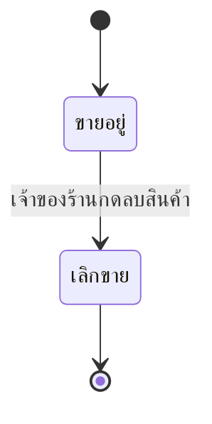

| จาก | ไป | เหตุการณ์ | ผู้กระทำ |
|---|---|---|---|
| ACTIVE | DISCONTINUED | เจ้าของร้านกดลบสินค้า | — |

#### วงจรชีวิต STM-talad-002 · วงจรชีวิตโปรโมชั่น

เอนทิตี: `ENT-005`

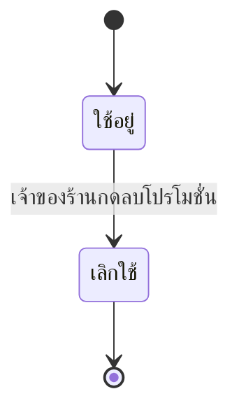

| จาก | ไป | เหตุการณ์ | ผู้กระทำ |
|---|---|---|---|
| ACTIVE | DISCONTINUED | เจ้าของร้านกดลบโปรโมชั่น | — |

#### วงจรชีวิต STM-talad-003 · วงจรชีวิตสมาชิก

เอนทิตี: `ENT-004`

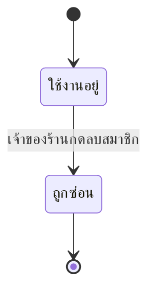

| จาก | ไป | เหตุการณ์ | ผู้กระทำ |
|---|---|---|---|
| ACTIVE | HIDDEN | เจ้าของร้านกดลบสมาชิก | — |

#### วงจรชีวิต STM-talad-004 · วงจรชีวิตบัญชีผู้ใช้

เอนทิตี: `ENT-008`

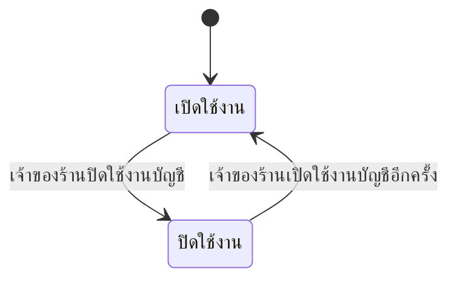

| จาก | ไป | เหตุการณ์ | ผู้กระทำ |
|---|---|---|---|
| ACTIVE | DISABLED | เจ้าของร้านปิดใช้งานบัญชี | — |
| DISABLED | ACTIVE | เจ้าของร้านเปิดใช้งานบัญชีอีกครั้ง | — |

#### วงจรชีวิต STM-talad-005 · วงจรชีวิตตะกร้า

เอนทิตี: `ENT-009`

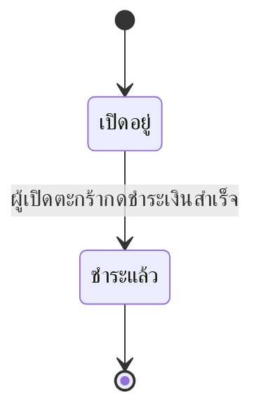

| จาก | ไป | เหตุการณ์ | ผู้กระทำ |
|---|---|---|---|
| OPEN | PAID | ผู้เปิดตะกร้ากดชำระเงินสำเร็จ | — |

#### วงจรชีวิต STM-talad-006 · วงจรชีวิตบิลขาย

เอนทิตี: `ENT-011`

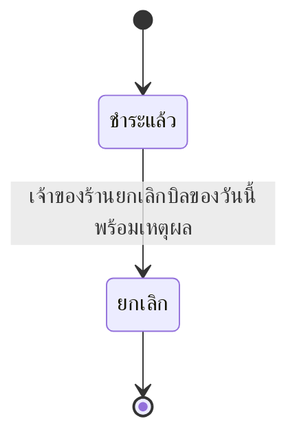

| จาก | ไป | เหตุการณ์ | ผู้กระทำ |
|---|---|---|---|
| PAID | VOIDED | เจ้าของร้านยกเลิกบิลของวันนี้พร้อมเหตุผล | — |

## 4 ความต้องการที่ไม่ใช่เชิงหน้าที่

| รหัส | ด้าน | ข้อความจาก `req` | สิ่งที่วัด | เป้าหมาย | เงื่อนไข | วัดด้วย |
|---|---|---|---|---|---|---|
| NFR-talad-001 | usability | เป็น web responsive รองรับได้หลายขนาดหน้าจอ | ความกว้างหน้าจอที่แคบที่สุดที่ทุกหน้าจอของระบบใช้งานได้ครบทุกปุ่มและทุกช่อง โดยไม่ต้องเลื่อนแนวนอน | <= 768 px | เบราว์เซอร์รุ่นปัจจุบัน (Chrome · Edge · Safari) ทดสอบที่ความกว้าง 768 · 1280 · 1920 px ทุกหน้าจอ | เปิดทุกหน้าจอในโหมด responsive ของ DevTools ที่สามความกว้าง แล้วตรวจว่าไม่มีแถบเลื่อนแนวนอนและกดทุกปุ่มได้ |
| NFR-talad-002 | usability | ใช้เมนูนำทางด้านซ้าย (left nav menu) | จำนวนหน้าจอหลังเข้าสู่ระบบที่ไม่ได้ใช้เมนูนำทางด้านซ้ายเป็นเมนูหลัก (ยกเว้นหน้าเข้าสู่ระบบและใบเสร็จเต็มจอ) | = 0 หน้าจอ | ทุกหน้าจอใน sitemap ที่ความกว้าง 768 px ขึ้นไป | ไล่เปิดทุกหน้าจอตาม sitemap แล้วนับหน้าที่ไม่มีเมนูซ้าย |
| NFR-talad-003 | other | Tech stack: web = React + Tailwind v5 + daisy v4 · api = .NET 10 API · database = PostgreSQL v18 | จำนวนส่วนประกอบของระบบ (เว็บ · API · ฐานข้อมูล) ที่ใช้เทคโนโลยีหรือรุ่นหลักต่างจากที่ลูกค้ากำหนด | = 0 ส่วนประกอบ | ตรวจที่รุ่นที่ส่งมอบ เทียบกับ React + Tailwind v5 + daisy v4 · .NET 10 · PostgreSQL v18 | อ่านไฟล์ dependency ของแต่ละส่วน (package.json · .csproj · รุ่นของ PostgreSQL ใน compose) แล้วนับรายการที่ไม่ตรง |
| NFR-talad-004 | other | ขอบเขต: ร้านค้าเดี่ยว (single store) ไม่รองรับหลายสาขาในเวอร์ชันนี้ | จำนวนร้าน/สาขาที่ข้อมูลของระบบหนึ่งชุดรองรับ | = 1 ร้าน | เวอร์ชันนี้ทั้งหมด — ไม่มีคอลัมน์หรือหน้าจอที่แยกข้อมูลตามสาขา | ตรวจ datamodel และหน้าจอที่ส่งมอบว่าไม่มีแนวคิดสาขา |
| NFR-talad-005 | security | Authentication ใช้ .NET Identity JWT | สัดส่วน endpoint ของ API (ยกเว้นเข้าสู่ระบบ) ที่ปฏิเสธคำขอที่ไม่มี JWT ที่ถูกต้องด้วย HTTP 401 | >= 100 % | ทุก endpoint ที่ประกาศใน interfaces.json · คำขอไม่มี token · token หมดอายุ · token ลายเซ็นผิด | เทสอัตโนมัติเรียกทุก endpoint ด้วยสามกรณีแล้วนับว่าได้ 401 |
| NFR-talad-006 | usability | ตารางรองรับ server paging, search filter และมีปุ่ม search | เวลาตั้งแต่กดปุ่มค้นหาที่ตารางสต็อกจนหน้าผลลัพธ์ (20 แถวต่อหน้า จากการแบ่งหน้าที่เซิร์ฟเวอร์) แสดงครบ | <= 2 วินาที | p95 · สินค้า 2,000 รายการ · บิลสะสม 5 ปีที่ 300 บิลต่อวัน (~550,000 บิล) · เครื่องขายใช้งานพร้อมกัน 5 เครื่อง · ผ่าน LAN ในร้าน | load test ด้วยข้อมูลจำลองขนาดตาม condition วัดเวลาที่ API ตอบบวกเวลาที่หน้าจอแสดงผล |
| NFR-talad-007 | usability | ตารางรองรับ server paging, search filter และมีปุ่ม search | เวลาตั้งแต่กดปุ่มค้นหาที่ตารางประวัติการขายจนหน้าผลลัพธ์ (20 แถวต่อหน้า จากการแบ่งหน้าที่เซิร์ฟเวอร์) แสดงครบ | <= 2 วินาที | p95 · สินค้า 2,000 รายการ · บิลสะสม 5 ปีที่ 300 บิลต่อวัน (~550,000 บิล) · เครื่องขายใช้งานพร้อมกัน 5 เครื่อง · ผ่าน LAN ในร้าน | load test ด้วยข้อมูลจำลองขนาดตาม condition วัดเวลาที่ API ตอบบวกเวลาที่หน้าจอแสดงผล |
| NFR-talad-008 | usability | ตารางรองรับ server paging, search filter และมีปุ่ม search | เวลาตั้งแต่กดปุ่มค้นหาที่ตารางรายงานจนหน้าผลลัพธ์ (20 แถวต่อหน้า จากการแบ่งหน้าที่เซิร์ฟเวอร์) แสดงครบ | <= 2 วินาที | p95 · ช่วงเวลาที่เลือกไม่เกิน 1 เดือน · สินค้า 2,000 รายการ · บิลสะสม 5 ปีที่ 300 บิลต่อวัน (~550,000 บิล) · เครื่องขายใช้งานพร้อมกัน 5 เครื่อง · ผ่าน LAN ในร้าน | load test ด้วยข้อมูลจำลองขนาดตาม condition วัดเวลาที่ API ตอบบวกเวลาที่หน้าจอแสดงผล |

> ℹ️ **ข้อจำกัดของข้อมูลชุดนี้** — ช่อง *ด้าน* กับ *ข้อความ* เป็นของ `req` และไม่ถูกคัดลอกลงไฟล์ของ `design` — ถ้าเห็นเป็นขีด แปลว่ารหัสนี้ไม่มีอยู่ในสัญญาที่ `req` ส่งมา

## 5 ความต้องการด้านข้อมูล

### 5.1 แผนภาพความสัมพันธ์ของข้อมูล (ERD)

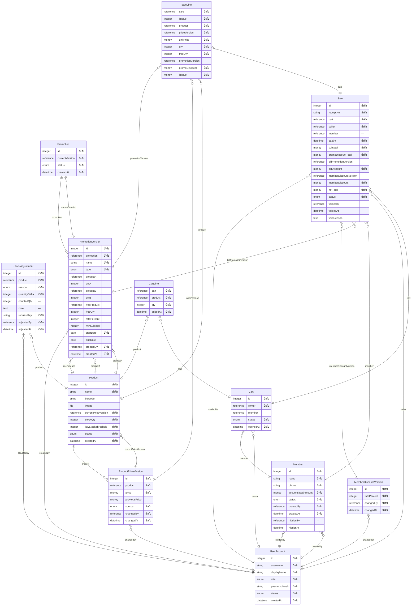

| ชื่อในผัง | รหัส | ชื่อที่แสดง | มีวงจรชีวิต | คำอธิบาย |
|---|---|---|---|---|
| Product | ENT-001 | สินค้า | มี | — |
| ProductPriceVersion | ENT-002 | เวอร์ชันราคาสินค้า (ประวัติราคา) | ไม่มี | — |
| StockAdjustment | ENT-003 | รายการปรับสต็อก | ไม่มี | — |
| Member | ENT-004 | สมาชิก | มี | — |
| Promotion | ENT-005 | โปรโมชั่น | มี | — |
| PromotionVersion | ENT-006 | เวอร์ชันเงื่อนไขโปรโมชั่น | ไม่มี | — |
| MemberDiscountVersion | ENT-007 | เวอร์ชันส่วนลดสมาชิก | ไม่มี | — |
| UserAccount | ENT-008 | บัญชีผู้ใช้ (พนักงานขาย · เจ้าของร้าน) | มี | — |
| Cart | ENT-009 | ตะกร้า | มี | — |
| CartLine | ENT-010 | รายการในตะกร้า | ไม่มี | — |
| Sale | ENT-011 | บิลขาย | มี | — |
| SaleLine | ENT-012 | รายการในบิลขาย | ไม่มี | — |

### 5.2 พจนานุกรมข้อมูล (Data Dictionary)

#### ENT-001 · สินค้า

ข้อบังคับที่ต้องเป็นจริงเสมอ: `BR-talad-007@v1`

| ฟิลด์ | ชื่อที่แสดง | ชนิด | บังคับ | ข้อมูลส่วนบุคคล | ชั้นความอ่อนไหว | ระยะเก็บรักษา | กฎตรวจสอบ |
|---|---|---|---|---|---|---|---|
| id | — | integer | บังคับ | ไม่ใช่ | — | — | รหัสที่ระบบสร้างอัตโนมัติ ห้ามซ้ำ ไม่นำกลับมาใช้ |
| name | — | string | บังคับ | ไม่ใช่ | — | — | ไม่ว่าง ตัดช่องว่างหน้า-หลังก่อนบันทึก |
| barcode | — | string | ไม่บังคับ | ไม่ใช่ | — | — | ถ้ามี ห้ามซ้ำกับสินค้าที่สถานะ ACTIVE ใช้ค้นหาที่หน้าขาย |
| image | — | file | ไม่บังคับ | ไม่ใช่ | — | — | รูปภาพสินค้า เก็บเป็นไฟล์บนดิสก์เซิร์ฟเวอร์ตามการ์ด DEC-002 ฐานข้อมูลเก็บเฉพาะตำแหน่งไฟล์ |
| currentPriceVersion | — | reference → ENT-002 | บังคับ | ไม่ใช่ | — | — | ชี้เวอร์ชันราคาล่าสุดของสินค้านี้ ราคาที่ใช้ตอนกดชำระอ่านจากเวอร์ชันนี้ |
| stockQty | — | integer | บังคับ | ไม่ใช่ | — | — | จำนวนเต็ม ≥ 0 เปลี่ยนได้เฉพาะจากการชำระบิล การยกเลิกบิล และรายการปรับสต็อก |
| lowStockThreshold | — | integer | บังคับ | ไม่ใช่ | — | — | จำนวนเต็ม ≥ 0 ที่เจ้าของร้านตั้ง สินค้าแสดงป้ายใกล้หมดเมื่อ stockQty ≤ ค่านี้ |
| status | — | enum ตาม STM-talad-001: ACTIVE · DISCONTINUED | บังคับ | ไม่ใช่ | — | — | ค่าเริ่มต้น ACTIVE |
| createdAt | — | datetime | บังคับ | ไม่ใช่ | — | — | เวลาที่สร้าง (เวลาไทย) |

#### ENT-002 · เวอร์ชันราคาสินค้า (ประวัติราคา)

ข้อบังคับที่ต้องเป็นจริงเสมอ: `BR-talad-033@v1` · `BR-talad-036@v1`

| ฟิลด์ | ชื่อที่แสดง | ชนิด | บังคับ | ข้อมูลส่วนบุคคล | ชั้นความอ่อนไหว | ระยะเก็บรักษา | กฎตรวจสอบ |
|---|---|---|---|---|---|---|---|
| id | — | integer | บังคับ | ไม่ใช่ | — | — | รหัสที่ระบบสร้างอัตโนมัติ ห้ามซ้ำ ไม่นำกลับมาใช้ |
| product | — | reference → ENT-001 | บังคับ | ไม่ใช่ | — | — | สินค้าที่ราคานี้เป็นของ |
| price | — | money | บังคับ | ไม่ใช่ | — | — | numeric(12,2) ≥ 0 — ทศนิยม 2 ตำแหน่ง และมากกว่า 0 |
| previousPrice | — | money | ไม่บังคับ | ไม่ใช่ | — | — | ราคาของเวอร์ชันก่อนหน้า ว่างเฉพาะเวอร์ชันแรกของสินค้า |
| source | — | enum: STOCK_SCREEN · SALES_SCREEN | บังคับ | ไม่ใช่ | — | — | ช่องทางที่แก้ราคา — หน้าสต็อก หรือทางลัดที่หน้าขาย |
| changedBy | — | reference → ENT-008 | บังคับ | ไม่ใช่ | — | — | ผู้แก้ราคา — ต้องเป็นบัญชีบทบาท OWNER |
| changedAt | — | datetime | บังคับ | ไม่ใช่ | — | — | เวลาที่แก้ (เวลาไทย) · ทุกการแก้สร้างแถวใหม่ ไม่มีการแก้ทับ และแถวที่บิลอ้างถึงลบไม่ได้ |

#### ENT-003 · รายการปรับสต็อก

ข้อบังคับที่ต้องเป็นจริงเสมอ: `BR-talad-032@v1` · `BR-talad-041@v1`

| ฟิลด์ | ชื่อที่แสดง | ชนิด | บังคับ | ข้อมูลส่วนบุคคล | ชั้นความอ่อนไหว | ระยะเก็บรักษา | กฎตรวจสอบ |
|---|---|---|---|---|---|---|---|
| id | — | integer | บังคับ | ไม่ใช่ | — | — | รหัสที่ระบบสร้างอัตโนมัติ ห้ามซ้ำ ไม่นำกลับมาใช้ |
| product | — | reference → ENT-001 | บังคับ | ไม่ใช่ | — | — | สินค้าที่ถูกปรับ |
| reason | — | enum: RECEIVE · SPOILED · RECOUNT | บังคับ | ไม่ใช่ | — | — | เลือกจากรายการเท่านั้น |
| quantityDelta | — | integer | บังคับ | ไม่ใช่ | — | — | จำนวนที่เพิ่ม (+) หรือลด (−) ไม่เป็น 0 · กรณี RECOUNT ระบบคำนวณจากจำนวนที่นับได้ลบคงเหลือเดิม · ผลต้องไม่ทำให้คงเหลือติดลบ |
| countedQty | — | integer | ไม่บังคับ | ไม่ใช่ | — | — | จำนวนที่นับได้ ≥ 0 บังคับเมื่อ reason = RECOUNT และว่างในกรณีอื่น |
| note | — | text | ไม่บังคับ | ไม่ใช่ | — | — | หมายเหตุ ไม่บังคับ |
| requestKey | — | string | บังคับ | ไม่ใช่ | — | — | คีย์ที่ฟอร์มสร้างขึ้นตอนเปิดฟอร์ม ห้ามซ้ำ (unique) — ส่งคำขอซ้ำด้วยคีย์เดิมถูกปฏิเสธ เปิดฟอร์มใหม่ได้คีย์ใหม่ |
| adjustedBy | — | reference → ENT-008 | บังคับ | ไม่ใช่ | — | — | ผู้ปรับสต็อก — ต้องเป็นบัญชีบทบาท OWNER |
| adjustedAt | — | datetime | บังคับ | ไม่ใช่ | — | — | เวลาที่บันทึก (เวลาไทย) · แถวที่บันทึกแล้วแก้หรือลบไม่ได้ |

#### ENT-004 · สมาชิก

ข้อบังคับที่ต้องเป็นจริงเสมอ: `BR-talad-003@v1`

| ฟิลด์ | ชื่อที่แสดง | ชนิด | บังคับ | ข้อมูลส่วนบุคคล | ชั้นความอ่อนไหว | ระยะเก็บรักษา | กฎตรวจสอบ |
|---|---|---|---|---|---|---|---|
| id | — | integer | บังคับ | ไม่ใช่ | — | — | รหัสที่ระบบสร้างอัตโนมัติ ห้ามซ้ำ ไม่นำกลับมาใช้ |
| name | — | string | บังคับ | ไม่ใช่ | — | — | ไม่ว่าง ตัดช่องว่างหน้า-หลังก่อนบันทึก |
| phone | — | string | บังคับ | ไม่ใช่ | — | — | ตัดขีดและช่องว่างออกก่อนตรวจและก่อนเก็บ แล้วต้องเป็นตัวเลข 10 หลักขึ้นต้นด้วย 0 · ห้ามซ้ำกับสมาชิกสถานะ ACTIVE (unique เฉพาะแถวที่ status = ACTIVE) · สมาชิกที่ถูกซ่อนไม่นับ |
| accumulatedAmount | — | money | บังคับ | ไม่ใช่ | — | — | numeric(12,2) ≥ 0 — ทศนิยม 2 ตำแหน่ง เริ่มที่ 0 · เพิ่มด้วยยอดชำระจริงเมื่อชำระบิลที่ผูกสมาชิก และหักคืนเมื่อยกเลิกบิลนั้น |
| status | — | enum ตาม STM-talad-003: ACTIVE · HIDDEN | บังคับ | ไม่ใช่ | — | — | ค่าเริ่มต้น ACTIVE |
| createdBy | — | reference → ENT-008 | บังคับ | ไม่ใช่ | — | — | ผู้สมัครให้ — พนักงานขายหรือเจ้าของร้าน |
| createdAt | — | datetime | บังคับ | ไม่ใช่ | — | — | เวลาที่สมัคร (เวลาไทย) |
| hiddenBy | — | reference → ENT-008 | ไม่บังคับ | ไม่ใช่ | — | — | ผู้ซ่อนสมาชิก — บังคับเมื่อ status = HIDDEN และต้องเป็นบัญชีบทบาท OWNER |
| hiddenAt | — | datetime | ไม่บังคับ | ไม่ใช่ | — | — | เวลาที่ซ่อน — บังคับเมื่อ status = HIDDEN |

#### ENT-005 · โปรโมชั่น

| ฟิลด์ | ชื่อที่แสดง | ชนิด | บังคับ | ข้อมูลส่วนบุคคล | ชั้นความอ่อนไหว | ระยะเก็บรักษา | กฎตรวจสอบ |
|---|---|---|---|---|---|---|---|
| id | — | integer | บังคับ | ไม่ใช่ | — | — | รหัสที่ระบบสร้างอัตโนมัติ ห้ามซ้ำ ไม่นำกลับมาใช้ |
| currentVersion | — | reference → ENT-006 | บังคับ | ไม่ใช่ | — | — | ชี้เวอร์ชันเงื่อนไขล่าสุดของโปรนี้ |
| status | — | enum ตาม STM-talad-002: ACTIVE · DISCONTINUED | บังคับ | ไม่ใช่ | — | — | ค่าเริ่มต้น ACTIVE |
| createdAt | — | datetime | บังคับ | ไม่ใช่ | — | — | เวลาที่สร้าง (เวลาไทย) |

#### ENT-006 · เวอร์ชันเงื่อนไขโปรโมชั่น

ข้อบังคับที่ต้องเป็นจริงเสมอ: `BR-talad-036@v1`

| ฟิลด์ | ชื่อที่แสดง | ชนิด | บังคับ | ข้อมูลส่วนบุคคล | ชั้นความอ่อนไหว | ระยะเก็บรักษา | กฎตรวจสอบ |
|---|---|---|---|---|---|---|---|
| id | — | integer | บังคับ | ไม่ใช่ | — | — | รหัสที่ระบบสร้างอัตโนมัติ ห้ามซ้ำ ไม่นำกลับมาใช้ |
| promotion | — | reference → ENT-005 | บังคับ | ไม่ใช่ | — | — | โปรโมชั่นที่เวอร์ชันนี้เป็นของ |
| name | — | string | บังคับ | ไม่ใช่ | — | — | ไม่ว่าง — ชื่อที่แสดงใต้บรรทัดสินค้าในบิล |
| type | — | enum: ITEM_PERCENT · BILL_PERCENT · BUY_X_GET_Y · BUY_AB_GET_Y · BUY_AB_PERCENT · BUY_X_PERCENT | บังคับ | ไม่ใช่ | — | — | รูปแบบโปรโมชั่น |
| productA | — | reference → ENT-001 | ไม่บังคับ | ไม่ใช่ | — | — | สินค้าที่ต้องซื้อ — บังคับทุกรูปแบบยกเว้น BILL_PERCENT |
| qtyA | — | integer | ไม่บังคับ | ไม่ใช่ | — | — | จำนวนต่อชุดของ productA ≥ 1 — บังคับสำหรับ BUY_X_GET_Y · BUY_AB_GET_Y · BUY_AB_PERCENT · BUY_X_PERCENT |
| productB | — | reference → ENT-001 | ไม่บังคับ | ไม่ใช่ | — | — | สินค้าที่สองของชุด — บังคับสำหรับ BUY_AB_GET_Y · BUY_AB_PERCENT |
| qtyB | — | integer | ไม่บังคับ | ไม่ใช่ | — | — | จำนวนต่อชุดของ productB ≥ 1 — บังคับเมื่อมี productB |
| freeProduct | — | reference → ENT-001 | ไม่บังคับ | ไม่ใช่ | — | — | ของแถม — บังคับสำหรับ BUY_X_GET_Y · BUY_AB_GET_Y เป็นสินค้าเดียวกับ productA/productB ได้ |
| freeQty | — | integer | ไม่บังคับ | ไม่ใช่ | — | — | จำนวนของแถมต่อชุด ≥ 1 — บังคับเมื่อมี freeProduct |
| ratePercent | — | integer | ไม่บังคับ | ไม่ใช่ | — | — | จำนวนเต็ม 0–100 — บังคับสำหรับ ITEM_PERCENT · BILL_PERCENT · BUY_AB_PERCENT · BUY_X_PERCENT |
| minSubtotal | — | money | ไม่บังคับ | ไม่ใช่ | — | — | numeric(12,2) ≥ 0 — ทศนิยม 2 ตำแหน่ง — บังคับสำหรับ BILL_PERCENT เทียบกับยอดหลังโปรระดับสินค้า |
| startDate | — | date | บังคับ | ไม่ใช่ | — | — | วันเริ่มมีผล (เวลาไทย) นับตั้งแต่ 00:00 ของวันนั้น |
| endDate | — | date | ไม่บังคับ | ไม่ใช่ | — | — | วันสุดท้ายที่มีผล (รวมทั้งวัน) ว่าง = มีผลจนกว่าจะลบ · ถ้ามีต้องไม่ก่อน startDate |
| createdBy | — | reference → ENT-008 | บังคับ | ไม่ใช่ | — | — | ผู้สร้างหรือแก้โปร — ต้องเป็นบัญชีบทบาท OWNER |
| createdAt | — | datetime | บังคับ | ไม่ใช่ | — | — | เวลาที่สร้างเวอร์ชัน (เวลาไทย) · ทุกการแก้สร้างแถวใหม่ ไม่มีการแก้ทับ และแถวที่บิลอ้างถึงลบไม่ได้ |

#### ENT-007 · เวอร์ชันส่วนลดสมาชิก

ข้อบังคับที่ต้องเป็นจริงเสมอ: `BR-talad-035@v1` · `BR-talad-036@v1`

| ฟิลด์ | ชื่อที่แสดง | ชนิด | บังคับ | ข้อมูลส่วนบุคคล | ชั้นความอ่อนไหว | ระยะเก็บรักษา | กฎตรวจสอบ |
|---|---|---|---|---|---|---|---|
| id | — | integer | บังคับ | ไม่ใช่ | — | — | รหัสที่ระบบสร้างอัตโนมัติ ห้ามซ้ำ ไม่นำกลับมาใช้ |
| ratePercent | — | integer | บังคับ | ไม่ใช่ | — | — | จำนวนเต็ม 0–100 · 0 = ไม่มีส่วนลดสมาชิก · เวอร์ชันล่าสุดคือค่าที่มีผล |
| changedBy | — | reference → ENT-008 | บังคับ | ไม่ใช่ | — | — | ผู้ตั้งค่า — ต้องเป็นบัญชีบทบาท OWNER |
| changedAt | — | datetime | บังคับ | ไม่ใช่ | — | — | เวลาที่ตั้งค่า (เวลาไทย) · ทุกการแก้สร้างแถวใหม่ และแถวที่บิลอ้างถึงลบไม่ได้ |

#### ENT-008 · บัญชีผู้ใช้ (พนักงานขาย · เจ้าของร้าน)

| ฟิลด์ | ชื่อที่แสดง | ชนิด | บังคับ | ข้อมูลส่วนบุคคล | ชั้นความอ่อนไหว | ระยะเก็บรักษา | กฎตรวจสอบ |
|---|---|---|---|---|---|---|---|
| id | — | integer | บังคับ | ไม่ใช่ | — | — | รหัสที่ระบบสร้างอัตโนมัติ ห้ามซ้ำ ไม่นำกลับมาใช้ |
| username | — | string | บังคับ | ไม่ใช่ | — | — | ไม่ว่าง ห้ามซ้ำกับบัญชีใด ๆ รวมบัญชีที่ปิดใช้งานแล้ว |
| displayName | — | string | บังคับ | ไม่ใช่ | — | — | ไม่ว่าง — ชื่อที่แสดงเป็นผู้ขายบนบิลและในรายงาน |
| role | — | enum: CASHIER · OWNER | บังคับ | ไม่ใช่ | — | — | บทบาทของบัญชี |
| passwordHash | — | string | บังคับ | ไม่ใช่ | — | — | เก็บผ่าน .NET Identity เท่านั้น ไม่เก็บรหัสผ่านที่อ่านได้ |
| status | — | enum ตาม STM-talad-004: ACTIVE · DISABLED | บังคับ | ไม่ใช่ | — | — | ค่าเริ่มต้น ACTIVE · บัญชี DISABLED ล็อกอินไม่ได้ |
| createdAt | — | datetime | บังคับ | ไม่ใช่ | — | — | เวลาที่สร้าง (เวลาไทย) |

#### ENT-009 · ตะกร้า

ข้อบังคับที่ต้องเป็นจริงเสมอ: `BR-talad-039@v1`

| ฟิลด์ | ชื่อที่แสดง | ชนิด | บังคับ | ข้อมูลส่วนบุคคล | ชั้นความอ่อนไหว | ระยะเก็บรักษา | กฎตรวจสอบ |
|---|---|---|---|---|---|---|---|
| id | — | integer | บังคับ | ไม่ใช่ | — | — | รหัสที่ระบบสร้างอัตโนมัติ ห้ามซ้ำ ไม่นำกลับมาใช้ |
| owner | — | reference → ENT-008 | บังคับ | ไม่ใช่ | — | — | ผู้เปิดตะกร้า — เห็น แก้ และชำระได้คนเดียว · ผู้ใช้หนึ่งคนมีตะกร้าสถานะ OPEN ได้ไม่เกิน 1 ใบ |
| member | — | reference → ENT-004 | ไม่บังคับ | ไม่ใช่ | — | — | สมาชิกที่ผูกกับตะกร้า ต้องมีสถานะ ACTIVE ตอนผูกและตอนกดชำระ |
| status | — | enum ตาม STM-talad-005: OPEN · PAID | บังคับ | ไม่ใช่ | — | — | ค่าเริ่มต้น OPEN |
| openedAt | — | datetime | บังคับ | ไม่ใช่ | — | — | เวลาที่เปิดตะกร้า (เวลาไทย) |

#### ENT-010 · รายการในตะกร้า

| ฟิลด์ | ชื่อที่แสดง | ชนิด | บังคับ | ข้อมูลส่วนบุคคล | ชั้นความอ่อนไหว | ระยะเก็บรักษา | กฎตรวจสอบ |
|---|---|---|---|---|---|---|---|
| cart | — | reference → ENT-009 | บังคับ | ไม่ใช่ | — | — | ตะกร้าที่รายการนี้อยู่ แก้ได้เฉพาะเมื่อตะกร้าสถานะ OPEN |
| product | — | reference → ENT-001 | บังคับ | ไม่ใช่ | — | — | สินค้าในรายการ ต้องมีสถานะ ACTIVE · หนึ่งสินค้าหนึ่งบรรทัดต่อตะกร้า (รวมชิ้นที่หยิบมาเป็นของแถม) |
| qty | — | integer | บังคับ | ไม่ใช่ | — | — | จำนวนเต็ม ≥ 1 และไม่เกิน stockQty ของสินค้า ณ ตอนเพิ่ม — ลดจนเป็น 0 คือเอารายการออก |
| addedAt | — | datetime | บังคับ | ไม่ใช่ | — | — | เวลาที่เพิ่มรายการครั้งแรก (เวลาไทย) ใช้เรียงบรรทัด |

#### ENT-011 · บิลขาย

ข้อบังคับที่ต้องเป็นจริงเสมอ: `BR-talad-039@v1` · `BR-talad-006@v1` · `BR-talad-016@v2` · `BR-talad-024@v1` · `BR-talad-025@v1` · `BR-talad-034@v1` · `BR-talad-035@v1` · `BR-talad-036@v1` · `BR-talad-042@v1`

| ฟิลด์ | ชื่อที่แสดง | ชนิด | บังคับ | ข้อมูลส่วนบุคคล | ชั้นความอ่อนไหว | ระยะเก็บรักษา | กฎตรวจสอบ |
|---|---|---|---|---|---|---|---|
| id | — | integer | บังคับ | ไม่ใช่ | — | — | รหัสที่ระบบสร้างอัตโนมัติ ห้ามซ้ำ ไม่นำกลับมาใช้ |
| receiptNo | — | string | บังคับ | ไม่ใช่ | — | — | เลขใบเสร็จที่ระบบออกตอนชำระ ห้ามซ้ำ ไม่นำเลขเดิมกลับมาใช้ · บิลที่ขายใหม่แทนได้เลขใหม่ |
| cart | — | reference → ENT-009 | บังคับ | ไม่ใช่ | — | — | ตะกร้าที่ถูกชำระ ห้ามซ้ำ (unique) — หนึ่งตะกร้าเกิดบิลได้ใบเดียว และเป็นคีย์กันชำระซ้ำ |
| seller | — | reference → ENT-008 | บังคับ | ไม่ใช่ | — | — | ผู้ขาย = เจ้าของตะกร้าที่กดชำระ |
| member | — | reference → ENT-004 | ไม่บังคับ | ไม่ใช่ | — | — | สมาชิกที่ผูกกับบิล คงอยู่แม้สมาชิกถูกซ่อนภายหลัง |
| paidAt | — | datetime | บังคับ | ไม่ใช่ | — | — | เวลาที่ชำระ (เวลาไทย) — วันที่ของค่านี้คือวันของบิล ใช้ตัดสินว่ายกเลิกได้หรือไม่ |
| subtotal | — | money | บังคับ | ไม่ใช่ | — | — | numeric(12,2) ≥ 0 — ทศนิยม 2 ตำแหน่ง = ผลรวม lineNet ของทุกบรรทัด |
| promoDiscountTotal | — | money | บังคับ | ไม่ใช่ | — | — | numeric(12,2) ≥ 0 — ทศนิยม 2 ตำแหน่ง = ผลรวม promoDiscount ของทุกบรรทัด แสดงเป็นยอด "ส่วนลดโปรโมชั่น" |
| billPromotionVersion | — | reference → ENT-006 | ไม่บังคับ | ไม่ใช่ | — | — | โปรส่วนลดทั้งบิลที่ใช้ (อันที่ลดมากสุดอันเดียว) ว่างเมื่อไม่มี |
| billDiscount | — | money | บังคับ | ไม่ใช่ | — | — | numeric(12,2) ≥ 0 — ทศนิยม 2 ตำแหน่ง ปัดตามจุดปัดของสัญญาการคำนวณ |
| memberDiscountVersion | — | reference → ENT-007 | ไม่บังคับ | ไม่ใช่ | — | — | เวอร์ชันส่วนลดสมาชิกที่ใช้ บังคับเมื่อบิลผูกสมาชิก |
| memberDiscount | — | money | บังคับ | ไม่ใช่ | — | — | numeric(12,2) ≥ 0 — ทศนิยม 2 ตำแหน่ง ปัดตามจุดปัดของสัญญาการคำนวณ · 0 เมื่อไม่ผูกสมาชิก |
| netTotal | — | money | บังคับ | ไม่ใช่ | — | — | numeric(12,2) ≥ 0 — ทศนิยม 2 ตำแหน่ง ยอดที่ชำระจริง = subtotal − billDiscount − memberDiscount |
| status | — | enum ตาม STM-talad-006: PAID · VOIDED | บังคับ | ไม่ใช่ | — | — | ค่าเริ่มต้น PAID |
| voidedBy | — | reference → ENT-008 | ไม่บังคับ | ไม่ใช่ | — | — | ผู้ยกเลิก — บังคับเมื่อ status = VOIDED และต้องเป็นบัญชีบทบาท OWNER |
| voidedAt | — | datetime | ไม่บังคับ | ไม่ใช่ | — | — | เวลาที่ยกเลิก — บังคับเมื่อ status = VOIDED |
| voidReason | — | text | ไม่บังคับ | ไม่ใช่ | — | — | เหตุผลการยกเลิก — บังคับและไม่ว่างเมื่อ status = VOIDED |

#### ENT-012 · รายการในบิลขาย

ข้อบังคับที่ต้องเป็นจริงเสมอ: `BR-talad-016@v2` · `BR-talad-025@v1` · `BR-talad-035@v1` · `BR-talad-036@v1`

| ฟิลด์ | ชื่อที่แสดง | ชนิด | บังคับ | ข้อมูลส่วนบุคคล | ชั้นความอ่อนไหว | ระยะเก็บรักษา | กฎตรวจสอบ |
|---|---|---|---|---|---|---|---|
| sale | — | reference → ENT-011 | บังคับ | ไม่ใช่ | — | — | บิลที่บรรทัดนี้อยู่ · บรรทัดของบิลที่บันทึกแล้วแก้หรือลบไม่ได้ |
| lineNo | — | integer | บังคับ | ไม่ใช่ | — | — | ลำดับบรรทัดในบิล เริ่มที่ 1 |
| product | — | reference → ENT-001 | บังคับ | ไม่ใช่ | — | — | สินค้าในบรรทัด คงอยู่แม้สินค้าเลิกขายภายหลัง |
| priceVersion | — | reference → ENT-002 | บังคับ | ไม่ใช่ | — | — | เวอร์ชันราคาที่ใช้ ณ ตอนกดชำระ |
| unitPrice | — | money | บังคับ | ไม่ใช่ | — | — | numeric(12,2) ≥ 0 — ทศนิยม 2 ตำแหน่ง ราคาต่อหน่วยของ priceVersion ณ ตอนกดชำระ |
| qty | — | integer | บังคับ | ไม่ใช่ | — | — | จำนวนเต็ม ≥ 1 รวมชิ้นที่ได้ฟรี |
| freeQty | — | integer | บังคับ | ไม่ใช่ | — | — | จำนวนชิ้นที่ได้ฟรีจากโปรแถม 0 ถึง qty |
| promotionVersion | — | reference → ENT-006 | ไม่บังคับ | ไม่ใช่ | — | — | โปรระดับสินค้าโปรเดียวที่บรรทัดนี้ได้ ว่างเมื่อไม่มีโปร · ชื่อโปรแสดงใต้บรรทัดจากเวอร์ชันนี้ |
| promoDiscount | — | money | บังคับ | ไม่ใช่ | — | — | numeric(12,2) ≥ 0 — ทศนิยม 2 ตำแหน่ง ส่วนลดของบรรทัดจากโปรที่ได้ ปัดตามสัญญาการคำนวณของโปรนั้น |
| lineNet | — | money | บังคับ | ไม่ใช่ | — | — | numeric(12,2) ≥ 0 — ทศนิยม 2 ตำแหน่ง = unitPrice × qty − promoDiscount |

> ℹ️ **ข้อจำกัดของข้อมูลชุดนี้** — มีฟิลด์ที่ติดธงว่าเป็นข้อมูลส่วนบุคคล 0 ฟิลด์ — ฟิลด์ที่ไม่มีใครติดธง ไม่มีสคริปต์ไหนรู้ว่าเป็นข้อมูลส่วนบุคคล ตารางนี้จึงไม่ใช่ผลการตรวจ PDPA

## 6 ความต้องการด้าน Interface

### 6.1 หน้าจอ

#### โมดูล talad

| รหัส | หน้าจอ | ชนิดหน้า | หน้าที่ | ถือข้อมูล | บทบาทที่เข้าถึงได้ |
|---|---|---|---|---|---|
| UI-talad-001 | เข้าสู่ระบบ | auth | ผู้ใช้ยืนยันตัวตนด้วยชื่อผู้ใช้และรหัสผ่านเพื่อเข้าใช้งานหน้าขาย | ไม่ใช่ | ROLE-003 |
| UI-talad-002 | หน้าขาย | workflow | พนักงานเลือกสินค้าใส่ตะกร้า ผูกสมาชิก ตรวจยอดและส่วนลด แล้วชำระเงิน | ใช่ | ROLE-001 · ROLE-002 |
| UI-talad-003 | เลือกโปรโมชั่นที่ลดเท่ากัน | modal | พนักงานเลือกโปรเมื่อโปรที่ลดมากที่สุดลดเท่ากันพอดี ก่อนชำระเงิน | ใช่ | ROLE-001 · ROLE-002 |
| RPT-talad-001 | ใบเสร็จ | report | แสดงใบเสร็จของบิลเต็มจอหลังชำระ และพิมพ์ให้ลูกค้าเมื่อต้องการ | ใช่ | ROLE-001 · ROLE-002 |
| UI-talad-004 | สมาชิก | list | ค้นหาสมาชิกทุกคนของร้าน เพื่อเปิดดูหรือแก้ข้อมูล และสมัครสมาชิกใหม่ | ใช่ | ROLE-001 · ROLE-002 |
| UI-talad-005 | สมัครสมาชิก | create | สร้างสมาชิกใหม่ด้วยชื่อและเบอร์โทร | ไม่ใช่ | ROLE-001 · ROLE-002 |
| UI-talad-006 | ข้อมูลสมาชิก | edit | ดูและแก้ชื่อหรือเบอร์โทรของสมาชิก และให้เจ้าของร้านซ่อนสมาชิก | ใช่ | ROLE-001 · ROLE-002 |
| UI-talad-007 | ประวัติการขาย | list | ค้นหาบิลขายย้อนหลังตามสิทธิ์ เพื่อเปิดดู พิมพ์ซ้ำ หรือยกเลิก | ใช่ | ROLE-001 · ROLE-002 |
| UI-talad-008 | รายละเอียดบิล | detail | ดูรายการ ส่วนลด ผู้ขาย สมาชิก และสถานะของบิล พิมพ์ใบเสร็จซ้ำ และให้เจ้าของร้านยกเลิกบิลของวันนี้ | ใช่ | ROLE-001 · ROLE-002 |
| UI-talad-009 | ยกเลิกบิล | modal | เจ้าของร้านยืนยันการยกเลิกบิลพร้อมเหตุผล | ไม่ใช่ | ROLE-002 |
| UI-talad-010 | สต็อก | list | ดูสินค้าที่ยังขายอยู่ จำนวนคงเหลือ และป้ายใกล้หมด เพื่อเปิดจัดการหรือเพิ่มสินค้า | ใช่ | ROLE-002 |
| UI-talad-011 | เพิ่ม/แก้ไขสินค้า | edit | เจ้าของร้านเพิ่มสินค้าใหม่ หรือแก้ชื่อ บาร์โค้ด รูป และจุดเตือนของสินค้า | ใช่ | ROLE-002 |
| UI-talad-012 | รายละเอียดสินค้า | detail | ดูข้อมูลสินค้า ประวัติราคา และรายการปรับสต็อก และเริ่มแก้ราคา ปรับสต็อก หรือเลิกขาย | ใช่ | ROLE-002 |
| UI-talad-013 | แก้ราคาสินค้า | modal | เจ้าของร้านตั้งราคาใหม่ของสินค้า จากหน้ารายละเอียดสินค้าหรือทางลัดที่หน้าขาย | ใช่ | ROLE-002 |
| UI-talad-014 | ปรับสต็อก | modal | เจ้าของร้านบันทึกรับของเข้า ของเน่า/เสีย หรือผลการนับสต็อกใหม่ | ใช่ | ROLE-002 |
| UI-talad-015 | โปรโมชั่น | list | ดูโปรโมชั่นที่ยังใช้อยู่ เพื่อสร้าง แก้ไข หรือเลิกใช้ | ใช่ | ROLE-002 |
| UI-talad-016 | เพิ่ม/แก้ไขโปรโมชั่น | edit | เจ้าของร้านกำหนดรูปแบบ เงื่อนไข และช่วงวันที่ของโปรโมชั่น | ใช่ | ROLE-002 |
| UI-talad-017 | ตั้งส่วนลดสมาชิก | manage | เจ้าของร้านตั้ง % ส่วนลดสมาชิกค่าเดียวของทั้งร้าน | ใช่ | ROLE-002 |
| UI-talad-018 | บัญชีพนักงาน | manage | เจ้าของร้านดูบัญชีผู้ใช้ทั้งหมดเพื่อเพิ่ม แก้ไข รีเซ็ตรหัสผ่าน หรือปิดใช้งาน | ใช่ | ROLE-002 |
| UI-talad-019 | เพิ่ม/แก้ไขบัญชีพนักงาน | edit | เจ้าของร้านสร้างบัญชี แก้ชื่อที่แสดงและบทบาท รีเซ็ตรหัสผ่าน และปิดหรือเปิดใช้งานบัญชี | ใช่ | ROLE-002 |
| RPT-talad-002 | รายงานยอดขายรายวัน/รายเดือน | report | เจ้าของร้านดูยอดขายสุทธิรายวันหรือรายเดือนในช่วงที่เลือก | ใช่ | ROLE-002 |
| RPT-talad-003 | รายงานสินค้าขายดี | report | เจ้าของร้านดูสินค้าที่ขายได้มากที่สุดในช่วงที่เลือก | ใช่ | ROLE-002 |
| RPT-talad-004 | รายงานยอดขายแยกตามผู้ขาย | report | เจ้าของร้านดูยอดขายของแต่ละผู้ขาย รวมเจ้าของร้าน ในช่วงที่เลือก | ใช่ | ROLE-002 |
| RPT-talad-005 | รายงานสต็อกคงเหลือ | report | เจ้าของร้านดูจำนวนคงเหลือของสินค้าที่ยังขายอยู่ | ใช่ | ROLE-002 |

##### UI-talad-001 · เข้าสู่ระบบ

| ฟิลด์ | ผูกกับข้อมูล | อ่าน/กรอก | บังคับ | กฎตรวจสอบ | กฎธุรกิจที่คุม |
|---|---|---|---|---|---|
| ชื่อผู้ใช้ | ENT-008.username | กรอก | บังคับ | ไม่ว่าง | BR-talad-005@v1 |
| รหัสผ่าน | ไม่ผูกกับเอนทิตีไหน | กรอก | บังคับ | ไม่ว่าง ไม่แสดงตัวอักษรที่พิมพ์ | BR-talad-005@v1 |

| การกระทำ | ชนิด | ผลที่เกิด | ไปที่ |
|---|---|---|---|
| เข้าสู่ระบบ | command | ตรวจชื่อผู้ใช้และรหัสผ่าน แล้วเริ่มการใช้งานของผู้ใช้คนนั้น | หน้าขาย หรือหน้าที่ผู้ใช้ตั้งใจเปิดก่อนถูกพามาหน้านี้ |

| สถานะที่ต้องรองรับ | พฤติกรรม |
|---|---|
| empty | ไม่เกิด — หน้านี้เป็นฟอร์มสองช่อง ไม่แสดงรายการข้อมูล |
| loading | ปุ่มเข้าสู่ระบบถูกปิดและแสดงตัวหมุนระหว่างตรวจสอบ |
| error | แสดง "ไม่พบชื่อผู้ใช้" หรือ "รหัสผ่านไม่ถูกต้อง" ใต้ฟอร์มตาม BR-talad-005@v1 และยังอยู่ที่หน้านี้ · บัญชีที่ปิดใช้งาน: ไม่ให้เข้า (ข้อความรอกำหนดที่ req) · เชื่อมต่อเซิร์ฟเวอร์ไม่ได้: แจ้งให้ลองใหม่ |
| unauthorized | ไม่เกิด — หน้านี้เปิดได้โดยไม่ต้องล็อกอิน · ผู้ที่ล็อกอินอยู่แล้วถูกพาไปหน้าขาย |
| overflow | ไม่เกิด — ฟอร์มสองช่อง ไม่มีรายการ |

##### UI-talad-002 · หน้าขาย

| ฟิลด์ | ผูกกับข้อมูล | อ่าน/กรอก | บังคับ | กฎตรวจสอบ | กฎธุรกิจที่คุม |
|---|---|---|---|---|---|
| ค้นหาสินค้า | ไม่ผูกกับเอนทิตีไหน | กรอก | ไม่บังคับ | ชื่อสินค้าบางส่วนหรือเลขบาร์โค้ดเต็ม ไม่บังคับ | — |
| ชื่อสินค้า (การ์ด) | ENT-001.name | อ่าน | ไม่บังคับ | แสดงค่าจากระบบ อ่านอย่างเดียว | — |
| รูปสินค้า (การ์ด) | ENT-001.image | อ่าน | ไม่บังคับ | แสดงค่าจากระบบ อ่านอย่างเดียว | — |
| ราคา (การ์ด) | ENT-002.price | อ่าน | ไม่บังคับ | แสดงค่าจากระบบ อ่านอย่างเดียว | — |
| ป้ายใกล้หมด | ENT-001.lowStockThreshold | อ่าน | ไม่บังคับ | แสดงป้าย "ใกล้หมด" เมื่อ stockQty ≤ ค่านี้ | BR-talad-008@v1 |
| สินค้าในตะกร้า | ENT-010.product | อ่าน | ไม่บังคับ | แสดงค่าจากระบบ อ่านอย่างเดียว | — |
| จำนวน | ENT-010.qty | กรอก | บังคับ | จำนวนเต็ม ≥ 1 ปรับด้วยปุ่ม + และ − ไม่เกินคงเหลือ | BR-talad-001@v1 · BR-talad-007@v1 |
| ชื่อโปรของบรรทัด | ENT-006.name | อ่าน | ไม่บังคับ | แสดงใต้บรรทัดเมื่อบรรทัดนั้นได้โปร | BR-talad-029@v1 · BR-talad-016@v2 |
| ค้นหาสมาชิก | ไม่ผูกกับเอนทิตีไหน | กรอก | ไม่บังคับ | เบอร์โทรเต็ม 10 หลัก หรือชื่อบางส่วน · เบอร์บางส่วนค้นไม่เจอ | BR-talad-004@v1 |
| สมาชิกที่ผูกกับตะกร้า | ENT-009.member | อ่าน | ไม่บังคับ | แสดงค่าจากระบบ อ่านอย่างเดียว | — |
| ยอดรวมหลังโปรระดับสินค้า | ไม่ผูกกับเอนทิตีไหน | อ่าน | ไม่บังคับ | คำนวณตามสัญญาการคำนวณ | CALC-talad-001@v1 |
| ส่วนลดทั้งบิล | ไม่ผูกกับเอนทิตีไหน | อ่าน | ไม่บังคับ | คำนวณตามสัญญาการคำนวณ | CALC-talad-003@v1 |
| ส่วนลดสมาชิก | ไม่ผูกกับเอนทิตีไหน | อ่าน | ไม่บังคับ | คำนวณตามสัญญาการคำนวณ | CALC-talad-009@v1 |
| ยอดที่ต้องชำระ | ไม่ผูกกับเอนทิตีไหน | อ่าน | ไม่บังคับ | คำนวณตามสัญญาการคำนวณ ด้วยค่า ณ ตอนกดชำระ | CALC-talad-001@v1 · BR-talad-038@v1 |

| การกระทำ | ชนิด | ผลที่เกิด | ไปที่ |
|---|---|---|---|
| ค้นหาสินค้า | filter | กรองการ์ดสินค้าตามคำค้น | อยู่ที่หน้าเดิม |
| หยิบใส่ตะกร้า | create | เพิ่มสินค้าลงตะกร้าจำนวน 1 หรือเพิ่มจำนวนถ้ามีอยู่แล้ว | อยู่ที่หน้าเดิม |
| + | edit | เพิ่มจำนวนของบรรทัดทีละ 1 ไม่เกินคงเหลือ | อยู่ที่หน้าเดิม |
| − | edit | ลดจำนวนของบรรทัดทีละ 1 · ที่จำนวน 1 ถามยืนยันการลบรายการ | อยู่ที่หน้าเดิม |
| ลบรายการ | delete | เอาบรรทัดออกจากตะกร้าหลังยืนยัน | อยู่ที่หน้าเดิม |
| ค้นหาสมาชิก | filter | แสดงสมาชิกที่ตรงกับเบอร์เต็มหรือชื่อบางส่วน | อยู่ที่หน้าเดิม |
| เลือกสมาชิก | edit | ผูกสมาชิกที่เลือกกับตะกร้าและคิดส่วนลดสมาชิก | อยู่ที่หน้าเดิม |
| สมัครสมาชิกใหม่ | navigate | เปิดหน้าสมัครสมาชิก | หน้าสมัครสมาชิก |
| แก้ราคา | edit | เปิดหน้าต่างแก้ราคาสินค้า (เฉพาะเจ้าของร้าน) มีผลกับบิลถัดไป | หน้าต่างแก้ราคาสินค้า |
| ชำระเงิน | command | ชำระตะกร้าเป็นบิลขาย ตัดสต็อก และสะสมยอดสมาชิก · ถ้ามีโปรลดเท่ากันให้เลือกก่อน | ใบเสร็จเต็มจอ |

| สถานะที่ต้องรองรับ | พฤติกรรม |
|---|---|
| empty | ตะกร้าว่าง: แสดง "ยังไม่มีสินค้าในตะกร้า" และปุ่มชำระเงินกดไม่ได้ · ค้นหาสินค้าไม่พบ: แสดง "ไม่พบสินค้า" · ค้นหาสมาชิกไม่พบ: แสดง "ไม่พบสมาชิก — สมัครสมาชิกใหม่?" |
| loading | การ์ดสินค้าแสดงโครงระหว่างโหลด ตะกร้ายังแก้ได้ · ระหว่างชำระปุ่มชำระเงินถูกปิดเพื่อกันกดซ้ำ |
| error | ชำระไม่สำเร็จ: แสดงข้อความตามกฎ (คงเหลือไม่พอ BR-talad-007@v1 · เลิกขายแล้ว BR-talad-037@v1 · ชำระไปแล้ว BR-talad-039@v1) ตะกร้าคงเดิม · เชื่อมต่อไม่ได้: แจ้งให้ลองใหม่ ตะกร้าคงเดิม |
| unauthorized | ไม่เกิดสำหรับผู้ที่ล็อกอินแล้ว — ทั้งพนักงานขายและเจ้าของร้านเปิดได้ · ยังไม่ล็อกอิน: พาไปหน้าเข้าสู่ระบบแล้วกลับมาหน้านี้หลังล็อกอิน (BR-talad-005@v1) |
| overflow | สินค้าหลายพันรายการ: การ์ดแบ่งหน้าจากเซิร์ฟเวอร์ · ชื่อสินค้ายาวตัดด้วย … · ตะกร้ายาวเลื่อนภายในกรอบตะกร้า ยอดรวมอยู่กับที่ |

##### UI-talad-003 · เลือกโปรโมชั่นที่ลดเท่ากัน

| ฟิลด์ | ผูกกับข้อมูล | อ่าน/กรอก | บังคับ | กฎตรวจสอบ | กฎธุรกิจที่คุม |
|---|---|---|---|---|---|
| ชื่อโปร | ENT-006.name | อ่าน | ไม่บังคับ | แสดงทุกโปรที่ลดเท่ากัน | BR-talad-029@v1 |
| ส่วนลดของโปร (บาท) | ไม่ผูกกับเอนทิตีไหน | อ่าน | ไม่บังคับ | คำนวณตามสัญญาการคำนวณของโปรนั้น | CALC-talad-008@v1 |

| การกระทำ | ชนิด | ผลที่เกิด | ไปที่ |
|---|---|---|---|
| เลือกโปรนี้ | command | ใช้โปรที่เลือกกับบรรทัดนั้นแล้วชำระต่อ | ใบเสร็จเต็มจอเมื่อชำระสำเร็จ |
| ยกเลิก | navigate | ปิดหน้าต่างโดยไม่ชำระ | หน้าขาย ตะกร้าคงเดิม |

| สถานะที่ต้องรองรับ | พฤติกรรม |
|---|---|
| empty | ไม่เกิด — หน้าต่างนี้เปิดเฉพาะเมื่อมีโปรลดเท่ากันอย่างน้อยสองโปร |
| loading | ปุ่มเลือกถูกปิดระหว่างชำระ |
| error | ชำระไม่สำเร็จ: ปิดหน้าต่างและแสดงข้อความตามกฎที่หน้าขาย |
| unauthorized | ไม่เกิดสำหรับผู้ที่ล็อกอินแล้ว — ทั้งพนักงานขายและเจ้าของร้านเปิดได้ · ยังไม่ล็อกอิน: พาไปหน้าเข้าสู่ระบบแล้วกลับมาหน้านี้หลังล็อกอิน (BR-talad-005@v1) |
| overflow | โปรลดเท่ากันหลายโปร: รายการเลื่อนภายในหน้าต่าง |

##### RPT-talad-001 · ใบเสร็จ

| ฟิลด์ | ผูกกับข้อมูล | อ่าน/กรอก | บังคับ | กฎตรวจสอบ | กฎธุรกิจที่คุม |
|---|---|---|---|---|---|
| เลขใบเสร็จ | ENT-011.receiptNo | อ่าน | ไม่บังคับ | แสดงค่าจากระบบ อ่านอย่างเดียว | BR-talad-026@v1 |
| วันเวลา | ENT-011.paidAt | อ่าน | ไม่บังคับ | แสดงค่าจากระบบ อ่านอย่างเดียว | — |
| ผู้ขาย | ENT-011.seller | อ่าน | ไม่บังคับ | แสดงค่าจากระบบ อ่านอย่างเดียว | BR-talad-006@v1 |
| สมาชิก | ENT-011.member | อ่าน | ไม่บังคับ | แสดงค่าจากระบบ อ่านอย่างเดียว | — |
| สินค้า | ENT-012.product | อ่าน | ไม่บังคับ | แสดงค่าจากระบบ อ่านอย่างเดียว | — |
| จำนวน | ENT-012.qty | อ่าน | ไม่บังคับ | แสดงค่าจากระบบ อ่านอย่างเดียว | — |
| ราคา | ENT-012.unitPrice | อ่าน | ไม่บังคับ | แสดงค่าจากระบบ อ่านอย่างเดียว | — |
| โปรของบรรทัด | ENT-012.promotionVersion | อ่าน | ไม่บังคับ | แสดงชื่อโปรและส่วนลดใต้บรรทัด | BR-talad-016@v2 |
| ส่วนลดของบรรทัด | ENT-012.promoDiscount | อ่าน | ไม่บังคับ | แสดงค่าจากระบบ อ่านอย่างเดียว | — |
| ส่วนลดโปรโมชั่น | ENT-011.promoDiscountTotal | อ่าน | ไม่บังคับ | แสดงค่าจากระบบ อ่านอย่างเดียว | BR-talad-016@v2 |
| ส่วนลดทั้งบิล | ENT-011.billDiscount | อ่าน | ไม่บังคับ | แสดงค่าจากระบบ อ่านอย่างเดียว | — |
| ส่วนลดสมาชิก | ENT-011.memberDiscount | อ่าน | ไม่บังคับ | แสดงค่าจากระบบ อ่านอย่างเดียว | — |
| ยอดชำระ | ENT-011.netTotal | อ่าน | ไม่บังคับ | แสดงค่าจากระบบ อ่านอย่างเดียว | — |

| การกระทำ | ชนิด | ผลที่เกิด | ไปที่ |
|---|---|---|---|
| พิมพ์ | other | เปิดหน้าต่างพิมพ์ของเบราว์เซอร์พร้อมใบเสร็จนี้ | อยู่ที่หน้าเดิม |
| ปิด | navigate | ปิดใบเสร็จและเริ่มตะกร้าว่างใบใหม่ | หน้าขายพร้อมตะกร้าว่าง |

| สถานะที่ต้องรองรับ | พฤติกรรม |
|---|---|
| empty | ไม่เกิด — ใบเสร็จเกิดจากบิลที่มีอย่างน้อยหนึ่งบรรทัดเสมอ |
| loading | ไม่เกิด — ใบเสร็จแสดงจากผลการชำระที่เพิ่งได้รับ |
| error | หน้าต่างพิมพ์เปิดไม่ได้หรือถูกยกเลิก: บิลบันทึกแล้วไม่เปลี่ยน พิมพ์ซ้ำได้จากประวัติการขาย |
| unauthorized | ไม่เกิดสำหรับผู้ที่ล็อกอินแล้ว — ทั้งพนักงานขายและเจ้าของร้านเปิดได้ · ยังไม่ล็อกอิน: พาไปหน้าเข้าสู่ระบบแล้วกลับมาหน้านี้หลังล็อกอิน (BR-talad-005@v1) |
| overflow | บิลหลายบรรทัด: ใบเสร็จเลื่อนบนจอ และพิมพ์ต่อเนื่องหลายหน้า |

##### UI-talad-004 · สมาชิก

| ฟิลด์ | ผูกกับข้อมูล | อ่าน/กรอก | บังคับ | กฎตรวจสอบ | กฎธุรกิจที่คุม |
|---|---|---|---|---|---|
| ค้นหา | ไม่ผูกกับเอนทิตีไหน | กรอก | ไม่บังคับ | เบอร์โทรเต็ม 10 หลัก หรือชื่อบางส่วน | BR-talad-004@v1 |
| ชื่อ | ENT-004.name | อ่าน | ไม่บังคับ | แสดงค่าจากระบบ อ่านอย่างเดียว | — |
| เบอร์โทร | ENT-004.phone | อ่าน | ไม่บังคับ | แสดงเบอร์เต็ม | BR-talad-031@v1 |
| ยอดซื้อสะสม | ENT-004.accumulatedAmount | อ่าน | ไม่บังคับ | แสดงค่าจากระบบ อ่านอย่างเดียว | BR-talad-031@v1 |

| การกระทำ | ชนิด | ผลที่เกิด | ไปที่ |
|---|---|---|---|
| ค้นหา | filter | แสดงสมาชิกที่ตรงกับคำค้น | อยู่ที่หน้าเดิม |
| ดูข้อมูล | view | เปิดข้อมูลสมาชิกคนนั้น | หน้าข้อมูลสมาชิก |
| สมัครสมาชิก | navigate | เปิดหน้าสมัครสมาชิก | หน้าสมัครสมาชิก |

| สถานะที่ต้องรองรับ | พฤติกรรม |
|---|---|
| empty | ยังไม่มีสมาชิกหรือค้นหาไม่พบ: แสดง "ไม่พบสมาชิก — สมัครสมาชิกใหม่?" พร้อมปุ่มสมัคร |
| loading | ตารางแสดงโครงแถวระหว่างโหลด ปุ่มค้นหาถูกปิดจนผลกลับมา · ไม่เกิน 2 วินาทีตามเป้าของ NFR |
| error | โหลดข้อมูลไม่สำเร็จ แสดงข้อความ "โหลดข้อมูลไม่สำเร็จ" พร้อมปุ่มลองใหม่ ข้อมูลที่กรอกค้างไว้ไม่หาย |
| unauthorized | ไม่เกิดสำหรับผู้ที่ล็อกอินแล้ว — ทั้งพนักงานขายและเจ้าของร้านเปิดได้ · ยังไม่ล็อกอิน: พาไปหน้าเข้าสู่ระบบแล้วกลับมาหน้านี้หลังล็อกอิน (BR-talad-005@v1) |
| overflow | ข้อมูลเกินหนึ่งหน้า: แบ่งหน้าจากเซิร์ฟเวอร์ หน้าละ 20 แถว · ข้อความยาวตัดด้วย … และแสดงเต็มเมื่อชี้ |

##### UI-talad-005 · สมัครสมาชิก

| ฟิลด์ | ผูกกับข้อมูล | อ่าน/กรอก | บังคับ | กฎตรวจสอบ | กฎธุรกิจที่คุม |
|---|---|---|---|---|---|
| ชื่อ | ENT-004.name | กรอก | บังคับ | ไม่ว่าง | BR-talad-002@v1 |
| เบอร์โทร | ENT-004.phone | กรอก | บังคับ | ตัดขีดและช่องว่างก่อนตรวจ แล้วต้องเป็นตัวเลข 10 หลักขึ้นต้นด้วย 0 และไม่ซ้ำกับสมาชิกที่ใช้งานอยู่ | BR-talad-002@v1 · BR-talad-030@v1 |

| การกระทำ | ชนิด | ผลที่เกิด | ไปที่ |
|---|---|---|---|
| บันทึก | create | สร้างสมาชิกใหม่ ยอดซื้อสะสม 0 บาท และแสดง "สมัครสมาชิกสำเร็จ" | หน้าสมาชิก |
| ยกเลิก | navigate | ออกโดยไม่บันทึก | หน้าสมาชิก |

| สถานะที่ต้องรองรับ | พฤติกรรม |
|---|---|
| empty | ไม่เกิด — ฟอร์มว่างคือสภาพเริ่มต้นของหน้านี้ |
| loading | ปุ่มบันทึกถูกปิดระหว่างบันทึกเพื่อกันกดซ้ำ |
| error | แสดงข้อความใต้ช่องที่ผิด: "กรุณากรอกชื่อ" · "เบอร์โทรต้องเป็นตัวเลข 10 หลัก ขึ้นต้นด้วย 0" · "เบอร์โทรนี้เป็นสมาชิกอยู่แล้ว" ไม่มีสมาชิกถูกสร้าง |
| unauthorized | ไม่เกิดสำหรับผู้ที่ล็อกอินแล้ว — ทั้งพนักงานขายและเจ้าของร้านเปิดได้ · ยังไม่ล็อกอิน: พาไปหน้าเข้าสู่ระบบแล้วกลับมาหน้านี้หลังล็อกอิน (BR-talad-005@v1) |
| overflow | ข้อความยาวเกินช่อง: ช่องเลื่อนภายในตัวเอง ไม่ดันรูปหน้า · ไม่มีรายการยาวบนหน้านี้ |

##### UI-talad-006 · ข้อมูลสมาชิก

| ฟิลด์ | ผูกกับข้อมูล | อ่าน/กรอก | บังคับ | กฎตรวจสอบ | กฎธุรกิจที่คุม |
|---|---|---|---|---|---|
| ชื่อ | ENT-004.name | กรอก | บังคับ | ไม่ว่าง | BR-talad-002@v1 |
| เบอร์โทร | ENT-004.phone | กรอก | บังคับ | ตัดขีดและช่องว่างก่อนตรวจ แล้วต้องเป็นตัวเลข 10 หลักขึ้นต้นด้วย 0 และไม่ซ้ำกับสมาชิกคนอื่นที่ใช้งานอยู่ | BR-talad-002@v1 · BR-talad-030@v1 |
| ยอดซื้อสะสม | ENT-004.accumulatedAmount | อ่าน | ไม่บังคับ | แสดงค่าจากระบบ อ่านอย่างเดียว | — |

| การกระทำ | ชนิด | ผลที่เกิด | ไปที่ |
|---|---|---|---|
| บันทึก | edit | บันทึกชื่อหรือเบอร์ใหม่ | อยู่ที่หน้าเดิม |
| ลบสมาชิก | delete | ซ่อนสมาชิกหลังยืนยัน (เฉพาะเจ้าของร้าน) — ค้นหาไม่เจออีก บิลเก่ายังแสดงครบ | หน้าสมาชิก |
| กลับ | navigate | กลับรายการสมาชิก | หน้าสมาชิก |

| สถานะที่ต้องรองรับ | พฤติกรรม |
|---|---|
| empty | ไม่เกิด — หน้าเปิดจากสมาชิกที่มีอยู่เสมอ |
| loading | แสดงโครงฟอร์มระหว่างโหลด · ปุ่มบันทึกถูกปิดระหว่างบันทึก |
| error | บันทึกไม่ผ่าน: แสดงข้อความใต้ช่องที่ผิด ค่าเดิมในระบบไม่เปลี่ยน · สมาชิกถูกซ่อนไปแล้วระหว่างเปิดหน้า: แจ้ง "ไม่พบสมาชิก" และกลับรายการ |
| unauthorized | ไม่เกิดสำหรับผู้ที่ล็อกอินแล้ว — ทั้งสองบทบาทเปิดได้ แต่พนักงานขายไม่เห็นปุ่มลบสมาชิก และ API ปฏิเสธถ้าเรียกตรง (BR-talad-019@v1) · ยังไม่ล็อกอิน: พาไปหน้าเข้าสู่ระบบ |
| overflow | ข้อความยาวเกินช่อง: ช่องเลื่อนภายในตัวเอง ไม่ดันรูปหน้า · ไม่มีรายการยาวบนหน้านี้ |

##### UI-talad-007 · ประวัติการขาย

| ฟิลด์ | ผูกกับข้อมูล | อ่าน/กรอก | บังคับ | กฎตรวจสอบ | กฎธุรกิจที่คุม |
|---|---|---|---|---|---|
| ค้นหา | ไม่ผูกกับเอนทิตีไหน | กรอก | ไม่บังคับ | เลขใบเสร็จ หรือช่วงวันที่ ไม่บังคับ | — |
| เลขใบเสร็จ | ENT-011.receiptNo | อ่าน | ไม่บังคับ | แสดงค่าจากระบบ อ่านอย่างเดียว | — |
| วันเวลา | ENT-011.paidAt | อ่าน | ไม่บังคับ | แสดงค่าจากระบบ อ่านอย่างเดียว | — |
| ผู้ขาย | ENT-011.seller | อ่าน | ไม่บังคับ | แสดงค่าจากระบบ อ่านอย่างเดียว | — |
| สมาชิก | ENT-011.member | อ่าน | ไม่บังคับ | แสดงค่าจากระบบ อ่านอย่างเดียว | — |
| ยอดชำระ | ENT-011.netTotal | อ่าน | ไม่บังคับ | แสดงค่าจากระบบ อ่านอย่างเดียว | — |
| สถานะ | ENT-011.status | อ่าน | ไม่บังคับ | แสดงค่าจากระบบ อ่านอย่างเดียว | — |

| การกระทำ | ชนิด | ผลที่เกิด | ไปที่ |
|---|---|---|---|
| ค้นหา | filter | แสดงบิลที่ตรงกับคำค้น ตามสิทธิ์ของผู้ดู | อยู่ที่หน้าเดิม |
| ดูบิล | view | เปิดรายละเอียดบิล | หน้ารายละเอียดบิล |
| Export Excel | export | ดาวน์โหลดไฟล์ .xlsx ของแถวที่แสดง (เฉพาะเจ้าของร้าน) | อยู่ที่หน้าเดิม |

| สถานะที่ต้องรองรับ | พฤติกรรม |
|---|---|
| empty | ยังไม่มีบิลหรือค้นหาไม่พบ: แสดง "ไม่พบบิลขาย" · พนักงานขายที่ยังไม่เคยขายเห็นข้อความเดียวกัน ไม่ใช่ข้อความเรื่องสิทธิ์ |
| loading | ตารางแสดงโครงแถวระหว่างโหลด ปุ่มค้นหาถูกปิดจนผลกลับมา · ไม่เกิน 2 วินาทีตามเป้าของ NFR |
| error | โหลดข้อมูลไม่สำเร็จ แสดงข้อความ "โหลดข้อมูลไม่สำเร็จ" พร้อมปุ่มลองใหม่ ข้อมูลที่กรอกค้างไว้ไม่หาย |
| unauthorized | ไม่เกิดในรูปหน้าต้องห้าม — พนักงานขายเปิดได้แต่เห็นเฉพาะบิลที่ตัวเองเป็นผู้ขาย บิลของคนอื่นไม่อยู่ในผลลัพธ์เลย (BR-talad-018@v1) · ยังไม่ล็อกอิน: พาไปหน้าเข้าสู่ระบบ |
| overflow | ข้อมูลเกินหนึ่งหน้า: แบ่งหน้าจากเซิร์ฟเวอร์ หน้าละ 20 แถว · ข้อความยาวตัดด้วย … และแสดงเต็มเมื่อชี้ |

##### UI-talad-008 · รายละเอียดบิล

| ฟิลด์ | ผูกกับข้อมูล | อ่าน/กรอก | บังคับ | กฎตรวจสอบ | กฎธุรกิจที่คุม |
|---|---|---|---|---|---|
| เลขใบเสร็จ | ENT-011.receiptNo | อ่าน | ไม่บังคับ | แสดงค่าจากระบบ อ่านอย่างเดียว | — |
| วันเวลา | ENT-011.paidAt | อ่าน | ไม่บังคับ | แสดงค่าจากระบบ อ่านอย่างเดียว | — |
| ผู้ขาย | ENT-011.seller | อ่าน | ไม่บังคับ | แสดงค่าจากระบบ อ่านอย่างเดียว | BR-talad-006@v1 |
| สมาชิก | ENT-011.member | อ่าน | ไม่บังคับ | แสดงชื่อและเบอร์แม้สมาชิกถูกซ่อนแล้ว | BR-talad-040@v2 |
| สินค้า | ENT-012.product | อ่าน | ไม่บังคับ | แสดงค่าจากระบบ อ่านอย่างเดียว | — |
| จำนวน | ENT-012.qty | อ่าน | ไม่บังคับ | แสดงค่าจากระบบ อ่านอย่างเดียว | — |
| ราคา ณ ตอนขาย | ENT-012.unitPrice | อ่าน | ไม่บังคับ | แสดงค่าจากระบบ อ่านอย่างเดียว | BR-talad-035@v1 |
| โปรของบรรทัด | ENT-012.promotionVersion | อ่าน | ไม่บังคับ | แสดงชื่อโปรและส่วนลดใต้บรรทัด | BR-talad-016@v2 |
| ส่วนลดของบรรทัด | ENT-012.promoDiscount | อ่าน | ไม่บังคับ | แสดงค่าจากระบบ อ่านอย่างเดียว | — |
| ส่วนลดโปรโมชั่น | ENT-011.promoDiscountTotal | อ่าน | ไม่บังคับ | แสดงค่าจากระบบ อ่านอย่างเดียว | — |
| ส่วนลดทั้งบิล | ENT-011.billDiscount | อ่าน | ไม่บังคับ | แสดงค่าจากระบบ อ่านอย่างเดียว | — |
| ส่วนลดสมาชิก | ENT-011.memberDiscount | อ่าน | ไม่บังคับ | แสดงค่าจากระบบ อ่านอย่างเดียว | — |
| ยอดชำระ | ENT-011.netTotal | อ่าน | ไม่บังคับ | แสดงค่าจากระบบ อ่านอย่างเดียว | — |
| สถานะ | ENT-011.status | อ่าน | ไม่บังคับ | แสดงค่าจากระบบ อ่านอย่างเดียว | — |
| ผู้ยกเลิก | ENT-011.voidedBy | อ่าน | ไม่บังคับ | แสดงค่าจากระบบ อ่านอย่างเดียว | BR-talad-034@v1 |
| เวลาที่ยกเลิก | ENT-011.voidedAt | อ่าน | ไม่บังคับ | แสดงค่าจากระบบ อ่านอย่างเดียว | BR-talad-034@v1 |
| เหตุผลการยกเลิก | ENT-011.voidReason | อ่าน | ไม่บังคับ | แสดงค่าจากระบบ อ่านอย่างเดียว | BR-talad-034@v1 |

| การกระทำ | ชนิด | ผลที่เกิด | ไปที่ |
|---|---|---|---|
| พิมพ์ใบเสร็จซ้ำ | other | เปิดหน้าต่างพิมพ์ของเบราว์เซอร์พร้อมใบเสร็จของบิลนี้ — ไม่มีปุ่มนี้เมื่อบิลถูกยกเลิก | อยู่ที่หน้าเดิม |
| ยกเลิกบิล | command | เปิดหน้าต่างยกเลิกบิล — มีเฉพาะเจ้าของร้าน และเฉพาะบิลของวันนี้ที่ยังชำระแล้ว | หน้าต่างยกเลิกบิล |
| กลับ | navigate | กลับรายการบิล | หน้าประวัติการขาย |

| สถานะที่ต้องรองรับ | พฤติกรรม |
|---|---|
| empty | ไม่เกิด — หน้าเปิดจากบิลที่มีอยู่เสมอ |
| loading | แสดงโครงบิลระหว่างโหลด |
| error | โหลดข้อมูลไม่สำเร็จ แสดงข้อความ "โหลดข้อมูลไม่สำเร็จ" พร้อมปุ่มลองใหม่ ข้อมูลที่กรอกค้างไว้ไม่หาย |
| unauthorized | พนักงานขายเปิดบิลของคนอื่นตรง ๆ: API ปฏิเสธและพากลับประวัติการขายพร้อม "คุณไม่มีสิทธิ์เข้าถึงหน้านี้" ไม่แสดงข้อมูลบิล (BR-talad-018@v1) · ยังไม่ล็อกอิน: พาไปหน้าเข้าสู่ระบบ |
| overflow | บิลหลายบรรทัด: ส่วนรายการเลื่อนได้ ยอดรวมอยู่กับที่ · เหตุผลการยกเลิกยาวตัดบรรทัด |

##### UI-talad-009 · ยกเลิกบิล

| ฟิลด์ | ผูกกับข้อมูล | อ่าน/กรอก | บังคับ | กฎตรวจสอบ | กฎธุรกิจที่คุม |
|---|---|---|---|---|---|
| เหตุผลการยกเลิก | ENT-011.voidReason | กรอก | บังคับ | ไม่ว่าง | BR-talad-019@v1 · BR-talad-034@v1 |

| การกระทำ | ชนิด | ผลที่เกิด | ไปที่ |
|---|---|---|---|
| ยืนยันยกเลิก | command | ยกเลิกบิล คืนสต็อก และหักยอดซื้อสะสมคืน | หน้ารายละเอียดบิลที่แสดงสถานะ "ยกเลิก" |
| ไม่ยกเลิก | navigate | ปิดหน้าต่างโดยไม่ยกเลิก | หน้ารายละเอียดบิล |

| สถานะที่ต้องรองรับ | พฤติกรรม |
|---|---|
| empty | ไม่เกิด — หน้าต่างเปิดจากบิลที่เลือกเสมอ |
| loading | ปุ่มยืนยันถูกปิดระหว่างยกเลิกเพื่อกันกดซ้ำ |
| error | ไม่ระบุเหตุผล: แสดง "กรุณาระบุเหตุผลการยกเลิก" · บิลถูกยกเลิกไปแล้ว: แสดง error ตาม BR-talad-042@v1 ไม่คืนของซ้ำ · ขึ้นวันใหม่ระหว่างเปิดหน้าต่าง: ปฏิเสธตาม BR-talad-023@v1 |
| unauthorized | พนักงานขายเปิดหน้านี้ตรง ๆ ถูกพากลับหน้าขายและแสดง "คุณไม่มีสิทธิ์เข้าถึงหน้านี้" โดยไม่แสดงข้อมูลใดของหน้านี้ (BR-talad-018@v1) · ยังไม่ล็อกอิน: พาไปหน้าเข้าสู่ระบบ |
| overflow | ข้อความยาวเกินช่อง: ช่องเลื่อนภายในตัวเอง ไม่ดันรูปหน้า · ไม่มีรายการยาวบนหน้านี้ |

##### UI-talad-010 · สต็อก

| ฟิลด์ | ผูกกับข้อมูล | อ่าน/กรอก | บังคับ | กฎตรวจสอบ | กฎธุรกิจที่คุม |
|---|---|---|---|---|---|
| ค้นหา | ไม่ผูกกับเอนทิตีไหน | กรอก | ไม่บังคับ | ชื่อสินค้าบางส่วนหรือเลขบาร์โค้ด ไม่บังคับ | — |
| ชื่อสินค้า | ENT-001.name | อ่าน | ไม่บังคับ | แสดงค่าจากระบบ อ่านอย่างเดียว | — |
| บาร์โค้ด | ENT-001.barcode | อ่าน | ไม่บังคับ | แสดงค่าจากระบบ อ่านอย่างเดียว | — |
| ราคา | ENT-002.price | อ่าน | ไม่บังคับ | แสดงค่าจากระบบ อ่านอย่างเดียว | — |
| คงเหลือ | ENT-001.stockQty | อ่าน | ไม่บังคับ | แสดงค่าจากระบบ อ่านอย่างเดียว | — |
| ป้ายใกล้หมด | ENT-001.lowStockThreshold | อ่าน | ไม่บังคับ | แสดงป้าย "ใกล้หมด" เมื่อ stockQty ≤ ค่านี้ | BR-talad-008@v1 |

| การกระทำ | ชนิด | ผลที่เกิด | ไปที่ |
|---|---|---|---|
| ค้นหา | filter | แสดงสินค้าที่ตรงกับคำค้น | อยู่ที่หน้าเดิม |
| เพิ่มสินค้า | create | เปิดฟอร์มเพิ่มสินค้า | หน้าเพิ่ม/แก้ไขสินค้า |
| ดูสินค้า | view | เปิดรายละเอียดสินค้า | หน้ารายละเอียดสินค้า |
| Export Excel | export | ดาวน์โหลดไฟล์ .xlsx ของแถวที่แสดง | อยู่ที่หน้าเดิม |

| สถานะที่ต้องรองรับ | พฤติกรรม |
|---|---|
| empty | ยังไม่มีสินค้าหรือค้นหาไม่พบ: แสดง "ไม่พบสินค้า" พร้อมปุ่มเพิ่มสินค้า |
| loading | ตารางแสดงโครงแถวระหว่างโหลด ปุ่มค้นหาถูกปิดจนผลกลับมา · ไม่เกิน 2 วินาทีตามเป้าของ NFR |
| error | โหลดข้อมูลไม่สำเร็จ แสดงข้อความ "โหลดข้อมูลไม่สำเร็จ" พร้อมปุ่มลองใหม่ ข้อมูลที่กรอกค้างไว้ไม่หาย |
| unauthorized | พนักงานขายเปิดหน้านี้ตรง ๆ ถูกพากลับหน้าขายและแสดง "คุณไม่มีสิทธิ์เข้าถึงหน้านี้" โดยไม่แสดงข้อมูลใดของหน้านี้ (BR-talad-018@v1) · ยังไม่ล็อกอิน: พาไปหน้าเข้าสู่ระบบ |
| overflow | ข้อมูลเกินหนึ่งหน้า: แบ่งหน้าจากเซิร์ฟเวอร์ หน้าละ 20 แถว · ข้อความยาวตัดด้วย … และแสดงเต็มเมื่อชี้ |

##### UI-talad-011 · เพิ่ม/แก้ไขสินค้า

| ฟิลด์ | ผูกกับข้อมูล | อ่าน/กรอก | บังคับ | กฎตรวจสอบ | กฎธุรกิจที่คุม |
|---|---|---|---|---|---|
| ชื่อสินค้า | ENT-001.name | กรอก | บังคับ | ไม่ว่าง | — |
| บาร์โค้ด | ENT-001.barcode | กรอก | ไม่บังคับ | ถ้ามี ห้ามซ้ำกับสินค้าที่ยังขายอยู่ | — |
| รูปสินค้า | ENT-001.image | กรอก | ไม่บังคับ | ไฟล์ JPG, PNG หรือ WebP ขนาดไม่เกิน 2 MB ไม่บังคับ | — |
| ราคา (เฉพาะตอนเพิ่ม) | ENT-002.price | กรอก | บังคับ | มากกว่า 0 ทศนิยม 2 ตำแหน่ง · แก้ราคาภายหลังผ่านหน้าต่างแก้ราคา | BR-talad-033@v1 |
| จำนวนคงเหลือเริ่มต้น (เฉพาะตอนเพิ่ม) | ENT-001.stockQty | กรอก | บังคับ | จำนวนเต็ม ≥ 0 · ปรับภายหลังผ่านรายการปรับสต็อก | BR-talad-032@v1 |
| จุดเตือนใกล้หมด | ENT-001.lowStockThreshold | กรอก | บังคับ | จำนวนเต็ม ≥ 0 | BR-talad-008@v1 |

| การกระทำ | ชนิด | ผลที่เกิด | ไปที่ |
|---|---|---|---|
| บันทึก | create | สร้างสินค้าใหม่ หรือบันทึกข้อมูลที่แก้ (ราคาและจำนวนคงเหลือแก้ที่นี่ไม่ได้หลังสร้าง) | หน้ารายละเอียดสินค้า |
| ยกเลิก | navigate | ออกโดยไม่บันทึก | หน้าสต็อก |

| สถานะที่ต้องรองรับ | พฤติกรรม |
|---|---|
| empty | ไม่เกิด — ฟอร์มว่างคือสภาพเริ่มต้นของการเพิ่มสินค้า |
| loading | ปุ่มบันทึกถูกปิดระหว่างบันทึก · อัปโหลดรูปแสดงความคืบหน้า |
| error | แสดงข้อความใต้ช่องที่ผิด (ชื่อว่าง · ราคาไม่มากกว่า 0 · บาร์โค้ดซ้ำ) ไม่มีอะไรถูกบันทึก |
| unauthorized | พนักงานขายเปิดหน้านี้ตรง ๆ ถูกพากลับหน้าขายและแสดง "คุณไม่มีสิทธิ์เข้าถึงหน้านี้" โดยไม่แสดงข้อมูลใดของหน้านี้ (BR-talad-018@v1) · ยังไม่ล็อกอิน: พาไปหน้าเข้าสู่ระบบ |
| overflow | ไฟล์รูปเกิน 2 MB หรือไม่ใช่ JPG/PNG/WebP: ปฏิเสธและแจ้งชนิดและขนาดที่รับได้ · ชื่อยาวเลื่อนในช่อง |

##### UI-talad-012 · รายละเอียดสินค้า

| ฟิลด์ | ผูกกับข้อมูล | อ่าน/กรอก | บังคับ | กฎตรวจสอบ | กฎธุรกิจที่คุม |
|---|---|---|---|---|---|
| ชื่อสินค้า | ENT-001.name | อ่าน | ไม่บังคับ | แสดงค่าจากระบบ อ่านอย่างเดียว | — |
| คงเหลือ | ENT-001.stockQty | อ่าน | ไม่บังคับ | แสดงค่าจากระบบ อ่านอย่างเดียว | — |
| จุดเตือน | ENT-001.lowStockThreshold | อ่าน | ไม่บังคับ | แสดงค่าจากระบบ อ่านอย่างเดียว | BR-talad-008@v1 |
| ราคาปัจจุบัน | ENT-002.price | อ่าน | ไม่บังคับ | แสดงค่าจากระบบ อ่านอย่างเดียว | — |
| ราคาเดิม | ENT-002.previousPrice | อ่าน | ไม่บังคับ | แสดงค่าจากระบบ อ่านอย่างเดียว | BR-talad-033@v1 |
| ผู้แก้ราคา | ENT-002.changedBy | อ่าน | ไม่บังคับ | แสดงค่าจากระบบ อ่านอย่างเดียว | BR-talad-033@v1 |
| เวลาที่แก้ราคา | ENT-002.changedAt | อ่าน | ไม่บังคับ | แสดงค่าจากระบบ อ่านอย่างเดียว | BR-talad-033@v1 |
| จำนวนที่ปรับ | ENT-003.quantityDelta | อ่าน | ไม่บังคับ | แสดงค่าจากระบบ อ่านอย่างเดียว | BR-talad-032@v1 |
| เหตุผล | ENT-003.reason | อ่าน | ไม่บังคับ | แสดงค่าจากระบบ อ่านอย่างเดียว | BR-talad-032@v1 |
| ผู้ปรับ | ENT-003.adjustedBy | อ่าน | ไม่บังคับ | แสดงค่าจากระบบ อ่านอย่างเดียว | BR-talad-032@v1 |
| เวลาที่ปรับ | ENT-003.adjustedAt | อ่าน | ไม่บังคับ | แสดงค่าจากระบบ อ่านอย่างเดียว | BR-talad-032@v1 |
| หมายเหตุ | ENT-003.note | อ่าน | ไม่บังคับ | แสดงค่าจากระบบ อ่านอย่างเดียว | — |

| การกระทำ | ชนิด | ผลที่เกิด | ไปที่ |
|---|---|---|---|
| แก้ไขข้อมูล | edit | เปิดฟอร์มแก้ไขสินค้า | หน้าเพิ่ม/แก้ไขสินค้า |
| แก้ราคา | edit | เปิดหน้าต่างแก้ราคา | หน้าต่างแก้ราคาสินค้า |
| ปรับสต็อก | create | เปิดฟอร์มปรับสต็อกพร้อมคีย์กันบันทึกซ้ำใหม่ | หน้าต่างปรับสต็อก |
| ลบสินค้า | delete | เปลี่ยนสินค้าเป็นเลิกขายหลังยืนยัน — หายจากหน้าขายและหน้าสต็อก บิลเก่ายังแสดงครบ | หน้าสต็อก |
| กลับ | navigate | กลับรายการสต็อก | หน้าสต็อก |

| สถานะที่ต้องรองรับ | พฤติกรรม |
|---|---|
| empty | ยังไม่มีประวัติราคาหรือรายการปรับสต็อก: แสดง "ยังไม่มีรายการ" ในส่วนนั้น |
| loading | แสดงโครงแต่ละส่วนระหว่างโหลด |
| error | โหลดข้อมูลไม่สำเร็จ แสดงข้อความ "โหลดข้อมูลไม่สำเร็จ" พร้อมปุ่มลองใหม่ ข้อมูลที่กรอกค้างไว้ไม่หาย |
| unauthorized | พนักงานขายเปิดหน้านี้ตรง ๆ ถูกพากลับหน้าขายและแสดง "คุณไม่มีสิทธิ์เข้าถึงหน้านี้" โดยไม่แสดงข้อมูลใดของหน้านี้ (BR-talad-018@v1) · ยังไม่ล็อกอิน: พาไปหน้าเข้าสู่ระบบ |
| overflow | ประวัติราคาและรายการปรับสต็อกยาว: แต่ละส่วนแบ่งหน้าจากเซิร์ฟเวอร์ หน้าละ 20 แถว |

##### UI-talad-013 · แก้ราคาสินค้า

| ฟิลด์ | ผูกกับข้อมูล | อ่าน/กรอก | บังคับ | กฎตรวจสอบ | กฎธุรกิจที่คุม |
|---|---|---|---|---|---|
| ราคาปัจจุบัน | ENT-002.price | อ่าน | ไม่บังคับ | แสดงค่าจากระบบ อ่านอย่างเดียว | — |
| ราคาใหม่ | ENT-002.price | กรอก | บังคับ | มากกว่า 0 ทศนิยม 2 ตำแหน่ง | BR-talad-033@v1 · BR-talad-035@v1 |

| การกระทำ | ชนิด | ผลที่เกิด | ไปที่ |
|---|---|---|---|
| บันทึก | edit | สร้างเวอร์ชันราคาใหม่และประวัติราคา มีผลกับบิลที่ชำระหลังจากนี้ | ปิดหน้าต่างและกลับหน้าที่เปิดมา (หน้าขาย หรือรายละเอียดสินค้า) |
| ยกเลิก | navigate | ปิดหน้าต่างโดยไม่บันทึก | กลับหน้าที่เปิดมา (หน้าขาย หรือรายละเอียดสินค้า) |

| สถานะที่ต้องรองรับ | พฤติกรรม |
|---|---|
| empty | ไม่เกิด — หน้าต่างเปิดจากสินค้าที่เลือกเสมอ |
| loading | ปุ่มบันทึกถูกปิดระหว่างบันทึก |
| error | ราคาไม่มากกว่า 0: แสดงข้อความใต้ช่อง ไม่บันทึก · สินค้าถูกเลิกขายระหว่างเปิดหน้าต่าง: แจ้งและปิดหน้าต่าง |
| unauthorized | พนักงานขายเปิดหน้านี้ตรง ๆ ถูกพากลับหน้าขายและแสดง "คุณไม่มีสิทธิ์เข้าถึงหน้านี้" โดยไม่แสดงข้อมูลใดของหน้านี้ (BR-talad-018@v1) · ยังไม่ล็อกอิน: พาไปหน้าเข้าสู่ระบบ |
| overflow | ไม่เกิด — มีช่องกรอกช่องเดียว |

##### UI-talad-014 · ปรับสต็อก

| ฟิลด์ | ผูกกับข้อมูล | อ่าน/กรอก | บังคับ | กฎตรวจสอบ | กฎธุรกิจที่คุม |
|---|---|---|---|---|---|
| คงเหลือปัจจุบัน | ENT-001.stockQty | อ่าน | ไม่บังคับ | แสดงค่าจากระบบ อ่านอย่างเดียว | — |
| เหตุผล | ENT-003.reason | กรอก | บังคับ | เลือกจากรายการ: รับของเข้า · ของเน่า/เสีย · นับสต็อกใหม่ | BR-talad-032@v1 |
| จำนวน +/− | ENT-003.quantityDelta | กรอก | ไม่บังคับ | จำนวนเต็มไม่เป็น 0 บังคับเมื่อเหตุผลไม่ใช่นับสต็อกใหม่ · ผลต้องไม่ทำให้คงเหลือติดลบ | BR-talad-032@v1 |
| จำนวนที่นับได้ | ENT-003.countedQty | กรอก | ไม่บังคับ | จำนวนเต็ม ≥ 0 บังคับเมื่อเหตุผลคือนับสต็อกใหม่ | BR-talad-032@v1 |
| หมายเหตุ | ENT-003.note | กรอก | ไม่บังคับ | ไม่บังคับ | — |

| การกระทำ | ชนิด | ผลที่เกิด | ไปที่ |
|---|---|---|---|
| บันทึก | create | บันทึกรายการปรับสต็อกหนึ่งรายการและปรับคงเหลือ ด้วยคีย์ของฟอร์มนี้ | หน้ารายละเอียดสินค้า |
| ยกเลิก | navigate | ปิดหน้าต่างโดยไม่บันทึก | หน้ารายละเอียดสินค้า |

| สถานะที่ต้องรองรับ | พฤติกรรม |
|---|---|
| empty | ไม่เกิด — ฟอร์มว่างคือสภาพเริ่มต้น |
| loading | ปุ่มบันทึกถูกปิดระหว่างบันทึกเพื่อกันกดซ้ำ |
| error | ติดลบ: แสดง "จำนวนคงเหลือต้องไม่ติดลบ (เหลือ <จำนวน>)" · บันทึกซ้ำด้วยฟอร์มเดิม: แสดง "รายการปรับสต็อกนี้บันทึกไปแล้ว" ไม่ปรับซ้ำ (BR-talad-041@v1) |
| unauthorized | พนักงานขายเปิดหน้านี้ตรง ๆ ถูกพากลับหน้าขายและแสดง "คุณไม่มีสิทธิ์เข้าถึงหน้านี้" โดยไม่แสดงข้อมูลใดของหน้านี้ (BR-talad-018@v1) · ยังไม่ล็อกอิน: พาไปหน้าเข้าสู่ระบบ |
| overflow | หมายเหตุยาว: ช่องเลื่อนภายในตัวเอง |

##### UI-talad-015 · โปรโมชั่น

| ฟิลด์ | ผูกกับข้อมูล | อ่าน/กรอก | บังคับ | กฎตรวจสอบ | กฎธุรกิจที่คุม |
|---|---|---|---|---|---|
| ค้นหา | ไม่ผูกกับเอนทิตีไหน | กรอก | ไม่บังคับ | ชื่อโปรบางส่วน ไม่บังคับ | — |
| ชื่อโปร | ENT-006.name | อ่าน | ไม่บังคับ | แสดงค่าจากระบบ อ่านอย่างเดียว | — |
| รูปแบบ | ENT-006.type | อ่าน | ไม่บังคับ | แสดงค่าจากระบบ อ่านอย่างเดียว | — |
| วันเริ่ม | ENT-006.startDate | อ่าน | ไม่บังคับ | แสดงค่าจากระบบ อ่านอย่างเดียว | BR-talad-015@v1 |
| วันสิ้นสุด | ENT-006.endDate | อ่าน | ไม่บังคับ | ว่าง = ไม่มีวันสิ้นสุด | BR-talad-015@v1 |
| สถานะ | ENT-005.status | อ่าน | ไม่บังคับ | แสดงค่าจากระบบ อ่านอย่างเดียว | — |

| การกระทำ | ชนิด | ผลที่เกิด | ไปที่ |
|---|---|---|---|
| ค้นหา | filter | แสดงโปรที่ตรงกับคำค้น | อยู่ที่หน้าเดิม |
| สร้างโปรโมชั่น | create | เปิดฟอร์มสร้างโปร | หน้าเพิ่ม/แก้ไขโปรโมชั่น |
| แก้ไข | edit | เปิดฟอร์มแก้โปร (สร้างเวอร์ชันใหม่เมื่อบันทึก) | หน้าเพิ่ม/แก้ไขโปรโมชั่น |
| ลบ | delete | เปลี่ยนโปรเป็นเลิกใช้หลังยืนยัน บิลเก่ายังแสดงส่วนลดเดิม | อยู่ที่หน้าเดิม |

| สถานะที่ต้องรองรับ | พฤติกรรม |
|---|---|
| empty | ยังไม่มีโปรหรือค้นหาไม่พบ: แสดง "ไม่พบโปรโมชั่น" พร้อมปุ่มสร้าง |
| loading | ตารางแสดงโครงแถวระหว่างโหลด ปุ่มค้นหาถูกปิดจนผลกลับมา · ไม่เกิน 2 วินาทีตามเป้าของ NFR |
| error | โหลดข้อมูลไม่สำเร็จ แสดงข้อความ "โหลดข้อมูลไม่สำเร็จ" พร้อมปุ่มลองใหม่ ข้อมูลที่กรอกค้างไว้ไม่หาย |
| unauthorized | พนักงานขายเปิดหน้านี้ตรง ๆ ถูกพากลับหน้าขายและแสดง "คุณไม่มีสิทธิ์เข้าถึงหน้านี้" โดยไม่แสดงข้อมูลใดของหน้านี้ (BR-talad-018@v1) · ยังไม่ล็อกอิน: พาไปหน้าเข้าสู่ระบบ |
| overflow | ข้อมูลเกินหนึ่งหน้า: แบ่งหน้าจากเซิร์ฟเวอร์ หน้าละ 20 แถว · ข้อความยาวตัดด้วย … และแสดงเต็มเมื่อชี้ |

##### UI-talad-016 · เพิ่ม/แก้ไขโปรโมชั่น

| ฟิลด์ | ผูกกับข้อมูล | อ่าน/กรอก | บังคับ | กฎตรวจสอบ | กฎธุรกิจที่คุม |
|---|---|---|---|---|---|
| ชื่อโปร | ENT-006.name | กรอก | บังคับ | ไม่ว่าง | BR-talad-016@v2 |
| รูปแบบ | ENT-006.type | กรอก | บังคับ | เลือกหนึ่งในหกรูปแบบ | BR-talad-009@v1 · BR-talad-011@v1 · BR-talad-012@v1 · BR-talad-013@v1 · BR-talad-014@v1 |
| สินค้า A | ENT-006.productA | กรอก | ไม่บังคับ | บังคับทุกรูปแบบยกเว้นลด % ทั้งบิล · เลือกจากสินค้าที่ยังขายอยู่ | — |
| จำนวน A ต่อชุด | ENT-006.qtyA | กรอก | ไม่บังคับ | จำนวนเต็ม ≥ 1 เมื่อรูปแบบต้องใช้ | — |
| สินค้า B | ENT-006.productB | กรอก | ไม่บังคับ | บังคับสำหรับรูปแบบซื้อ a + b | — |
| จำนวน B ต่อชุด | ENT-006.qtyB | กรอก | ไม่บังคับ | จำนวนเต็ม ≥ 1 เมื่อมีสินค้า B | — |
| ของแถม | ENT-006.freeProduct | กรอก | ไม่บังคับ | บังคับสำหรับรูปแบบแถม | BR-talad-011@v1 · BR-talad-012@v1 |
| จำนวนของแถมต่อชุด | ENT-006.freeQty | กรอก | ไม่บังคับ | จำนวนเต็ม ≥ 1 เมื่อมีของแถม | — |
| % ส่วนลด | ENT-006.ratePercent | กรอก | ไม่บังคับ | จำนวนเต็ม 0–100 บังคับสำหรับรูปแบบที่ลด % | BR-talad-009@v1 · BR-talad-013@v1 · BR-talad-014@v1 |
| ยอดขั้นต่ำ | ENT-006.minSubtotal | กรอก | ไม่บังคับ | ≥ 0 บังคับสำหรับลด % ทั้งบิล | BR-talad-009@v1 |
| วันเริ่ม | ENT-006.startDate | กรอก | บังคับ | วันที่ตามเวลาไทย | BR-talad-015@v1 |
| วันสิ้นสุด | ENT-006.endDate | กรอก | ไม่บังคับ | ว่าง = ไม่มีวันสิ้นสุด · ถ้ามีต้องไม่ก่อนวันเริ่ม | BR-talad-015@v1 |

| การกระทำ | ชนิด | ผลที่เกิด | ไปที่ |
|---|---|---|---|
| บันทึก | create | สร้างโปรใหม่ หรือสร้างเวอร์ชันใหม่ของโปรที่แก้ มีผลกับบิลที่ชำระหลังจากนี้ | หน้าโปรโมชั่น |
| ยกเลิก | navigate | ออกโดยไม่บันทึก | หน้าโปรโมชั่น |

| สถานะที่ต้องรองรับ | พฤติกรรม |
|---|---|
| empty | ไม่เกิด — ฟอร์มว่างคือสภาพเริ่มต้นของการสร้างโปร |
| loading | ปุ่มบันทึกถูกปิดระหว่างบันทึก · รายการสินค้าให้เลือกแสดงตัวหมุนระหว่างโหลด |
| error | แสดงข้อความใต้ช่องที่ผิด (% นอกช่วง 0–100 · จำนวนต่อชุดไม่มากกว่า 0 · วันสิ้นสุดก่อนวันเริ่ม · ช่องที่รูปแบบบังคับว่าง) ไม่มีอะไรถูกบันทึก |
| unauthorized | พนักงานขายเปิดหน้านี้ตรง ๆ ถูกพากลับหน้าขายและแสดง "คุณไม่มีสิทธิ์เข้าถึงหน้านี้" โดยไม่แสดงข้อมูลใดของหน้านี้ (BR-talad-018@v1) · ยังไม่ล็อกอิน: พาไปหน้าเข้าสู่ระบบ |
| overflow | รายการสินค้าให้เลือกหลายพันรายการ: ช่องเลือกค้นหาจากเซิร์ฟเวอร์ ไม่โหลดทั้งหมด |

##### UI-talad-017 · ตั้งส่วนลดสมาชิก

| ฟิลด์ | ผูกกับข้อมูล | อ่าน/กรอก | บังคับ | กฎตรวจสอบ | กฎธุรกิจที่คุม |
|---|---|---|---|---|---|
| % ส่วนลดสมาชิก | ENT-007.ratePercent | กรอก | บังคับ | จำนวนเต็ม 0–100 · 0 = ไม่มีส่วนลดสมาชิก | BR-talad-010@v1 |
| ตั้งล่าสุดโดย | ENT-007.changedBy | อ่าน | ไม่บังคับ | แสดงค่าจากระบบ อ่านอย่างเดียว | — |
| ตั้งล่าสุดเมื่อ | ENT-007.changedAt | อ่าน | ไม่บังคับ | แสดงค่าจากระบบ อ่านอย่างเดียว | — |

| การกระทำ | ชนิด | ผลที่เกิด | ไปที่ |
|---|---|---|---|
| บันทึก | edit | สร้างเวอร์ชันส่วนลดสมาชิกใหม่ มีผลกับบิลที่ชำระหลังจากนี้ | อยู่ที่หน้าเดิม |

| สถานะที่ต้องรองรับ | พฤติกรรม |
|---|---|
| empty | ยังไม่เคยตั้ง: แสดง 0% และข้อความ "ยังไม่มีส่วนลดสมาชิก" |
| loading | แสดงโครงระหว่างโหลด · ปุ่มบันทึกถูกปิดระหว่างบันทึก |
| error | % นอกช่วง 0–100: แสดงข้อความใต้ช่อง ไม่บันทึก · บันทึกไม่สำเร็จ: ค่าเดิมยังมีผล |
| unauthorized | พนักงานขายเปิดหน้านี้ตรง ๆ ถูกพากลับหน้าขายและแสดง "คุณไม่มีสิทธิ์เข้าถึงหน้านี้" โดยไม่แสดงข้อมูลใดของหน้านี้ (BR-talad-018@v1) · ยังไม่ล็อกอิน: พาไปหน้าเข้าสู่ระบบ |
| overflow | ไม่เกิด — มีค่าเดียว |

##### UI-talad-018 · บัญชีพนักงาน

| ฟิลด์ | ผูกกับข้อมูล | อ่าน/กรอก | บังคับ | กฎตรวจสอบ | กฎธุรกิจที่คุม |
|---|---|---|---|---|---|
| ชื่อที่แสดง | ENT-008.displayName | อ่าน | ไม่บังคับ | แสดงค่าจากระบบ อ่านอย่างเดียว | — |
| ชื่อผู้ใช้ | ENT-008.username | อ่าน | ไม่บังคับ | แสดงค่าจากระบบ อ่านอย่างเดียว | — |
| บทบาท | ENT-008.role | อ่าน | ไม่บังคับ | แสดงค่าจากระบบ อ่านอย่างเดียว | — |
| สถานะ | ENT-008.status | อ่าน | ไม่บังคับ | แสดงค่าจากระบบ อ่านอย่างเดียว | — |

| การกระทำ | ชนิด | ผลที่เกิด | ไปที่ |
|---|---|---|---|
| เพิ่มบัญชี | create | เปิดฟอร์มสร้างบัญชี | หน้าเพิ่ม/แก้ไขบัญชีพนักงาน |
| แก้ไข | edit | เปิดบัญชีที่เลือก | หน้าเพิ่ม/แก้ไขบัญชีพนักงาน |

| สถานะที่ต้องรองรับ | พฤติกรรม |
|---|---|
| empty | ไม่เกิด — มีบัญชีเจ้าของร้านที่ล็อกอินอยู่อย่างน้อยหนึ่งบัญชีเสมอ |
| loading | ตารางแสดงโครงแถวระหว่างโหลด ปุ่มค้นหาถูกปิดจนผลกลับมา · ไม่เกิน 2 วินาทีตามเป้าของ NFR |
| error | โหลดข้อมูลไม่สำเร็จ แสดงข้อความ "โหลดข้อมูลไม่สำเร็จ" พร้อมปุ่มลองใหม่ ข้อมูลที่กรอกค้างไว้ไม่หาย |
| unauthorized | พนักงานขายเปิดหน้านี้ตรง ๆ ถูกพากลับหน้าขายและแสดง "คุณไม่มีสิทธิ์เข้าถึงหน้านี้" โดยไม่แสดงข้อมูลใดของหน้านี้ (BR-talad-018@v1) · ยังไม่ล็อกอิน: พาไปหน้าเข้าสู่ระบบ |
| overflow | ข้อมูลเกินหนึ่งหน้า: แบ่งหน้าจากเซิร์ฟเวอร์ หน้าละ 20 แถว · ข้อความยาวตัดด้วย … และแสดงเต็มเมื่อชี้ |

##### UI-talad-019 · เพิ่ม/แก้ไขบัญชีพนักงาน

| ฟิลด์ | ผูกกับข้อมูล | อ่าน/กรอก | บังคับ | กฎตรวจสอบ | กฎธุรกิจที่คุม |
|---|---|---|---|---|---|
| ชื่อที่แสดง | ENT-008.displayName | กรอก | บังคับ | ไม่ว่าง | — |
| ชื่อผู้ใช้ | ENT-008.username | กรอก | บังคับ | ไม่ว่าง ห้ามซ้ำกับบัญชีใด ๆ รวมบัญชีที่ปิดใช้งาน | — |
| บทบาท | ENT-008.role | กรอก | บังคับ | พนักงานขาย หรือเจ้าของร้าน/ผู้ดูแล | BR-talad-018@v1 · BR-talad-021@v1 |
| รหัสผ่าน (ตอนสร้าง) / รหัสผ่านใหม่ (ตอนรีเซ็ต) | ไม่ผูกกับเอนทิตีไหน | กรอก | ไม่บังคับ | บังคับตอนสร้างบัญชีและตอนรีเซ็ต ไม่แสดงตัวอักษร · นโยบายความยาวรอกำหนดที่ req | — |
| สถานะ | ENT-008.status | อ่าน | ไม่บังคับ | แสดงค่าจากระบบ อ่านอย่างเดียว | — |

| การกระทำ | ชนิด | ผลที่เกิด | ไปที่ |
|---|---|---|---|
| บันทึก | create | สร้างบัญชีใหม่ หรือบันทึกชื่อที่แสดงและบทบาท | หน้าบัญชีพนักงาน |
| รีเซ็ตรหัสผ่าน | command | ตั้งรหัสผ่านใหม่ รหัสเดิมใช้ไม่ได้อีก | อยู่ที่หน้าเดิม |
| ปิด/เปิดใช้งาน | command | สลับสถานะบัญชีระหว่างเปิดใช้งานและปิดใช้งาน บัญชีที่ปิดล็อกอินไม่ได้ | อยู่ที่หน้าเดิม |
| ยกเลิก | navigate | ออกโดยไม่บันทึก | หน้าบัญชีพนักงาน |

| สถานะที่ต้องรองรับ | พฤติกรรม |
|---|---|
| empty | ไม่เกิด — ฟอร์มว่างคือสภาพเริ่มต้นของการสร้างบัญชี |
| loading | ปุ่มถูกปิดระหว่างบันทึก |
| error | ชื่อผู้ใช้ซ้ำ หรือช่องบังคับว่าง: แสดงข้อความใต้ช่อง ไม่บันทึก · รหัสผ่านใหม่ว่างตอนรีเซ็ต: ไม่บันทึก |
| unauthorized | พนักงานขายเปิดหน้านี้ตรง ๆ ถูกพากลับหน้าขายและแสดง "คุณไม่มีสิทธิ์เข้าถึงหน้านี้" โดยไม่แสดงข้อมูลใดของหน้านี้ (BR-talad-018@v1) · ยังไม่ล็อกอิน: พาไปหน้าเข้าสู่ระบบ |
| overflow | ข้อความยาวเกินช่อง: ช่องเลื่อนภายในตัวเอง ไม่ดันรูปหน้า · ไม่มีรายการยาวบนหน้านี้ |

##### RPT-talad-002 · รายงานยอดขายรายวัน/รายเดือน

| ฟิลด์ | ผูกกับข้อมูล | อ่าน/กรอก | บังคับ | กฎตรวจสอบ | กฎธุรกิจที่คุม |
|---|---|---|---|---|---|
| ช่วงเวลา | ไม่ผูกกับเอนทิตีไหน | กรอก | บังคับ | วันที่เริ่มและวันที่สิ้นสุดตามเวลาไทย ไม่เกิน 1 เดือนต่อการค้นหา | — |
| วัน/เดือน | ENT-011.paidAt | อ่าน | ไม่บังคับ | แสดงค่าจากระบบ อ่านอย่างเดียว | — |
| จำนวนบิล | ไม่ผูกกับเอนทิตีไหน | อ่าน | ไม่บังคับ | นับบิลสถานะชำระแล้ว | — |
| ยอดขาย | ENT-011.netTotal | อ่าน | ไม่บังคับ | ผลรวมยอดชำระจริง ไม่นับบิลที่ยกเลิก | BR-talad-024@v1 |

| การกระทำ | ชนิด | ผลที่เกิด | ไปที่ |
|---|---|---|---|
| ค้นหา | filter | แสดงรายงานของช่วงที่เลือก ไม่นับบิลที่ยกเลิก | อยู่ที่หน้าเดิม |
| Export Excel | export | ดาวน์โหลดไฟล์ .xlsx ที่มีแถวเดียวกับบนจอ ยอดเงินเป็นเซลล์ตัวเลข 2 ตำแหน่ง | อยู่ที่หน้าเดิม |

| สถานะที่ต้องรองรับ | พฤติกรรม |
|---|---|
| empty | ช่วงที่เลือกไม่มีข้อมูล: แสดง "ไม่มีข้อมูลในช่วงที่เลือก" · Export ยังได้ไฟล์ที่มีแต่หัวตาราง (BR-talad-017@v1) |
| loading | ตารางแสดงโครงแถวระหว่างโหลด ปุ่มค้นหาถูกปิดจนผลกลับมา · ไม่เกิน 2 วินาทีตามเป้าของ NFR |
| error | โหลดข้อมูลไม่สำเร็จ แสดงข้อความ "โหลดข้อมูลไม่สำเร็จ" พร้อมปุ่มลองใหม่ ข้อมูลที่กรอกค้างไว้ไม่หาย |
| unauthorized | พนักงานขายเปิดหน้านี้ตรง ๆ ถูกพากลับหน้าขายและแสดง "คุณไม่มีสิทธิ์เข้าถึงหน้านี้" โดยไม่แสดงข้อมูลใดของหน้านี้ (BR-talad-018@v1) · ยังไม่ล็อกอิน: พาไปหน้าเข้าสู่ระบบ |
| overflow | ข้อมูลเกินหนึ่งหน้า: แบ่งหน้าจากเซิร์ฟเวอร์ หน้าละ 20 แถว · ข้อความยาวตัดด้วย … และแสดงเต็มเมื่อชี้ |

##### RPT-talad-003 · รายงานสินค้าขายดี

| ฟิลด์ | ผูกกับข้อมูล | อ่าน/กรอก | บังคับ | กฎตรวจสอบ | กฎธุรกิจที่คุม |
|---|---|---|---|---|---|
| ช่วงเวลา | ไม่ผูกกับเอนทิตีไหน | กรอก | บังคับ | วันที่เริ่มและวันที่สิ้นสุดตามเวลาไทย ไม่เกิน 1 เดือนต่อการค้นหา | — |
| สินค้า | ENT-012.product | อ่าน | ไม่บังคับ | แสดงค่าจากระบบ อ่านอย่างเดียว | — |
| จำนวนที่ขาย | ENT-012.qty | อ่าน | ไม่บังคับ | ผลรวมจำนวนจากบิลที่ชำระแล้ว | — |
| ยอดขาย | ENT-012.lineNet | อ่าน | ไม่บังคับ | ผลรวมยอดสุทธิของบรรทัด ไม่นับบิลที่ยกเลิก | — |

| การกระทำ | ชนิด | ผลที่เกิด | ไปที่ |
|---|---|---|---|
| ค้นหา | filter | แสดงรายงานของช่วงที่เลือก ไม่นับบิลที่ยกเลิก | อยู่ที่หน้าเดิม |
| Export Excel | export | ดาวน์โหลดไฟล์ .xlsx ที่มีแถวเดียวกับบนจอ ยอดเงินเป็นเซลล์ตัวเลข 2 ตำแหน่ง | อยู่ที่หน้าเดิม |

| สถานะที่ต้องรองรับ | พฤติกรรม |
|---|---|
| empty | ช่วงที่เลือกไม่มีข้อมูล: แสดง "ไม่มีข้อมูลในช่วงที่เลือก" · Export ยังได้ไฟล์ที่มีแต่หัวตาราง (BR-talad-017@v1) |
| loading | ตารางแสดงโครงแถวระหว่างโหลด ปุ่มค้นหาถูกปิดจนผลกลับมา · ไม่เกิน 2 วินาทีตามเป้าของ NFR |
| error | โหลดข้อมูลไม่สำเร็จ แสดงข้อความ "โหลดข้อมูลไม่สำเร็จ" พร้อมปุ่มลองใหม่ ข้อมูลที่กรอกค้างไว้ไม่หาย |
| unauthorized | พนักงานขายเปิดหน้านี้ตรง ๆ ถูกพากลับหน้าขายและแสดง "คุณไม่มีสิทธิ์เข้าถึงหน้านี้" โดยไม่แสดงข้อมูลใดของหน้านี้ (BR-talad-018@v1) · ยังไม่ล็อกอิน: พาไปหน้าเข้าสู่ระบบ |
| overflow | ข้อมูลเกินหนึ่งหน้า: แบ่งหน้าจากเซิร์ฟเวอร์ หน้าละ 20 แถว · ข้อความยาวตัดด้วย … และแสดงเต็มเมื่อชี้ |

##### RPT-talad-004 · รายงานยอดขายแยกตามผู้ขาย

| ฟิลด์ | ผูกกับข้อมูล | อ่าน/กรอก | บังคับ | กฎตรวจสอบ | กฎธุรกิจที่คุม |
|---|---|---|---|---|---|
| ช่วงเวลา | ไม่ผูกกับเอนทิตีไหน | กรอก | บังคับ | วันที่เริ่มและวันที่สิ้นสุดตามเวลาไทย ไม่เกิน 1 เดือนต่อการค้นหา | — |
| ผู้ขาย | ENT-008.displayName | อ่าน | ไม่บังคับ | หนึ่งแถวต่อผู้ขายทุกคน รวมเจ้าของร้าน ผู้ที่ไม่มียอดแสดง 0.00 | BR-talad-022@v1 |
| ยอดขาย | ENT-011.netTotal | อ่าน | ไม่บังคับ | ผลรวมยอดชำระจริงของบิลที่คนนั้นเป็นผู้ขาย ไม่นับบิลที่ยกเลิก | BR-talad-022@v1 |

| การกระทำ | ชนิด | ผลที่เกิด | ไปที่ |
|---|---|---|---|
| ค้นหา | filter | แสดงรายงานของช่วงที่เลือก ไม่นับบิลที่ยกเลิก | อยู่ที่หน้าเดิม |
| Export Excel | export | ดาวน์โหลดไฟล์ .xlsx ที่มีแถวเดียวกับบนจอ ยอดเงินเป็นเซลล์ตัวเลข 2 ตำแหน่ง | อยู่ที่หน้าเดิม |

| สถานะที่ต้องรองรับ | พฤติกรรม |
|---|---|
| empty | ช่วงที่เลือกไม่มีข้อมูล: แสดง "ไม่มีข้อมูลในช่วงที่เลือก" · Export ยังได้ไฟล์ที่มีแต่หัวตาราง (BR-talad-017@v1) |
| loading | ตารางแสดงโครงแถวระหว่างโหลด ปุ่มค้นหาถูกปิดจนผลกลับมา · ไม่เกิน 2 วินาทีตามเป้าของ NFR |
| error | โหลดข้อมูลไม่สำเร็จ แสดงข้อความ "โหลดข้อมูลไม่สำเร็จ" พร้อมปุ่มลองใหม่ ข้อมูลที่กรอกค้างไว้ไม่หาย |
| unauthorized | พนักงานขายเปิดหน้านี้ตรง ๆ ถูกพากลับหน้าขายและแสดง "คุณไม่มีสิทธิ์เข้าถึงหน้านี้" โดยไม่แสดงข้อมูลใดของหน้านี้ (BR-talad-018@v1) · ยังไม่ล็อกอิน: พาไปหน้าเข้าสู่ระบบ |
| overflow | ข้อมูลเกินหนึ่งหน้า: แบ่งหน้าจากเซิร์ฟเวอร์ หน้าละ 20 แถว · ข้อความยาวตัดด้วย … และแสดงเต็มเมื่อชี้ |

##### RPT-talad-005 · รายงานสต็อกคงเหลือ

| ฟิลด์ | ผูกกับข้อมูล | อ่าน/กรอก | บังคับ | กฎตรวจสอบ | กฎธุรกิจที่คุม |
|---|---|---|---|---|---|
| ณ วันที่ | ไม่ผูกกับเอนทิตีไหน | กรอก | ไม่บังคับ | ว่าง = ณ ตอนนี้ · รายงานคงเหลือไม่ใช้ช่วงเวลา | — |
| สินค้า | ENT-001.name | อ่าน | ไม่บังคับ | แสดงค่าจากระบบ อ่านอย่างเดียว | — |
| คงเหลือ | ENT-001.stockQty | อ่าน | ไม่บังคับ | แสดงค่าจากระบบ อ่านอย่างเดียว | — |
| จุดเตือน | ENT-001.lowStockThreshold | อ่าน | ไม่บังคับ | แสดงค่าจากระบบ อ่านอย่างเดียว | BR-talad-008@v1 |

| การกระทำ | ชนิด | ผลที่เกิด | ไปที่ |
|---|---|---|---|
| ค้นหา | filter | แสดงรายงานของช่วงที่เลือก ไม่นับบิลที่ยกเลิก | อยู่ที่หน้าเดิม |
| Export Excel | export | ดาวน์โหลดไฟล์ .xlsx ที่มีแถวเดียวกับบนจอ ยอดเงินเป็นเซลล์ตัวเลข 2 ตำแหน่ง | อยู่ที่หน้าเดิม |

| สถานะที่ต้องรองรับ | พฤติกรรม |
|---|---|
| empty | ช่วงที่เลือกไม่มีข้อมูล: แสดง "ไม่มีข้อมูลในช่วงที่เลือก" · Export ยังได้ไฟล์ที่มีแต่หัวตาราง (BR-talad-017@v1) |
| loading | ตารางแสดงโครงแถวระหว่างโหลด ปุ่มค้นหาถูกปิดจนผลกลับมา · ไม่เกิน 2 วินาทีตามเป้าของ NFR |
| error | โหลดข้อมูลไม่สำเร็จ แสดงข้อความ "โหลดข้อมูลไม่สำเร็จ" พร้อมปุ่มลองใหม่ ข้อมูลที่กรอกค้างไว้ไม่หาย |
| unauthorized | พนักงานขายเปิดหน้านี้ตรง ๆ ถูกพากลับหน้าขายและแสดง "คุณไม่มีสิทธิ์เข้าถึงหน้านี้" โดยไม่แสดงข้อมูลใดของหน้านี้ (BR-talad-018@v1) · ยังไม่ล็อกอิน: พาไปหน้าเข้าสู่ระบบ |
| overflow | ข้อมูลเกินหนึ่งหน้า: แบ่งหน้าจากเซิร์ฟเวอร์ หน้าละ 20 แถว · ข้อความยาวตัดด้วย … และแสดงเต็มเมื่อชี้ |

### 6.2 ระบบภายนอกและ API

```mermaid
flowchart LR
  SYS["ระบบ talad"]
  E0["API-001 · เข้าสู่ระบบ"]
  SYS --- E0
  E1["API-002 · ออกจากระบบ"]
  SYS --- E1
  E2["API-003 · ค้นหาสินค้า"]
  SYS --- E2
  E3["API-004 · ตะกร้าของฉัน"]
  SYS --- E3
  E4["API-005 · หยิบสินค้าใส่ตะกร้า"]
  SYS --- E4
  E5["API-006 · ปรับจำนวนในตะกร้า"]
  SYS --- E5
  E6["API-007 · เอารายการออกจากตะกร้า"]
  SYS --- E6
  E7["API-008 · ผูกสมาชิกกับตะกร้า"]
  SYS --- E7
  E8["API-009 · ยอดและส่วนลดของตะกร้า"]
  SYS --- E8
  E9["API-010 · ชำระเงิน"]
  SYS --- E9
  E10["API-011 · รายละเอียดบิล"]
  SYS --- E10
  E11["API-012 · ค้นหาสมาชิก"]
  SYS --- E11
  E12["API-013 · สมัครสมาชิก"]
  SYS --- E12
  E13["API-014 · ข้อมูลสมาชิก"]
  SYS --- E13
  E14["API-015 · แก้ข้อมูลสมาชิก"]
  SYS --- E14
  E15["API-016 · ซ่อนสมาชิก"]
  SYS --- E15
  E16["API-017 · ค้นหาบิลขาย"]
  SYS --- E16
  E17["API-018 · ยกเลิกบิล"]
  SYS --- E17
  E18["API-019 · รายละเอียดสินค้า"]
  SYS --- E18
  E19["API-020 · เพิ่มสินค้า"]
  SYS --- E19
  E20["API-021 · แก้ข้อมูลสินค้า"]
  SYS --- E20
  E21["API-022 · แก้ราคาสินค้า"]
  SYS --- E21
  E22["API-023 · เลิกขายสินค้า"]
  SYS --- E22
  E23["API-024 · ปรับสต็อก"]
  SYS --- E23
  E24["API-025 · รายการโปรโมชั่น"]
  SYS --- E24
  E25["API-026 · รายละเอียดโปรโมชั่น"]
  SYS --- E25
  E26["API-027 · สร้างโปรโมชั่น"]
  SYS --- E26
  E27["API-028 · แก้โปรโมชั่น"]
  SYS --- E27
  E28["API-029 · เลิกใช้โปรโมชั่น"]
  SYS --- E28
  E29["API-030 · ส่วนลดสมาชิกปัจจุบัน"]
  SYS --- E29
  E30["API-031 · ตั้งส่วนลดสมาชิก"]
  SYS --- E30
  E31["API-032 · รายการบัญชีพนักงาน"]
  SYS --- E31
  E32["API-033 · ข้อมูลบัญชีพนักงาน"]
  SYS --- E32
  E33["API-034 · สร้างบัญชีพนักงาน"]
  SYS --- E33
  E34["API-035 · แก้บัญชีพนักงาน"]
  SYS --- E34
  E35["API-036 · รีเซ็ตรหัสผ่าน"]
  SYS --- E35
  E36["API-037 · ปิด/เปิดใช้งานบัญชี"]
  SYS --- E36
  E37["API-038 · รายงานยอดขายรายวัน/รายเดือน"]
  SYS --- E37
  E38["API-039 · รายงานสินค้าขายดี"]
  SYS --- E38
  E39["API-040 · รายงานยอดขายแยกตามผู้ขาย"]
  SYS --- E39
  E40["API-041 · รายงานสต็อกคงเหลือ"]
  SYS --- E40
  E41["API-042 · Export Excel"]
  SYS --- E41
  E42["API-043 · รูปสินค้า"]
  SYS --- E42
  E43["API-044 · ข้อมูลผู้ใช้ปัจจุบันและเมนู"]
  SYS --- E43
  I0[["เครื่องพิมพ์ใบเสร็จที่ต่อกับเครื่องขาย · ร้าน (เจ้าของร้าน/ผู้ดูแล) — เป็นเจ้าของและดูแลเครื่องพิมพ์และไดรเวอร์บนเครื่องขาย"]]
  SYS --> I0
```

> ℹ️ **ข้อจำกัดของข้อมูลชุดนี้** — §11.1 ขอทั้ง Sequence และ Integration Diagram — ที่วาดได้คือ Integration เท่านั้น เพราะ `interfaces.json` เก็บ *ชุด* ของ endpoint ไม่ได้เก็บ *ลำดับ* ของข้อความ และการวาดลำดับที่ไม่มีใครเขียนไว้คือการอ้างพฤติกรรมที่ไม่มีหลักฐาน

#### ระบบที่อยู่อีกฝั่งของสาย

| รหัส | ระบบ | เจ้าของ | ทิศทาง | โปรโตคอล | ต้องยืนยันตัวตน | วิธี |
|---|---|---|---|---|---|---|
| INT-001 | เครื่องพิมพ์ใบเสร็จที่ต่อกับเครื่องขาย | ร้าน (เจ้าของร้าน/ผู้ดูแล) — เป็นเจ้าของและดูแลเครื่องพิมพ์และไดรเวอร์บนเครื่องขาย | outbound | หน้าต่างพิมพ์ของเบราว์เซอร์ (window.print) ส่งงานผ่านไดรเวอร์เครื่องพิมพ์ของระบบปฏิบัติการ — ไม่มี API เชื่อมตรง | ไม่ต้อง | — |

#### เมื่อปลายทางล่ม

| รหัส | รู้ได้ยังไง | ระบบทำอะไร | ผู้ใช้เห็นอะไร | รายการที่ค้างกลางทาง |
|---|---|---|---|---|
| INT-001 | ระบบตรวจไม่ได้เอง — หน้าต่างพิมพ์ของเบราว์เซอร์ไม่รายงานผลการพิมพ์กลับมา ผู้ใช้เห็นเองว่ากระดาษไม่ออก หรือหน้าต่างพิมพ์แจ้งว่าเครื่องพิมพ์ไม่พร้อม | ไม่มีผลกับบิล — บิลบันทึกแล้วก่อนเปิดใบเสร็จ การพิมพ์ไม่สำเร็จไม่ยกเลิกหรือแก้บิล และไม่มีการลองพิมพ์ซ้ำอัตโนมัติ | หน้าจอใบเสร็จยังเปิดอยู่พร้อมปุ่ม [พิมพ์] ให้กดใหม่ หรือกด [ปิด] แล้วพิมพ์ซ้ำภายหลังจากหน้ารายละเอียดบิลในประวัติการขาย | ไม่ต้องกู้คืนข้อมูล — ไม่มีรายการค้างระหว่างทาง เมื่อเครื่องพิมพ์กลับมาใช้งานได้ ผู้ใช้พิมพ์ซ้ำจากประวัติการขายได้ทุกบิลที่ยังไม่ถูกยกเลิก |

#### ที่อยู่ที่ระบบนี้ตอบ

| รหัส | ชื่อ | การกระทำ | เพื่ออะไร |
|---|---|---|---|
| API-001 | เข้าสู่ระบบ | POST /api/auth/login | ตรวจชื่อผู้ใช้และรหัสผ่าน แล้วได้ JWT ของผู้ใช้คนนั้น หรือเหตุผลที่เข้าไม่ได้ |
| API-002 | ออกจากระบบ | POST /api/auth/logout | จบการใช้งานของผู้ใช้ปัจจุบัน ตะกร้าที่ค้างยังอยู่ |
| API-003 | ค้นหาสินค้า | GET /api/products?search={คำค้น}&page={n}&pageSize=20 | สินค้าที่ยังขายอยู่แบบแบ่งหน้า พร้อมราคาปัจจุบัน คงเหลือ และธงใกล้หมด |
| API-004 | ตะกร้าของฉัน | GET /api/cart | ตะกร้าสถานะ OPEN ของผู้ใช้ปัจจุบัน (สร้างใหม่ถ้ายังไม่มี) พร้อมรายการและสมาชิกที่ผูก |
| API-005 | หยิบสินค้าใส่ตะกร้า | POST /api/cart/lines | เพิ่มสินค้าลงตะกร้าของตัวเอง หรือเพิ่มจำนวนถ้ามีอยู่แล้ว |
| API-006 | ปรับจำนวนในตะกร้า | PATCH /api/cart/lines/{productId} | ตั้งจำนวนใหม่ของบรรทัด ไม่เกินคงเหลือ |
| API-007 | เอารายการออกจากตะกร้า | DELETE /api/cart/lines/{productId} | ลบบรรทัดออกจากตะกร้าของตัวเอง |
| API-008 | ผูกสมาชิกกับตะกร้า | PUT /api/cart/member | ผูกหรือเลิกผูกสมาชิกกับตะกร้าของตัวเอง |
| API-009 | ยอดและส่วนลดของตะกร้า | GET /api/cart/pricing | ยอดแต่ละบรรทัด โปรที่ได้ ส่วนลดทั้งบิล ส่วนลดสมาชิก ยอดสุทธิ และรายการโปรที่ลดเท่ากันซึ่งต้องให้เลือก |
| API-010 | ชำระเงิน | POST /api/cart/checkout | ชำระตะกร้าของตัวเองเป็นบิลขาย (พร้อมโปรที่เลือกเมื่อลดเท่ากัน) แล้วได้ใบเสร็จ หรือเหตุผลที่ชำระไม่ได้ |
| API-011 | รายละเอียดบิล | GET /api/sales/{id} | บิลหนึ่งใบพร้อมรายการ ส่วนลด ผู้ขาย สมาชิก และข้อมูลการยกเลิก ตามสิทธิ์ของผู้ดู |
| API-012 | ค้นหาสมาชิก | GET /api/members?q={เบอร์เต็มหรือชื่อบางส่วน}&page={n} | สมาชิกสถานะ ACTIVE ที่ตรงกับคำค้น พร้อมชื่อ เบอร์เต็ม และยอดซื้อสะสม |
| API-013 | สมัครสมาชิก | POST /api/members | สร้างสมาชิกใหม่ หรือเหตุผลที่สร้างไม่ได้ |
| API-014 | ข้อมูลสมาชิก | GET /api/members/{id} | สมาชิกหนึ่งคน |
| API-015 | แก้ข้อมูลสมาชิก | PUT /api/members/{id} | บันทึกชื่อหรือเบอร์ใหม่ หรือเหตุผลที่บันทึกไม่ได้ |
| API-016 | ซ่อนสมาชิก | POST /api/members/{id}/hide | เปลี่ยนสมาชิกเป็น HIDDEN และปล่อยเบอร์ |
| API-017 | ค้นหาบิลขาย | GET /api/sales?search={คำค้น}&from={วันที่}&to={วันที่}&page={n}&pageSize=20 | บิลตามสิทธิ์ของผู้ดูแบบแบ่งหน้า |
| API-018 | ยกเลิกบิล | POST /api/sales/{id}/void | ยกเลิกบิลของวันนี้พร้อมเหตุผล คืนสต็อก และหักยอดสะสมคืน หรือเหตุผลที่ยกเลิกไม่ได้ |
| API-019 | รายละเอียดสินค้า | GET /api/products/{id} | สินค้าหนึ่งรายการพร้อมประวัติราคาและรายการปรับสต็อก (แบ่งหน้า) |
| API-020 | เพิ่มสินค้า | POST /api/products | สร้างสินค้าใหม่พร้อมราคาแรกและคงเหลือเริ่มต้น |
| API-021 | แก้ข้อมูลสินค้า | PUT /api/products/{id} | บันทึกชื่อ บาร์โค้ด รูป และจุดเตือน |
| API-022 | แก้ราคาสินค้า | POST /api/products/{id}/prices | สร้างเวอร์ชันราคาใหม่และประวัติราคา |
| API-023 | เลิกขายสินค้า | POST /api/products/{id}/discontinue | เปลี่ยนสินค้าเป็น DISCONTINUED |
| API-024 | ปรับสต็อก | POST /api/products/{id}/stock-adjustments | บันทึกรายการปรับสต็อกหนึ่งรายการด้วย requestKey ของฟอร์ม หรือเหตุผลที่บันทึกไม่ได้ |
| API-025 | รายการโปรโมชั่น | GET /api/promotions?search={คำค้น}&page={n} | โปรที่ยังใช้อยู่พร้อมเงื่อนไขเวอร์ชันล่าสุด |
| API-026 | รายละเอียดโปรโมชั่น | GET /api/promotions/{id} | โปรหนึ่งรายการพร้อมเงื่อนไขเวอร์ชันล่าสุด |
| API-027 | สร้างโปรโมชั่น | POST /api/promotions | สร้างโปรใหม่พร้อมเวอร์ชันแรก |
| API-028 | แก้โปรโมชั่น | POST /api/promotions/{id}/versions | สร้างเวอร์ชันเงื่อนไขใหม่ของโปร |
| API-029 | เลิกใช้โปรโมชั่น | POST /api/promotions/{id}/discontinue | เปลี่ยนโปรเป็น DISCONTINUED |
| API-030 | ส่วนลดสมาชิกปัจจุบัน | GET /api/settings/member-discount | % ส่วนลดสมาชิกเวอร์ชันล่าสุดพร้อมผู้ตั้งและเวลา |
| API-031 | ตั้งส่วนลดสมาชิก | POST /api/settings/member-discount | สร้างเวอร์ชันส่วนลดสมาชิกใหม่ |
| API-032 | รายการบัญชีพนักงาน | GET /api/users | บัญชีผู้ใช้ทั้งหมดพร้อมบทบาทและสถานะ |
| API-033 | ข้อมูลบัญชีพนักงาน | GET /api/users/{id} | บัญชีหนึ่งบัญชี |
| API-034 | สร้างบัญชีพนักงาน | POST /api/users | สร้างบัญชีใหม่ หรือเหตุผลที่สร้างไม่ได้ |
| API-035 | แก้บัญชีพนักงาน | PUT /api/users/{id} | บันทึกชื่อที่แสดงและบทบาท |
| API-036 | รีเซ็ตรหัสผ่าน | POST /api/users/{id}/reset-password | ตั้งรหัสผ่านใหม่ รหัสเดิมใช้ไม่ได้อีก |
| API-037 | ปิด/เปิดใช้งานบัญชี | PUT /api/users/{id}/status | ตั้งสถานะบัญชีเป็น ACTIVE หรือ DISABLED |
| API-038 | รายงานยอดขายรายวัน/รายเดือน | GET /api/reports/sales-by-period?from=&to=&groupBy=day\|month&page={n} | ยอดขายสุทธิและจำนวนบิลต่อวันหรือเดือน ไม่นับบิลที่ยกเลิก |
| API-039 | รายงานสินค้าขายดี | GET /api/reports/top-products?from=&to=&page={n} | สินค้าเรียงตามยอดขาย ไม่นับบิลที่ยกเลิก |
| API-040 | รายงานยอดขายแยกตามผู้ขาย | GET /api/reports/sales-by-seller?from=&to= | หนึ่งแถวต่อผู้ขายทุกคน รวมเจ้าของร้าน ผู้ที่ไม่มียอดเป็น 0 |
| API-041 | รายงานสต็อกคงเหลือ | GET /api/reports/stock?page={n} | คงเหลือและจุดเตือนของสินค้าที่ยังขายอยู่ |
| API-042 | Export Excel | GET /api/exports/{sales-by-period\|top-products\|sales-by-seller\|stock\|stock-list\|sales-history}.xlsx?{ตัวกรองเดียวกับบนจอ} | ไฟล์ .xlsx ที่มีแถวเดียวกับบนจอ ยอดเงินเป็นเซลล์ตัวเลข 2 ตำแหน่ง · ไม่มีข้อมูลได้ไฟล์ที่มีแต่หัวตาราง |
| API-043 | รูปสินค้า | GET /api/products/{id}/image | ไฟล์รูปของสินค้า |
| API-044 | ข้อมูลผู้ใช้ปัจจุบันและเมนู | GET /api/me | ชื่อ บทบาท และรายการเมนูที่บทบาทนี้เปิดได้ |

#### กฎธุรกิจถูกบังคับใช้ที่ชั้นไหน

| กฎ | ชั้นที่บังคับใช้ | หมายเหตุ |
|---|---|---|
| BR-talad-001@v1 | ui · api · domain | ปุ่ม +/−/ลบ ทำงานเฉพาะตะกร้าสถานะ OPEN ของผู้ใช้เอง และ domain ปฏิเสธการแก้ตะกร้าที่ชำระแล้ว |
| BR-talad-002@v1 | ui · api · domain | ฟอร์มตรวจก่อนส่ง API ตรวจรูปแบบ และ domain ตรวจอีกครั้งก่อนบันทึก |
| BR-talad-003@v1 | domain · db | เพิ่มยอดสะสมใน transaction เดียวกับการสร้างบิล |
| BR-talad-004@v1 | api · domain | API ค้นเฉพาะเบอร์เต็มหรือชื่อบางส่วน ไม่รองรับเบอร์บางส่วน |
| BR-talad-005@v1 | api · domain | ทุก endpoint ยกเว้นเข้าสู่ระบบต้องมี JWT ที่ถูกต้อง |
| BR-talad-006@v1 | domain | ผู้ขายของบิลคือเจ้าของตะกร้า ตั้งโดย domain ไม่รับจากคำขอ |
| BR-talad-007@v1 | ui · domain · db | domain ตรวจคงเหลือตอนเพิ่มและตอนชำระ และฐานข้อมูลมี check stockQty ≥ 0 |
| BR-talad-008@v1 | api · ui | API คำนวณธงใกล้หมดส่งมากับสินค้า หน้าจอแสดงป้าย — เป็นกฎการแสดงผล ไม่มีการเขียนข้อมูลให้กัน |
| BR-talad-009@v1 | domain | คำนวณใน domain ตามสัญญาการคำนวณของ req ที่เดียว หน้าจอแสดงผลจาก API ไม่คำนวณเอง |
| BR-talad-010@v1 | domain | คำนวณใน domain ตามสัญญาการคำนวณของ req ที่เดียว หน้าจอแสดงผลจาก API ไม่คำนวณเอง |
| BR-talad-011@v1 | domain | คำนวณใน domain ตามสัญญาการคำนวณของ req ที่เดียว หน้าจอแสดงผลจาก API ไม่คำนวณเอง |
| BR-talad-012@v1 | domain | คำนวณใน domain ตามสัญญาการคำนวณของ req ที่เดียว หน้าจอแสดงผลจาก API ไม่คำนวณเอง |
| BR-talad-013@v1 | domain | คำนวณใน domain ตามสัญญาการคำนวณของ req ที่เดียว หน้าจอแสดงผลจาก API ไม่คำนวณเอง |
| BR-talad-014@v1 | domain | คำนวณใน domain ตามสัญญาการคำนวณของ req ที่เดียว หน้าจอแสดงผลจาก API ไม่คำนวณเอง |
| BR-talad-015@v1 | domain | คำนวณใน domain ตามสัญญาการคำนวณของ req ที่เดียว หน้าจอแสดงผลจาก API ไม่คำนวณเอง |
| BR-talad-016@v2 | domain · db | บันทึกบรรทัด ราคา ส่วนลด และเวอร์ชันโปรใน transaction เดียวกับบิล |
| BR-talad-017@v1 | api | API สร้างไฟล์จาก query เดียวกับหน้าจอ |
| BR-talad-018@v1 | ui · api · domain | เมนูซ่อนงานที่ไม่มีสิทธิ์ API ปฏิเสธด้วย 403 และ domain กรองบิลตามผู้ขาย |
| BR-talad-019@v1 | ui · api · domain | งานที่เฉพาะเจ้าของร้านทำได้ถูกปฏิเสธที่ API ตามบทบาทใน JWT และตรวจซ้ำที่ domain |
| BR-talad-020@v1 | api · domain | ตะกร้าเลือกจากผู้ใช้ใน JWT เท่านั้น ไม่รับ id ตะกร้าของคนอื่น |
| BR-talad-021@v1 | api · domain | บทบาท OWNER ได้ขอบเขต all สำหรับประวัติการขายและพิมพ์ซ้ำ |
| BR-talad-022@v1 | api | query รายงานรวมผู้ขายทุกคนด้วย outer join และตัดบิลที่ยกเลิก |
| BR-talad-023@v1 | ui · domain | domain เทียบวันของ paidAt กับวันนี้ตามเวลาไทยก่อนยกเลิก |
| BR-talad-024@v1 | domain · db | คืนสต็อกและหักยอดสะสมใน transaction เดียวกับการยกเลิก |
| BR-talad-025@v1 | domain · db | ไม่มี endpoint แก้บรรทัดของบิล และแถวของบิลไม่ถูก update ยกเว้นข้อมูลการยกเลิก |
| BR-talad-026@v1 | ui · domain | ใบเสร็จของบิลที่ยกเลิกพิมพ์ซ้ำไม่ได้ เลขใบเสร็จออกโดย domain |
| BR-talad-027@v1 | domain | คำนวณใน domain ตามสัญญาการคำนวณของ req ที่เดียว หน้าจอแสดงผลจาก API ไม่คำนวณเอง |
| BR-talad-028@v1 | domain | คำนวณใน domain ตามสัญญาการคำนวณของ req ที่เดียว หน้าจอแสดงผลจาก API ไม่คำนวณเอง |
| BR-talad-029@v1 | domain | คำนวณใน domain ตามสัญญาการคำนวณของ req ที่เดียว หน้าจอแสดงผลจาก API ไม่คำนวณเอง |
| BR-talad-030@v1 | domain · db | unique index บางส่วนที่ Member.phone เฉพาะ status = ACTIVE |
| BR-talad-031@v1 | api | ค้นหาสมาชิกไม่กรองตามผู้สมัคร |
| BR-talad-032@v1 | domain · db | รายการปรับสต็อกเป็น insert-only และฐานข้อมูลกันคงเหลือติดลบ |
| BR-talad-033@v1 | domain · db | ทุกการแก้ราคาสร้างแถวเวอร์ชันใหม่ ไม่มี update |
| BR-talad-034@v1 | domain · db | บันทึกผู้ยกเลิก เวลา และเหตุผลพร้อมเปลี่ยนสถานะ |
| BR-talad-035@v1 | domain | บิลอ้างเวอร์ชันที่ใช้ ณ ตอนชำระ ไม่คำนวณใหม่ |
| BR-talad-036@v1 | domain · db | เวอร์ชันเป็น insert-only และ foreign key จากบิลกันการลบ |
| BR-talad-037@v1 | domain | สินค้า/โปรที่เลิกขายไม่ถูกส่งออกจาก API และทำให้ชำระไม่ได้ |
| BR-talad-038@v1 | domain | ราคา โปร และส่วนลดสมาชิกอ่านใหม่ ณ ตอนกดชำระ |
| BR-talad-039@v1 | domain · db | unique index ที่ Sale.cart และสถานะตะกร้าเปลี่ยนเป็น PAID ใน transaction เดียวกัน |
| BR-talad-040@v2 | domain · db | ซ่อนด้วยสถานะ ไม่ลบแถว และ unique index บางส่วนปล่อยเบอร์ |
| BR-talad-041@v1 | domain · db | unique index ที่ StockAdjustment.requestKey |
| BR-talad-042@v1 | domain | domain ปฏิเสธการยกเลิกบิลที่สถานะ VOIDED แล้ว |
| CALC-talad-001@v1 | domain | คำนวณใน domain ตามสัญญาการคำนวณของ req ที่เดียว หน้าจอแสดงผลจาก API ไม่คำนวณเอง |
| CALC-talad-002@v1 | domain | คำนวณใน domain ตามสัญญาการคำนวณของ req ที่เดียว หน้าจอแสดงผลจาก API ไม่คำนวณเอง |
| CALC-talad-003@v1 | domain | คำนวณใน domain ตามสัญญาการคำนวณของ req ที่เดียว หน้าจอแสดงผลจาก API ไม่คำนวณเอง |
| CALC-talad-004@v1 | domain | คำนวณใน domain ตามสัญญาการคำนวณของ req ที่เดียว หน้าจอแสดงผลจาก API ไม่คำนวณเอง |
| CALC-talad-005@v1 | domain | คำนวณใน domain ตามสัญญาการคำนวณของ req ที่เดียว หน้าจอแสดงผลจาก API ไม่คำนวณเอง |
| CALC-talad-006@v1 | domain | คำนวณใน domain ตามสัญญาการคำนวณของ req ที่เดียว หน้าจอแสดงผลจาก API ไม่คำนวณเอง |
| CALC-talad-007@v1 | domain | คำนวณใน domain ตามสัญญาการคำนวณของ req ที่เดียว หน้าจอแสดงผลจาก API ไม่คำนวณเอง |
| CALC-talad-008@v1 | domain | คำนวณใน domain ตามสัญญาการคำนวณของ req ที่เดียว หน้าจอแสดงผลจาก API ไม่คำนวณเอง |
| CALC-talad-009@v1 | domain | คำนวณใน domain ตามสัญญาการคำนวณของ req ที่เดียว หน้าจอแสดงผลจาก API ไม่คำนวณเอง |

### 6.5 ตารางกำหนดสิทธิ์

**ค่าเริ่มต้นเมื่อไม่มีรายการไหนตรง:** `deny`

#### บทบาท

| รหัส | บทบาท | ผู้มีส่วนได้ส่วนเสียต้นทาง | สืบทอดจาก |
|---|---|---|---|
| ROLE-001 | พนักงานขาย | STK-talad-001 | — |
| ROLE-002 | เจ้าของร้าน/ผู้ดูแล | STK-talad-002 | ROLE-001 |
| ROLE-003 | ผู้ที่ยังไม่เข้าสู่ระบบ | ไม่มี — ผู้ที่ยังไม่เข้าสู่ระบบ | — |

#### ตารางสิทธิ์

| รหัส | บทบาท | ทำกับอะไร | ทำอะไรได้ | ขอบเขตข้อมูล | เฉพาะตอนสถานะ | บังคับใช้ที่ชั้น |
|---|---|---|---|---|---|---|
| ACL-001 | ROLE-001 | UC-talad-001 | เพิ่ม ลด และเอาสินค้าออกจากตะกร้าของตัวเอง | own | STM-talad-005 OPEN | ui · api · domain |
| ACL-002 | ROLE-001 | UC-talad-002 | เปิดตะกร้าที่ตัวเองค้างไว้และทำรายการต่อ | own | STM-talad-005 OPEN | ui · api · domain |
| ACL-003 | ROLE-001 | UC-talad-003 | ชำระเงินตะกร้าของตัวเอง | own | STM-talad-005 OPEN | ui · api · domain |
| ACL-004 | ROLE-001 | UC-talad-004 | ดูยอดและส่วนลดของตะกร้าตัวเอง และเลือกโปรเมื่อส่วนลดเท่ากัน | own | STM-talad-005 OPEN | ui · api · domain |
| ACL-005 | ROLE-001 | UC-talad-005 | ดูและพิมพ์ใบเสร็จของบิลที่ตัวเองเพิ่งชำระ | own | STM-talad-006 PAID | ui · api · domain |
| ACL-006 | ROLE-001 | UC-talad-006 | พิมพ์ใบเสร็จซ้ำเฉพาะบิลที่ตัวเองเป็นผู้ขาย | own | STM-talad-006 PAID | ui · api · domain |
| ACL-007 | ROLE-001 | UC-talad-007 | สมัครสมาชิกใหม่ | all | — | ui · api · domain |
| ACL-008 | ROLE-001 | UC-talad-008 | แก้ชื่อหรือเบอร์โทรของสมาชิกทุกคน | all | STM-talad-003 ACTIVE | ui · api · domain |
| ACL-009 | ROLE-001 | UC-talad-009 | ค้นหาสมาชิกทุกคนและผูกกับตะกร้าของตัวเอง | all | STM-talad-003 ACTIVE | ui · api · domain |
| ACL-010 | ROLE-001 | UC-talad-012 | ใช้เมนูและเปิดหน้าของงานหน้าร้าน (ขาย · สมาชิก · ประวัติการขาย) | own | — | ui · api · domain |
| ACL-011 | ROLE-001 | UC-talad-024 | ดูประวัติการขายและรายละเอียดบิลเฉพาะที่ตัวเองเป็นผู้ขาย | own | — | ui · api · domain |
| ACL-012 | ROLE-002 | UC-talad-006 | พิมพ์ใบเสร็จซ้ำได้ทุกบิล | all | STM-talad-006 PAID | ui · api · domain |
| ACL-013 | ROLE-002 | UC-talad-024 | ดูประวัติการขายและรายละเอียดบิลได้ทุกบิล | all | — | ui · api · domain |
| ACL-014 | ROLE-002 | UC-talad-010 | ลบ (ซ่อน) สมาชิก | all | STM-talad-003 ACTIVE | ui · api · domain |
| ACL-015 | ROLE-002 | UC-talad-013 | สร้างบัญชีพนักงาน | all | — | ui · api · domain |
| ACL-016 | ROLE-002 | UC-talad-014 | รีเซ็ตรหัสผ่านบัญชีพนักงาน | all | STM-talad-004 ACTIVE | ui · api · domain |
| ACL-017 | ROLE-002 | UC-talad-015 | ปิดใช้งานหรือเปิดใช้งานบัญชีพนักงานอีกครั้ง | all | STM-talad-004 ACTIVE · DISABLED | ui · api · domain |
| ACL-018 | ROLE-002 | UC-talad-016 | เพิ่มหรือแก้ไขข้อมูลสินค้า | all | — | ui · api · domain |
| ACL-019 | ROLE-002 | UC-talad-017 | แก้ราคาสินค้า (หน้าสต็อกและทางลัดที่หน้าขาย) และดูประวัติราคา | all | STM-talad-001 ACTIVE | ui · api · domain |
| ACL-020 | ROLE-002 | UC-talad-018 | ลบ (เลิกขาย) สินค้า | all | STM-talad-001 ACTIVE | ui · api · domain |
| ACL-021 | ROLE-002 | UC-talad-019 | ดูรายการสต็อกและป้ายใกล้หมด | all | — | ui · api · domain |
| ACL-022 | ROLE-002 | UC-talad-020 | บันทึกรายการปรับสต็อก | all | STM-talad-001 ACTIVE | ui · api · domain |
| ACL-023 | ROLE-002 | UC-talad-021 | สร้างหรือแก้ไขโปรโมชั่น | all | — | ui · api · domain |
| ACL-024 | ROLE-002 | UC-talad-022 | ลบ (เลิกใช้) โปรโมชั่น | all | STM-talad-002 ACTIVE | ui · api · domain |
| ACL-025 | ROLE-002 | UC-talad-023 | ตั้งส่วนลดสมาชิก | all | — | ui · api · domain |
| ACL-026 | ROLE-002 | UC-talad-025 | ยกเลิกบิลขายของวันนี้พร้อมเหตุผล | all | STM-talad-006 PAID | ui · api · domain |
| ACL-027 | ROLE-002 | UC-talad-026 | ดูรายงานทุกรายงาน | all | — | ui · api · domain |
| ACL-028 | ROLE-002 | UC-talad-027 | Export Excel ของรายงาน สต็อก และประวัติการขาย | all | — | ui · api · domain |
| ACL-029 | ROLE-003 | UC-talad-011 | เปิดหน้าเข้าสู่ระบบและยืนยันตัวตนด้วยชื่อผู้ใช้และรหัสผ่าน | own | — | ui · api · domain |

#### ฟิลด์ที่จำกัดการมองเห็น

| เอนทิตี | ฟิลด์ | ใครเห็นได้ | ชั้นความอ่อนไหว |
|---|---|---|---|
| ENT-008 | passwordHash | — | sensitive |

#### การมอบอำนาจ

| เปิดใช้ | ขอบเขตที่ผู้รับมอบได้ |
|---|---|
| ปิด | — |

#### เมทริกซ์สิทธิ์ · บทบาท × หน้าจอ

|  | พนักงานขาย ROLE-001 | เจ้าของร้าน/ผู้ดูแล ROLE-002 | ผู้ที่ยังไม่เข้าสู่ระบบ ROLE-003 |
|---|---|---|---|
| เข้าสู่ระบบ UI-talad-001 | ⛔ ปฏิเสธ | ⛔ ปฏิเสธ | ✅ ACL-029 |
| หน้าขาย UI-talad-002 | ✅ ACL-001 ACL-002 ACL-003 ACL-004 ACL-009 ACL-010 | ✅ ACL-001 ACL-002 ACL-003 ACL-004 ACL-009 ACL-010 ACL-019 | ⛔ ปฏิเสธ |
| เลือกโปรโมชั่นที่ลดเท่ากัน UI-talad-003 | ✅ ACL-004 | ✅ ACL-004 (สืบทอด) | ⛔ ปฏิเสธ |
| ใบเสร็จ RPT-talad-001 | ✅ ACL-005 | ✅ ACL-005 (สืบทอด) | ⛔ ปฏิเสธ |
| สมาชิก UI-talad-004 | ✅ ACL-009 | ✅ ACL-009 (สืบทอด) | ⛔ ปฏิเสธ |
| สมัครสมาชิก UI-talad-005 | ✅ ACL-007 | ✅ ACL-007 (สืบทอด) | ⛔ ปฏิเสธ |
| ข้อมูลสมาชิก UI-talad-006 | ✅ ACL-008 | ✅ ACL-008 ACL-014 | ⛔ ปฏิเสธ |
| ประวัติการขาย UI-talad-007 | ✅ ACL-011 | ✅ ACL-011 ACL-013 ACL-028 | ⛔ ปฏิเสธ |
| รายละเอียดบิล UI-talad-008 | ✅ ACL-011 ACL-006 | ✅ ACL-011 ACL-013 ACL-006 ACL-012 ACL-026 | ⛔ ปฏิเสธ |
| ยกเลิกบิล UI-talad-009 | ⛔ ปฏิเสธ | ✅ ACL-026 | ⛔ ปฏิเสธ |
| สต็อก UI-talad-010 | ⛔ ปฏิเสธ | ✅ ACL-021 ACL-028 | ⛔ ปฏิเสธ |
| เพิ่ม/แก้ไขสินค้า UI-talad-011 | ⛔ ปฏิเสธ | ✅ ACL-018 | ⛔ ปฏิเสธ |
| รายละเอียดสินค้า UI-talad-012 | ⛔ ปฏิเสธ | ✅ ACL-021 ACL-019 ACL-020 ACL-022 | ⛔ ปฏิเสธ |
| แก้ราคาสินค้า UI-talad-013 | ⛔ ปฏิเสธ | ✅ ACL-019 | ⛔ ปฏิเสธ |
| ปรับสต็อก UI-talad-014 | ⛔ ปฏิเสธ | ✅ ACL-022 | ⛔ ปฏิเสธ |
| โปรโมชั่น UI-talad-015 | ⛔ ปฏิเสธ | ✅ ACL-023 ACL-024 | ⛔ ปฏิเสธ |
| เพิ่ม/แก้ไขโปรโมชั่น UI-talad-016 | ⛔ ปฏิเสธ | ✅ ACL-023 | ⛔ ปฏิเสธ |
| ตั้งส่วนลดสมาชิก UI-talad-017 | ⛔ ปฏิเสธ | ✅ ACL-025 | ⛔ ปฏิเสธ |
| บัญชีพนักงาน UI-talad-018 | ⛔ ปฏิเสธ | ✅ ACL-015 ACL-016 ACL-017 | ⛔ ปฏิเสธ |
| เพิ่ม/แก้ไขบัญชีพนักงาน UI-talad-019 | ⛔ ปฏิเสธ | ✅ ACL-015 ACL-016 ACL-017 | ⛔ ปฏิเสธ |
| รายงานยอดขายรายวัน/รายเดือน RPT-talad-002 | ⛔ ปฏิเสธ | ✅ ACL-027 ACL-028 | ⛔ ปฏิเสธ |
| รายงานสินค้าขายดี RPT-talad-003 | ⛔ ปฏิเสธ | ✅ ACL-027 ACL-028 | ⛔ ปฏิเสธ |
| รายงานยอดขายแยกตามผู้ขาย RPT-talad-004 | ⛔ ปฏิเสธ | ✅ ACL-027 ACL-028 | ⛔ ปฏิเสธ |
| รายงานสต็อกคงเหลือ RPT-talad-005 | ⛔ ปฏิเสธ | ✅ ACL-027 ACL-028 | ⛔ ปฏิเสธ |

#### เมทริกซ์สิทธิ์ · บทบาท × API

|  | พนักงานขาย ROLE-001 | เจ้าของร้าน/ผู้ดูแล ROLE-002 | ผู้ที่ยังไม่เข้าสู่ระบบ ROLE-003 |
|---|---|---|---|
| API-001 | ⛔ ปฏิเสธ | ⛔ ปฏิเสธ | ✅ ACL-029 |
| API-002 | ✅ ACL-010 | ✅ ACL-010 (สืบทอด) | ⛔ ปฏิเสธ |
| API-003 | ✅ ACL-001 | ✅ ACL-001 ACL-021 | ⛔ ปฏิเสธ |
| API-004 | ✅ ACL-002 | ✅ ACL-002 (สืบทอด) | ⛔ ปฏิเสธ |
| API-005 | ✅ ACL-001 | ✅ ACL-001 (สืบทอด) | ⛔ ปฏิเสธ |
| API-006 | ✅ ACL-001 | ✅ ACL-001 (สืบทอด) | ⛔ ปฏิเสธ |
| API-007 | ✅ ACL-001 | ✅ ACL-001 (สืบทอด) | ⛔ ปฏิเสธ |
| API-008 | ✅ ACL-009 | ✅ ACL-009 (สืบทอด) | ⛔ ปฏิเสธ |
| API-009 | ✅ ACL-004 | ✅ ACL-004 (สืบทอด) | ⛔ ปฏิเสธ |
| API-010 | ✅ ACL-003 | ✅ ACL-003 (สืบทอด) | ⛔ ปฏิเสธ |
| API-011 | ✅ ACL-005 ACL-006 ACL-011 | ✅ ACL-005 ACL-006 ACL-011 ACL-012 ACL-013 | ⛔ ปฏิเสธ |
| API-012 | ✅ ACL-009 | ✅ ACL-009 (สืบทอด) | ⛔ ปฏิเสธ |
| API-013 | ✅ ACL-007 | ✅ ACL-007 (สืบทอด) | ⛔ ปฏิเสธ |
| API-014 | ✅ ACL-008 | ✅ ACL-008 (สืบทอด) | ⛔ ปฏิเสธ |
| API-015 | ✅ ACL-008 | ✅ ACL-008 (สืบทอด) | ⛔ ปฏิเสธ |
| API-016 | ⛔ ปฏิเสธ | ✅ ACL-014 | ⛔ ปฏิเสธ |
| API-017 | ✅ ACL-011 | ✅ ACL-011 ACL-013 | ⛔ ปฏิเสธ |
| API-018 | ⛔ ปฏิเสธ | ✅ ACL-026 | ⛔ ปฏิเสธ |
| API-019 | ⛔ ปฏิเสธ | ✅ ACL-021 | ⛔ ปฏิเสธ |
| API-020 | ⛔ ปฏิเสธ | ✅ ACL-018 | ⛔ ปฏิเสธ |
| API-021 | ⛔ ปฏิเสธ | ✅ ACL-018 | ⛔ ปฏิเสธ |
| API-022 | ⛔ ปฏิเสธ | ✅ ACL-019 | ⛔ ปฏิเสธ |
| API-023 | ⛔ ปฏิเสธ | ✅ ACL-020 | ⛔ ปฏิเสธ |
| API-024 | ⛔ ปฏิเสธ | ✅ ACL-022 | ⛔ ปฏิเสธ |
| API-025 | ⛔ ปฏิเสธ | ✅ ACL-023 ACL-024 | ⛔ ปฏิเสธ |
| API-026 | ⛔ ปฏิเสธ | ✅ ACL-023 | ⛔ ปฏิเสธ |
| API-027 | ⛔ ปฏิเสธ | ✅ ACL-023 | ⛔ ปฏิเสธ |
| API-028 | ⛔ ปฏิเสธ | ✅ ACL-023 | ⛔ ปฏิเสธ |
| API-029 | ⛔ ปฏิเสธ | ✅ ACL-024 | ⛔ ปฏิเสธ |
| API-030 | ⛔ ปฏิเสธ | ✅ ACL-025 | ⛔ ปฏิเสธ |
| API-031 | ⛔ ปฏิเสธ | ✅ ACL-025 | ⛔ ปฏิเสธ |
| API-032 | ⛔ ปฏิเสธ | ✅ ACL-015 | ⛔ ปฏิเสธ |
| API-033 | ⛔ ปฏิเสธ | ✅ ACL-015 | ⛔ ปฏิเสธ |
| API-034 | ⛔ ปฏิเสธ | ✅ ACL-015 | ⛔ ปฏิเสธ |
| API-035 | ⛔ ปฏิเสธ | ✅ ACL-015 | ⛔ ปฏิเสธ |
| API-036 | ⛔ ปฏิเสธ | ✅ ACL-016 | ⛔ ปฏิเสธ |
| API-037 | ⛔ ปฏิเสธ | ✅ ACL-017 | ⛔ ปฏิเสธ |
| API-038 | ⛔ ปฏิเสธ | ✅ ACL-027 | ⛔ ปฏิเสธ |
| API-039 | ⛔ ปฏิเสธ | ✅ ACL-027 | ⛔ ปฏิเสธ |
| API-040 | ⛔ ปฏิเสธ | ✅ ACL-027 | ⛔ ปฏิเสธ |
| API-041 | ⛔ ปฏิเสธ | ✅ ACL-027 | ⛔ ปฏิเสธ |
| API-042 | ⛔ ปฏิเสธ | ✅ ACL-028 | ⛔ ปฏิเสธ |
| API-043 | ✅ ACL-001 | ✅ ACL-001 ACL-021 | ⛔ ปฏิเสธ |
| API-044 | ✅ ACL-010 | ✅ ACL-010 (สืบทอด) | ⛔ ปฏิเสธ |

> ℹ️ **ข้อจำกัดของข้อมูลชุดนี้** — สองตารางข้างบน **คำนวณสดจากตารางสิทธิ์** ไม่ได้เก็บไว้เป็นอีกไฟล์ · ช่องที่ไม่ใช่ ✅ คือ `deny` ตามค่าเริ่มต้นที่ไฟล์นี้ประกาศเอง **ไม่ใช่ช่องที่ลืมกรอก** — คนที่ไม่มีข้อห้ามจึงทำอะไรไม่ได้ ซึ่งเป็นสิ่งที่เมทริกซ์เต็มช่องมีไว้กัน · **ที่นี่ยังไม่มีค่า "ไม่เกี่ยวข้อง"** แยกจาก "ปฏิเสธ" เพราะไม่มีไฟล์ไหนบันทึกความต่างนั้นไว้ และการเดาแทนคือสิ่งที่ตลาดนี้ห้าม · ✅ ที่มีคำว่า *สืบทอด* คือสิทธิ์ที่ได้จากบทบาทที่สืบทอดมา ไม่ใช่แถวที่บทบาทนี้เขียนเอง · ⚠️ คือช่องที่**ไม่มีรายการไหนอนุญาต** แต่ค่าเริ่มต้นของไฟล์ไม่ใช่ `deny` ⇒ เข้าได้โดยไม่มีใครตัดสินใจให้เข้า ซึ่งเป็นสภาพที่เมทริกซ์นี้มีไว้ทำให้เห็น

> ℹ️ **ข้อจำกัดของข้อมูลชุดนี้** — ตารางนี้เป็นเอกสารที่ **ลูกค้าเซ็น** ไม่ใช่ของภายในทีม — อำนาจในองค์กรเป็นคำถามทางธุรกิจ ตารางที่ไม่เข้าเอกสารส่งมอบคือตารางที่จะไปเถียงกันตอนตรวจรับ

## 7 ตารางสอบทานความต้องการ (RTM)

| ความต้องการ | หัวข้อ | ฟังก์ชัน | หน้าจอ | เกณฑ์รับ | ต้องมีหน้าจอไหม | ผลสอบทานหน้าจอ | ผลสอบทานเกณฑ์รับ |
|---|---|---|---|---|---|---|---|
| REQ-talad-001 | หน้าขายสินค้า (Sales Screen) | FUN-talad-001 · FUN-talad-002 · FUN-talad-004 | RPT-talad-001 · UI-talad-002 · UI-talad-008 | AC-talad-001 · AC-talad-002 · AC-talad-003 · AC-talad-004 · AC-talad-014 · AC-talad-015 · AC-talad-020 · AC-talad-021 · AC-talad-022 · AC-talad-023 · AC-talad-024 · AC-talad-025 · AC-talad-026 · AC-talad-027 · AC-talad-028 · AC-talad-029 · AC-talad-030 · AC-talad-031 · AC-talad-032 · AC-talad-037 · AC-talad-038 · AC-talad-039 · AC-talad-041 · AC-talad-049 · AC-talad-067 · AC-talad-068 · AC-talad-069 · AC-talad-070 · AC-talad-071 · AC-talad-072 · AC-talad-087 · AC-talad-092 · AC-talad-110 · AC-talad-114 · NFR-talad-001 · NFR-talad-002 · NFR-talad-003 · NFR-talad-004 | ต้องมี | มีแล้ว | มีแล้ว |
| REQ-talad-002 | ระบบสมาชิก (Membership) | FUN-talad-002 · FUN-talad-005 · FUN-talad-006 · FUN-talad-007 · FUN-talad-008 | RPT-talad-001 · UI-talad-002 · UI-talad-004 · UI-talad-005 · UI-talad-006 | AC-talad-004 · AC-talad-005 · AC-talad-006 · AC-talad-007 · AC-talad-008 · AC-talad-009 · AC-talad-010 · AC-talad-011 · AC-talad-012 · AC-talad-013 · AC-talad-014 · AC-talad-015 · AC-talad-016 · AC-talad-017 · AC-talad-018 · AC-talad-019 · AC-talad-023 · AC-talad-024 · AC-talad-025 · AC-talad-026 · AC-talad-027 · AC-talad-028 · AC-talad-037 · AC-talad-038 · AC-talad-039 · AC-talad-040 · AC-talad-043 · AC-talad-067 · AC-talad-068 · AC-talad-070 · AC-talad-087 · AC-talad-089 · AC-talad-090 · AC-talad-092 | ต้องมี | มีแล้ว | มีแล้ว |
| REQ-talad-003 | ระบบพนักงานขาย (Staff/Cashier) | FUN-talad-009 · FUN-talad-010 · FUN-talad-011 | UI-talad-001 · UI-talad-002 · UI-talad-018 · UI-talad-019 | AC-talad-033 · AC-talad-034 · AC-talad-035 · AC-talad-036 · AC-talad-044 · AC-talad-045 · NFR-talad-005 | ต้องมี | มีแล้ว | มีแล้ว |
| REQ-talad-004 | ระบบสต็อกสินค้า (Stock) | FUN-talad-002 · FUN-talad-012 · FUN-talad-013 · FUN-talad-019 | RPT-talad-001 · RPT-talad-002 · RPT-talad-003 · RPT-talad-004 · RPT-talad-005 · UI-talad-002 · UI-talad-007 · UI-talad-010 · UI-talad-011 · UI-talad-012 · UI-talad-013 · UI-talad-014 | AC-talad-004 · AC-talad-014 · AC-talad-015 · AC-talad-023 · AC-talad-024 · AC-talad-025 · AC-talad-026 · AC-talad-027 · AC-talad-028 · AC-talad-037 · AC-talad-038 · AC-talad-039 · AC-talad-048 · AC-talad-060 · AC-talad-067 · AC-talad-068 · AC-talad-070 · AC-talad-071 · AC-talad-072 · AC-talad-073 · AC-talad-074 · AC-talad-075 · AC-talad-076 · AC-talad-077 · AC-talad-078 · AC-talad-079 · AC-talad-080 · AC-talad-081 · AC-talad-082 · AC-talad-083 · AC-talad-084 · AC-talad-085 · AC-talad-086 · AC-talad-087 · AC-talad-092 · AC-talad-106 · AC-talad-107 · AC-talad-108 · NFR-talad-006 | ต้องมี | มีแล้ว | มีแล้ว |
| REQ-talad-005 | ระบบโปรโมชั่น (Promotion) | FUN-talad-003 · FUN-talad-014 · FUN-talad-015 | UI-talad-002 · UI-talad-003 · UI-talad-015 · UI-talad-016 · UI-talad-017 | AC-talad-023 · AC-talad-024 · AC-talad-025 · AC-talad-026 · AC-talad-061 · AC-talad-062 · AC-talad-064 · AC-talad-065 · AC-talad-088 · AC-talad-091 · AC-talad-092 · AC-talad-093 · AC-talad-094 · AC-talad-095 · AC-talad-096 · AC-talad-097 · AC-talad-098 · AC-talad-099 · AC-talad-100 · AC-talad-101 · AC-talad-102 · AC-talad-109 · AC-talad-110 · AC-talad-111 · AC-talad-112 · AC-talad-113 · AC-talad-114 · AC-talad-115 · AC-talad-116 · AC-talad-117 · AC-talad-118 · AC-talad-119 · AC-talad-120 · AC-talad-121 · AC-talad-122 · AC-talad-123 · AC-talad-124 · AC-talad-125 · AC-talad-126 · AC-talad-127 · AC-talad-128 | ต้องมี | มีแล้ว | มีแล้ว |
| REQ-talad-006 | การบันทึกยอดขาย (Sales Record) | FUN-talad-002 · FUN-talad-004 · FUN-talad-016 · FUN-talad-017 · FUN-talad-019 | RPT-talad-001 · RPT-talad-002 · RPT-talad-003 · RPT-talad-004 · RPT-talad-005 · UI-talad-002 · UI-talad-007 · UI-talad-008 · UI-talad-009 · UI-talad-010 | AC-talad-004 · AC-talad-013 · AC-talad-014 · AC-talad-015 · AC-talad-023 · AC-talad-024 · AC-talad-025 · AC-talad-026 · AC-talad-027 · AC-talad-028 · AC-talad-029 · AC-talad-030 · AC-talad-031 · AC-talad-032 · AC-talad-037 · AC-talad-038 · AC-talad-039 · AC-talad-041 · AC-talad-042 · AC-talad-046 · AC-talad-047 · AC-talad-049 · AC-talad-050 · AC-talad-051 · AC-talad-052 · AC-talad-053 · AC-talad-054 · AC-talad-055 · AC-talad-056 · AC-talad-057 · AC-talad-058 · AC-talad-059 · AC-talad-060 · AC-talad-061 · AC-talad-062 · AC-talad-063 · AC-talad-064 · AC-talad-065 · AC-talad-066 · AC-talad-067 · AC-talad-068 · AC-talad-070 · AC-talad-087 · AC-talad-092 · AC-talad-106 · AC-talad-107 · AC-talad-108 · AC-talad-125 · AC-talad-128 · NFR-talad-007 | ต้องมี | มีแล้ว | มีแล้ว |
| REQ-talad-007 | รายงาน (Reports) | FUN-talad-018 · FUN-talad-019 | RPT-talad-002 · RPT-talad-003 · RPT-talad-004 · RPT-talad-005 · UI-talad-007 · UI-talad-010 | AC-talad-052 · AC-talad-103 · AC-talad-104 · AC-talad-105 · AC-talad-106 · AC-talad-107 · AC-talad-108 · NFR-talad-008 | ต้องมี | มีแล้ว | มีแล้ว |

> ℹ️ **ข้อจำกัดของข้อมูลชุดนี้** — คอลัมน์ **เกณฑ์รับ** คือประโยคในบทที่ 3 ที่ลูกค้าเซ็น บวกเป้า NFR ที่ design ขยายเป็นตัวเลข — **ไม่ใช่เทสต์** · เทสต์ที่รันได้จริงเป็นของ `qa` และเกิดหลังเอกสารนี้ถูกเซ็น จึงไม่มีคอลัมน์ไหนในเอกสารนี้อ่านมันได้ (ประตู 124)

**สรุป:** 7 ความต้องการ · 0 ข้อยังมีช่องว่าง

**กฎธุรกิจข้อไหนถูกนำมาใช้ในดีไซน์นี้บ้าง** — ตารางข้างบนอ่านจากความต้องการลงมา ตารางนี้อ่านจากกฎขึ้นไป ความต้องการที่ครบทุกช่องยังมีกฎข้างในที่ไม่มีใครหยิบไปใช้ได้

| กฎ | ข้อความ | สถานะจาก `req` | สิ่งที่ชี้ถึงกฎนี้ | ผลสอบทาน |
|---|---|---|---|---|
| BR-talad-001@v1 | พนักงานเพิ่ม ลด หรือลบสินค้าในตะกร้าได้ก่อนชำระเงิน | draft | FUN-talad-001, AC-talad-001, AC-talad-002, AC-talad-003, AC-talad-004 | `req` ยังไม่ยืนยัน |
| BR-talad-020@v1 | ตะกร้าผูกกับผู้ขายที่เปิดตะกร้านั้น — เฉพาะคนที่เปิดเท่านั้นที่เห็น แก้ไข และกดชำระเงินได้ เจ้าของร้านก็แตะตะกร้าที่คนอื่นเปิดไม่ได้ · ตะกร้าที่ยังไม่ชำระคงอยู่เมื่อผู้เปิดล็อกเอาต์ และกลับมาครบเมื่อผู้เปิดล็อกอินอีกครั้ง · คนอื่นที่ล็อกอินที่เครื่องเดียวกันได้ตะกร้าว่างของตัวเอง | draft | FUN-talad-001, FUN-talad-009, AC-talad-004, AC-talad-020, AC-talad-021, AC-talad-022 | `req` ยังไม่ยืนยัน |
| BR-talad-026@v1 | ทุกบิลขายที่ชำระเงินสำเร็จออกใบเสร็จให้ลูกค้า — หลังชำระ หน้าจอแสดงใบเสร็จเต็มจอพร้อมปุ่มพิมพ์ (พนักงานกดพิมพ์เมื่อลูกค้าต้องการ) กดปิดแล้วจึงได้ตะกร้าว่างใบใหม่ · เมื่อยกเลิกบิล ใบเสร็จเดิมถือว่ายกเลิกและพิมพ์ซ้ำไม่ได้ · บิลที่ขายใหม่แทนออกใบเสร็จเลขใหม่ ไม่อ้างถึงใบเดิม | draft | FUN-talad-002, FUN-talad-004, FUN-talad-017, AC-talad-029, AC-talad-030, AC-talad-031, AC-talad-032 | `req` ยังไม่ยืนยัน |
| BR-talad-038@v1 | ตะกร้าคิดราคา โปรโมชั่น และส่วนลดสมาชิกตามค่า ณ ตอนกดชำระเงิน — ถ้าระหว่างที่ตะกร้าเปิดอยู่มีการแก้ราคา หรือโปรโมชั่นหมดช่วงเวลา ยอดที่ชำระใช้ค่าล่าสุด ณ ตอนกดชำระ | draft | FUN-talad-002, FUN-talad-003, AC-talad-023, AC-talad-024, AC-talad-025, AC-talad-026 | `req` ยังไม่ยืนยัน |
| BR-talad-039@v1 | ตะกร้าหนึ่งใบชำระเงินได้ครั้งเดียว — กดชำระเงินซ้ำหรือส่งซ้ำ ครั้งหลังไม่สำเร็จ ไม่เกิดบิลขายที่สอง ไม่ตัดสต็อกและไม่เพิ่มยอดซื้อสะสมซ้ำ และระบบแจ้ง error | draft | FUN-talad-002, AC-talad-004, AC-talad-027, AC-talad-028 | `req` ยังไม่ยืนยัน |
| BR-talad-002@v1 | สมัครสมาชิกต้องกรอกทั้งเบอร์โทรและชื่อ — ขาดอย่างใดอย่างหนึ่งสมัครไม่ได้ · เบอร์โทรต้องเป็นตัวเลข 10 หลักขึ้นต้นด้วย 0 ทั้งตอนสมัครและตอนแก้เบอร์ | draft | FUN-talad-005, FUN-talad-006, AC-talad-005, AC-talad-006, AC-talad-007, AC-talad-008 | `req` ยังไม่ยืนยัน |
| BR-talad-003@v1 | ยอดที่ชำระจริงของบิลขายที่ผูกกับสมาชิก (ยอดสุทธิหลังหักโปรโมชั่น ส่วนลดทั้งบิล และส่วนลดสมาชิกแล้ว · ของแถมไม่นับ) ถูกสะสมเข้ายอดซื้อสะสมของสมาชิกคนนั้นเมื่อชำระเงินสำเร็จ | draft | FUN-talad-002, AC-talad-014, AC-talad-015 | `req` ยังไม่ยืนยัน |
| BR-talad-004@v1 | พนักงานค้นหาสมาชิกตอนขายด้วยเบอร์โทรเต็ม 10 หลัก หรือด้วยชื่อบางส่วน (ได้รายชื่อทุกคนที่ชื่อมีคำนั้นให้เลือก) แล้วผูกสมาชิกกับตะกร้า เพื่อให้การขายนั้นได้รับสิทธิ์ส่วนลดสมาชิก · ค้นด้วยเบอร์บางส่วนไม่ได้ | draft | FUN-talad-007, AC-talad-016, AC-talad-017, AC-talad-018, AC-talad-019 | `req` ยังไม่ยืนยัน |
| BR-talad-030@v1 | เบอร์โทรสมาชิกห้ามซ้ำกับสมาชิกที่ยังใช้งานอยู่ — เบอร์โทรหนึ่งเบอร์เป็นของสมาชิกที่ใช้งานอยู่ได้คนเดียว · สมัครด้วยเบอร์ที่มีสมาชิกใช้อยู่แล้ว (รวมถึงกดบันทึกซ้ำ) หรือแก้เบอร์ให้ไปซ้ำกับสมาชิกคนอื่น ไม่สำเร็จ และระบบแจ้ง error · สมาชิกที่ถูกซ่อนตาม BR-talad-040 ไม่นับตอนตรวจซ้ำ | draft | FUN-talad-005, FUN-talad-006, FUN-talad-008, AC-talad-005, AC-talad-009, AC-talad-010, AC-talad-011 | `req` ยังไม่ยืนยัน |
| BR-talad-031@v1 | พนักงานขายทุกคนค้นหาและเห็นสมาชิกได้ทุกคนของร้าน ไม่จำกัดว่าใครเป็นคนสมัครให้ · ผลค้นหาแสดงชื่อ เบอร์โทรเต็ม และยอดซื้อสะสมของสมาชิก | draft | FUN-talad-007, AC-talad-016 | `req` ยังไม่ยืนยัน |
| BR-talad-040@v2 | สมาชิกทุกคน ไม่ว่ามีบิลขายผูกอยู่หรือไม่ เมื่อเจ้าของร้านกดลบ ระบบไม่ลบจริงแต่ซ่อน — ค้นหาที่หน้าขายไม่เจออีก แต่บิลเก่า (ถ้ามี) ยังแสดงชื่อสมาชิกครบ · เบอร์ของสมาชิกที่ถูกซ่อนถูกปล่อย สมัครใหม่ด้วยเบอร์นั้นได้เป็นสมาชิกคนใหม่ ยอดซื้อสะสมเริ่มที่ 0 | draft | FUN-talad-005, FUN-talad-007, FUN-talad-008, AC-talad-011, AC-talad-012, AC-talad-013, AC-talad-089, AC-talad-090 | `req` ยังไม่ยืนยัน |
| BR-talad-005@v1 | ผู้ใช้ต้องล็อกอินด้วยชื่อผู้ใช้และรหัสผ่านก่อนเข้าใช้งานหน้าขาย · ล็อกอินไม่สำเร็จ ระบบบอกแยกว่าไม่พบชื่อผู้ใช้ หรือรหัสผ่านไม่ถูกต้อง · เปิดหน้าขายโดยยังไม่ล็อกอิน ระบบพาไปหน้าล็อกอิน และล็อกอินแล้วกลับมาหน้าขาย | draft | FUN-talad-009, AC-talad-033, AC-talad-034, AC-talad-035, AC-talad-036 | `req` ยังไม่ยืนยัน |
| BR-talad-006@v1 | ทุกบิลขายบันทึกผู้ขาย คือผู้ใช้ที่เปิดตะกร้าและกดชำระเงินบิลนั้น — เป็นได้ทั้งพนักงานขายและเจ้าของร้าน | draft | FUN-talad-002, AC-talad-037, AC-talad-038, AC-talad-039 | `req` ยังไม่ยืนยัน |
| BR-talad-018@v1 | พนักงานขายใช้ได้เฉพาะงานหน้าร้าน คือขายสินค้า สมัคร/ค้นหาสมาชิก แก้ชื่อ/เบอร์สมาชิก ดูบิลขายย้อนหลังเฉพาะบิลที่ตัวเองเป็นผู้ขาย (บิลของคนอื่นมองไม่เห็น) และพิมพ์ใบเสร็จซ้ำเฉพาะบิลที่ตัวเองขาย — จัดการสต็อก จัดการโปรโมชั่น จัดการบัญชีพนักงาน ดูรายงาน Export Excel และลบสมาชิกไม่ได้ · เมนูของงานที่ทำไม่ได้ถูกซ่อนจากเมนูซ้าย · เปิดหน้าที่ไม่มีสิทธิ์ตรง ๆ ระบบพากลับหน้าขายและแสดง "คุณไม่มีสิทธิ์เข้าถึงหน้านี้" | draft | FUN-talad-004, FUN-talad-006, FUN-talad-010, FUN-talad-016, FUN-talad-019, AC-talad-042, AC-talad-043, AC-talad-044, AC-talad-045 | `req` ยังไม่ยืนยัน |
| BR-talad-019@v1 | ยกเลิกบิลขายที่ชำระแล้ว แก้ราคาสินค้าในระบบจากหน้าขาย (ทางลัดแก้ราคาสินค้า — มีผลกับบิลถัดไปตาม BR-talad-035 และเกิดประวัติราคาตาม BR-talad-033) ลบสินค้าออกจากระบบ และลบสมาชิก ทำได้เฉพาะเจ้าของร้าน/ผู้ดูแล — พนักงานขายทำไม่ได้ · การยกเลิกบิลต้องระบุเหตุผลทุกครั้ง ไม่ระบุ ระบบแสดง "กรุณาระบุเหตุผลการยกเลิก" และไม่ยกเลิกบิล · (การเอารายการออกจากตะกร้าที่ยังไม่ชำระไม่ใช่ "ลบสินค้า" — พนักงานขายทำได้ตาม BR-talad-001) | draft | FUN-talad-008, FUN-talad-010, FUN-talad-012, FUN-talad-017, AC-talad-043, AC-talad-044, AC-talad-046, AC-talad-047, AC-talad-048, AC-talad-049 | `req` ยังไม่ยืนยัน |
| BR-talad-021@v1 | เจ้าของร้าน/ผู้ดูแลทำทุกอย่างที่พนักงานขายทำได้ รวมถึงขายหน้าร้าน — บิลที่เจ้าของร้านขายบันทึกเจ้าของร้านเป็นผู้ขาย · ดูบิลขายย้อนหลังและพิมพ์ใบเสร็จซ้ำได้ทุกบิล ไม่จำกัดเฉพาะบิลของตัวเอง · ยกเว้นแตะตะกร้าที่คนอื่นเปิดไม่ได้ (BR-talad-020) | draft | FUN-talad-004, FUN-talad-005, FUN-talad-010, FUN-talad-016, AC-talad-022, AC-talad-038, AC-talad-040, AC-talad-041 | `req` ยังไม่ยืนยัน |
| BR-talad-007@v1 | เมื่อขายสำเร็จ ระบบตัดสต็อกของสินค้าที่ขายโดยอัตโนมัติ รวมถึงของแถม (และคืนเมื่อยกเลิกบิลตาม BR-talad-024) · ตะกร้าที่ยังไม่ชำระไม่ตัดและไม่จองสต็อก · ขายเกินจำนวนคงเหลือไม่ได้ — หยิบหรือกด "+" เกินคงเหลือไม่ได้ และถ้าตอนกดชำระสต็อกไม่พอแล้วก็ชำระไม่ได้ ทั้งสองกรณีระบบแสดง "<ชื่อสินค้า> คงเหลือไม่พอ (เหลือ <จำนวน>)" | draft | FUN-talad-001, FUN-talad-002, AC-talad-067, AC-talad-068, AC-talad-069, AC-talad-070 | `req` ยังไม่ยืนยัน |
| BR-talad-008@v1 | สินค้าแต่ละรายการมีจุดเตือนที่เจ้าของร้านตั้งเอง · เมื่อจำนวนคงเหลือเท่ากับหรือน้อยกว่าจุดเตือน สินค้านั้นแสดงป้าย "ใกล้หมด" ทั้งที่หน้าสต็อก (เจ้าของร้าน) และบนการ์ดสินค้าที่หน้าขาย (ทุกคน) · คงเหลือมากกว่าจุดเตือนแล้วป้ายหายไป | draft | FUN-talad-001, FUN-talad-012, FUN-talad-013, AC-talad-071, AC-talad-072, AC-talad-073, AC-talad-074 | `req` ยังไม่ยืนยัน |
| BR-talad-032@v1 | การแก้จำนวนคงเหลือด้วยมือทุกครั้งบันทึกเป็นรายการปรับสต็อกแยก — จำนวนที่เพิ่ม/ลด ผู้ทำ เวลา และเหตุผล · รายการปรับสต็อกที่บันทึกแล้วคงไว้ ไม่ถูกทับ · กรอกได้สองแบบ: รับของเข้า/ของเน่าเสีย กรอกจำนวน +/− ส่วนนับสต็อกใหม่ กรอกจำนวนที่นับได้ แล้วระบบคำนวณส่วนต่าง · เหตุผลต้องเลือกจากรายการ (รับของเข้า · ของเน่า/เสีย · นับสต็อกใหม่) หมายเหตุไม่บังคับ · ปรับจนคงเหลือติดลบไม่ได้ ระบบแสดง "จำนวนคงเหลือต้องไม่ติดลบ (เหลือ <จำนวน>)" | draft | FUN-talad-013, AC-talad-075, AC-talad-076, AC-talad-077, AC-talad-078 | `req` ยังไม่ยืนยัน |
| BR-talad-033@v1 | การแก้ราคาสินค้าทุกครั้งบันทึกประวัติราคา — ราคาเดิม ราคาใหม่ ผู้แก้ และเวลา · ประวัติเดิมคงไว้ ไม่ถูกทับ | draft | FUN-talad-012, AC-talad-082, AC-talad-083, AC-talad-084 | `req` ยังไม่ยืนยัน |
| BR-talad-037@v1 | สินค้าหรือโปรโมชั่นทุกรายการ เมื่อเจ้าของร้านกดลบ ระบบไม่ลบจริงแต่เปลี่ยนเป็นเลิกขาย ไม่ว่าเคยถูกขายในบิลแล้วหรือไม่ — หายจากหน้าขายและหน้าจัดการ แต่บิลเก่ายังแสดงสินค้า ราคา และส่วนลดเดิมครบ · สินค้าที่อยู่ในตะกร้าที่ยังเปิดอยู่เมื่อถูกลบ ชำระไม่ได้ ระบบแสดง "<ชื่อสินค้า> เลิกขายแล้ว กรุณาเอาออกจากตะกร้า" | draft | FUN-talad-001, FUN-talad-002, FUN-talad-012, FUN-talad-014, AC-talad-064, AC-talad-085, AC-talad-086, AC-talad-087, AC-talad-088 | `req` ยังไม่ยืนยัน |
| BR-talad-041@v1 | การบันทึกรายการปรับสต็อกหนึ่งครั้งเกิดรายการเดียว — กดบันทึกซ้ำหรือส่งซ้ำ ครั้งหลังไม่สำเร็จ ไม่ปรับจำนวนคงเหลือซ้ำ และระบบแจ้ง error | draft | FUN-talad-013, AC-talad-075, AC-talad-079, AC-talad-080, AC-talad-081 | `req` ยังไม่ยืนยัน |
| BR-talad-009@v1 | ตั้งส่วนลดเป็น % ได้ทั้งแบบต่อสินค้า และแบบทั้งบิล · ส่วนลด % ต่อสินค้าคิดจากยอดทั้งบรรทัด (ราคา × จำนวน) · ส่วนลด % ทั้งบิลมียอดขั้นต่ำที่เจ้าของร้านตั้ง เทียบกับยอดหลังโปรระดับสินค้า (ยอดเท่ากับขั้นต่ำพอดีได้ลด) · ถ้ามีโปรทั้งบิลที่ครบขั้นต่ำหลายอัน ใช้อันที่ลดมากสุดอันเดียว | draft | FUN-talad-003, FUN-talad-014, AC-talad-065, AC-talad-091, AC-talad-096, AC-talad-097, AC-talad-098, AC-talad-099 | `req` ยังไม่ยืนยัน |
| BR-talad-010@v1 | สมาชิกได้ส่วนลดพิเศษเป็น % เดียวกันทั้งร้าน ที่เจ้าของร้านตั้งแยกจากโปรโมชั่นทั่วไป (% เต็ม 0–100) · ไม่มีช่วงเวลา มีผลตลอดจนกว่าจะแก้ · ตั้ง 0% = ไม่มีส่วนลดสมาชิก · ใช้กับบิลที่ผูกสมาชิกเท่านั้น | draft | FUN-talad-003, FUN-talad-007, FUN-talad-015, AC-talad-016, AC-talad-024, AC-talad-066, AC-talad-094, AC-talad-095 | `req` ยังไม่ยืนยัน |
| BR-talad-011@v1 | โปรโมชั่นแบบ ซื้อ x แถม y — ของแถมอาจเป็นสินค้าเดียวกันหรือคนละสินค้า · พนักงานหยิบของแถมใส่ตะกร้าเอง ระบบคิดเป็นฟรีเมื่อครบเงื่อนไข (ไม่หยิบก็ไม่ได้แถม) · แถมซ้ำตามจำนวนชุดที่ครบ · ของแถมแสดงราคาปกติพร้อมส่วนลดเท่าราคา · ของแถมหมดสต็อก สินค้าที่ซื้อยังขายได้ราคาปกติ | draft | FUN-talad-003, FUN-talad-014, AC-talad-109, AC-talad-110, AC-talad-111, AC-talad-112 | `req` ยังไม่ยืนยัน |
| BR-talad-012@v1 | โปรโมชั่นแบบ ซื้อ a + b แถม y — เจ้าของร้านตั้งจำนวน a และ b ต่อชุดได้ · แถมซ้ำตามจำนวนชุดที่ครบคู่ (นับตามฝั่งที่ครบน้อยกว่า) · ของแถมเป็นสินค้าอื่น หรือเป็น a / b เองก็ได้ (ชิ้นที่ฟรีไม่นับเป็นชิ้นที่ซื้อ) · พนักงานหยิบของแถมใส่ตะกร้าเอง ระบบคิดเป็นฟรีเมื่อครบเงื่อนไข · ของแถมแสดงราคาปกติพร้อมส่วนลดเท่าราคา · ของแถมหมดสต็อก a และ b ยังขายได้ราคาปกติ | draft | FUN-talad-003, FUN-talad-014, AC-talad-113, AC-talad-114, AC-talad-115, AC-talad-116 | `req` ยังไม่ยืนยัน |
| BR-talad-013@v1 | โปรโมชั่นแบบ ซื้อ a + b ลด y% — เจ้าของร้านตั้งจำนวน a และ b ต่อชุดได้ · นับชุดตามฝั่งที่ครบน้อยกว่า · ลด y% เฉพาะชิ้นที่อยู่ในชุดครบคู่ ชิ้นที่เกินคิดราคาปกติ · ส่วนลดคิดและปัดแยกต่อบรรทัด a และ b | draft | FUN-talad-003, FUN-talad-014, AC-talad-117, AC-talad-118, AC-talad-119, AC-talad-120 | `req` ยังไม่ยืนยัน |
| BR-talad-014@v1 | โปรโมชั่นแบบ ซื้อ x ชิ้น ลด y% — ผูกกับสินค้าตัวเดียว นับจำนวนจากบรรทัดของสินค้านั้น · นับเป็นชุดละ x ชิ้น ลด y% ซ้ำตามจำนวนชุด ชิ้นที่ไม่ครบชุดคิดราคาปกติ · ส่วนลดคิดและปัดครั้งเดียวต่อบรรทัด | draft | FUN-talad-003, FUN-talad-014, AC-talad-121, AC-talad-122, AC-talad-123, AC-talad-124 | `req` ยังไม่ยืนยัน |
| BR-talad-015@v1 | โปรโมชั่นมีผลเฉพาะในช่วงวันที่เริ่ม-สิ้นสุดที่กำหนดไว้ · ช่วงวันที่เป็นระดับวันตามเวลาไทย รวมทั้งวันเริ่มและวันสุดท้าย (00:00 ของวันเริ่ม ถึง 23:59 ของวันสุดท้าย) · วันเริ่มต้องมี วันสิ้นสุดเว้นว่างได้ = มีผลจนกว่าจะลบ · ดูช่วงวันที่ ณ ตอนกดชำระเงิน (BR-talad-038) | draft | FUN-talad-003, FUN-talad-014, AC-talad-025, AC-talad-026, AC-talad-100, AC-talad-101, AC-talad-102 | `req` ยังไม่ยืนยัน |
| BR-talad-027@v1 | ทุกจุดที่คำนวณส่วนลดแล้วได้เศษเกินหน่วยเงินที่ใช้ ให้ปัดทันทีที่จุดนั้นแบบ round half up (ปัดครึ่งขึ้น) | draft | FUN-talad-003, AC-talad-014, AC-talad-091, AC-talad-093 | `req` ยังไม่ยืนยัน |
| BR-talad-028@v1 | ส่วนลดสมาชิกใช้ร่วมกับโปรโมชั่นทั่วไปได้ โดยคิดโปรโมชั่นทั่วไปก่อน แล้วลด % สมาชิกจากยอดที่เหลือ (คิดต่อกัน ไม่ใช่บวก % กัน) | draft | FUN-talad-003, AC-talad-014, AC-talad-065, AC-talad-091, AC-talad-092 | `req` ยังไม่ยืนยัน |
| BR-talad-029@v1 | สินค้าแต่ละรายการ (บรรทัด) ในตะกร้าใช้โปรโมชั่นระดับสินค้าได้เพียงโปรเดียว ทั้งบรรทัด — ชิ้นที่ไม่อยู่ในชุดของโปรนั้นคิดราคาปกติ ไม่เข้าโปรอื่น · ถ้าเข้าเงื่อนไขหลายโปร ระบบเลือกโปรที่ลูกค้าได้ลดมากที่สุด (ส่วนลดเป็นบาทหลังปัด) ให้อัตโนมัติ ไล่ทีละโปร บรรทัดที่ถูกใช้แล้วหลุดจากโปรอื่น · ถ้าโปรที่ลดมากที่สุดลดเท่ากันพอดี ให้พนักงานเลือก · ส่วนลดทั้งบิลคิดทีหลังจากยอดที่เหลือหลังหักโปรระดับสินค้าแล้ว | draft | FUN-talad-003, AC-talad-125, AC-talad-126, AC-talad-127, AC-talad-128 | `req` ยังไม่ยืนยัน |
| BR-talad-016@v2 | ทุกบิลขายต้องบันทึกรายการสินค้า ราคา ส่วนลด พนักงาน และสมาชิก (ถ้ามี) · บรรทัดสินค้าที่ได้โปรโมชั่นระดับสินค้าแสดงชื่อโปรและส่วนลดของบรรทัดนั้นใต้บรรทัดสินค้า (เช่น "โปร: ส้มสายน้ำผึ้ง ลด 10% − 13.50 บาท") และบิลยังแสดงยอด "ส่วนลดโปรโมชั่น" รวม | draft | FUN-talad-002, FUN-talad-016, AC-talad-066, AC-talad-125, AC-talad-128 | `req` ยังไม่ยืนยัน |
| BR-talad-023@v1 | ยกเลิกบิลขายได้เฉพาะบิลที่ขายในวันนี้ — ระบบไม่มีขั้นตอนปิดยอด ขึ้นวันใหม่แล้วบิลของวันก่อนหน้ายกเลิกไม่ได้ · บิลของวันก่อนหน้าไม่มีปุ่มยกเลิก | draft | FUN-talad-017, AC-talad-046, AC-talad-053, AC-talad-054 | `req` ยังไม่ยืนยัน |
| BR-talad-024@v1 | เมื่อยกเลิกบิลขาย ระบบคืนสต็อกของสินค้าในบิลและหักยอดซื้อสะสมของสมาชิกคืนอัตโนมัติ — บิลเดิมเก็บไว้ในสถานะยกเลิก ดูย้อนหลังได้ แต่ไม่นับในยอดขายและรายงาน | draft | FUN-talad-017, FUN-talad-018, AC-talad-031, AC-talad-050, AC-talad-051, AC-talad-052 | `req` ยังไม่ยืนยัน |
| BR-talad-025@v1 | บิลขายที่ชำระแล้วแก้ไขรายการไม่ได้ — ถ้าผิดต้องยกเลิกบิลแล้วขายใหม่ | draft | FUN-talad-016, AC-talad-004, AC-talad-032, AC-talad-059 | `req` ยังไม่ยืนยัน |
| BR-talad-034@v1 | บิลขายที่ยกเลิกแล้วบันทึกและแสดงผู้ยกเลิก เวลาที่ยกเลิก และเหตุผลการยกเลิก | draft | FUN-talad-016, FUN-talad-017, AC-talad-046, AC-talad-057, AC-talad-058 | `req` ยังไม่ยืนยัน |
| BR-talad-035@v1 | การแก้ราคาสินค้า โปรโมชั่น หรือ % ส่วนลดสมาชิก มีผลเฉพาะบิลที่ชำระเงินหลังจากแก้ — บิลที่ขายไปแล้วคงราคาและส่วนลด ณ ตอนขาย ไม่ถูกคำนวณใหม่ | draft | FUN-talad-002, FUN-talad-012, FUN-talad-014, FUN-talad-015, FUN-talad-016, AC-talad-023, AC-talad-060, AC-talad-061, AC-talad-062 | `req` ยังไม่ยืนยัน |
| BR-talad-036@v1 | ราคาสินค้า โปรโมชั่น และ % ส่วนลดสมาชิกเก็บเป็นเวอร์ชัน — บิลขายอ้างถึงเวอร์ชันที่ใช้ตอนขาย และเวอร์ชันที่บิลอ้างถึงแล้วลบไม่ได้ | draft | FUN-talad-002, FUN-talad-012, FUN-talad-014, FUN-talad-015, FUN-talad-016, AC-talad-060, AC-talad-061, AC-talad-062, AC-talad-063, AC-talad-064 | `req` ยังไม่ยืนยัน |
| BR-talad-042@v1 | บิลขายที่ยกเลิกแล้วยกเลิกซ้ำไม่ได้ — กดยกเลิกซ้ำ ครั้งหลังไม่สำเร็จ ไม่คืนสต็อกและไม่หักยอดซื้อสะสมซ้ำ และระบบแจ้ง error | draft | FUN-talad-017, AC-talad-046, AC-talad-055, AC-talad-056 | `req` ยังไม่ยืนยัน |
| BR-talad-017@v1 | ทุกรายงาน Export เป็น Excel ได้ · ไฟล์มีแถวเดียวกับที่รายงานแสดงบนจอในช่วงที่เลือก · ยอดเงินในไฟล์เป็นเซลล์ตัวเลข 2 ตำแหน่ง ค่าตรงกับบนจอทุกสตางค์ · รายงานที่ไม่มีข้อมูล Export ได้เป็นไฟล์ที่มีแต่หัวตาราง | draft | FUN-talad-019, AC-talad-106, AC-talad-107, AC-talad-108 | `req` ยังไม่ยืนยัน |
| BR-talad-022@v1 | รายงานยอดขายแยกตามพนักงานนับบิลที่เจ้าของร้านขายด้วย โดยเจ้าของร้านมีแถวของตัวเองเหมือนผู้ขายคนหนึ่ง · ยอดขายของแต่ละแถวคือผลรวมยอดชำระจริง (หลังส่วนลด) ของบิลที่คนนั้นเป็นผู้ขาย ไม่นับบิลที่ยกเลิก · ผู้ขายที่ไม่มียอดในช่วงที่เลือกแสดงแถวยอด 0 | draft | FUN-talad-018, AC-talad-103, AC-talad-104, AC-talad-105 | `req` ยังไม่ยืนยัน |

**สรุป:** 42 กฎ · สอบทาน 0 ข้อที่ `req` ยืนยันแล้ว · 0 ข้อยังไม่มีอะไรในดีไซน์นี้ชี้ถึง

> ℹ️ **ข้อจำกัดของข้อมูลชุดนี้** — ตารางนี้อ่านจาก **มุมมองรวมตอนอ่าน** ของกราฟ ไม่ใช่จากไฟล์กราฟรวมใบไหน — §11 เขียนว่าสร้างจาก `trace.json` แต่ไฟล์นั้นไม่มีอยู่และจะไม่มี · ช่อง "ต้องมีหน้าจอไหม" มีสามค่า และ "req ไม่ได้บอก" ไม่ใช่ทั้งช่องว่างและไม่ใช่ทั้งผ่าน · ตารางกฎอ่านจากเส้นในกราฟ **ไม่ใช่จากช่อง `rules` ในไฟล์** — กฎที่ถูกเอ่ยชื่อไว้ในช่องแต่ไม่มีใครต่อเส้นให้ จะขึ้นว่า *ยังขาด* ที่นี่

**แหล่งข้อมูลของกราฟที่อ่านไม่ได้ในรอบนี้:**
- `dev` — absent
- `qa` — absent
- `mockup` — absent

`absent` แปลว่ายังไม่มีใครบันทึกอะไรไว้ทั้งสองทาง ไม่ได้แปลว่า *ยังไม่ได้สร้าง* และไม่ได้แปลว่า *ไม่มีเทส*

## 8 ผังหน้าจอ

```mermaid
flowchart TD
  ROOT["ผังเมนู"]
  n0["เข้าสู่ระบบ UI-talad-001 · จุดเข้า"]
  ROOT --> n0
  n1["หน้าขาย UI-talad-002 · จุดเข้า"]
  ROOT --> n1
  n2["เลือกโปรโมชั่น UI-talad-003"]
  n1 --> n2
  n3["สมัครสมาชิก UI-talad-005"]
  n4 --> n3
  n5["รายละเอียดบิล UI-talad-008"]
  n6 --> n5
  n7["ยกเลิกบิล UI-talad-009"]
  n5 --> n7
  n8["เพิ่ม/แก้ไขสินค้า UI-talad-011"]
  n9 --> n8
  n10["แก้ราคา UI-talad-013"]
  n11 --> n10
  n12["เพิ่ม/แก้ไขโปรโมชั่น UI-talad-016"]
  n13 --> n12
  n14["เพิ่ม/แก้ไขบัญชี UI-talad-019"]
  n15 --> n14
  n16["ใบเสร็จ RPT-talad-001"]
  n1 --> n16
  n4["สมาชิก UI-talad-004"]
  ROOT --> n4
  n17["ข้อมูลสมาชิก UI-talad-006"]
  n4 --> n17
  n11["รายละเอียดสินค้า UI-talad-012"]
  n9 --> n11
  n18["ปรับสต็อก UI-talad-014"]
  n11 --> n18
  n6["ประวัติการขาย UI-talad-007"]
  ROOT --> n6
  n9["สต็อก UI-talad-010"]
  ROOT --> n9
  n13["โปรโมชั่น UI-talad-015"]
  ROOT --> n13
  n19["ส่วนลดสมาชิก UI-talad-017"]
  ROOT --> n19
  n20["รายงานยอดขาย RPT-talad-002"]
  ROOT --> n20
  n21["รายงานสินค้าขายดี RPT-talad-003"]
  ROOT --> n21
  n22["รายงานยอดขายแยกตามผู้ขาย RPT-talad-004"]
  ROOT --> n22
  n23["รายงานสต็อกคงเหลือ RPT-talad-005"]
  ROOT --> n23
  n15["บัญชีพนักงาน UI-talad-018"]
  ROOT --> n15
```

| หน้าจอ | ชื่อในเมนู | อยู่ใต้ | ลำดับ | เป็นจุดเข้า |
|---|---|---|---|---|
| UI-talad-001 | เข้าสู่ระบบ | (ระดับบนสุด) | 0 | ใช่ |
| UI-talad-002 | หน้าขาย | (ระดับบนสุด) | 1 | ใช่ |
| UI-talad-003 | เลือกโปรโมชั่น | UI-talad-002 | 1 | ไม่ใช่ |
| RPT-talad-001 | ใบเสร็จ | UI-talad-002 | 2 | ไม่ใช่ |
| UI-talad-004 | สมาชิก | (ระดับบนสุด) | 2 | ไม่ใช่ |
| UI-talad-005 | สมัครสมาชิก | UI-talad-004 | 1 | ไม่ใช่ |
| UI-talad-006 | ข้อมูลสมาชิก | UI-talad-004 | 2 | ไม่ใช่ |
| UI-talad-007 | ประวัติการขาย | (ระดับบนสุด) | 3 | ไม่ใช่ |
| UI-talad-008 | รายละเอียดบิล | UI-talad-007 | 1 | ไม่ใช่ |
| UI-talad-009 | ยกเลิกบิล | UI-talad-008 | 1 | ไม่ใช่ |
| UI-talad-010 | สต็อก | (ระดับบนสุด) | 4 | ไม่ใช่ |
| UI-talad-011 | เพิ่ม/แก้ไขสินค้า | UI-talad-010 | 1 | ไม่ใช่ |
| UI-talad-012 | รายละเอียดสินค้า | UI-talad-010 | 2 | ไม่ใช่ |
| UI-talad-013 | แก้ราคา | UI-talad-012 | 1 | ไม่ใช่ |
| UI-talad-014 | ปรับสต็อก | UI-talad-012 | 2 | ไม่ใช่ |
| UI-talad-015 | โปรโมชั่น | (ระดับบนสุด) | 5 | ไม่ใช่ |
| UI-talad-016 | เพิ่ม/แก้ไขโปรโมชั่น | UI-talad-015 | 1 | ไม่ใช่ |
| UI-talad-017 | ส่วนลดสมาชิก | (ระดับบนสุด) | 6 | ไม่ใช่ |
| RPT-talad-002 | รายงานยอดขาย | (ระดับบนสุด) | 7 | ไม่ใช่ |
| RPT-talad-003 | รายงานสินค้าขายดี | (ระดับบนสุด) | 8 | ไม่ใช่ |
| RPT-talad-004 | รายงานยอดขายแยกตามผู้ขาย | (ระดับบนสุด) | 9 | ไม่ใช่ |
| RPT-talad-005 | รายงานสต็อกคงเหลือ | (ระดับบนสุด) | 10 | ไม่ใช่ |
| UI-talad-018 | บัญชีพนักงาน | (ระดับบนสุด) | 11 | ไม่ใช่ |
| UI-talad-019 | เพิ่ม/แก้ไขบัญชี | UI-talad-018 | 1 | ไม่ใช่ |

## 9 Wireframe / Mockup

> ⛔ **ยังไม่มีข้อมูลในส่วนนี้** — wireframe กับ mockup เป็นของ plugin `mock` — เอกสารใบนี้ render จากไฟล์ของ `design` เท่านั้น จึงไม่มีต้นทางให้หัวข้อนี้
>
> **ปิดช่องว่างนี้ด้วย:** `design` เป็นเจ้าของ *พฤติกรรม* ของหน้าจอ (หัวข้อ 6.1) ไม่ใช่ *หน้าตา* — หน้าตาส่งมอบด้วย `/mock:deliver` เป็นชุดของมันเอง ไม่ไหลกลับเข้าเอกสารใบนี้

## 10 สถาปัตยกรรมการตัดสินใจ (ภาคผนวก)

> ⛔ **ยังไม่มีข้อมูลในส่วนนี้** — ยังไม่มีบันทึกการตัดสินใจสักใบใน .aeon/wiki/adr
>
> **ปิดช่องว่างนี้ด้วย:** เขียนไฟล์ `.md` ลงโฟลเดอร์ `adr/` ของห้องสมุด แล้ว render ใหม่ — ไม่มีคำสั่งไหนสร้างให้ เพราะการตัดสินใจเป็นของคน

---

## ที่มาของเอกสารฉบับนี้

| หัวข้อ | สร้างจาก | ผังที่ generate |
|---|---|---|
| — ปกและตารางแก้ไข | design.state.json · changes.json · req/change-set.json | — |
| 1 บทนำ | context.json · docs/design/01-introduction.md | — |
| 1.4 อภิธานศัพท์ | req/glossary.json | — |
| 2 ภาพรวมระบบ | context.json · req/stakeholders.json · docs/design/02-system-overview.md | System Context (DFD 0) · Stakeholder Map |
| 3 ความต้องการเชิงหน้าที่ | modules/<module>/functions.json · modules/<module>/statemachines.json | Use Case · State Diagram |
| 4 ความต้องการที่ไม่ใช่เชิงหน้าที่ | nfr.json · req/requirements.json | — |
| 5 ความต้องการด้านข้อมูล | datamodel.json | Conceptual ERD |
| 6 ความต้องการด้าน Interface | interfaces.json · modules/<module>/screens.json | Integration Diagram |
| 6.5 ตารางกำหนดสิทธิ์ | rbac.json | — |
| 7 ตารางสอบทานความต้องการ (RTM) | queries.mjs · merged graph · req/requirements.json | — |
| 8 ผังหน้าจอ | sitemap.json | Sitemap Tree |
| 9 Wireframe / Mockup | mock plugin · delivered by /mock:deliver | — |
| 10 สถาปัตยกรรมการตัดสินใจ (ภาคผนวก) | wiki/adr/*.md | — |

> ℹ️ **ข้อจำกัดของข้อมูลชุดนี้** — `design` ไม่แปลงไฟล์นี้เป็น `.docx` — รีโปนี้ไม่มี `package.json` และไม่มี dependency ตัวไหน · ให้แปลงด้วยเครื่องมือภายนอก และแปลงจากไฟล์นี้เสมอ ไม่ใช่จากสำเนาที่มีคนแก้มือ
